## المجال المفاهيمي الأول
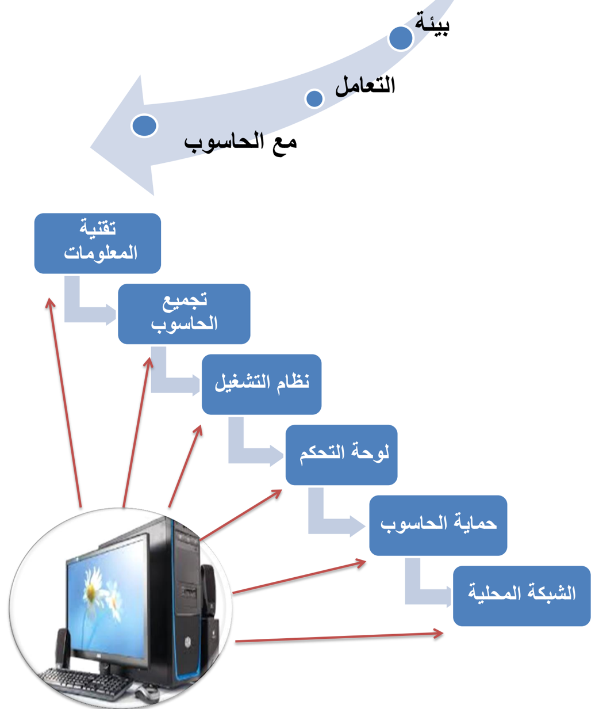
## الكفاءات المستهدفة
-  يكتسب المتعلم معارف حول التقنيات الرقمية
-  يتعلم مراحل تركيب الحاسوب
-  يتعرف على مراحل تثبيت النظام.
-  يتعرف على بعض عمليات التحكم في الحاسوب.
-  يتعلم تثبيت مضاد الفيروسات واستعماله.
-  يتعرف على طريقة إعداد الشبكة محلية واستغلالها.
## تقنية المعلومات
## .1 تكنولوجيا الإعلام والاتصال
Techniques de l'information et de la communication
كلمة تكنولوجيا الإعلام و الاتصال مركبة من ثلاثة كلمات هي:
-  تكنولوجيا
-  إعلام
-  اتصال
## 1.1 : التكنولوجيا Technologie
تكنولوجيا ( Technologie ) هي كلمة أصلها يوناني technología مركبة من مقطعين :
- تكنو (techno) : علم
- لوجي (logos) : المهارة الفنية
و  هي تلك المجموعة المتناسقة  من  المعارف والممارسات في المجال التقني، و  توظيفها  بشكل  منطقي  لتأدية وظيفة محددة و بلوغ أهداف مرجوة.
## 2.1 : الإعلام Information
الاعلام لغة هو الإخبار و تقديم المعلومات: و يعني وجود رسالة (أخبار، معلومات، أفكار و )... آراء تنتقل من مرسل إلى مستقبل.
## 3.1 : الاتصال Communication
الاتصال هو العملية التي يتم بمقتضاها تفاعل بين مرسل ومستقبل ورسالة في مضامين معينة مستعملين أدوات خاصة .
مثل : اللقاءات العلمية، المحاضرات، ... الندوات، المؤتمرات، الدروس في القسم
## : تكنولوجيا الإعلام و الاتصال Techniques de l'information et de la communication
تكنولوجيا الإعلام والاتصال (TIC) هي:
- 1 . مجموعة التقنيات
- 2 . الأدوات والأجهزة السمعية البصرية
- 3 . مختلف الوسائط المتعددة
- 4 . الإنترنت والاتصالات
ويمكن اختصار المفهوم على أنه هو ذلك التلاقي والتزاوج بين عتاد وأجهزة الكمبيوتر بمختلف أنواعها والبرمجيات وشبكات الاتصالات.
## 1.1 خصائص تكنولوجيا الإعلام و الاتصال
## من مميزات و خصائص TIC ما يلي:
-  ربح الوقت والجهد.
-  استغلال عقلاني وإيجابي للموارد.
-  زيادة الدقة والتقليل من الأخطاء.
-  توفير معلومات حديثة وبكميات هائلة.
-  جعل الاتصالات أسرع، وأقل تكلفة.
-  تستخدم في جميع الميادين .
## من سلبيات استخدام TIC ما يلي:
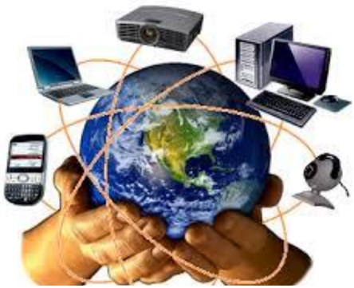
-  تشتت الانتباه لمن يستعمله بطريقة مكثفة.
-  استخدامها بشكل كلي تقلل من مهارات الإنسان.
-  كثرة الجلوس أمام الحاسوب أو باستعمال الهواتف الذكية واللوحات الرقمية يسبب بعض الأمراض مثل: العمود الفقري، توتر الجهاز العصبي والانطواء، ضعف النظر ...
## 1.1 إدماج تكنولوجيا الإعلام والاتصال في التعليم TICE
استخدام التكنولوجيا في العملية التعليمية التعلمية يعتبر تطويرا    و إثراء لها وتيسيرا    لها، وذلك باستخدام الوسائل  التكنولوجية  من  وسائل  صوتيه  وفيديو  وشرائح  وغيرها.  حيث  أصبح  الكمبيوتر  الأداة  الرئيسية  التي تركز على نشاط المتعلم وعلى أساليب العمل داخل القسم. ومن أهم خصائصها:
-  التحول من التعليم القائم على التلقين، إلى تعليم يدعم لدى المتعلم القدرة على التفكير و الابتكار و تعليم الذات (المقاربة بالكفاءات) .
-  القدرة على تخزين و استرجاع كم هائل من المعلومات.
-  القدرة على العرض المرئي للمعلومات.
-  السرعة الفائقة في إجراء العمليات.
-  تقديم العديد من الفرص والاختيارات أمام المتعلم.
## .2 : المعلوماتية Informatique
- -مفهوم  المعلوماتية:  هو  ذلك  العلم  الحديث  الذي  يعالج  المعلومات  ويبني  برامج  التي  يقترحها  الإنسان بطريقة آلية و باستعمال جهاز الحاسوب و برامج خاصة أنشئت لهذا الغرض.
- -و هي المنظومة التي تجمع كل ما يتعلق بأجهزة الحاسوب عبر أبعاده الأربعة:
- 1 . العتاد أو الأجهزة Matériels (Hard)
- 2 . البرمجيات Logiciels (Soft)
- 3 . الموارد المعرفية
- 4 . الموارد البشرية
- .3 تطور تقنية المعلومات
تهتم تقنية المعلومات باستخدام الحواسيب و وسائل الاتصال والتطبيقات : من أجل
تخزين، معالجة، حماية، إرسال والاسترجاع الآمن للمعلومات.
لقد مرت بمراحل عدة في تطورها عبر الزمن و بسرعة جد فائقة وصولا إلى ما نحن عليه اليوم، و يمكن تصنيف التطور إلى ثلاثة أصناف هي:
- 1 . تطور أجهزة معالجة المعلومات (الحاسوب)
يبين الجدول الموالي تطور أجهزة الحواسيب عبر الزمن:
| بدأ تشغيل الكمبيوتر المعروف باسم .EDVAC                            |   1591 |
|--------------------------------------------------------------------|--------|
| ظهر أول حاسوب محمول يعتمد على المعالج الدقيق.                      |   1891 |
| باسم ذكي هاتف أول ظهر Simon شركة إنتاج من IBM                      |   1552 |
| Microsoft) ) ت بالقلم يعمل لوحي لحاسوب الأول النموذج عرض           |   2001 |
| Sony Ericsson تطلق الذكية الهواتف من سلسلة                         |   2009 |
| جهاز ظهر iPhone أبل شركة من Apple iPhone                           |   2002 |
| Samsung عن تكشف ( Galaxy Tab ) بنظام يعمل الذي (Android) من Google |   2010 |
## 2 . تطور البرامج
لا يمكن الاستفادة من العتاد بدون برامج و هي بدورها تتطور بتطور الأجهزة و يمكن تصنيفها إلى صنفين
##  1.2 البرامج التطبيقية:
التي هي كثيرة و متنوعة و في مختلف المجالات و الميادين و كان تطورها دوما مرتبط بالأجهزة و بنظم التشغيل.
##  2.2 نظام التشغيل:
<!-- formula-not-decoded -->
توجد عدة شركات مصممة لنظم التشغيل، لكن نتوقف عند شركة Microsoft التي تستحوذ على أكثر من 90 % من الاستعمال عبر العالم، حيث بدأت بنظام Ms-Dos سنة 1891 ثم تحولت لنظام Windows ذو الواجهة البيانية، ويبين المخطط التالي تطور النظام:
 نظام التشغيل الخاص بالهواتف الذكية و اللوحات الرقمية
| Windows 8   | Windows 7   | Windows Vista   | Windows XP   | Windows 95   | Windows 1.O   |
|-------------|-------------|-----------------|--------------|--------------|---------------|
| أكتوبر 1051 | أكتوبر 1008 | جانفي 1002      | أكتوبر 1005  | أوت 5881     | نوفمبر 5891   |
تطور أنظمة التشغيل الخاصة باللوحات الرقمية و الهواتف الذكية بدأ التصميم له سنة 1882 و عرف هو كذلك تطور سريع بحيث تخصصت مختلف الشركات المختصة في البرمجة بهذا النوع و منها ما  يبينه الجدول:
| الشركة      | النظام        |
|-------------|---------------|
| Google      | Android       |
| Samsung     | Bada          |
| Apple       | iOS           |
| RIM         | BlackBerry OS |
| Symbian ltd | Symbian OS    |
| Microsoft   | Windows Phone |
## تجميع الحاسوب
## .1 تعريف الحاسوب
كلمة حاسوب هي ترجمة للكلمة الإنجليزية ( computer ) مشتقة من الفعل compute بمعنى يحسب وترجمت إلى العربية بعدة أسماء : كمبيوتر، العقل الإلكتروني، الحاسب الآلي الإلكتروني وهو عبارة عن جهاز إلكتروني يقوم باستقبال المعلومات، تخزينها، معالجتها قصد إظهارها واستعمالها وقت الحاجة، ويسمى كذلك " PC " أي Personnel Computer الحاسوب الشخصي.

حاسوب مكتبي
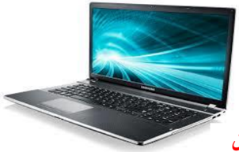
## حاسوب محمول
## .2 مكونات الحاسوب
من خلال تعريفنا للحاسوب فهو إدخال معلومات، معالجتها و إظهار نتائج، إذن يمكن تقسيمة إلى ثلاثة عناصر أساسية هي:
- 1 . وحدات الإدخال
- 2 . وحدة المعالجة
- 3 . وحدات الإخراج
## 5.1 وحدات الإدخال
وهى : الأجهزة التي من خلالها يتم إدخال المعلومات لوحدة المعالجة و تتلخص فيما يلي
- .1 لوحة المفاتي ح ( ::)Clavier ; Keyboard تتكون من أزرار أو مفاتيح لإدخال المعلومات إلى جهاز الحاسوب . وتكتب هذه الأزرار أحرف أو أرقام أو رموز.

## .2 الفأرة )La Souris ; Mouse(
الفأرة: هي إحدى وحدات الإدخال في الحاسوب يتم استعمالها يدويا للتأشير والنقر في الواجهة الرسومية وعلى الأيقونات، وتحتوي الفأرة الافتراضية حاليا على زرين وعجلة في المنتصف تعمل كزر وسطى. الفأرة نوعان هما:
فأرة الكرة
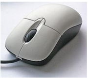

الميكروفون
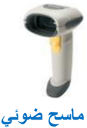
يدوي
ماسح ضوئي

مكتبي
-  فارة الكرة: تحتوي على كرة داخل الفارة تدور مع حركتها بحيث تتغير وضعية المؤشر حسب حركة ودوران الكرة.
-  الفارة الضوئية: تعتمد علي شعاع من ضوء الليزر أسفل الفارة ينعكس من على السطح ويتم استقباله على شريحة إلكترونية لتحديد الحركة، و تعمل فأرة البلوتوث بنفس المبدأ غير أنها غير متصلة بكابل.
## .3 الميكروفون ( )MicroPhone;
جهاز يتصل بالحاسوب حيث يتكلم المستخدم في هذا المكبر فيخزن صوته على الكمبيوتر بواسطة برنامج خاص ويخرج في السماعات ويستخدم أيضا في التحدث الصوتي بين شخصين على الإنترنت بواسطة برامج المحادثة و التواصل.
## .4 الماسح الضوئي (Scanneur ; Scanner)
## وهو ينقسم إلى:
-  ماسح يدوى أو ما يسمى ب: قارئ شفرة الأعمدة ( Lecteur de code à barres )وهو الذي يمسك باليد ويتم مسح الصورة بمصدر الضوء الذي يشع منه فتظهر الصورة أو معلومات على الشاشة (يستعمل في المحلات التجارية لتحديد السلعة و ثمنها)
-  ماسح ضوئي مكتبي حيث يتم وضع الصورة داخله حتى يظهرها على الشاشة بعد عملية المسح.
## .5 الكاميرا الرقمية (Caméra Numérique : Digital camera)

تستعمل لالتقاط الصور و الفيديوهات و حفظها بذاكرتها، حيث يمكن نسخها على قرص الحاسوب لاستعمالها أو تغيرها، كما يمكن ربطها بالحاسوب و التسجيل مباشرة فيه.
كاميرا رقمية
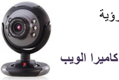
## .6 كاميرا ويب ( Webcam)
تستخدم من أجل التحدث بين فردين على الإنترنت حيث يمكن لكل فرد رؤية الآخر بوضوح عبر هذه الكاميرا والتحدث معه بالصوت والصورة، وتكون مدمجة في الحواسيب المحمولة. كاميرا الويب

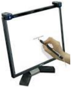
## .7 شاشة لمسية (Ecran Tactile ; Touch screen) :
تعتبر من وسائل إدخال المعلومات الحديثة، تستخدم في جهاز الصرف الآلي في المصارف (البنوك، شبابيك البريد ) حيث يمكن للفرد أن يضغط على الأيقونات الموجودة على الشاشة بإصبعه لإجراء عملية .
## .8 قلم ضوئي )Crayon Optique ; Light Pen( :
يستخدم هذا القلم أحيانا بديلا عن الإصبع في شاشة اللمس، نجده مثلا في جواز السفر البيو متري حيث يتم الإمضاء به.
قلم ضوئي
## .9 لوحة لمسية )Panneau Tactile ; Touch Panel( :
لوحة لمسية
الجهة الأمامية

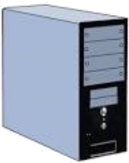
توجد في الحواسيب المحمولة وهى بديلا عن الفأرة، حيث يمكن وضع الإصبع على هذه اللوحة وتحريك الإصبع فيتحرك السهم أو الأيقونة الموجود على الشاشة.
## 1.1 الوحدة المركزية
و هي الوحدة التي يتم فيها القيام بجميع العمليات من تخزين معالجة و غيرهما، و تحتوي على:
.1 الصندوق الرئيسي (Boîtier; Case CPU)
هي تلك العلبة الفولاذية التي تحوي البطاقة الأم و كل مكونات الحاسوب الداخلية، و هي مرتبطة ) ... بالوسط الخارجي بواسطة مآخذ الكهرباء و وصلات البيانات (الفأرة، لوحة المفاتيح، الشاشة، الطابعة
## .2 علبة التغذية بالكهرباء( ) Bloc alimentation ; power supply unit
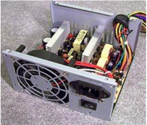
هي وحدة امداد وتحويل التيار الكهربائي للوحدة المركزية بكل مكوناها.
علبة الإمداد أو التغذية بالكهرباء
## .3 اللوحة الأم ( )Carte Mère ; Motherboard
هي لوحة إلكترونية يتصل بها كل مكونات الحاسوب الداخلية و مختلف وحدات الإدخال و الإخراج حيث توصل باللوحة الأم عن طريق وصلات أو كابلات.
جهة المنافذ و الوصلات
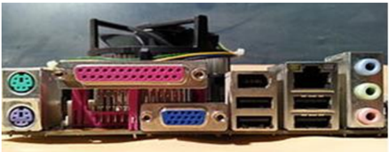
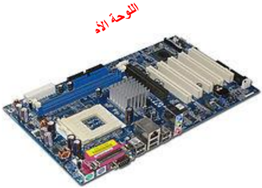
## .4 المعالج المركزي (Le Processeur; Processor  )
: و يطلق عليه تسمية CPU ( Unité Centrale de Traitement; ) يمثل عقل الحاسوب حيث يقوم بتسيير و تنسيق كل المهام و يقوم بتنفيذ التعليمات ومعالجة البيانات التي تتضمنها البرمجيات. و يطلق عليه تسمية المعالج الدقيق ( .)Microprocessor; Microprocesseur
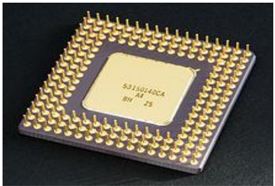
المعالج من الجهة السفلى ) جهة الإبر (
المعالج من الجهة العليا

## و يعرف المعالج : بما يلي
- .1 التسمية.
- .2 : سرعة تنفيذ العمليات و تقاس ب GHz أو . Mhz

1 Khz = 10 3 Hz ; 1 Mhz = 10 3 Khz ; 1 Ghz = 10 3 Mhz ;
| سرعته              | المعالج       |
|--------------------|---------------|
| 109 kHz            | Intel 80486   |
| من 1,3 Ghz إلى 3,8 | Pentium 4     |
| 2,4 GHz            | Core 2 Duo    |
| 3,33 GHz           | Intel Core i7 |
## مثال:
## .5 الذاكرة المركزية (Mémoire Centrale ; Central Memory)
: هي وحدة تخزن فيها المعلومات و تحتوي على قسمين
- 1 . الذاكرة الحية ( أو ذاكرة الوصول العشوائي :)RAM ( Random Access Memory :    mémoire à
الذاكرة الحية

الذاكرة الميتة
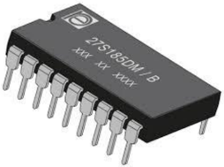
accès direct ) و هي الذاكرة التي تخزن المعلومات أثناء
المعالجة، من ميزاتها:
-  السرعة في الوصول للمعلومة و توفيرها للمعالج.
-  الحاسوب الكهربائي  عن التيار انقطاع تمحى  بمجرد () (متلاشية، متطايرة .)volatile
-  يتغير محتواها حسب البرامج المفتوحة أو النشطة.
- .2 الذاكرة الميتة )Read Only Memory( ROM
و هي ذاكرة تصمم من قبل الشركة المصممة للوحة الأم و من ميزاتها:
-  ذاكرة للقراءة فقط، لا يمكن التخزين فيها و محتوياتها ثابتة.
-  لا يمكن حذف المعلومات التي تحويها.
-  تحوي برامج لبداية تشغيل الحاسوب.
-  . تحوي برنامج التعرف على الأجهزة الموصولة بالحاسوب
-  تستخدم لتخزين نظام الإدخال والإخراج الأساسي Basic (Bios )Input Output System
( Unités de Stockage ; Storage Units)
## 6 . وحدات التخزين الخارجية
: هي الأجهزة و الأدوات التي يتم تخزين المعلومات و البرامج  فيها بصفة مؤقتة أو دائمة نذكر منها
## .1 القرص الصلب: (Disque Dur ; Hard Disk)
هو قرص مثبت بالوحدة المركزية و يعتبر وحدة التخزين الرئيسية بالحاسوب و من مميزاته

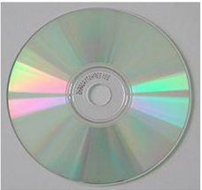
قرص ضغوط CD

-  يتصل باللوحة الأم بواسطة الكبل IDE : أو SATA
-  سرعة الوصول إلى المعلومة.
-  سعة تخزين كبيرة جدا.
-  يعمر و لا يتلف بسرعة.
-  ( يوجد فيه نوع خارجي )Disque Dur Externe
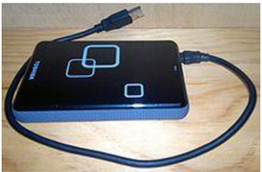
قرص صلب خارجي Externe
## القرص المضغوط CD
القرص  المضغوط  ( Compact  Disc ) هو  قرص  بصري  يستخدم لتخزين البيانات.
## : خصائصه
- o تستخدم أشعة الليزر في تسجيل البيانات على سطحه.
- o قراءة محتواه بواسطة قارئ القرص الضوئي.
- o لا يمكن أن يكتب عليه الا باستخدام الناسخ.
- o المعلومات فيه محفوظة بشكل جيد و لا تضيع.
## 2 . قرص المرياء الرقمي DVD
قرص المرياء الرقمي ( Digital Video Disc ) أو قرص متعدد الاستخدامات الرقمي ( Digital Versatile Disc )، والذي يعرف ب ( DVD )، هو قرص
بصري يستخدم كوسيط لتخزين البيانات.
## خصائصه:
- o سعة أكبر تصل إلى 9.8 GB
- o يمكن للقرص الرقمي أن يسجل المعلومات في جهة واحدة أو في جهتين.
## 3 . ( ذاكرة الفلاش أو ذاكرة وامضة Clé Usb ; flash Drive )
( يطلق عليه كذلك تسمة: فلاش ديسك و  هو وحدة تخزين متحرك amovible )، تتصل بالحاسوب عن طريق المنفذ ( ناقل متسلسل عام) USB(port U niversal S erial B us) . و يحتوي ذاكرة وامضة
رمز ذاكرة الفلاش
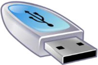
## من مميزاته:
- o صغير الحجم و خفيف الوزن
- o سعة تصل إلى 1 TO أو أكثر
- o عملية النسخ منه و إليه سهلة و سلسة
من عيوبه:
- o كثير ا الالتقاط للفيروسات
- o حساس للصدمات و يتلف بسرعة
## 4 . بطاقة ذاكرة ( Carte Mémoire ; Memory Card )
بطاقة الذاكرة هي ذاكرة فلاش إلكترونية صلبة لتخزين البيانات . تستعمل في آلات التصوير الرقمية،
كي تواصل الحفظ

وأجهزة الحاسوب، والهواتف، وألعاب الفيديو، والعديد من الأجهزة الإلكترونية الأخرى.
مميزاتها:
- o قدرة عالية على التخزين والحفظ
- لا تحتاج للطاقة بطاقة ذاكرة
- o
## وحدة قياس الذاكرة
-  تتكون الذاكرات بكل أصنافها من خلايا، بحيث كل خلية تعادل بتا ( واحدا Bit ) من البيانات
-  ( البت Bit ) هو أصغر وحدة من وحدات قياس ( الذاكرة ويحتوي قيمتين 1 أو 0 .)
-  كل 9 بتات تشكل بايتا واحدا    ( Octet ;Byte ) و هو المساحة الكافية لتخزين قيمة حرف واحد أو رقم أو رمز، و هي وحدة قياس الذاكرة.
- مثال
مضاعفات البايت byte
-  1024= Bytes 2 10 =( Kilo Byte) KB1 Bytes و يصطلح عليها ب 1000 Bytes
-  1024*1024= KB 2 10 =( Méga Byte) MB1 bytes و يصطلح عليها ب 1000 KB
-  1024*1024= MB 2 10 =( Giga Byte) GB1 KB و يصطلح عليها ب 1000 MB
## 0 1 1 0 0 1 0 1
-  1024*1024= GB 2 10 =( Téra Byte) TB1 MB و يصطلح عليها ب 1000 GB
## .7 البطاقات الداخلية
## 1 . بطاقة الشبكة (Carte Réseau ; NetWork Card)
بطاقة شبكة لا سلكية Wireless
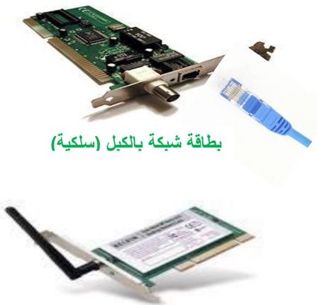
و تسمى كذلك network adapter أو LAN Adapter .
وغالبا ما تعرف بالاختصار NIC وهو اختصار لـ Network Interface Card ويعني واجهة بطاقة الشبكة، و دورها أنها تسمح لمستخدم الحاسوب بالتواصل مع الحواسيب الأخرى عن طريق الشبكة.
## و هي نوعان:
-  سلكية أو بالكبل
-  لا سلكية Wireless
## 2 . بطاقة بيانية أو بطاقة عرض مرئي (Carte Graphique ; Graphic Card )
بطاقة الصوت
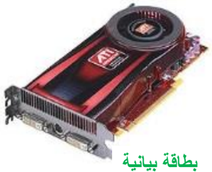
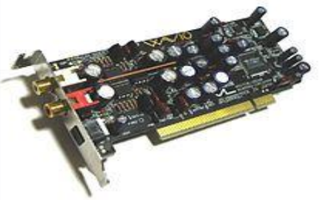
هي البطاقة التي تتصل بشاشة الحاسوب و دورها توصيل الصور و البيانات وعرضها على الشاشة.
## من ميزاتها:
-  لديها ذاكرة خاصة بها.
-  ترسل صور إلى الشاشة مخزنة في ذاكرتها الخاصة.
-  لديها ذاكرة ميتة خاصة بها
## 3 . بطاقة الصوت ) Sound Card (Carte Son ;
بطاقة الصوت أو البطاقة السمعية هي بطاقة تسهل المدخلات والمخرجات من الإشارات الصوتية من وإلى جهاز الحاسوب. حيث توفر العنصر الصوتي لتطبيقات الوسائط المتعددة : مثل القرآن، و  الموسيقى، وأفلام الفيديو و الترفيه (العاب .)
طابعة نقطيّة
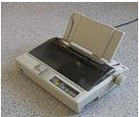
( طابعة ليزريّة )Laser

الشاشة : هو جهاز يشبه التلفاز يقوم بعرض البيانات و الصور و الفيديو التي تتم معالجتها

## و هو نوعان:
-  شاشة أشعة أنبوب الكاثود ( CRT - Cathode Ray Tube )
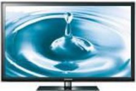
( شاشة العرض البلوري السائل LCD - Liquid Crystal Display )
السماعات : هي وحدة تقوم بإخراج الصوت من الحاسوب و إسماع الشخص كل البيانات الصوتية التي توفرها بطاقة الصوت مثل القرآن

## 2.1 وحدات الإخراج
هي الوحدات التي تخرج أو تظهر نتائج المعالجة و منها :
الطابعة : وهى ذاك الجهاز الذي يسمح بتحويل البيانات المرئية على الشاشة إلى أوراق، و هي عدة أصناف :

( طابعة بنفث الحبر أو الحبر النفاث Jet )Inkjet printers( )d'encre
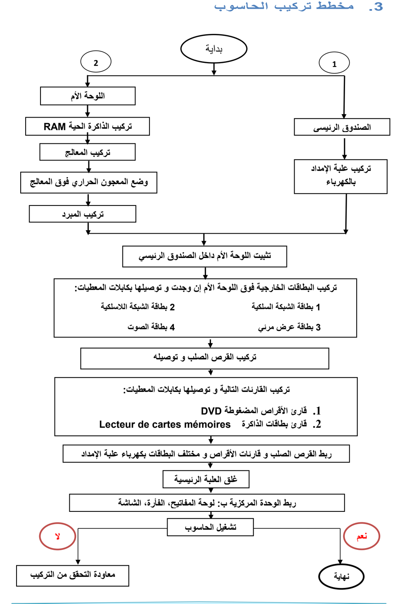

## نظام التشغيل
## .1 تعريف نظام التشغيل
نظام التشغيل (Système d'exploitation SE) (Operating system OS) هو مجموعة من الملفات و البرمجيات المتكاملة فيما بينها و المسؤولة عن:
-  إعداد الحاسوب لبدء التشغيل.
-  إدارة موارد ( الحاسوب وحدات الإدخال،المعالج، الذاكرة، القرص الصلب، كل الأجهزة الملحقة)
-  إدارة برمجيات الحاسوب.
-  تنظيم و إدارة الملفات…
## و يتميز بما يلي:
-  يعتبر الوسيط بين المستخدم و الحاسوب
-  هو جسر لتشغيل برامج المستخدم
-  يوفر واجهة بيانية سهلة الاستخدام( Interface Graphique )،
-  استخدام أكثر من برنامج أو تطبيق في آن واحد( Multitâches ) .
## من أشهر أنظمة التشغيل:
-  Windows  Unix  Linux اللوحات اللمسية و الهواتف الذكية:
-  IBM OS/2
 Mac OS
من أشهر أنظمة تشغيل
-  Android  BlackBerry OS  iOS  Windows Phone  Mac OS
## .2 مفهوم التثبيت
تثبيت  النظام  هو  عملية  نسخ  الملفات  و  البرامج  الخاصة  بالنظام  و  جعلها  متوفرة  بصفة  دائمة  على القرص الصلب لتمكين الحاسوب من القيام بجميع مهامه.
تتم العملية بواسطة حزمة الملفات و البرامج المتوفرة على (قرص مضغوط، ذاكرة أو قرص صلب أو شبكة) و  التي تحوي  برنامج  الإقلاع Bootable ،  و  تتم  هذه  العملية بواسطة  برنامج  خاص  يسمى  المثبت Installer( ) الذي يقترح مراحل و خطوات يجب إتباعها لإتمام العملية.

## .3 مفهوم تقسيم القرص
-  القرص الصلب هو قطعة واحدة من الناحية المادية، لكن يمكن تجزئته أو تقسيمه افتراضيا إلى تجزئتين أو أكثر بحيث كل تجزئة تتميز بنظام ملفات خاص بها (FAT ,FAT32,NTFS) و يسمح بحفظ و تخزين . الملفات
-  في بعض أنظمة التشغيل مثل Windows تظهر التجزئات في شكل أقراص منفصلة و يرمز لها بحروف ( أبجدية مثال )C ; D ; E ; F
-  في أنظمة أخرى مثل الماكنتوش تظهر في شكل أيقونات
-  التجزئة الأساسية هي التي تحتوي عادة ملفات نظام التشغيل و يرمز لها بالحرف C و تتولى علمية إقلاع الحاسوب.
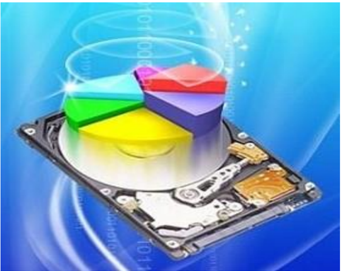
##  تهدف تعدد التجزئات : إلى
-  تنظيم و ترتيب الملفات
-  حماية الملفات و المجلدات من الضياع
-  تعدد مواضع التخزين
-  تثبيت النظام في تجزئة خاصة به.
-  جعل الملفات الشخصية و الخاصة في تجزئة مخالفة لتجزئة النظام
-  تتيح فرصة تثبيت أكثر من نظام تشغيل على نفس الحاسوب.
- .1 مفهوم تهيئة القرص
تهيئة القرص الصلب هي إعداده و تحضيره ليصبح جاهزا لتخزين نظام التشغيل و . البرامج و الملفات
يوجد نوعان من التهيئة:
-  الفيزيائية : Physical Formatting و تعرف أيضا بتهيئة المستوي المنخفض Low Level Formatting. يتم تقسيم : القرص الصلب إلى عناصر أساسية اسطوانات
مسار
Piste
A
قطاع Secteur B
مسار قطاع Piste d'un Secteur C ;D

(Cylinders ;Cylindres) ، مسارات
(Tracks ;
Pistes) و قطاعات (Sectors ; Secteurs)
و تتم
هذه العملية عند مصنع الأقراص الصلبة قبل بيعها
لنستطيع تهيئتها منطقيا.
-  التهيئة المــنطقية : Logical Formatting مـــا يعرف بتهــيــئة المستوي العـــالي High Level Formatting. ( يتم فيها وضع نظام الملفات file system ) على القرص الصلب مما يتيح له استخدام . المساحة التخزينية الموجودة عليه في قراءة و تخزين الملفات و البيانات
## .1 إعدادات تثبيت نظام التشغيل
## 1.8 إعدادات قبل التثبيت
إعداد ال ( )basic Input Output system( : BIOS نظام الإدخال والإخراج الأساسي ): الملاحظ أنه عند تشغيل الجهاز مباشرة فإنه يقلع من القرص الصلب و هذا راجع للترتيب الموجود في BIOS ، فإذا أردنا إقلاع الجهاز من جهة أخرى (قرص مضغوط، ذاكرة متصلة بمنفذ USB ، شبكة...) توجب علينا تغيير الإقلاع الأول في BIOS
للدخول لبرنامج BIOS في أي جهاز بعد بدء تشغيل الجهاز نضغط على المفتاح delete(Suppr) أو F2 و هو يختلف من جهاز لآخر حسب الشركة المصنعة للوحة الأم و هنا نغير الإقلاع الاول ثم نحفظ و نغادر البرنامج.
## 2.8 التثبيت
بعد تغيير الإقلاع الأولي و تحديده حسب الوسيلة المتوفرة نتبع المراحل التالية لتثبيت نظام التشغيل ( Windows2 :)
- .1 نضع قرص النظام المضغوط في قارئ الأقراص المضغوطة، أو الذاكر في المنفذ .USB
- .2 نشغل الجهاز، يطلب منا الضغط على أي مفتاح من لوحة المفاتيح.
- .3 تظهر نافذة نختار فيها لغة التثبيت ثم المصادقة على شروط استعمال البرنامج.
- .4 ( اختيار موضع التثبيت في الأقراص المتوفرة .)C ; D ; E
- .8 إدخال اسم المستعمل و إدخال كلمة مرور.
- .6 اختيار المنطقة الزمنية.
- .7 ضبط الوقت و الساعة.
- .9 إعداد الشبكة.
- .8 انتهاء عملية التثبيت.
عند الانتهاء يعاد التشغيل مرة أخرى تلقائيا وبذلك نكون قد انهينا عملية تثبيت النظام بنجاح.
## لوحة التحكم
## لوحة التحكم (Panneau de configuration ; Control Pannel)
لوحة التحكم هو برنامج مثبت مع نظام التشغيل ذو واجهة بيانية، يعتبر مركز إعدادات الحاسوب بحيث يسمح للمستخدمين  بعرض  و  ضبط  الإعدادات  الأساسية ، مثل : إضافة  وإزالة  البرامج وال ، تحكم  في  حسابات المستخدمين، التاريخ و الوقت و خصائص العرض و غيرها.
## لتنفيذ لوحة التحكم نتبع ما يلي:
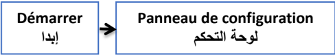
## تظهر النافذة التالية:
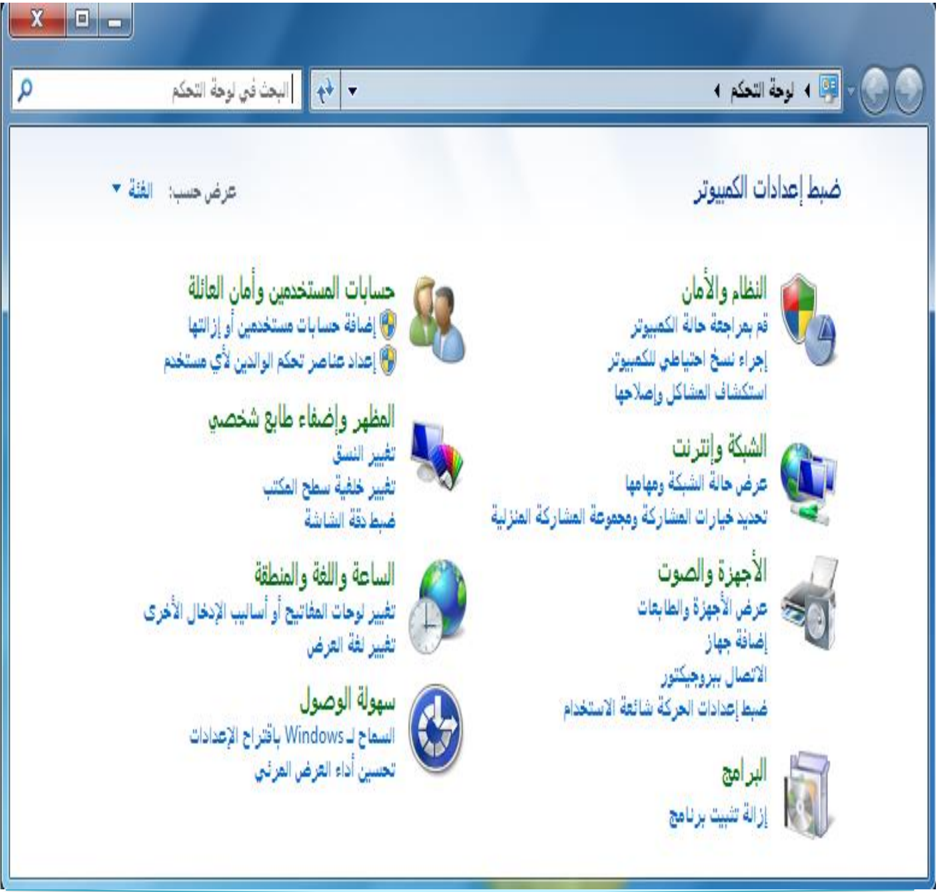
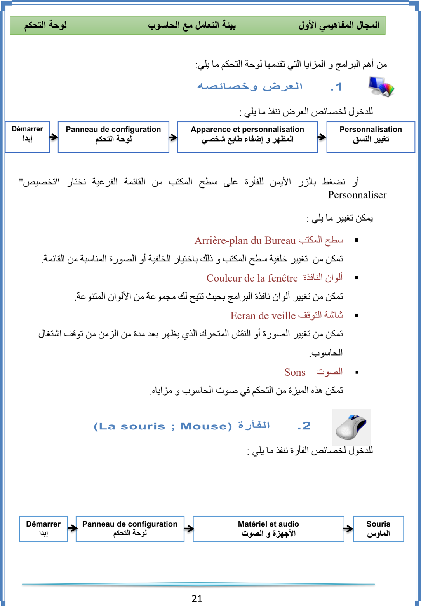
لوحة التحكم
تغيير شكل
المؤشر
التبديل بين
الأساسية
الأزرار
و الثانوية
سرعة النقر
المزدوج المزدوج
.3 الخيارات الإقليمية و خيارات اللغة (Horloge , langue et région)
: للدخول لخصائص الخيارات الإقليمية و اللغة ننفذ ما يلي
Panneau de configuration لوحة التحكم
22
Horloge, langue et région
الساعة و اللغة و المنطقة
يظهر الإطار التالي:
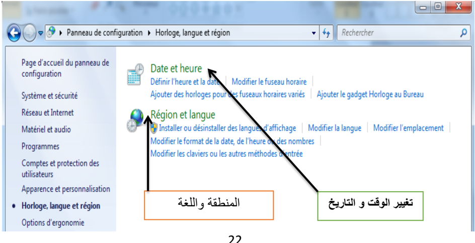
Démarrer
إبدا
## الأول                     بيئة التعامل مع الحاسوب
المجال المفاهيمي
في هذه النافذة يمكن تغيير
## : ما يلي
- -التبديل بين الأزرار الأساسية  و الثانوية
- -التحكم في سرعة النقر المزدوج
- -تغيير شكل مؤشر ... الفأرة
لوحة التحكم
## المجال المفاهيمي الأول                     بيئة التعامل مع الحاسوب
## 1 . تغيير التاريخ و الوقت
في هذه الخاصية يمكن : التغيير و التحكم فيما يلي
-  التاريخ
-  الوقت
-  المنطقة الزمنية ( Fuseau horaire ) ( GMT+1 )
## 2 . المنطقة و اللغة
: في هذه الخاصية يمكن التغيير و التحكم فيما يلي
-  إضافة و إزالة لغات، نتبع ما يلي
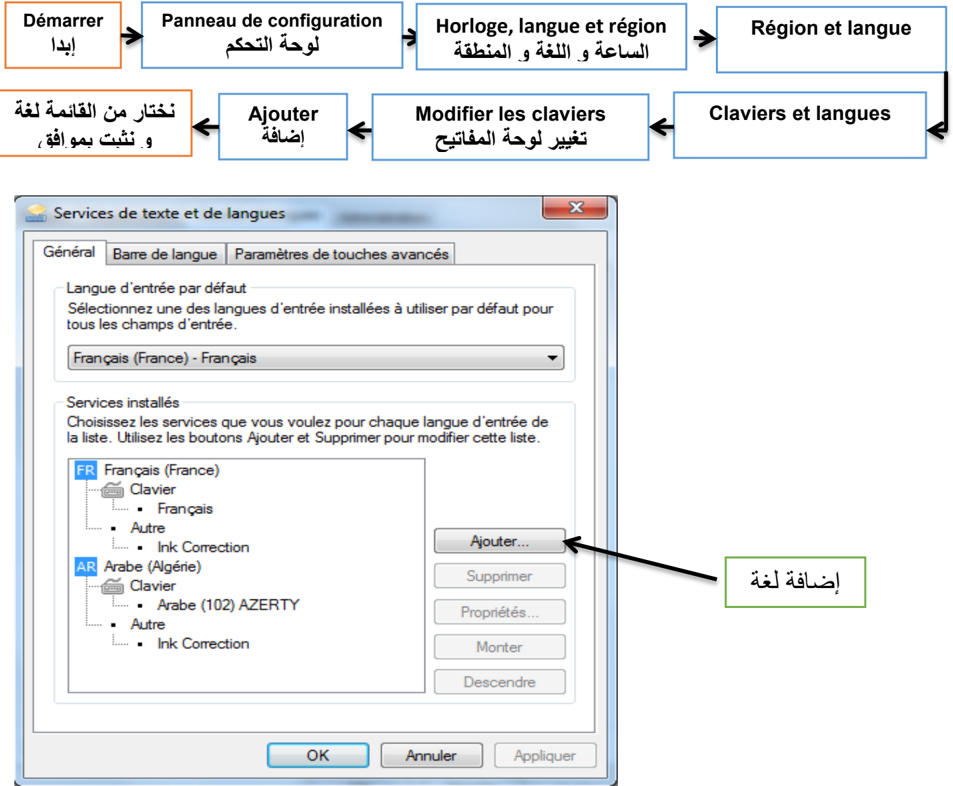
## .1 إزالة تثبيت البرامج( )Désinstallation des programmes

هي عملية تتيحها لوحة التحكم للتخلص نهائيا من البرامج الغير مرغوب فيها أو التي لا تعمل بطريقة سليمة و . التي تم تثبيتها من قبل
: لتنفيذ هذه الخاصية نتبع ما يلي

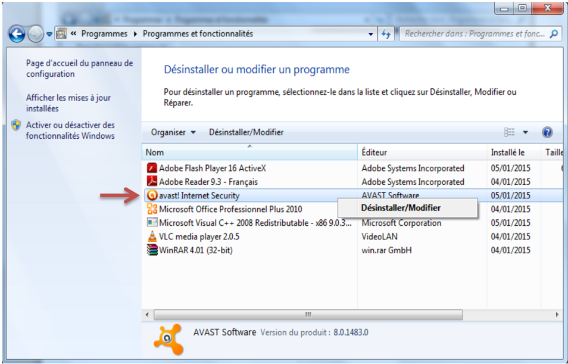
( لحذف برنامج ننقر فوقه بالزر الأيمن للفأرة فتظهر القائمة )Désinstaller/Modifier ثم نتبع المراحل المقترحة.
## .1 حسابات المستخدمين (Comptes Utilisateurs )

حساب المستخدم يعرّف على أنه مجموعة الإجراءات التي يمكن لمستخدم ما تنفيذها على حاسوب مستقل أو على كمبيوتر عضو في مجموعة عمل، يوفر الحساب لكل مستخدم برامجه، ملفاته، مجلداته و واجهته الخاصة به في التعامل مع نفس الجهاز.
## 1 . أنواع الحسابات:

حساب مسؤول الكمبيوتر Administrateur
حساب المسؤول يكون خاص بمالك الحاسوب بحيث يعطيه قدرة غير محدودة في إجراء تغييرات و تعديلات على النظام، تثبيت البرامج، والوصول إلى كل الملفات و المجلدات المخزنة في حاسوبه . و يمكنه كذلك التحكم في حسابات المستخدمين الآخرين بـــ:
-  إنشاء و حذف
-  . تغيير اسم، صورة، كلمة مرور، ونوع أيّ من حسابات المستخدمين
-  . تثبيت البرامج والأجهزة وإلغاء تثبيتها
-  تغيير كافة إعدادات النظام .
## حساب ( المستخدم القياسي ) المحدود Limited User ; Standard

الحساب المحدود : فيه محدودية تغيير إعدادات الحاسوب و منع من حذف الملفات الهامة، يمنح عادة هذا النوع لقليلي الخبرة و لغير المخولين بتغيير الإعدادات. يمكن إنشاء حسابات من هذا النوع في البيت للأطفال أو داخل مخبر الإعلام الآلي للتلاميذ. كما لمالك هذه الحساب الحق في :
-  إنشاء، تغيير، أو حذف كلمة . المرور الخاصة به
-  تغيير صورة  حسابه .
## حساب الضيف Guest ; Invité

هو حساب مخصص لمستعمل لا يملك حساب على الحاسوب بحيث يتيح له تشغيله كما لو أنه يملك حسابا محدودا   ، و هو غير محمي بكلمة مرور و يسهّل تسجيل الدخول لتصفح الأنترنت و معاينة البريد الإلكتروني، وكتابة مستندات وطباعتها، وتنفيذ بعض النشاطات ال . مشابهة
## 2 . عمليات على الحسابات
- .1 إنشاء حساب
: لإنشاء حساب جديد نتبع ما يلي
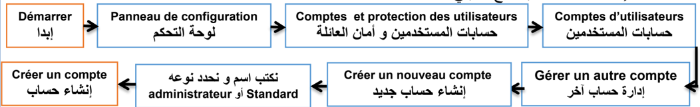
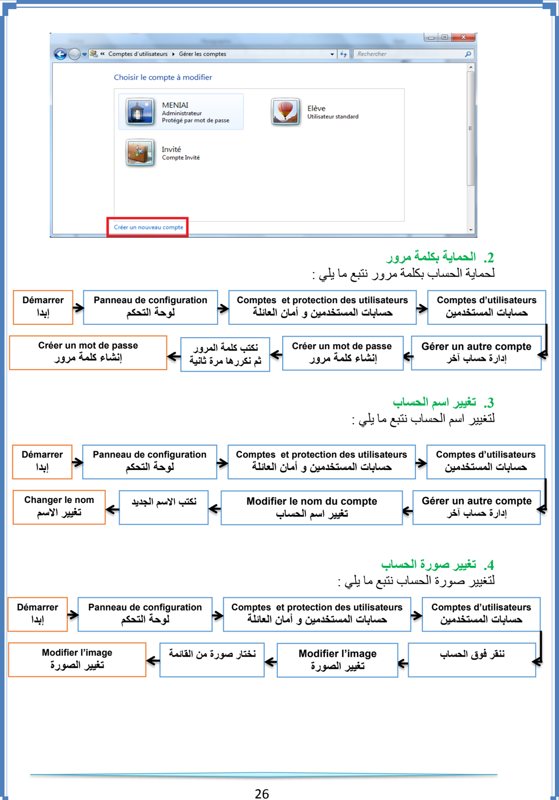
## حماية الحاسوب
الحاسوب جهاز ذو أهمية بالغة في حياتنا و هو كثير الاستعمال لذا فهو معرض لخطر الأعطاب و الأعطال سواءا في أجزائه المادية أو في أمن المعلومات و البرمجيات، لذا فحمايته و وقايته من هذه الأخطار عملية مهمة في الإبقاء عليه سليم و عملي لمدة أطول.
## .1 أمن المعلومات و البرمجيات
المعلومات و البرمجيات هي الأكثر عرضة لمخاطر الإتلاف و القرصنة و الاختراقات، و تتم بواسطة برامج خاصة تلج للحاسوب عن طريق الاتصال بالأنترنت أو استعمال وحدات تخزين خارجية (ذاكرة )... وامضة، قرص و من بين هذه البرامج:
## .1 البرامج الخطيرة
هي البرامج التي تسمح لأشخاص بالدخول عبر شبكة الأنترنت إلى حاسوبك بدون إذن بهدف التجسس أو سرقة المعلومات و البيانات أو التخريب حيث تكون لها القدرة على نقل، حذف أو إضافة ملفات أو برامج كما أنه يمكنه إصدار أوامر كالطباعة أو التصوير و إرسال رس .. ائل
## 2 . ( الاختراق Hacking )
اختراق حاسوب يعني الدخول إليه بغض النظر عن الأضرار التي قد يحدثها. أما عندما يقوم بحذف ملف أو تشغيل آخر أو جلب ملف جديد فهو مخرب بالإنجليزية( . (Cracker لا يستطيع الهاكر الدخول إلى جهازك إلا مع وجود ملف يسمى: patch ( ( ) أو .) trojan
## .3 برامج التجسس ( Spyware )

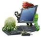

تثبت خلسة على الأجهزة للتجسس على المستخدمين أو للسيطرة جزئي ا على الحاسوب الشخصي، فهي تهدف إلى التعرف على محتويات الحاسوب. ويمكن لهذه البرامج أن تسيطر على الحاسوب، وتتحكم فيه وتقوم بعدة مهام، مثل: إضافة برامج، سرقة بيانات وأرقام حسابات، كلمة المرور أو ارقام بطاقات الائتمان.
## 1 . الفيروس ( Le Virus )

عبارة عن برنامج صمم عمدا من طرف مبرمجين محترفين ليصل إلى الحاسوب بدون معرفة صاحبه بغرض إحداث أضرار بمكونات الحاسوب المادية وحذف، تغيير أو تخريب الملفات و البرامج، مما يؤدي الى تغيير طريقة عمل الحاسوب ، وفي بعض الأحيان يصل الأمر الى تعطيل الحاسوب كلية. سمي بهذا الاسم لتشابه آلية عمله مع تلك الكائنات الحية المتطفلة.
## .2 خصائص الفيروس
-  القدرة على التخفي عن طريق الارتباط ببرامج أخرى، و يبدأ العمل بمجرد تشغيل هذا البرنامج.
-  يتواجد في أماكن استراتيجية كالذاكرة، و يصيب أي ملف يوجد بالذاكرة.
-  سرعة التكاثر و الانتشار والانتقال بالعدوى .
-  برنامج قادر على التناسخ و الانتشار.
-  لا يمكن أن تنشأ الفيروسات من ذاتها.
-  يمكن أن تنتقل من حاسوب مصاب لآخر سليم او عن طريق الأنترنت.
## .3 أعراض الإصابة
-  تكرار رسائل الخطأ في أكثر من برنامج
-  ظهور رسالة تعذر الحفظ لعدم وجود مساحة كافية على الذاكرة أو القرص .
-  تكرار اختفاء بعض الملفات التنفيذية .
-  بطء شديد في بدء تشغيل .) (إقلاع الجهاز
-  بطء  تنفيذ بعض التطبيقات .
-  رفض بعض التطبيقات التنفيذ .
-  تحويل الملفات و البرامج إلى اختصارات لا تفتح و لا تنفذ…
## .1 أضرار الفيروس
-  استهلاك مساحات تخزين عالية.
-  استغلال جزء كبير من ذاكرة الكمبيوتر.
-  التعدي على حقوق الملكية الفكرية بالتعديل دون موافقة من مالكي البرامج أو الملفات .
-  تجبر على تشغيل برمجيات مضاد الفيروسات مما  يشكل عبئا    على المستخدم.
-  حذف، تعديل أو تخريب الملفات و المجلدات.

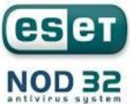
## .1 الوقاية من الفيروسات:
للوقاية من الفيروسات يتطلب الأمر:
-  تفعيل برنامج الجدار الناري.
-  تزويد الحاسوب ببرامج للكشف عن الفيروسات تسمى مضاد الفيروسات Antivirus و تحديثها بانتظام.
-  ( تزويد الحاسوب ببرنامج مراقبة الذاكرة فلاش Usb Guard .)
-  إجراء الفحص على البرامج المحملة من الأنترنت قبل تشغيلها.
-  لا تشغل أي برنامج أو ملف لا تعرفه .
-  الحذر من رسائل البريد الإلكتروني غير معروفة المصدر وفحصها قبل الإقدام على فتحها .
-  لا تقم بتنزيل أو تحميل برامج من مواقع غير شرعيه أو مضمونه و لا تتبادل أي ملفات أو برامج مع أشخاص غرباء أو غير موثوق بهم .
-  الكشف الدوري علي جميع الأقراص الصلبة المثبتة باستخدام برنامج مضاد الفيروس
-  عدم استخدام أي ذاكرات ثانوية إلا بعد الكشف عليها بمضاد الفيروس
-  القيام بنسخ البيانات بشكل دوري على أقراص خارجية .
## .6 مضاد الفيروسات Antivirus
هي البرامج التي تقوم بحماية الحاسوب من هجمات الفيروسات و بقية البرامج الخبيثة التي تشكل تهديدا على المعلومات و الملفات و تستطيع أن تمنعها من الدخول كما تعمل على اكتشافها وازالتها أو تعطيلها.
أمثلة عن بعض أنواع مضاد الفيروسات:

## الشبكة المحلية
## .1 تعريف  الشبكة
الشبكة هي عبارة عن مجموعة من أجهزة الحاسوب ; متصلة ببعضها البعض بغرض التواصل و تبادل معطيات و استخدام موارد. وتتكون من جهازين على الأقل.
## أ . فوائد استعمال الشبكة
-  مشاركة التطبيقات و المعطيات و المعلومات.
-  مشاركة الأجهزة و الأقراص : مثل الطابعات، الماسح ، القرص الصلب ... ، المضغوط، الفلاش
-  الاتصالات: تسهل الاتصالات مثل البريد الإلكتروني والرسائل الفورية و أدوات التواصل الاجتماعي.
-  الأمن: يحتاج المستخدم لحساب خاص للدخول للشبكة ويجب استعمال اسم حساب وكلمة مرور لاستعمال الموارد، كما يمكن منع بعض المستخدمين من الدخول إلى الشبكة.
-  الدخول إلى الأنترنت: يمكن للمستخدمين الدخول إلى العالم الافتراضي واستغلال مزاياه.
## ب  .  تصنيف الشبكات
## تصنف الشبكات حسب :
## .1 وسيلة الربط
-  الشبكات السلكية
-  الش ّ بكات اللاسلكية ( ) Wi-Fi
## .2 الامتداد الجغرافي
-  الشبكة المحلية ( LAN  :  Local  Area  Network ):  هي شبكة تستخدم لتغطية أماكن محدودة وصغيرة مثل المكتب و مخبر التدريس و مقاهي الأنترنت.
-  الشبكة  الإقليمية  ( :)MAN :  Metropolitan  Area  Network هي  الشبكة  التي  تستعمل  في مناطق جغرافية أوسع من المحلية مثل الثانويات و الجامعات و المدن.
-  الشبكة الواسعة ( :)WAN : Wide Area Network هي الشبكة التي تستعمل في الأماكن الأوسع مثل البلدان، القارات و الأرض بأكملها، و أكبرها على الإطلاق شبكة الأنترنت.
## العلاقة الوظيفية
نوعان من الشبكة هما :
##  الخادم و الزبون ( :)Client-Serveur
تتكون  هذه  الشبكة  من  حاسوب  أو  أكثر  ذو  خصائص  تقنية  جد  عالية  (سرعة  معالج،  سعة )... تخزين يسمى الخادم  ( )Serveur و مجموعة من الحواسيب تسمى الزبائن ( )Clients بحيث يقوم الخادم بتزويد الزبائن في الشبكة بمختلف الخدمات و الموارد ، إستجابة للعرائض أو الطلبات المقدمة من طرفهم.
##  الند للند :(Peer To Peer)
هي شبكة تتكون من حواسيب عادة ما تكون بنفس الخصائص التقنية بحيث يمكن لأي حاسوب عضو في هذه الشبكة أن يكون خادما أو زبونا في نفس الوقت أو بالتناوب مثل: مخابر الإعلام الآلي و مقاهي الأنترنت.
## .3 طوبولوجيا الربط
طوبولوجيا أو تشكيل الربط هي الطريقة التي يتم من خلالها توصيل حواسيب الشبكة الواحدة ببعضها البعض و يمكن تصنيفها إلى ثلاثة أصناف:
-  طوبولوجيا الباص: )Bus topology( أو التشكيل الخطي: تكون أجهزة الشبكة فيهـا متصلة بخط توصيل واحد.
-  طوبولوجيا الحلقة :)ring topology( :(Anneau) يتم ربط الأجهزة على شكل حلقة حيث يوصل كل جهاز بالجهاز المجاور له مع وصل الجهاز الأخير بالأول، و يكون لكل واحد منها دور في الاتصال حسب ترتيبها.

##  طوبولوجيا النجمة : )star topology( :(Etoile)
تتصل كل أجهزة الشبكة (حواسيب، )... طابعات بوحدة توصيل مركزية تسمى المحول( )Switch أو و باستخدام كابل مستقل لكل جهاز، حيث ترسل العرائض أو البيانات إلى وحدة التوصيل المركزية
الموزع( )Hub التي تعمل على تحويلها.
ملاحظة:  يعتبر  المحول  /المبدل  ( )Switch أكثر  تطورا وسرعة من الموزع ( .)Hub
## .2 المكونات المادية للشبكة
لنتمكن من إنجاز شبكة طوبولوجيا النجمة سلكية أو لا سلكية يجب توفير التجهيزات التالية:

## .3 إعداد الشبكة
بعد عملية الربط، نشرع في إعداد الشبكة بإتباع المراحل التالية:
-  ننقر بالزر الأيمن على (الكمبيوتر) Ordinateur من سطح المكتب ثم نختار (خصائص) .Propriétés
-  تظهر نافذة ننقر فيها على  (الإعدادات عن بعد) " ."  Paramètres d'utilisation à distance
-  يظهر إطار ننقر على علامة تبويب (اسم الكمبيوتر) Nom de l'ordinateur ، ثم على الزر (معرف الشبكة) "Identité sur le réseau "

معرف الشبكة
-  يظهر إطار نختار الاختيار الأول (هذا الكمبيوتر جزء من مجموعة )... العمل "Cet Ordinateur appartient à un réseau d'entreprise…" ثم ننقر على (التالي) .Suivant
-  يظهر إطار اخر لتحديد نوع شبكة الاتصال ننقر على الاختيار الثاني (تستخدم الشركة شبكة بدون مجال) " Ma société utilise un réseau sans domaine" ثم (التالي) Suivant
-  يظهر إطار نكتب فيه اسم مجموعة العمل مثال: MS Home; Workgroups ثم (التالي) .Suivant (يجب اختيار نفس اسم مجموعة العمل بالنسبة لكافة المناصب)
-  يظهر إطار اخير ننقر على (إنهاء) Terminer مع إعادة تشغيل الجهاز.
## ملاحظة:
- .1 نقوم بهذه العملية مع كافة حواسيب الشبكة. .2 للاطلاع على الاجهزة المتصلة بالشبكة والمشغلة، نفتح ايقونة Réseau الموجودة على سطح المكتب.
- .1 استغلال الموارد المشتركة
## المشاركة (Partage ; Sharing)
هي إعطاء الحق لأعضاء الشبكة باستغلال الأقراص، الطابعات، الماسح، مجلد أو برنامج. المشاركة نوعان:
-  و في الوسائل مثل: الطابعة.
-  في الأقراص و المجلدات و الملفات.
يوجد نوعان من المشاركة في الأقراص و المجلدات:
-  المشاركة الكاملة: يستطيع المستعملون الآخرون أن يقوموا بكل العمليات على الملحقة المشتركة  (قراءة، تغيير، حذف)
-  المشاركة في القراءة فقط: باقي أعضاء الشبكة لا يستطيعون التغيير في محتوى الأقراص المشتركة بل القراءة فقط.
## .1 المشاركة في الأقراص و المجلدات
## 1.1 المشاركة في الأقراص
يمكن مشاركة القرص الصلب أو تجزئة منه أو ذاكرة ... فلاش
للقيام بهذه العملية نتبع ما يلي :
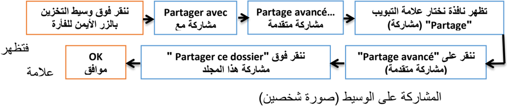

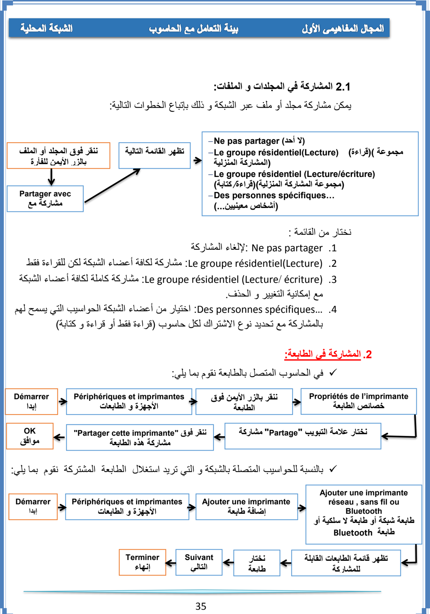

## نموذج لشبكة محلية متصلة بأنترنت
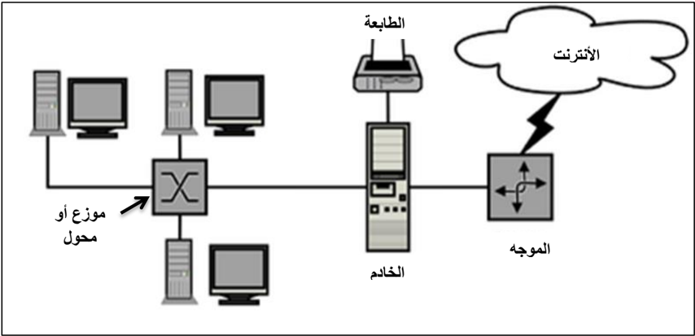
## التطبيقات
## التمرين :11
- ما الفرق بين المعلوماتية و تكنولوجيا الاعلام والاتصال؟
- أذكر  إيجابيات استعمال تكنولوجيا الاعلام والاتصال في ميدان التربية والتعليم .
- عدد الآثار السلبية للاستعمال المفرط لتكنولوجيا الاعلام والاتصال.
- أذكر 44 إصدارات  من WINDOWS وتاريخ ظهورها
## التمرين :12
- حول إلى الأوكتي:
64 ko= ………………..……. Octet
1 Go= ……………………… TeraOctet
2 To= ………………………. MégaOctet
500 Ko= …………………… MégaOctet
500 Mo= …………………… KiloOctet
1 To= ………………………. Octet
- ر : تب تصاعديا قياسات الذاكرات التالية 1 GO ، 1.44 Mo ، 650 Mo ، 800 Ko :03
## التمرين
- قم بالمقارنة بين RAM و ROM
## التمرين :04
- -1 من البرامج التطبيقية في الحاسوب:
- [ ] - ]  [ البرامج المكتبية
- [ ] - ]  [         Windows7
- [ ] - ]  [ الألعاب
- [ ] - ]  [           MS DOS
- [ ] - معالج النصوص ]  [
- [ ] - اللوحة الأم ]  [
- -2 أي الوحدات الآتية لا تفقد بياناتها عن فصل التيار الكهربائي عن الحاسوب:
- [ ] - الذاكرة RAM ]  [
- [ ] - القرص الصلب ]  [
- [ ] - لوحة المفاتيح ]  [
- [ ] - القرص المضغوط ]  [
- [ ] - الذاكرة ]  [            ROM
- [ ] - الطابعة ]  [
حواسيب  ضمن  مجموعة  عمل
## التمرين :05
إلي أي قسم تنتمي  المكونات التالية:(ضع اشارة x في العمود المناسب)
| البرمجيات   | المعدات   | المكون                                                                                    |
|-------------|-----------|-------------------------------------------------------------------------------------------|
|             |           | المعالج (Processeur) الذاكرة التشغيل نظام النصوص معالج الصلب القرص الطابعة البيانات جداول |
## التمرين :06
املأ الفراغات بما يناسبها:
التهيئة ................... تتم على مستوى ...................... حيث تقوم بتقسيم القرص الصلب إلى مسارات
.............. و..............و
والتهيئة ................... تتم قبل تثبيت ....................................................... النظام من أجل
## التمرين :07
- -. قم بمقارنة في جدول ، بين الأنواع الثلاثة لحسابات المستخدمين
## التمرين :08
- -عندما أردت حفظ ملف معين على أحد الأقراص ، ظهرت لك الرسالة التالية:
- " لا يمكن حفظ الملف لعدم وجود مساحة كافية " espace disque insuffisant /
- -1 ما هو تفسيرك لهذه المشكلة؟
- 2 -كيف يمكن معالجتها ؟
## التمرين :09
طلب  منك  في  مخبر  المعلوماتية  إنشاء  شبكة  محلية  متكونة  من 4 "informatique"
- -ما هي الأدوات اللازمة؟
- -أذكر مراحل إعداد هذه الشبكة.
