## المجال المفاهيمي الثاني
<!-- formula-not-decoded -->
## Word - Excel - PowerPoint
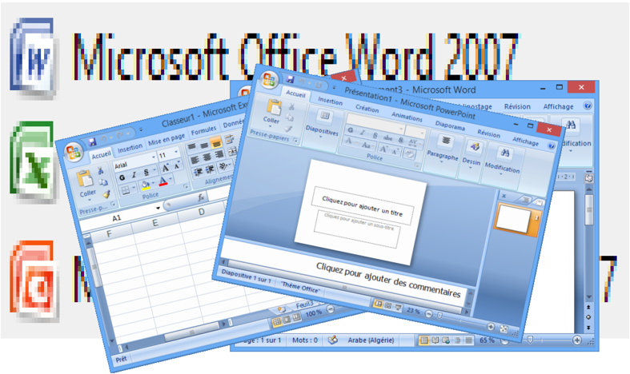
## مدخل إلى المجال
بعد تحصيل المبادئ الأولية للمكتبية في مرحلة التعليم المتوسط، يسرنا أن نأخذ بيد تلاميذ السنة الأولى ثانوي لاكتساب مفاهيم هامة، عملية ومتقدمة في هذا المجال، وذلك طبقا للمنهاج الجديد لمادة المعلوماتية الخاص بهذه السنة.
سنتطرق في هذا المجال إلى ثلاث وحدات:
-  وحدة معالج النصوص وتشمل أربعة مواضيع:  الأنماط،  القوالب، المقاطع و دمج المراسلات.
-  وحدة المجدول وتشمل موضوعين: الصيغ والدوال وفرز البيانات.
-  وحدة العروض التقديمية وتشمل موضوعين: الارتباطات التشعبية والحركة.
لقد  اخترنا  أن  تكون  التطبيقات  على  الإصدار Microsoft  office  2007 وللأستاذ التكيف مع ما هو موفر له في المخبر.
وقد اعتمدنا في تقديمنا لهذه المفاهيم على الدعم الموجود على موقع الشركة الأم على الإنترنت www.support.office.com
نرجو  أننا  قد  وفقنا  لتوضيح  بعض  المفاهيم  المبهمة  وتيسير  بعض  الطرائق الصعبة، مقرين أن هذا العمل البشري لا يخلو من نقائص، مرحبين بكل ما نتلقاه من نقد وإثراء وشاكرين لكل من يبدى رأيا لتحسينه.
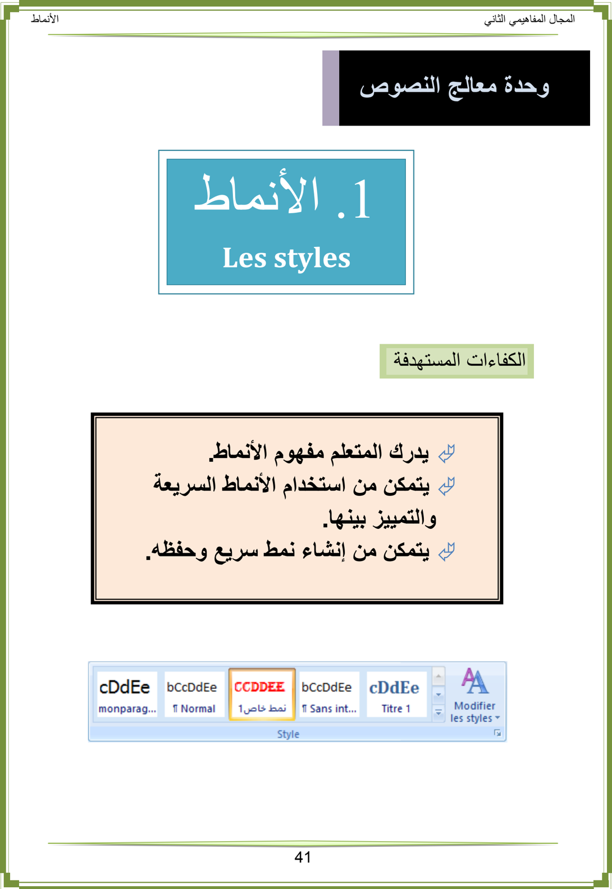
## الأنماط في Word
## .1 الإشكالية
في جميع مستنداتي أريد إبراز بعض الكلمات الهامة فأختار لها تنسيقا خاصا: خطا مختلفا عن خط الفقرة، حجما مختلفا أيضا، لونا مميزا، ... داكنا، سميكا ومائلا، بحدود وتظليل
هل  يوفر Word طريقة  سريعة  وبسيطة  لهذا  العمل؟  وإذا  لم  يكن  هنالك  نمط  بهذه  الخيارات هل أستطيع إنشاء نمط خاص؟ وهل يمكن حفظه لاستعماله لاحقا؟
## .2 ما هو النمط؟
عوضا  عن  استعمال  التنسيق  المباشر،  نستخدم  الأنماط  لتطبيق  مجموعة  من  خيارات  التنسيق للحصول على مستند متناسق بسرعة وسهولة.
## النمط مجموعة من خصائص التنسيق تُطبّق معا دفعة واحدة .
تتنوع الأنماط في Word فمنها أنماط للحروف ومنها أنماط للفقرات ومنها أنماط للقوائم ومنها أنماط للجداول.
## .3 لماذا نستخدم الأنماط؟
-  توفر الأنماط الوقت، فعوضا عن القيام بعدة عمليات للتنسيق نقوم بعملية واحدة.
-  تمنح الأنماط للمستند مظهرًا متناسقًا.
-  عند استخدام أنماط العناوين المُضمّنة في Word ، يمكن له إنشاء جدول محتويات تلقائيًا كما ينشئ مخطط المستند لتسهيل التنقل في المستندات الكبيرة.
## .4 أنماط الحروف والفقرات والأنماط المرتبطة
##  أين نجد الأنماط ؟
نجد أنماط الحروف والفقرات والأنماط المرتبطة في المجموعة نمط Style ضمن علامة التبويب الصفحة الرئيسية . Accueil
##  كيف نميز الأنماط ؟
ننقر فوق مشغل مربع الحوار نمط Style فيظهر جزء المهام أنماط.Styles

-  الأنماط المسبوقة بالرمز ¶ هي أنماط فقرة. ننقر في أي مكان داخل الفقرة لتطبيق النمط على كامل الفقرة.
-  الأنماط المسبوقة بالرمز a هي أنماط حروف. ننقر في أي مكان داخل الكلمة لتطبيق النمط على كامل الكلمة. يمكن تحديد جزء من كلمة أو عدة كلمات لتطبيق النمط عليها.
-  الأنماط المسبوقة بالرمز a¶ هي أنماط مرتبطة. تعمل كأنماط حروف وأنماط فقرات في نفس الوقت.
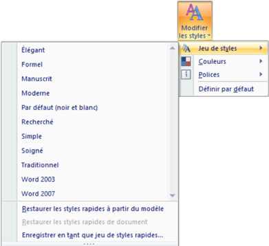
##  تغيير الأنماط
- o ننقر على Modifier les styles
- o نضع المؤشر فوق Jeu de styles
- o تظهر عدة أنماط نختار واحدا لإدراجه في معرض الأنماط السريعة ثم ننقر على خيارنا.
ملاحظة: يمكن تغيير الألوان من Couleurs والخطوط من.Polices
##  أنماط الحروف
تتضمن أنماط الحروف خصائص تنسيق يمكن تطبيقها على النص، مثل: اسم الخط،  حجمه، لونه، التنسيق غامق، مائل، تسطير والحدود والتظليل.
لا تشمل أنماط الحروف تنسيقًا يؤثر على خصائص الفقرة، مثل تباعد الأسطر، محاذاة النص، المسافة البادئة وعلامات الجدولة.
## لتطبيق نمط الحروف:
- .4 نحدد النص الذي نريد تنسيقه، (حرف، كلمة بالنقر داخلها، عدة كلمات)
- .4 ننقر على نمط الحروف الذي نريد استعماله.
## ملاحظة:
عند تمرير المؤشر فوق الأنماط السريعة  تظهر معاينة للتنسيق في المستند . عندما نشير إلى نمط حروف، يتم تنسيق الكلمة التي نقرنا فوقها فقط . وعندما نشير إلى نمط فقرة أو نمط مرتبط، يتم تنسيق الفقرة بكاملها.
##  أنماط الفقرة
زيادة  على  كل  ما  يتضمنه  نمط  الحروف،  يتحكم  نمط  الفقرة  بمظهرها،  مثل  محاذاة  النص، علامات الجدولة، تباعد الأسطر، والحدود .
## لتطبيق نمط فقرة:
- .4 نحدد الفقرات التي نريد تنسيقها، (إذا كانت فقرة واحدة يكفي النقر داخلها)
- .4 ننقر على نمط الفقرة الذي نريد استعماله.
في مستند فارغ جديد، يطبّق Word تلقائيًا نمط الفقرة "عادي Normal " على كل النص ويطبق النمط "سرد الفقرات "Paragraphe de liste على عناصر قائمة التعداد.
##  الأنماط المرتبطة
تستجيب الأنماط المرتبطة إلى التحديد الذي نقوم به:
- o فإذا حددنا فقرة (نقرنا داخلها) ثم طبقنا نمطا مرتبطا، فسيتم تطبيق النمط على كل الفقرة باعتباره نمط فقرة.
- o وإذا حددنا كلمة أو جملة في فقرة ثم طبقنا نمطا مرتبطا، فسيتم تطبيق النمط على النص المحدد فقط باعتباره نمط حروف ولا تتأثر الفقرة ككل.
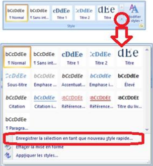
## .5 حفظ نمط فقرة سريع خاص
إذا  كنا  نستخدم  تخطيطا  خاصا  للفقرات  يمكن  حفظه  كنمط : سريع واستخدامه
-  ننسق الفقرة كما نريد أن تظهر و نحدّدها (المؤشر داخلها)
-  ننقر على
-  ننقر على

Enregistrer la sélection en tant que nouveau style rapide

-  ندخل اسما لحفظ النمط ثم ننقر على OK .
ملاحظة: إذا أردنا تغيير بعض الخصائص الأخرى، ننقر على Modifier فتظهر علبة حوار Créer un style à partir de le mise en forme كما في الصورة التالية:

نحدد خياراتنا ثم ننقر على.OK
سيظهر الآن النمط السريع الجديد مع الأنماط الأخرى

## .6 حذف نمط
##  حذف النمط من معرض الأنماط السريعة فقط

- o ننقر بالزر الأيمن على النمط في معرض الأنماط السريعة
- o ننقر على Supprimer de la galerie de styles rapides
## ملاحظتان:
- 4 . يحذف النمط من معرض الأنماط السريعة لكنه يبقى موجودا في جزء المهام أنماط.Styles
- 4 . إذا أردنا إجراء تعديلات فقط على النمط ننقر على.Modifier
##  حذف النمط من جزء المهام أنماط Styles
- o ننقر بالزر الأيمن على: اسم النمط ( مثلا في الصورة: نمط خاص ) 4
- o ننقر على: اسم النمط Supprimer ( : مثلا في الصورة نمط خاص 1 Supprimer )
- o تظهر علبة حوار لتأكيد الحذف، ننقر على Oui

ملاحظة: في هذه الحالة يحذف النمط نهائيا من المستند.
## تمارين
- )4 ما هي فوائد استعمال الأنماط مقارنة بالتنسيق المباشر؟
- )4 ك ُ ل ِّ فت بكتابة جزء من المصحف الشريف على أن يكون اسم الجلالة الله بتنسيق مختلف عن خط الكتابة ... فيكون بلون أخضر، سميك، مائل،
-  ما أفضل طريقة لتحقيق المطلوب؟
-  ( . حقق المطلوب بإنشاء نمط و تطبيقه على بعض الآيات : يطبق النمط أيضا على كلمات مثل )... تالله، بالله
- )4 أنشئ نمطا لفقرة لاستعماله في مستنداتك لاحقا, كيف تحفظ هذا النمط؟
- )0 لديك مستند جاهز, تريد من Word أن ينشئ له جدولا للمحتويات تلقائيا. ما الخطوات التي تتبعها؟
- )4 في  الصورة  الم نريد لمستند هيكل قابلة تنسيقه بتطبيق نمط سريع:
- أاكتب المحتوى في مستند جديد
- ب  لتنسيق السريعة الأنماط استعمل هذا المستند كما يلي:
-  غير : الأنماط السريعة إلى Moderne
-  استعمل Normal للفقرات
-  استعمل Titre 1 Titre 1
-  استعمل Titre 2 Sous Titre1 Sous Titre2
-  Titre 3 Sous Sous Titre1 Sous Sous Titre2

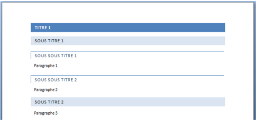
## صورة للمستند الناتج:
- ت  أعد التنسيق بتطبيق أنماط سريعة أخرى من اختيارك.
## .2 القوالب Les modèles
## الكفاءات المستهدفة
 يدرك المتعلم مفهوم القوالب.
 يتمكن من استخدام القوالب الجاهزة.
 يتمكن من إنشاء قالب من مستند.
 يتمكن من تغيير قالب و حفظه.

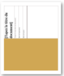

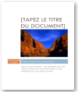

## القوالب في Word
## .1 الإشكالية
طلب منك مدير مؤسسة المساعدة في حل الإشكالية التالية:
كلما  أراد  أن  يبعث  رسالة  إلى  أحد  زبائنه  إلا  و  أعاد  إدخال:  اسم  المؤسسة،  العنوان  البريدي، الهاتف، الفاكس، العنوان ... الإلكتروني، رمز المؤسسة، تاريخ المراسلة، العبارات التي تتكرر في الرسالة
فهل يمكن أن تثبت هذه المعلومات في الرسالة وتصبح مهمته إدخال النصوص المتغيرة فقط؟
## .2 مفهوم القالب
## القالب نوع من المستندات، يُنشِئ نسخة لنفسه عند فتحه.
-  كل مستند word يعتمد على قالب.
-  القالب الافتراضي في word هو Normal.dotm
-  يحتوي القالب على الخط المستعمل, حجمه، نمط الفقرات، أنماط العناوين، الهوامش... وقد يحتوي ... أيضا على نصوص ثابتة، أنماط خاصة
## .3 أين نجد القوالب؟
افتراضيا تحفظ القوالب داخل المجلد:
## C:\Utilisateurs\nom\_utilisateur\AppData\Roaming\ Microsoft\Templates
لكن يمكن حفظ القوالب في أي مكان (سطح المكتب، مجلد، قرص 'فلاش' حتى نستطيع استخدام )... القالب على أي جهاز
## .4 إنشاء مستند جديد من قالب موجود
يسمح لنا معالج النصوص Word بإنشاء مستندات جديدة باستخدام قوالب جاهزة.
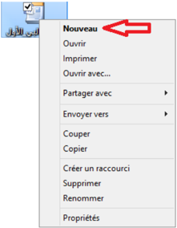
## الطريقة الأولى:

- .4
- ننقر على الزر Microsoft Office ، ثم ننقر على Nouveau .
- .4 أسفل Modèles ، نجد عدة خيارات :
-  إذا أردنا استخدام قالب موجود على جهاز الحاسوب، ننقر على
## Modèles Installés
-  إذا أردنا على ننقر قالب، تنزيل أحد الارتباطات الموجودة أسفل Microsoft Office Online ، مثل Curriculum-vitae ، Lettres ، Diplômes ( ... يجب أن يكون الحاسوب متصلاً بالإنترنت)
- .4 ننقر نقرًا مزدوجًا على القالب المختار .

## الطريقة الثانية:
إذا  كان  ملف  القالب  موجودا  في  مجلد خاص،  على  سطح  المكتب  أو  في مفتاح usb
- .4 ننقر بالزر الأيمن للفأرة على ملف القالب.
- .4 ننقر على Nouveau
- .4 يفتح مباشرة مستند جديد من هذا القالب.
## .5 إنشاء قالب
## إنشاء قالب من مستند
-  نفتح المستند الذي سيكون أساسا للقالب، أو ننشئ مستندا جديدا ونجري عليه التنسيقات التي نريد أن يحتويها القالب.
-  نحفظه على شكل قالب، كما يلي:

- o ننقر على زر Microsoft Office
- o نختار حفظ باسم.Enregistrer sous
- o ننقر على.Modèle Word

تظهر علبة حوار، نختار مكان الحفظ، نكتب اسمًا للقالب في مربع اسم الملف، ثم ننقر على.Enregistrer
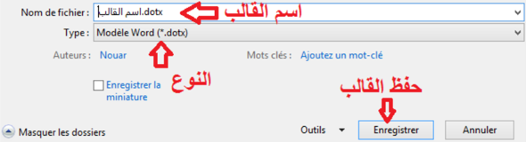
- o نغلق القالب.
## إنشاء قالب من قالب موجود
-  نفتح القالب الذي نريد تغييره
-  نجري التغييرات
-  نحفظه على شكل قالب. (كما رأينا سابقا)
-  نغلق القالب.
## .6 حل الاشكالية:
لحل الإشكالية المطروحة أعلاه ننشئ قالبا:
##  " إنشاء قالب.dotx الرسالة"
- .1 ننشئ مستندا جديدا في.Word لاحظ في شريط العنوان Document x - Microsoft Word حيث x عدد.
- .2 نقوم بكتابة النصوص الثابتة في الرسالة وتنسيقها.
رأس الرسالة: اسم المؤسسة مع الرمز (مثلا صورة من معرض الصور)، العنوان البريدي، الهاتف، الفاكس، البريد الإلكتروني، اسم المدينة و التاريخ.
النصوص الثابتة: إلى السيد / ، الموضوع، تقبلوا فائق التقدير والاحترام، المدير.

## يمكن أن ننسّ ق أ على الرسالة كما يلي:

## ملاحظة:
## إنهاء الفقرة أو الرجوع إلى السطر؟
لاحظ الكتابة على اليمين ومثيلتها على اليسار. كلا الكتابتين كُتبت بنفس الخط ونفس الحجم لكن : الكتابة على اليمين استهلكت مساحة أكبر على الرسالة. وهذا لأن
-  : كل سطر في الكتابة على اليمين يعتبر فقرة لأننا أنهيناه بـ Entrer
-  الأسطر الخمس في الكتابة على اليسار تمثل فقرة واحدة لأننا أنهينا كل سطر بـ: رجوع إلى السطر Maj + Entrer
لإظهار كل العلامات والرموز المخفية، ننقر على الأمر Afficher tout من المجموعة :Paragraphe
.
يُمث َّ ل الضغط على المفتاح Entrer بالرمز
يُمث َّ ل الضغط على المفتاحين Maj + Entrer بالرمز .
يمكن أن ننسّ  ق أسفل الرسالة كما يلي:

نكتب النصوص التي لا تتغير و ننسّقها، وندرج التاريخ.
## ملاحظة:
## كيف يُحيّن التاريخ تلقائيا كلما كتبنا رسالة؟

- -1 ننقر على التبويب إدراج Insertion
- ، ننقر على الأمر
- -2 في المجموعة Texte
- -3 تظهر علبة حوار Date et heure ، نختار نوع التاريخ، ننشط Mettre à jour automatiquement ، ثم ننقر على.OK

- .3 نحفظ المستند الجديد على شكل قالب:
- o ننقر على زر Microsoft Office
- o نختار حفظ باسم.Enregistrer sous
- o ننقر على.Modèle Word
- o تظهر علبة حوار Enregistrer sous ،

نختار مكان الحفظ Bureau ،
نكتب اسم القالب ".dotx رسالة" في مربع Nom de Fichier ،
نلاحظ أن مربع النوع Type : به
ثم ننقر على
Modèle Word (*.dotx).Enregistrer

نلاحظ أن شريط العنوان أصبح:
" أي أننا حصلنا على قالب باسم.dotx ." رسالة
" (القوالب من الشكل.dotm اسم\_القالب" تكون الماكروات فيها مُن   ش َّطة).
- نغلق المستند بالنقر على الزر
- .4
- .5 نجد فوق سطح المكتب الملف التالي
- : جاهزا للاستعمال.

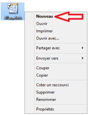
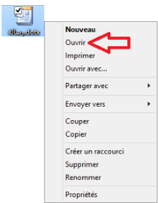

##  إنشاء مستند من قالب "الرسالة"

-  ننقر نقرا مزدوجا على
-  ينشئ القالب نسخة لنفسه.
( لاحظ شريط العنوان: Document x - Microsoft Word لاحظ المحتوى).
## ملاحظة:
يمكن إنشاء المستند بالنقر بالزر الأيمن على
.Nouveau
ثم النقر على
##  تغيير قالب "الرسالة"
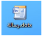
-  ننقر بالزر الأيمن على
-  ننقر على Ouvrir
-  يفتح القالب، نجري التغييرات عليه ثم نحفظه.
(لاحظ شريط العنوان
.dotx - Microsoft Word رسالة)
## تمارين
## التمرين الأول
س 4 : ما الفائدة من استعمال القوالب؟ س 4 : اختر الإجابة الصحيحة كيف أعرف القالب الذي يعتمد عليه مستند Word ؟ ج 4 : من خصائص المستند ج 4 : لا نستطيع معرفة القالب ج 4 : القالب هو دوما القالب الافتراضي Normal.dotm
## التمرين الثاني
## لاحظ الكتابة التالية:
بعملية واحدة نريد أن تكون الجملة بالفرنسية في السطر الثاني دون أن تكون عنصرا من القائمة.كيف نحقق هذا؟
## التمرين الثالث
طُلِب منك كتابة سيرة ذاتية C.V للمشاركة في مسابقة توظيف بمؤسسة عالمية. كيف تلبي هذا الطلب باستعمال القوالب الجاهزة للسير الذاتية التي يوفرها Word ؟
## التمرين الرابع
أنشئ قالبا لشهادة مدرسية لمؤسستك.
## التمرين الخامس
أنشئ قالبا لوصفة طبيّة لطبيب أخصّائي، أدرج تاريخا يُحيَّن تلقائيا.
## 3 .المقاطع Les sections
## الكفاءات المستهدفة

 يدرك المتعلم مفهوم المقاطع.
مقطع بعمود واحد  يتمكن من إنشاء مقاطع بتخطيط صفحات و تنسيقات مختلفة.
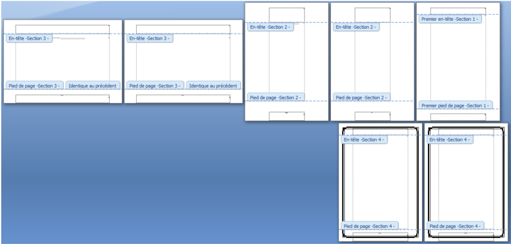
## المقاطع في Word
## .1 الإشكالية
ك ُ ل ِّ فت بإنجاز بحث من سبع صفحات حول المقاطع في Word حيث:
الصفحة الأولى:
باتجاه عمودي، هوامش مخصصة وهي بدون ترقيم.
الصفحتان الثانية والثالثة: باتجاه عمودي و ترقيم  أ, ب.
الصفحتان الرابعة و الخامسة: باتجاه أفقي و ترقيم
4 ، . 4
- الصفحتان السادسة والسابعة: باتجاه عمودي، لها حدود و ترقيم يتبع السابق.
كيف يمكن تغيير اتجاه بعض الصفحات فقط في المستند؟
كيف نحصل على صفحات مختلفة التنسيق في نفس المستند؟

## 2 . مفهوم المقطع Section
يحتوي المستند المنشأ في Word على مقطع واحد يتميز بخصائص تخطيط الصفحة وتنسيقها.
لتغيير تخطيط صفحة أو عدة صفحات من مستند أو تغيير تنسيقها, نلجأ إلى تقطيع هذا المستند إلى عدة أجزاء وهمية نسميها مقاطعا .
نستعمل المقاطع  للحصول على صفحات مختلفة التنسيق والإعدادات داخل مستند واحد.
.
## فيمكن مثلا:
-  تخطيط جزء من صفحة ذات عمود واحد بعدة أعمدة.
-  تقسيم المستند إلى فصول ليبدأ ترقيم صفحات كل فصل بالرقم .4
-  إنشاء رأس و/أو تذييل مختلف لمقطع من مقاطع المستند.
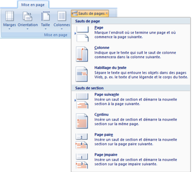

## 3 . متى نجزئ المستند إلى مقاطع؟
نجزئ المستند إلى مقاطع ليسهل علينا تنسيقه في الحالات التالية:
-  المستند يحتوي على صفحات أفقية و أخرى عمودية.
-  هوامش بعض الصفحات تختلف عن الأخرى.
-  رؤوس وتذييلات بعض الصفحات مختلفة أو بعض الصفحات بدون رؤوس وتذييلات.
-  ترقيم بعض الصفحات يختلف عن البقية كأن يكون مقطع (المقدمة مثلا). بترقيم حروف أبجدية ( ( أ، ب، ج...) ، والباقي بترقيم أرقام 4 ، 4 ، .)…4
-  جزء من المستند (جزء من صفحة أو عدة صفحات) على شكل أعمدة.
-  ...
## 4 . إنشاء مقطع
## .1 إدراج فاصل مقطع
- .4 ننقر حيث نريد بدء المقطع
- .4 في علامة التبويب Mise en page ، في المجموعة Mise en page ،
- ننقر على Sauts de pages
- .4 في مجموعة الأوامر Sauts de section ننقر على نوع فاصل المقطع الذي نريد.
## .2 مبدأ عمل الفواصل المقطعية
-  عند  إدراج  فاصل  مقطع  فإنه  يفرق  بين  الصفحات اللاحقة، والصفحات السابقة الصفحات ويسمِّي السابقة مقطع 4 والصفحات اللاحقة مقطع .4
-  يمكننا تنسيق أبعاد وهوامش صفحات المقطع الأول دون أن تتأثر أبعاد وهوامش صفحات المقطع الثاني.
-  يتحكم فاصل المقطع في تنسيق مقطع النص الذي يسبقه.
-  عند حذف فاصل المقطع في الصورة السابقة فإننا نحذف أيضا تنسيق النص في المقطع 4 ويصبح النص في المقطع 4 جزءا من نص المقطع 4 ويتبعه في التنسيق.
## ملاحظة:
## فاصل صفحات أو فاصل مقطعي؟
-  نستعمل فاصل الصفحات إذا أردنا الانتقال إلى الصفحة التالية دون إجراء تغيير لا في تخطيط الصفحة ولا في تنسيقها.
-  نستعمل الفواصل المقطعية إذا أردنا إجراء تغيير في تخطيط الصفحة و/أو في تنسيقها بالنسبة للصفحات التالية.

## .3 أنواع الفواصل المقطعية
- o الأمر الصفحة  التالية Page suivante : يقوم بإدراج فاصل مقطع وبدء المقطع الجديد على الصفحة التالية.
- o الأمر مستمر : Continu يقوم بإدراج فاصل مقطع وبدء مقطع جديد على الصفحة ذاتها.
- o الأمر صفحة زوجية Page paire أو صفحة فردية Page impaire يقوم بإدراج فاصل مقطع، وبدء مقطع جديد على الصفحة التالية ذات العدد الزوجي أو الفردي.

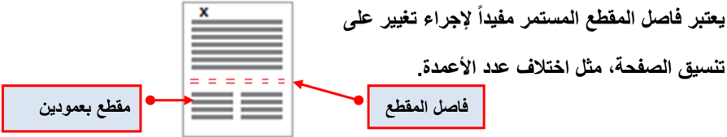

## رؤوس و تذييلات الصفحات
-  رؤوس وتذييلات صفحات المقطع الثاني تبقى متصلة مع رؤوس وتذييلات صفحات المقطع الأول وتتغير بتغيّرها. لاحظ الصورة:
-  لكي نجعل لكل مقطع رأس صفحات مخصص:
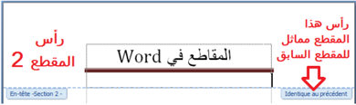
-4 نضع المؤشر في رأس صفحة من صفحات المقطع الثاني.
-4 ضمن التبويب تصميم Création
وفي المجموعة Navigation نلغي تنشيط الأمر Lier au précédent

-  بطريقة مماثلة نجعل لكل مقطع تذييل صفحات مخصّص.
-  رؤوس الصفحات غير مرتبطة بتذييلاتها، فيمكن الحصول مثلا على رؤوس متماثلة لكل المقاطع مع اختلاف التذييلات من مقطع لآخر.
## 5 . حذف فاصل مقطع
## لإظهار فاصل المقطع:
-  ننقرعلى علامة التبويب Affichage
-  ضمن المجموعة Affichages document ننقرعلى Brouillon

يظهر فاصل المقطع على شكل خط منقط مزدوج.
ملاحظة: يمكن إظهار فاصل المقطع أيضا بالنقر على الزر Afficher tout من المجموعة.Paragraphe
## لحذف فاصل المقطع:
-  نحدد فاصل المقطع الذي . نريد حذفه
-  نضغط على المفتاح.Suppr
## ملاحظات:
## المقاطع في Word 2007
يتكون  المستند  المنشأ  في Word من  مقطع  واحد  يتميز  بخصائص  تخطيط  الصفحة  وتنسيقها.  ولتغيير  تخطيط صفحة أو عدة صفحات من مستند أو تغيير تنسيقها, نلجأ إلى تقطيع هذا المستند إلى عدة أجزاء وهمية نسميها مقاطعا . فيمكن مثلا: تخطيط جزء من صفحة ذات عمود واحد بعدة أعمدة، تقسيم المستند إلى فصول ليبدأ ترقيم صفحات كل فصل بالرقم 4 أو إنشاء رأس و/أو تذييل مختلف لمقطع من مقاطع المستند.
نجزئ المستند إلى مقاطع ليسهل علينا تنسيقه في الحالات التالية:
-  المستند يحتوي على صفحات أفقية و أخرى عمودية
-  هوامش بعض الصفحات تختلف عن الأخرى
-  ترقيم بعض الصفحات يختلف عن البقية كأن يكون مقطع (المقدمة مثلا) بترقيم حروف أبجدية ( (أ ، ب ، ج...) ، والباقي بترقيم أرقام 4 ، 4 ، .)…4
-  جزء من المستند (جزء من صفحة أو عدة صفحات) على شكل أعمدة
| الاستعمال                                               | الفاصل نوع                                                                                                                         |
|---------------------------------------------------------|------------------------------------------------------------------------------------------------------------------------------------|
| جديد فصل وبدء الحالي الفصل لإنهاء مثلا يستعمل مستند. في | الأمر التالية: الصفحة وبدء مقطع فاصل بإدراج يقوم التالية. الصفحة على الجديد المقطع                                                 |
| الأعمدة. عدد إختلاف                                     | الأمر مستمر: مقطع فاصل بإدراج يقوم جديد مقطع وبدء مفيدا المستمر المقطع فاصل ويعتبر ذاتها. الصفحة على الصفحة تنسيق على تغيير لإجراء |
| عادة فردية صفحة على المستندات فصول نبدأ ما              | الأمر صفحة زوجية أو صفحة فردية فاصل بإدراج يقوم العدد ذات التالية الصفحة على جديد مقطع وبدء مقطعي، الفردي. أو الزوجي               |
## نهاية الصفحة
## تمارين
## التمرين الأول:
- .1 ما هي فوائد تجزئة المستند إلى مقاطع؟
- .2 ما الفرق بين فاصل الصفحة وفاصل المقطع؟
- .3 اذكر أنواع فواصل المقاطع.
## التمرين الثاني:
إليك محتويات صفحة في :word
## بداية الصفحة
## المطلوب:
- o أكتب هذه الصفحة في.word
- o ( أجر عليها التعديلات اللازمة تنسيق, تخطيط صفحة, إدراج فواصل صفحة، إدراج فواصل مقاطع...) حتى تحصل على النتيجة كما في الصورة التالية:
## صورة الصفحة قبل التعديل

## صورة الصفحة بعد التعديل
حيث نحصل على ثلاث صفحات: الأولى والثانية باتجاه عمودي والثالثة باتجاه أفقي، كما أن الصفحة الثانية بها مقطعان الأول بعمودين والثاني بعمود واحد.
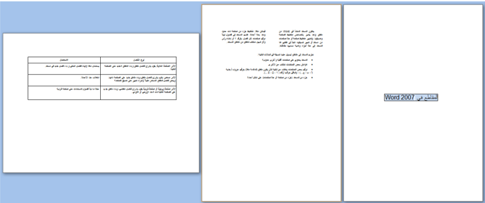
## .4 دمج المراسلات Publipostage
## الكفاءات المستهدفة
 يدرك المتعلم مفهوم دمج المراسلات وأهميته.
 يتمكن من تطبيق عملية دمج المراسلات.
 يتمكن من الإدراج المشروط لنص.
-  يتمكن من تصفية البيانات.
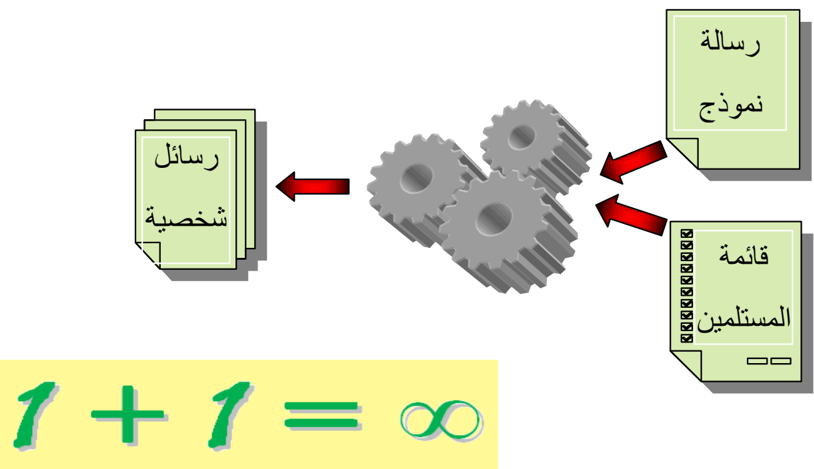
## 1 . دمج المراسلات
## 1.1 الإشكالية
قررت إدارة ثانويتك تقديم جوائز و إنجاز شهادات تقدير للطلاب المتحصلين على معدلات جيدة، يتكون نص الشهادة من جزء ثابت و جزء متغير حسب اسم ولقب الطالب، قسمه، ومعدله. ولكون  العدد كبيرا يصعب ملء هذه الشهادات بالطريقة التقليدية. اقترح على الإدارة حلا لإنجاز هذا العمل بطريقة أسرع و بجهد أقل. علما أن للإدارة ملفا معلوماتيا . لكل التلاميذ المتفوقين
الشهادة حيث يظهر النص المشترك، و الفراغات التي تُملأ حسب كل طالب:
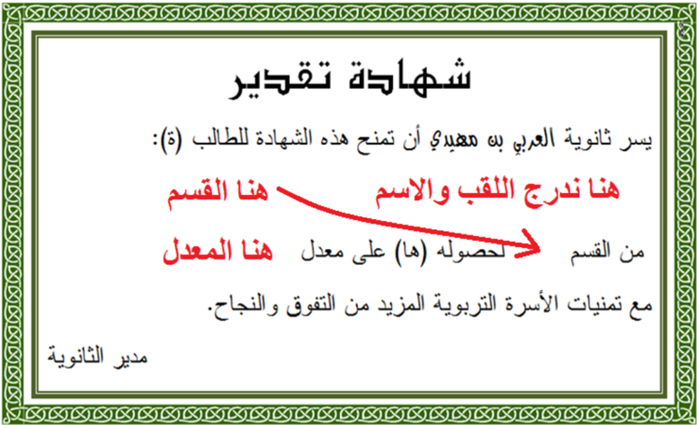
## جزء من ملف الطلاب:

## 2.1 دمج المراسلات
يوفر معالج النصوص طريقة مناسبة أكثر لحل هذا النوع من الإشكاليات هي: دمج المراسلات. تسهل . هذه الطريقة عملية إرسال العديد من الرسائل المتشابهة إلى العديد من المستلمين
## الهدف  من  دمج  المراسلات  هو  إنشاء  رسائل  شخصية لقائمة من المستلمين.

## 3.1 تنفيذ عملية دمج المراسلات
لتنفيذ عملية دمج المراسلات نحتاج إلى:
-  الوثيقة الأولى تحتوي على بيانات المستلمين (المرسل إليهم) ونسميها مصدر البيانات .
-  الوثيقة الثانية وهي الرسالة النموذج ونسميها المستند  الرئيسي وتحتوي على  الجزء  الثابت الذي تشترك فيه كل الرسائل.
ينتج عن دمج المستند الرئيسي مع مصدر البيانات مستندا ثالثا يمكن أن يكون:
-  رسائل شخصية
-  رسائل إلكترونية
-  ملصقات Etiquettes
-  ظروف بريدية Enveloppes
-  دليل Répertoire
## مصدر البيانات
في المثال الحالي مصدر البيانات هو جدول في معالج النصوص Word ،  و يمكن أن يكون جدولا في مصنف Excel أو في قاعدة بيانات Access أو قائمة عناوين في .Outlook
يمكن  أن  يكون  ملف  مصدر  البيانات  موجودا  قبل  بدء  عملية  دمج  المراسلات،  كما  يمكن إنشاؤه خلال العملية نفسها.
## المستند الرئيسي
ننشئ وثيقة في Word ، تحتوي على كل المعلومات المشتركة في الشهادة ونترك فراغات . للمعلومات المتغيرة حسب الطالب

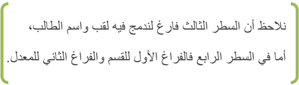
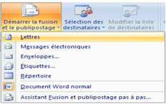
## خطوات عملية الدمج
 ننقر على علامة التبويب Publipostage
 ننقر على Démarrer la fusion et le publipostage ثم على Lettres
. لتأكيد أننا بصدد إنشاء رسائل
 ننقر على Sélection des destinataires

 تنسدل قائمة، ننقر على Utiliser la liste existante…

 تظهر علبة حوار لاختيار مصدر البيانات.
 ننتقل إلى مكان وجود ملف مصدر البيانات - في المثال الحالي - المكان هو سطح المكتب واسم الملف هو .docx" ملف\_الطلاب"، نحدده ثم ننقر على . Ouvrir
ظاهريا  لم  يحدث  شيء،  لكن  حدث  ربط  بين  المستند  الرئيسي  ومصدر  البيانات.  وهذا  ما سنلاحظه في الخطوة التالية.
.
 نضع مؤشر الكتابة في المكان الذي سندرج فيه اللقب.
 ننقر على: Insérer un champ de fusion

 تنسدل قائمة، ننقر على اللقب
فيدمج الحقل "اللقب" في المستند الرئيسي ويظهر على الشكل:
## &gt;&gt; &lt;&lt;اللقب
. وبطريقة مماثلة ندرج كل الحقول الاخرى كلا في مكانه
بعد إكمال هذه العملية يصبح المستند الرئيسي كما في الشكل المقابل.
يمكن إضافة التنسيقات للحقول المدرجة. فمثلا نحدد &gt;&gt; &lt;&lt;اللقب ... ونغير الخط والحجم واللون
 لمعاينة النتيجة ننقر على Aperçu des résultats
ننتقل من مستلم لآخر باستعمال الأزرار

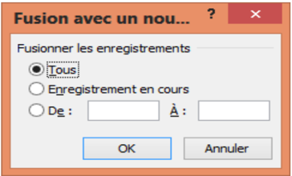
 لإتمام عملية الدمج ننقر على: Terminer &amp; fusionner تنسدل قائمة، ننقر على Modifier des documents individuels…
-  تظهر علبة حوار لاختيار كل السجلات في عملية الدمج أو بعضها فقط. نختار Tous ثم ننقر على OK
-  افتراضي باسم جديد ملف في الدمج عملية تتم Lettres1
فنحصل على الناتج كما في الصورة التالية:
(في نهاية  كل صفحة يدرج Word فاصلا للصفحات)
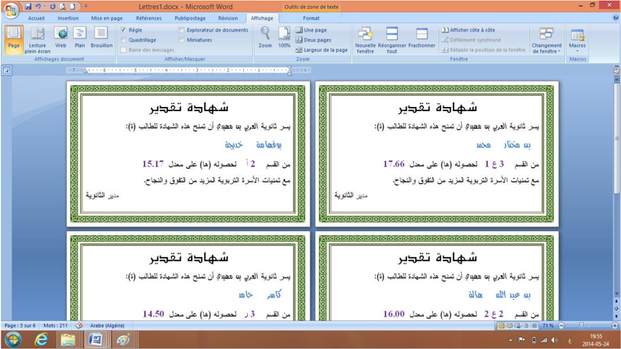
:) إذا كانت نتيجة الدمج مُرضية، نقوم بعملية الطباعة (لا يلزم حفظ الملف
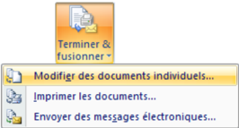
-  ننقر على Terminer &amp; fusionner
-  ننقر على Imprimer les documents…
## 2 . الإدراج المشروط لنص
## 1.2 الإشكالية
لم يستسغ أستاذ اللغة العربية الكتابتين التاليتين الواردتين في الشهادة ") : "الطالب(ة)" و"لحصوله (ها فطلب منك أن تكون شهادة الطالب بالصيغة المذكرة وشهادة الطالبة بالصيغة المؤنثة. مذكرا إياك أن للإدارة ملفا بصيغة Excel للطلبة، به حقل يشير إلى جنس الطالب. أنظر الصورة:
شهادة الطالبة

ملف الطلبة بصيغة Excel
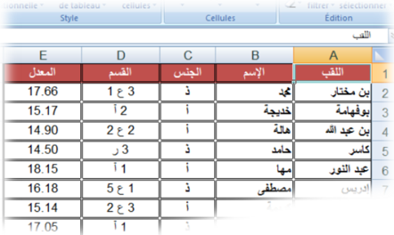
## 2.2 تنفيذ الإدراج المشروط لنص تلقائيا
شهادة الطالب
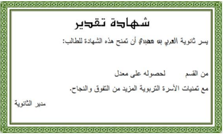
## ... للطالب …  / للطالبة
-  نفتح المستند الرئيسي
-  ننقر على علامة التبويب Publipostage
-  ننقر على Règles
-  ثم على Si…Alors…Sinon…
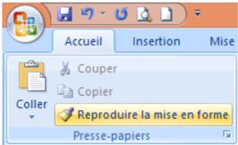
-  تظهر علبة حوار Insérer le mot clé
-  من Nom du champ: نختار حقل الجنس
-  من Élément de comparaison: نختار est égal à
-  من Comparer avec: نكتب: أ
-  في خانة Insérer le texte suivant: : نكتب ة كما يبدو على الصورة.
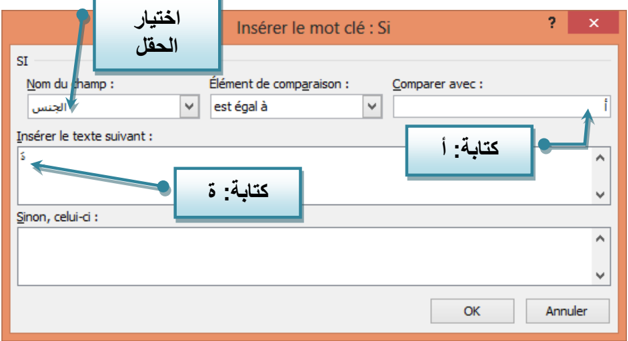
الحرف " ة " لن يكون بنفس تنسيق كلمة للطالب، لذلك وجب تنسيقه
 بعد حرف الباء من كلمة للطالب نقر على زر المسافة لإدخال فراغ
 ننقر على كلمة للطالب
-  ننقر على علامة التبويب Accueil ننقر على Reproduire la mise en forme
-  نحدد الفراغ السابق ليصبح بنفس تنسيق كلمة الطالب وهو مكان إدراج الحرف ة إذا كان جنس الطالب أ (أنثى)
## ... لحصوله ... / لحصولها
" بطريقة مماثلة يمكن إضافة الحرف ا " للكلمة "لحصوله" إذا كانت الشهادة لطالبة.
نعيد  دمج  المستند  الرئيسي  المعدل  مع  مصدر  البيانات  الجديد  فنحصل  على  شهادات  تقدير مخصّ : صة
للذكور: يسر ثانوية العربي بن مهيدي ... : أن تمنح هذه الشهادة للطالب لحصوله ...
للإناث: يسر ثانوية العربي بن مهيدي ... : أن تمنح هذه الشهادة للطالبة لحصولها ...

## 3 . تصفية مصدر البيانات
## 1.3 الإشكالية
ات ّ صل  بك  مدير  المؤسسة  مبديا  أسفه  لأنه  لا  يستطيع  توفير  جوائز  لكل  التلاميذ  المتفوقين،  لذلك يتوجب إنجاز شهادات تقدير للحاصلين على معدل أكبر من أو يساوي 44 من 44 . فقط
علينا في هذه الحالة تصفية مصدر البيانات، فكيف يكون ذلك؟
## 2.3 عملية التصفية
-  نفتح المستند الرئيسي
-  ننقر على علامة التبويب Publipostage
-  ننقر على: Modifier la liste de destinataires
-  ننقر على.Filtrer
تظهر علبة حوار: Fusion et publipostage: Destinataires

-  إذا كان عدد المستلمين صغيرا يمكن إجراء عملية التصفية يدويا باستخدام مربعات الاختيار
-  يمكن فرز قائمة المستلمين باستخدام Trier
##  تظهر علبة حوار أخرى Option de requête
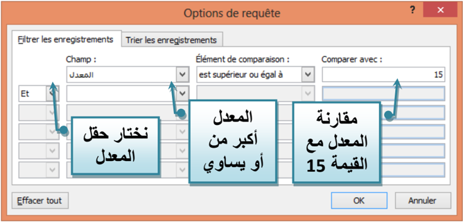
-  في : Champ نختار الحقل &gt;&gt; &lt;&lt;المعدل
- في :Elément de comparaison نختار est supérieur ou égal à
- في :Comparer avec ندخل القيمة 15 .
 ننقر على OK ّ فتتم تصفية البيانات، ونحصل على السجلات التي تحقق الشرط:
- " المعدل أكبر من أو يساوي " 15 فقط.

ثم نكمل عملية الدمج.
## 4 . تمارين
## التمرين الأول:
- -4 أنشئ جدولا في Excel لأصدقائك حيث:
- -4 املأ الجدول بمعلومات من طرفك (لا يقل عدد الأصدقاء عن 44 موزعين على مدن مختلفة)
- -4 أنشئ في معالج النصوص مستندا رئيسيا لدعوة أصدقائك لحضور حفل نجاحك.
- -0 استعمل دمج المراسلات للحصول على كل الدعوات.
- -4 طرأ طارئ مما يستدعي اقتصار الدعوة على الأصدقاء الذين يسكنون في مدينتك. كيف تفعل؟
العمود A
: اسم ولقب الصديق
- العمود B : المدينة التي يقيم بها.
## التمرين الثاني: الظروف البريدية
املأ الجدول أدناه (أهل، أصدقاء، زملاء...)، ثم باستخدام دمج المراسلات، أنشئ ظروفا بريدية للمستلمين.
| الدولة   | البريدي الرمز   | البريدي العنوان   | الاسم واللقب   | الصفة   |
|----------|-----------------|-------------------|----------------|---------|
|          |                 |                   |                | السيد   |
|          |                 |                   |                | السيدة  |
|          |                 |                   |                | الآنسة  |
: قد يبدو الظرف على الشكل التالي
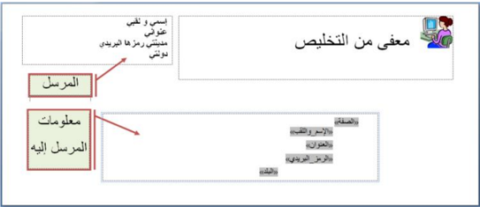
## التمرين الثالث: الملصقات
اقترب موعد الامتحان ولم تتم كتابة الملصقات التي ستلصق على طاولة كل ممتحن حاملة: اسمه، لقبه ورقم تسجيله. وبما أن العدد يقارب 444 فلن تكون العملية يدوية، اقترح حلا. (يفترض وجود ملف إلكتروني للطلاب).
