## وحدة المجدول
## .1 الصيغ والدوال Les formules et les fonctions
## الكفاءات المستهدفة
-  يدرك المتعلم مفهوم الصيغة، مفهوم الدالة والفرق بينهما.
-  يتمكن من كتابة صيغ واستعمال دوال بسيطة لحل مشكلة.
-  يتمكن من استعمال الدالة .si

## الصيغ والدوال في Excel
## .1 الإشكالية 1
يوجد في كشف نقاط التلميذ نوعان من المواد الدراسية:
-  أساسية : يُقو َّ م فيها التلميذ بفرضين،
-  غير أساسية: يُقو َّ م فيها التلميذ بفرض واحد.
قد يبدو جزء من هذا الكشف على الشكل التالي:
## لحساب معدل الفروض :
-  إذا  كانت  المادة  أساسية  نجمع  النقاط  الثلاثة  "التقويم"،  "الفرض 4 "،  "الفرض 4 "  ثم  نقسم  هذا المجموع على .4
-  إذا كانت المادة غير أساسية نجمع نقطتي "التقويم" و "الفرض 4 "، ثم نقسم المجموع على .4
هل نستعمل صيغة ثم ننسخها؟ أم نستعمل دالة؟
## 2 . هل أستعمل صيغة أم دالة؟
-  ما هي الصيغة؟
الصيغة عبارة حسابية و/أو منطقية، يقوم المجدول بحساب  نتيجتها  تلقائيا  بعد  كتابتها  والضغط على المفتاح .Entrer
## الدوال صيغ  جاهزة  م ٌض َ َ م ّن َة  في  البرنامج  يمكن استخدامها بسرعة وسهولة.

-  ماهي الدالة؟
##  أمثلة
مثال :1 يمكن أن تحتوي الصيغة أعدادا وعمليات حسابية فقط.
-  في الخلية B1 ، نكتب الصيغة 7 -4 = لاحظ أن ما كتبناه يظهر في شريط الصيغة
-  نضغط على المفتاح Entrer
-  يحسب المجدول نتيجة الصيغة تلقائيا لاحظ أن محتوي الخلية B1 هو النتيجة 3 .
مثال :2 " يمكن أن تحتوي الصيغة عبارة منطقية وتكون نتيجتها إما "صح VRAI " وإما "خطأ FAUX . عبارة الصيغة: محتوى الخلية A5 أكبر من محتوى الخلية B5
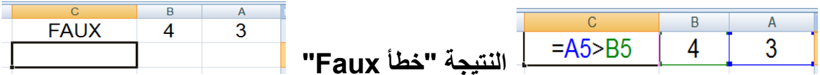
مثال :3 يمكن أن تحتوي الصيغة مراجع للخلايا.
## حساب محيط مستطيل:
محتوى الخلية A2 قيمة الطول.
محتوى الخلية B2 قيمة العرض.

لحساب مساحة هذا المستطيل ووضع قيمتها في الخلية C3 نتبع الخطوات التالية:
4 . نكتب )
4 . نكتب +
4 . نكتب )
4 . نكتب 2 ثم نضغط على Entrer .
- 4 . في الخلية C3 نكتب =
- 4 . ننقر على الخلية A2
- 4 . ننقر على الخلية B2
- 4 . نكتب *
ملاحظة: إذا غيرنا مثلا قيمة الخلية A2 فإن النتيجة في الخلية C2 تتغير تلقائيا.
.2
## مراجعة:
## أولويات العمليات الحسابية من الأقوى إلى الأضعف:
-  )( الأقواس
-  الأس ^
-  الجداء * ، القسمة / و الأفضلية من اليسار إلى اليمين.
-  الجمع + ، الطرح  و الأفضلية من اليسار إلى اليمين.
## مثال :4 حساب متوسط القيم الموجودة في النطاق A1:A10
الحل :1 : باستعمال الصيغ =(A1+A2+A3+A4+A5+A6+A7+A8+A9+A10)/10
بالتأكيد من الأفضل استعمال الدوال:
- الحل :2 باستعمال دالة مجموع =SOMME)A1:A10(/10
الحل :3 و هو الأفضل استعمال دالة الوسط الحسابي =MOYENNE)A1:A10(
## من فوائد استعمال الدوال: تبسيط الصيغ
## مراجعة:
## الدالة SOMME دالة المجموع
-  = SOMME (A1;C3:D12;2) جمع محتوى الخلية A1 و محتوى خلايا النطاق C3:D12 و القيمة
-  =SOMME(E:E)
## جمع محتويات خلايا العمود E
ألا يؤدي استخدام كل العمود كنطاق في دالة إلى بطء العمليات الحسابية؟
هذا الاعتقاد غير صحيح، لأن Excel يتعقب آخر خلايا العمود التي تم استخدامها ولن يستخدم الخلايا التي تقع بعدها عند حساب نتيجة الصيغة.
<!-- formula-not-decoded -->
<!-- formula-not-decoded -->
- 4 . نضغط على المفتاح Entrer
## الدالة MOYENNE الوسط الحسابي
-  = MOYENNE (A1:D20) جمع الأعداد الموجودة في النطاق A1:D20 وقسمتها على عدد هذه الأعداد.
- 
- =MOYENNE (E:E) الوسط الحسابي لأعداد العمود .E
##  حل الإشكالية 1
## حساب معدل الفروض
نريد جمع محتويات الخلايا: C7 ، D7 ، E7 ونضع الناتج في الخلية .F7
## الخطوات:
- 4 . في الخلية F7 ) ، نكتب = ثم القوس
- 4 . ننقر على الخلية D7 + ثم نكتب
- 4 . ندخل رمز القسمة / ثم 4
: نحصل على معدل الرياضيات 13.17
)+( لنسخ الصيغة ولصقها نستعمل مقبض التعبئة ونسحب إلى الأسفل.
## : النتيجة
بالنسبة للمواد الأساسية نحصل على نتائج صحيحة. لكن بالنسبة للمواد غير الأساسية فإن النتائج تكون خاطئة إذ سنجمع قيمتين فقط و نقسم على ثلاثة.
## : الحل
يمكن كتابة صيغة أخرى بالنسبة للمواد غير الأساسية، : لكن الأفضل استعمال الدالة Moyenne .
- .4 في الخلية F7 = ، نكتب
- .4 ننقر على التبويب Formules
- .4 من الأوامر الموجودة في المجموعة Bibliothèque de fonctions. ننقر على Somme automatique
- .0 تنسدل قائمة، ننقر على Moyenne
- .4 نحدد النطاق C7:E7
- .4 نضغط على المفتاح Entrer
ننسخ الدالة ونلصقها باستعمال مقبض التعبئة (+) والسحب إلى الأسفل.
-  أمثلة أخرى
مثال :5 يمكن إدراج دالة داخل صيغة:
إذا كان محتوي الخلية A1 قيمة نصف قطر دائرة.
لحساب محيط هذه الدائرة نكتب في الخلية B1 الصيغة التالية:
حيث pi() دالة ترجع قيمة π .
## ملاحظة:
## وسائط دالة
كل الدوال تستعمل أقواسا () ما بداخل الأقواس هي  وسائط الدالة.
قد يكون للدالة وسيطا أو أكثر وقد يكون عدد الوسائط محددا أو غير محدد و قد يكون اختياريا وقد تكون دالة بدون وسيط.
-  ليس للدال PI() وسيطا.
-  للدالة  الجذر التربيعي وسيط واحد. RACINE (A1) ترجع الجذر التربيعي لمحتوى الخلية .A1
-  تقبل الدالة SOMME وسيطا أو أكثر.
-  للتفريق بين الوسطاء نستعمل الفاصلة أو النقطة الفاصلة حسب إعدادات الجهاز. عرض الصيغة في الخلية بدل النتيجة
-  ننقر على علامة  التبويب .Formules
-  ضمن المجموعة Audit de formules ننقر على الأمر Afficher les formules
## مثال :6 ما هي أكبر قيمة في النطاق A1:E1000 ؟
لا يمكن استخدام صيغة للإجابة على هذا السؤال.
الحل: استخدام الدالة :MAX =MAX(A1:E1000)
: من فوائد استعمال الدوال تنفيذ حسابات لا يمكن تنفيذها باستعمال الصيغ.
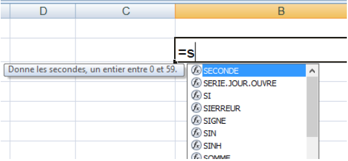
## مراجعة:
## الدالة MAX أكبر قيمة
-  = MAX (A1;D1:D5;9)
إيجاد أكبر قيمة من محتوى الخلية A1 و محتويات الخلايا في النطاق D1:D5 والعدد .9
الدالة MIN أصغر قيمة
-  = MIN (A1;D1:D5;9)
إيجاد أصغر قيمة من محتوى الخلية A1 و محتويات الخلايا في النطاق D1:D5 والعدد .9
## 3 . إدراج دالة
لإدراج دالة يمكن اتباع إحدى الطرائق التالية:
- .4 كتابة الدالة يدويا، ستجد أن المجدول يوف ّ ر لك ميزة الإكمال التلقائي.
- .4 النقر على التبويب Formules ، واستعمال أمر من الأوامر الموجودة في المجموعة Bibliothèque de fonctions.
-  بالنقر على Insérer une fonction "إدراج دالة" تظهر علبة حوار للبحث عن دالة أو اختيار دالة من الفئات المتوفرة.
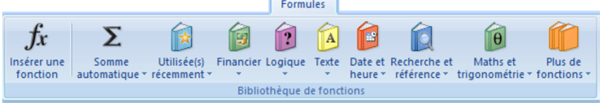

بعد النقر على OK تظهر علبة حوار أخرى لإدخال وسائط الدالة.

-  بالنقر على Somme automatique "جمع تلقائي" ثم اختيار إحدى الدوال المألوفة من القائمة المنسدلة أو النقر على الأمر Autres fonctions "دوال " إضافية
-  " بالنقر على إحدى الفئات المعروضة مثلا "المنطقية Logique
- .4 النقر على الرمز في شريط الصيغة

- .0 : الاختصار
Maj+F3
## .4 الإشكالية 2
لحساب معدل المادة في العمود H : نضرب "معدل الفروض" بالمعامل 4 و "الاختبار" بالمعامل 4 ، نجمع الناتجين ثم نقسم على .4
هل توجد دالة لحساب هذا المعدل أم أننا مجبرون على استعمال صيغة؟
##  حل الإشكالية 2
لا توجد دالة لحساب معدل المادة بالطريقة المطلوبة لذلك يجب كتابة صيغة لحساب هذا المعدل كما يلي:.
- 4 . ننقر على الخلية F7 ثم نكتب *4
- 0 . نكتب *4 ثم القوس )
- 4 نضغط على المفتاح Entrer
- 4 . في الخلية H7 = ، نكتب ) ثم القوس
- 4 . نكتب + ثم ننقر على الخلية G7
- 4 . ندخل رمز القسمة / ثم 4
## .5 الإشكالية 3
## إدراج قرار في كشف نقاط التلميذ
في كشف نقاط نهاية السنة الدراسية، نريد إدراج عمود للنتيجة يكون فيه محتوى الخلية (ناجح) إذا كان المعدل السنوي للتلميذ أكبر من أو يساوي 10 و(راسب) في الحالات الأخرى.
هل توجد دالة نستخدمها لهذه العملية؟
بالفعل هي الدالة الشرطية .si
## من فوائد استعمال الدوال: التنفيذ الشرطي للصيغ، مما يسمح باتخاذ القرارات.
## 6 . الدالة SI
من أهم الدوال استخداما في Excel الدالة الشرطية SI "إذا كان" التي تمك ّن الصيغة من اتخاذ القرار.
عبارة الدالة
<!-- formula-not-decoded -->
##  حل الإشكالية :3
الشرط: المعدل السنوي أكبر من أو يساوي :44 B2&gt;=10
إذا تحقق الشرط: تظهر عبارة ناجح ." في الخلية من العمود "النتيجة
إذا لم يتحقق الشرط: تظهر عبارة راسب ." في الخلية من العمود "النتيجة
<!-- formula-not-decoded -->
- 4 . نضغط على المفتاح Entrer
- .4 ننسخ الصيغة ونلصقها بالسحب من مقبض التعبئة (+) إلى الأسفل فنحصل على النتائج.
ملاحظة: : نحصل على نفس النتيجة باستعمال الصيغة " ("ناجح ; " "راسب =SI )B2&lt;10;
## مثال: إدراج عمود للتهنئة.
نريد إدراج عمود للتهنئة بحيث : إذا كان محتوى خلية "النتيجة" (ناجح) يصبح محتوى خلية التهنئة من العمود D (مبروك) و إلا نترك خلية التهنئة فارغة.
## الحل:
في الخلية D2 نكتب الدالة  (لاحظ الصورة ) ، نضغط على المفتاح Entrer ثم ننسخ ونلصق الدالة.

لاحظ كيف تمثل الخلية الفارغة في الدالة
## .7 الإشكالية 4
## راسب ناجح ! و ناجح راسب!
نظرا لنجاح عدة تلاميذ رغم مستوياتهم الضعيفة في اللغة العربية : ، قررت وزارة التربية أن ّ ه لا يعتبر ناحجا إلا من تحصل على معدل سنوي أكبر من أو يساوي 10 و يكون معدله في اللغة أيضا أكبر من أو يساوي .11
نلاحظ وجود شرطين  في هذه الاشكالية من الواجب أن يتحققا معا . لذلك  نلجأ إلى استخدام  الدالة المنطقية "و "ET" " مع الدالة الشرطية .SI
## ملاحظة:
## " " الدالة المنطقية "و "ET
يمكن استخدام الدوال المنطقية مستقلة ويكون الناتج إما Vrai وإما Faux ، كما يمكن استخدامها داخل الدالة SI للربط بين الشروط.
" توجد دوال منطقية أخرى ومنها: "أو "OU" " " ، "نفي ."NON
##  حل الإشكالية 4
الشرط: المعدل السنوي أكبر من أو يساوي 44 و معدل اللغة أكبر من أو يساوي .44
<!-- formula-not-decoded -->
إذا تحقق الشرط: ." تظهر عبارة ناجح في الخلية من العمود "النتيجة
إذا لم يتحقق الشرط: ." تظهر عبارة راسب في الخلية من العمود "النتيجة
في الخلية ِ D4 نكتب الدالة  (لاحظ الصورة)، نضغط على المفتاح Entrer ثم ننسخ ونلصق . الدالة " ( "راسب ; (  " "ناجح =SI )ET )B2&gt;=10 ; C2&gt;=10
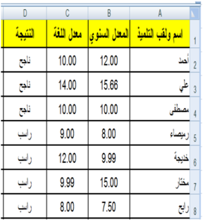

## تمارين
## التمرين الأول:
ما هي فوائد استعمال الدوال في Excel ؟
## التمرين الثاني:
- 4 .) . أنجز الجدول التالي ونسقه (بتنسيقك الخاص
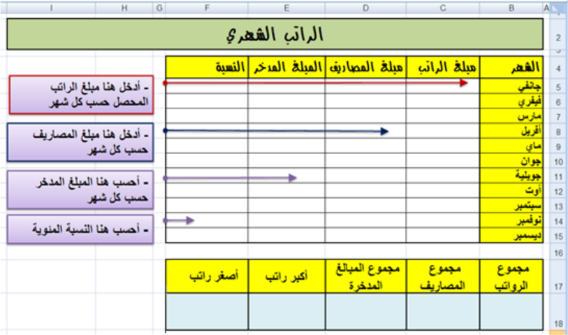
## 4 . في الجدول الأول أعلى الصورة:
-  .) أدخل مبلغ الراتب، المصاريف, لكل شهر(المبالغ تكون بالعملة: د.ج
-  اكتب صيغة لحساب المبلغ المدخر لشهر جانفي ثم انسخها للأشهر الأخرى.
-  اكتب صيغة لحساب نسبة الادخار لشهر جانفي ثم انسخها للأشهر الأخرى.
- 4 :) . في الجدول الثاني أسفل الصورة، واستنادا للجدول الأعلى، اكتب صيغا (دوالا) لحساب (تعيين
-  مجموع الرواتب.
-  مجموع المصاريف.
-  مجموع المبالغ المدخرة.
-  أكبر راتب
-  أصغر راتب
: التمرين الثالث
(استعمال العمليات الحسابية على التواريخ)
## متوسط الاستهلاك اليومي لمادة البطاطا بين تاريخين:
استهلكت أسرة 500 : كغ بطاطا بين التاريخين التاليين 4440-4-44 و .4444-0-44
نريد حساب متوسط الاستهلاك يوميا، اكتب في الخلية B5 الصيغة المطلوبة.
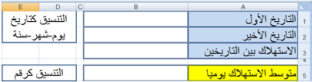
## التمرين الرابع: استعمال الدالة "OU"
" " باستعمال  الدالة "أو OU " اكتب صيغة داخل الخلية B3 وانسخها للحصول على  القيمة VRAI إذا كان اللون المقابل في العمود A من ألوان العلم الوطني, و القيمة FAUX في الحالات الأخرى.
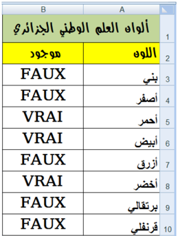

قد تكون من الشكل:
## التمرين الخامس:
أدخل في العمود A قيما عشوائية من 4 إلى .444
أدخل في العمود B قيما عشوائية من 4 إلى .444
اكتب صيغة في العمود C : تدرج العبارة
- " القيمة في العمود A أكبر من أو تساوي القيمة في العمود " B
- " القيمة في العمود A أصغر من القيمة في العمود " B
## التمرين السادس: ليكن الجدول:
## .1 : أكمل الجدول السابق بكتابة صيغتين
-  الأولى في العمود C لحساب قيمة الخصم حسب القاعدة التالية: إذا كانت قيمة مشتريات زبون  أقل  من 44444 دج  يستفيد  من  خصم  مقداره 5% أما  في  الحالات  الأخرى يستفيد من خصم مقداره .7%
-  الثانية في العمود D لحساب المبلغ المدفوع.
- .2 إذا حذفنا العمود ِ C من الجدول السابق، أعد كتابة الصيغة في العمود D لحساب المبلغ المدفوع حسب نفس القاعدة في السؤال السابق.
## التمرين السابع:
للمشاركة في مسابقة الدخول للتكوين في المدرسة العليا للرياضيات يشترط أن يكون المعدل السنوي أكبر من أو يساوي 40 و معدل الرياضيات أكبر تماما من .44
اكتب صيغة ت ُ در ِ ج في العمود D "مقبول" أو "مرفوض" حسب الحالة.
## .2 فرز البيانات Le tri
## الكفاءات المستهدفة
-  يدرك المتعلم مفهوم فرز البيانات.
-  يتمكن من فرز جدول حسب معيار.
-  يتمكن من فرز جدول حسب معيارين.
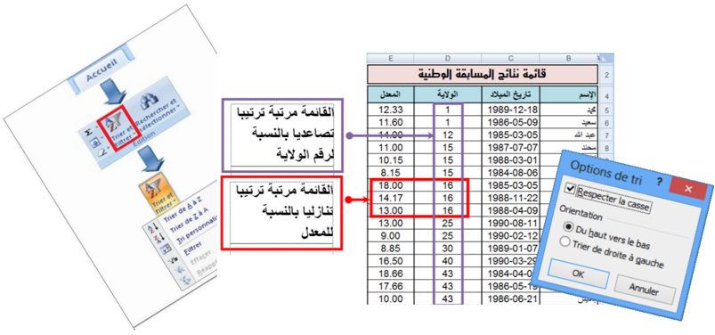
## فرز وترتيب البيانات في Excel
## .1 نشاط
## إليك جزء من قائمة نتائج مسابقة وطنية:
## المطلوب:
- .4 اكتب القائمة في ورقة excel
- .4 رتب القائمة حسب المعدل من الأكبر إلى الأصغر.
- .4 ." أعد ترتيب القائمة حسب الاسم من "أ" إلى "ي
- .0 أعد ترتيب القائمة حسب تاريخ الميلاد من الأقدم إلى الأحدث.
- .4 كيف نرتب القائمة ترتيبا تصاعديا بالنسبة لرقم الولاية و ترتيبا تنازليا  بالنسبة للمعدل (في نفس الوقت)؟
## 2 . فرز البيانات
فرز  بيانات  جدول  هو  إعادة  ترتيبها  حسب  القيم العددية  أو  النصية  الموجودة  في  الأعمدة  وقد  يكون الترتيب تصاعديا أو تنازليا.
## ملاحظات:
-  عادة ما تتم عملية الفرز حسب العمود، لكن يمكن أيضا أن تتم حسب الصف.
-  يمكن أن تتم عملية الفرز في عمود واحد أو أكثر.
##  يمكن فرز البيانات:
-  حسب النص (من أ إلى ي أو من ي إلى أ)
-  حسب الرقم (من الأصغر إلى الأكبر أو من الأكبر إلى الأصغر)
-  حسب التواريخ والأوقات (من الأقدم للأحدث أو من الأحدث للأقدم)
-  حسب قائمة مخصصة (مثل كبير ،متوسط وصغير)
-  )... حسب التنسيق (مثل لون الخلية أو لون الخط
##  لماذا الفرز؟
## تسمح عملية الفرز بـ:
-  معاينة البيانات بشكل أسرع.
-  فهمها بصورة أفضل.
-  تنظيم البيانات مما يسهل البحث عنها.
-  اتخاذ قرارات سليمة وأكثر فاعلية.
القائمة بعد الفرز

-  كيف تتم عملية الفرز؟
## حل النشاط السابق
- 1 . ترتيب القائمة حسب المعدل من الأكبر إلى الأصغر.
-  ." ننقر على إحدى خلايا العمود "المعدل
-  في  علامة  التبويب  "الصفحة  الرئيسية"  " Accueil "،  في " مجموعة  "تحرير "Edition" ،  ننقر  على  الأداة  "فرز " وتصفية Trier et filtrer" " لتظهر أدوات التصفية:
.
-  ننقر على الأداة
-  نحصل على الجدول المرتب.
القائمة قبل الفرز
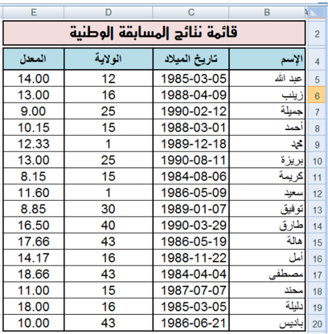
## ملاحظات:
- .4 في  عملية  الفرز  يتم  إعادة  ترتيب  جميع  بيانات  الجدول  وليس  بيانات  العمود  الذي  تم  الفرز  على أساسه فقط. وإلا لحصلنا على نتائج خاطئة.
- .4 عند ترتيب قيم عددية يجب التحقق من أن كافة البيانات مخزنة كرقم. كيف يتم هذا؟
-  ننقر بالزر الأيمن على الخلية أو النطاق.
-  ننقر على .Format de cellule
-  تظهر علبة حوار،من علامة التبويب "Nombre" نختار الفئة التي نريد.
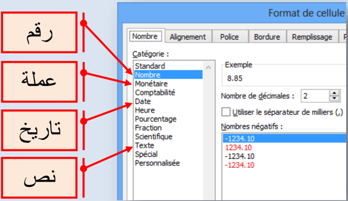
## 2 . ترتيب القائمة حسب الاسم من أ إلى ي.
-  ." ننقر على إحدى خلايا العمود "الاسم
-  " في  علامة  التبويب  "الصفحة  الرئيسية Accueil" "،  في " مجموعة "تحرير "Edition" ،  ننقر  على  الأداة "فرز " وتصفية Trier et filtrer" " لتظهر أدوات التصفية:
.
-  ننقر على الأداة
-  نحصل على الجدول المرتب المقابل
## ملاحظات
- .4 عند ترتيب قيم نصية يجب التحقق من أن كافة البيانات مخزنة كنص.
- .4 عند  استيراد  بيانات  من  تطبيقات  أخرى،  يجب  التأكد  من  عدم  وجود  مسافات  بادئة  مدرجة  قبل البيانات لأن هذا يؤدي إلى نتائج خاطئة، في حالة كهذه يجب حذف هذه المسافات قبل فرز البيانات.
- .4 إذا استعملنا نصوصا بلغة ذات أصول لاتينية (فرنسية أو إنجليزية مثلا)، يمكن القيام بعملية الفرز مع تحسس حالة الأحرف: Majuscule أو . Minuscule كيف يتم هذا؟

## 3 . ترتيب القائمة حسب تاريخ الميلاد من الأقدم إلى الأحدث.
-  ." ننقر على إحدى خلايا العمود "تاريخ الميلاد
-  "  " في  علامة  التبويب  "الصفحة  الرئيسية Accueil "، "  " في مجموعة "تحرير Edition " ، ننقر على الأداة "  " "فرز  وتصفية Trier  et  filtrer "  لتظهر  أدوات التصفية:
.
-  ننقر على الأداة
-  نحصل على الجدول المرتب المقابل
## ملاحظة:
- .4 عند ترتيب التواريخ يجب التحقق من أن كافة البيانات مخزنة كتاريخ.
- .4 يمكن إجراء عملية الفرز بالنقر بالزر الأيمن على خلية من العمود ثم اختيار نوع الفرز.

## 4 . ترتيب القائمة ترتيبا تصاعديا بالنسبة لرقم الولاية و ترتيبا تنازليا بالنسبة للمعدل.
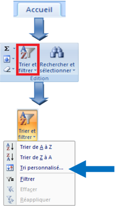
-  . ننقر على إحدى خلايا الجدول
-  "  " في  علامة  التبويب  "الصفحة  الرئيسية Accueil "، "  " في مجموعة "تحرير Edition " ، ننقر على الأداة "  " "فرز  و  تصفية Trier  et  filtrer "  لتظهر  أدوات التصفية:
-  ننقر على الأداة .
-  تظهر علبة حوار .Tri
-  في مربع Trier par نختار العمود "الولاية"
-  في مربع Trier sur " نختار ."Valeurs
-  " في مربع Ordre " " نختار "Du plus petit au plus grand
-  ننقر على Ajouter un niveau
-  في مربع Trier par " نختار العمود"المعدل
-  في مربع Trier sur " نختار ."Valeurs
-  " في مربع Ordre " " نختار "Du plus grand au plus petit
-  ننقر على OK لنحصل على الجدول مرتبا.

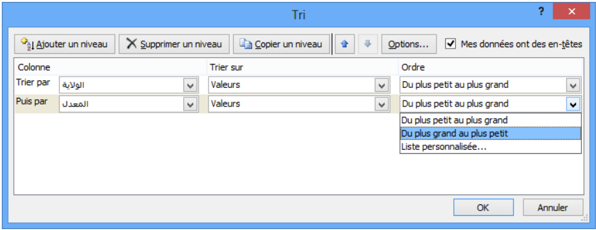
القائمة مرتبة ترتيبا تصاعديا بالنسبة لرقم الولاية
القائمة مرتبة ترتيبا تنازليا بالنسبة للمعدل
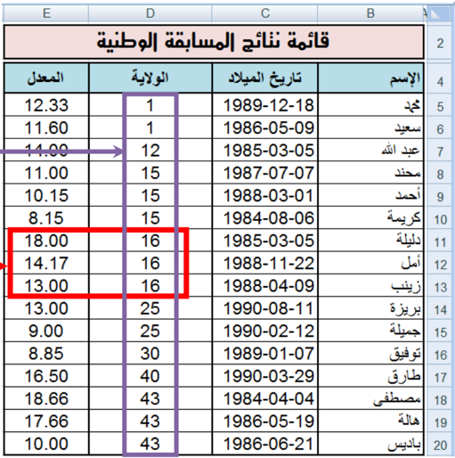
## ملاحظات
-  عادة ما يحتوي الجدول على صف عنوان لأن هذا يسهل قراءة البيانات
-  افتراضيا لا يتم تضمين القيم الموجودة في عنوان العمود في عملية الفرز
-  إذا أردنا أن تشمل عملية الفرز القيم الموجودة في العنوان:
- ننقر على Trier et filtrer (التبويب - Acceuil المجموعة (Edition
- .1
- .2 ننقر على .Tri personnalisé
- 3 . في علبة الحوار Tri ، نلغي تنشيط Mes données ont des en-têtes

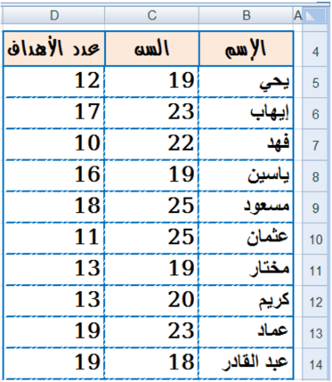
## تمارين
## التمرين الأول: أجب بصحيح أو خطأ
- .4 لايمكن تطبيق عملية الفرز إلا على الأعمدة.
- .4 يمكن فرز البيانات حسب لون الخلية.
- .4 تسمح عملية الفرز بتنظيم البيانات مما يسهل اتخاذ القرارات الأكثر فاعلية.
- .0 يمكن تطبيق عملية الفرز حسب عدة أعمدة.
## التمرين الثاني
قصد  اختيار  لاعبي  هجوم  لتكوين  فريق  ولائي،  تمت عملية  إحصاء  شملت  كل  فرق  الولاية  وأسفرت  على  الجدول المقابل: (يمكنك  تغيير  هذه  البيانات    ببيانات  أخرى  حسب الحاجة)
- .4 رتب الجدول حسب سن اللاعب.
- .4 رتب الجدول حسب عدد الأهداف المسجلة.
- .4 رتب  الجدول  حسب  عدد  الأهداف  المسجلة  وسن .) اللاعب (في نفس الوقت
## التمرين الثالث
مستعينا بمكتبة ثانويتك املأ الجدول التالي:
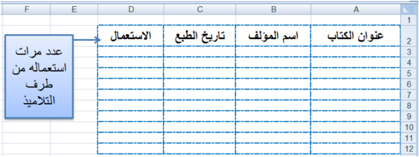
- .4 رتب الجدول حسب عنوان الكتاب.
- .4 حسب أي معيار يجب ترتيب الجدول لمعرفة أقدم كتاب في المكتبة؟ قم بهذه العملية.
- .4 ما هو الكتاب الأكثر استعمالا من طرف التلاميذ؟
