## وحدة العروض التقديمية
## .1 الارتباطات التشعبية Les liens hypertextes
## الكفاءات المستهدفة
-  يتعرف على مفهوم العرض التفاعلي.
-  يتعرف على مفهوم الارتباط التشعبي.
-  يتمكن من استعمال أزرار الإجراءات.
-  يتمكن من استعمال الارتباطات التشعبية.

## الارتباطات التشعبية
## 1 . نشاط: عرض تقديمي "سؤال و جواب"
نريد إنشاء عرض  تقديمي  المطلوب  فيه  اختيار  الإجابة  الصحيحة  من  عدة  إجابات  مقترحة  لعدة أسئلة، ويكون إظهار شريحة للإجابة الصحيحة وأخرى للإجابة الخاطئة حسب الحالة ثم الرجوع لاختيار سؤال آخر.
-  شغل برنامج PowerPoint
-  أنشئ عرضا تقديميا يتكون من 4 شرائح (على الأقل) كما في الشكل التالي:
تخطيط الشرائح الأخرى
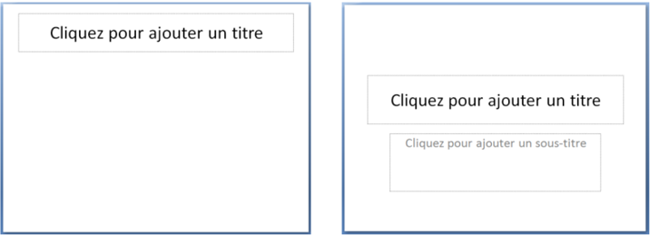
تخطيط الشريحة الأولى
الشريحة :1 العنوان: "سؤال و جواب"، العنوان الفرعي: "تقويم حول برنامج العروض التقديمية " PowerPoint . ، إدراج صورة أو أكثر من مكتبة الصور
الشريحة :2 العنوان:  "الأسئلة"،  إدراج SmartArt . من  شكل  قائمة  تحوي  الأسئلة  المقترحة (على الأقل ثلاثة)
الشريحة :3 العنوان: "السؤال الأول"، إدراج مربع نص السؤال الأول، إدراج SmartArt من شكل قائمة تحوي الإجابات المقترحة.(على الأقل ثلاثة)
- الشريحة :4 العنوان: "السؤال الثاني"، إدراج مربع نص السؤال الثاني، إدراج SmartArt من شكل قائمة تحوي الإجابات المقترحة.(على الأقل ثلاثة)
- الشريحة :5 العنوان: "السؤال الثالث"، إدراج مربع نص السؤال الثالث، إدراج SmartArt من شكل قائمة تحوي الإجابات المقترحة.(على الأقل ثلاثة)
الشريحة :6 العنوان: "إجابة صحيحة"، إدراج مربعي نص "أحسنت" "العودة إلى الأسئلة، إدراج ." شكل "وجه ضاحك
الشريحة :7 العنوان:  "إجابة  خاطئة"،  إدراج  مربعي  نص  "حاول  مرة  أخرى"  "العودة  إلى ." الأسئلة"، إدراج شكل "وجه عبوس
: بعد التنسيق قد تبدو الشرائح في عرض "فارز الشرائح" كما يلي

عند تنفيذ العرض يتم : عرض الشرائح حسب تسلسلها
الشريحة 1 الشريحة 2 الشريحة 3 الشريحة 4 ... وهكذا
الإشكالية: كيف ننتقل مثلا من الشريحة الثانية إلى الشريحة الخامسة لعرض السؤال الثالث؟
وكيف ننتقل إلى شريحة الإجابة الصحيحة إذا كانت إجابتنا بالفعل صحيحة؟
وكيف نعود بعد ذلك لاختيار سؤال آخر؟
لتحقيق هذا: يجب أن يكون عرضنا التقديمي تفاعليا
.
للتحكم في تسلسل عرض الشرائح ندرج "أزرار إجراءات".
## 2 . أزار الإجراءات Boutons d'action
زر الإجراء هو زر جاهز يمكن إدراجه في العرض التقديمي و تعريف ارتباط له.

- زر الإجراء "السابق" للذهاب إلى الشريحة السابقة.
- زر الإجراء "التالي" للذهاب إلى الشريحة الموالية.
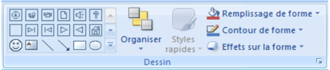
ملاحظة: تظهر أزرار الإجراءات أيضا في المجموعة Dessin من التبويب Acceuil
-  توجد أزرار الإجراءات ضمن مجموعات الأشكال.
-  تظهر على أزرار الإجراءات أشكال تساعد على فهم عملها.
## مثلا:

## إدراج زر إجراء
نعرض الشرائح في العرض العادي" "Normal
- .4 ضمن علامة التبويب Insertion ، من مجموعة الرسومات التوضيحية Illustrations ، نضغط على السهم أسفل أداة أشكال
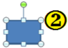
Formes ستظهر مجموعة من الأشرطة. ننقر على شكل الزر الذي نريد إدراجه.

- .4 يتغير المؤشر إلى شكل +، باستخدام السحب والإفلات، نرسم الزر على الشريحة
في علبة الحوار Paramètres des actions التي تظهر نختار إحدى علامتي التبويب:
-  Pointer avec la souris " " إذا أردنا أن يستجيب الزر بمجرد مرور مؤشر الفأرة فوقه.
-  Cliquer avec la souris " " إذا أردنا أن تكون استجابة الزر بعد النقر عليه.
(الإستجابة تكون في طريقة العرض )Diaporama
- .4 يتوقف الإجراء الذي سيحدث عند النقر على زر الإجراء أو تحريك المؤشر فوقه على ما  نختار من بين : ما يلي
-  ننقر على Aucune : لاستخدام الشكل بدون تنفيذ أي إجراء.
-  ننقر على Créer un lien hypertexte vers : لإنشاء ارتباط تشعبي، ثم نختار الوجهة التي نريد أن ينتقل إليها إجراء الارتباط التشعبي:
-  ننقر على Exécuter le programme : لتشغيل برنامج، ثم ننقر على Parcourir لتحديد مكان البرنامج الذي نريد تشغيله.
-  نحدد خانة الاختيار Activer un son : لتشغيل صوت، ننقر على السهم لتنسدل قائمة للأصوات نحدد واحدا لتشغيله.
- .4 ننقر على OK .
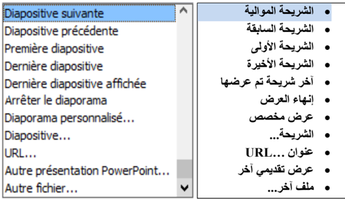
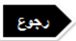
- o إدراج الزر "التالي" في الشريحة الأولى من النشاط السابق.
- o ." تنسيق الزر وإضافة النص التالي له: "ابدأ
بعد إدراج الزر على الشريحة، ننقر على OK .
باستعمال الزر الأيمن للفأرة ،ننقر على "Modifier le texte"
ونكتب: "ابدأ" ، ثم ننقر خارج الزر.

.
شكل الزر بعد التخصيص:
:
تخصيص زر الإجراء
## ملاحظات:
-  : عند تنفيذ العرض التقديمي، تمرير المؤشر على الزر الإجرائي يغير شكله إلى
-  يمكن تنسيق زر الإجراء، تغيير حجمه ومكانه.
-  لحذف زر الإجراء نحدده ثم نضغط على مفتاح Suppr من لوحة المفاتيح.
-  نستطيع تغيير . عمل أي زر من أزرار الإجراءات
-  لإنشاء ارتباط بملف تم إنشاؤه بواسطة برنامج آخر، مثلا ملف Word ، Excel أو Pdf ، ننقر فوق ملف آخر Autre fichier من الارتباط التشعبي.
## عودة للنشاط

## عودة للنشاط
- o إدراج الزر في الشريحة الأولى من النشاط السابق.وتخصيصه بحيث لما ننقر عليه ننهي العرض.
## المطلوب
- o ." تنسيق الزر وإضافة النص التالي له: "إنهاء العرض
- o نسخ الزر ولصقه في الشرائح الأخرى.
- بعد إدراج الزر على الشريحة ، ننشئ ارتباطا تشعبيا له نحو:
" Arrêter le diaporama " . و ننقر على OK .
باستعمال الزر الأيمن للفأرة، ننقر على "Modifier le texte"
ونكتب: "إنهاء العرض" ، ثم ننقر خارج الزر.
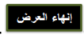
.
شكل الزر بعد التخصيص:
## وأيضا:
- o أدرج زرا للرجوع إلى شريحة الأسئلة في كل شريحة من شرائح الأسئلة.
## المطلوب
## 3 . الارتباطات التشعبية
لقد أدرجنا، عند حل النشاط السابق، أزرار إجراءات سمحت لنا بالانتقال من شريحة إلى أخرى وهذا " ما نسميه ارتباطا تشعبيا ."
ما هو الارتباط التشعبي؟
الارتباط التشعبي اتصال من شريحة لأخرى في نفس العرض التقديمي أو إلى شريحة في عرض تقديمي آخر، أو عنوان بريد إلكتروني، أو صفحة Web ، أو ملف..
يمكننا إنشاء ارتباط تشعبي من نص أو كائن، مثل صورة أو رسم بياني أو شكل أو .WordArt
إنشاء ارتباط تشعبي إلى شريحة في نفس العرض التقديمي
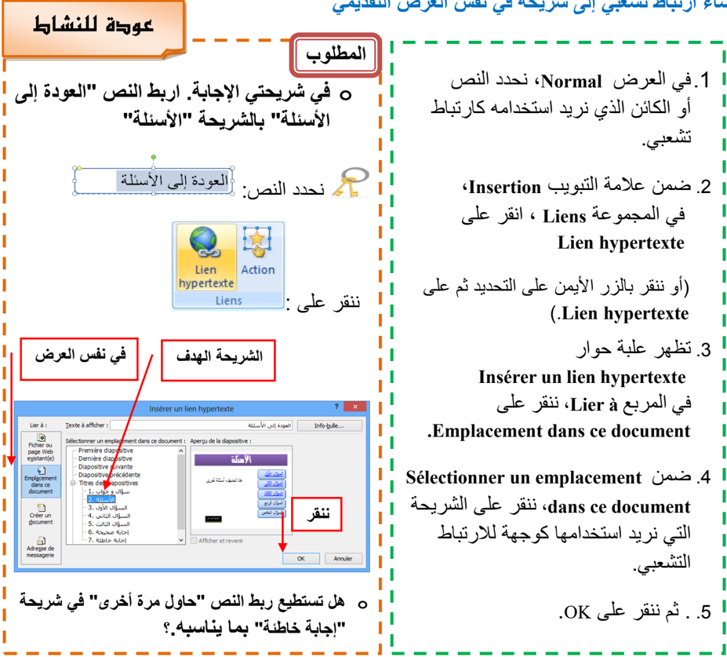
## وأيضا:
- o اربط كل سؤال من شريحة "الأسئلة" بالشريحة المناسبة له .
- o اربط كل إجابة بالشريحة الموافقة لها : صحيحة أو خاطئة.
## لاحظ:
-  ظهور نص الارتباط التشعبي داخل مربع "Texte à afficher" أين يمكن تغييره.
-  ظهور معاينة للشريحة الهدف.
## إنشاء ارتباط تشعبي إلى شريحة في عرض تقديمي آخر
- .1 في العرض Normal ، نحدد النص أو الكائن الذي نريد استخدامه كارتباط تشعبي.
- .2 ضمن علامة التبويب Insertion ، في المجموعة Liens ، ننقر على Lien hypertexte (أو ننقر بالزر الأيمن على التحديد ثم على .Lien hypertexte ( : تظهر علبة حوار باسم Insérer un lien hypertexte
- .3 في المربع Lier à ، ننقر على .Fichier ou page Web existante(e)
- .4 . نحدد موقع العرض التقديمي الذي يحتوي على الشريحة التي نريد الارتباط بها
- .5 ننقر على "إشارة مرجعية" Signet … ، تظهر علبة حوار باسم
- "Sélectionner un emplacement dans le document"
- .6 ننقر على عنوان الشريحة التي نريد الارتباط بها. ثم ننقر على OK .(لإغلاق هذه العلبة)
- .7 ننقر على OK .) .(لإغلاق علبة الحوار السابقة
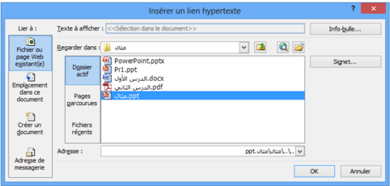

الطريقة 1 : استعمال الأمر Lien hypertexte

## لاحظ:
-  بالنقر على Info-bulle "تعريف الأدوات" يمكن إدخال نص يظهر عند مرور مؤشر الفأرة على الارتباط التشعبي.
-  من خلال عملية إدراج ارتباط تشعبي يمكن إنشاء ملف جديد باختيار:
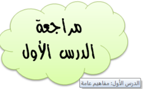

Créer un document من المربع Lier à .
## عودة للنشاط
## الطريقة 2 : استعمال الأمر Action

- o في شريحة السؤال الثاني. أدرج صورة، ثم اربطها بملف على سطح المكتب اسمه pdf" " .الدرس الثاني
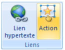
## نحدد الصورة :
ننقر على :
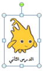

في إعدادات الإجراءات ننقر على Autre fichier ) (كما في الصورة ثم ننقر على . OK تظهر علبة حوار، نحدد الملف ثم ننقر على OK .

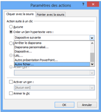
يظهر مسار الملف في خانة الارتباط التشعبي. ننقر على . ok

## العمليات على الارتباط التشعبي
بالنقر بالزر الأيمن على ارتباط تشعبي يمكن:
- o تغيير الارتباط التشعبي Modifier le lien hypertexte
- o فتح الارتباط التشعبي Ouvrir le lien hypertexte
- o نسخ الارتباط التشعبي Copier le lien hypertexte
- o حذف الارتباط التشعبي Supprimer le lien hypertexte

## .2 الحركة في العروض التقديمية L'animation
## الكفاءات المستهدفة
 يدرك المتعلم أهمية الحركة في العروض التقديمية.
 يتمكن من إدراج مراحل انتقالية للشرائح والتحكم في إعداداتها.
 يتمكن من إضافة حركة مخصصة وتغيير إعداداتها.

## الحركة: تأثيرات مشوقة
لإضفاء الحيوية، وجعل العرض التقديمي أكثر تشويقا نلجأ إلى:
- تطبيق مراحل إنتقالية للشرائح.
- إضافة أصوات و مقاطع فيديو.
- ... تطبيق حركة مخصصة على الكائنات: نصوص، صور، أشكال،
## 1 . المراحل الانتقالية للشرائح
## هي تأثير حركي يظهر عند الانتقال من شريحة إلى أخرى.
## إضافة مرحلة انتقالية إلى شريحة من العرض التقديمي:
- .4 في طريقة العرض Normal ، في جزء المهام الذي يحتوي على علامتي التبويب Plan و Diapositives ، ننقر على علامة التبويب " " Diapositives .
- .4 نحد ّد الشريحة التي نريد إضافة مرحلة انتقالية إليها.
- .4 ننقر على علامة التبويب حركات Animations ، في المجموعة Accès à cette diapositive ، ننقر على أحد التأثيرات المتوفرة ليتم تطبيقه على . الشريحة المحددة
- .0 لتطبيق نفس المرحلة الانتقالية على كافة شرائح العرض ننقر على Appliquer partout
- .4 لاختيار : سرعة لحركة الانتقال بين الشريحتين، ننقر على السهم بجانب Vitesse de transition وننقر على أحد الخيارات: بطيئة Lente ، متوسطة Moyenne ، سريعة Rapide .
- .4 لإضافة صوت يتم تشغيله أثناء الانتقال من شريحة إلى أخرى، ننقر على السهم : بجانب Son de transition ونختار صوتا من الأصوات المتاحة أو تشغيل صوت من ملف صوتي Autre son .
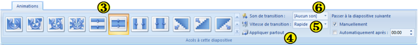

## ملاحظات:
-  ننقر على السهم لعرض كافة التأثيرات المتوفرة
-  لمعاينة نتيجة المرحلة الانتقالية قبل تطبيقها، نضع مؤشر الفأرة فوق أيقونتها يظهر التأثير.
-  لتطبيق نفس المرحلة الانتقالية على بعض الشرائح فقط، نحد ّد الشرائح المعنية ثم نتبع الخطوات السابقة.
## توقيت عرض الشرائح
إفتراضيا يكون الانتقال من شريحة إلى أخرى يدويا Manuellement . لجعل هذا الانتقال آليا بعد مدة زمنية نحدد Automatiquement après: و نعين المدة بالثواني.
بدون مرحلة انتقالية
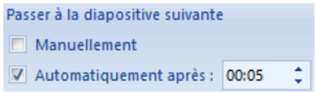

عودة للنشاط

## حذف مرحلة انتقالية لشريحة
- o نحدد هذه الشريحة
- o " من علامة التبويب Animation "، " من المجموعة " Accès à cette diapositive ننقرعلى الرمز الأول Aucune transition
## المطلوب
- o أضف مراحل انتقالية للشرائح.
- o أضف صوت تصفيق عند الانتقال إلى شريحة الإجابة الصحيحة.
- o سجل فيديو تقديمي للنشاط ( باستعمال الحاسوب أو باستعمال الهاتف النقال ) وأدرجه في الشريحة الأولى.
- o يمكنك الإستغناء عن الزر ابدأ في الشريحة الأولى ويكون الانتقال إلى الشريحة الثانية بتوقيت.

- Animation personnalisée
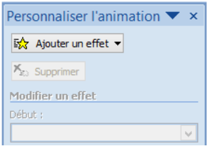

## 2 . الحركات المخصصة:
هي مؤثرات بصرية متنوعة، يمكن تطبيقها على النصوص وعلى الكائنات المدرجة على الشريحة. : الهدف منها التشويق، التنظيم، ودعم أفكار العرض.
-  يمكن تطبيق عدة حركات على نفس النص أو الكائن.
-  تكون الحركات داخل شريحة واحدة مرقمة و تنفذ بالترتيب.
## إضافة حركة مخصصة إلى كائن
- .4 نحدد النص أو الكائن الذي نريد تحريكه
- .4 ننقر على علامة التبويب Animations
- .4 من المجموعة Animations ننقر على الزر يظهر جزء المهام الخاص بالحركة المخصصة Personnaliser
l'animation
- .0 ننقر على السهم بجانب الزر تنسدل قائمة بأربعة أنواع ، يتفرع كل نوع إلى مجموعة من الحركات المستخدمة مؤخرا وتنتهي بزر Autres effets… للحصول على حركات أخرى.
- .4 ننقر على اسم حركة لتطبيقها.

.
## تعيين إعدادات الحركة المخصصة
في جزء المهام الخاص "تخصيص الحركة" Personnaliser l'animation ، نحدد حركة ونقوم بتغيير إعداداتها:
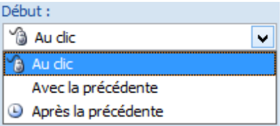
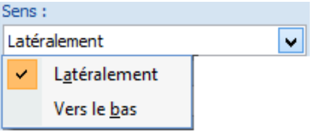

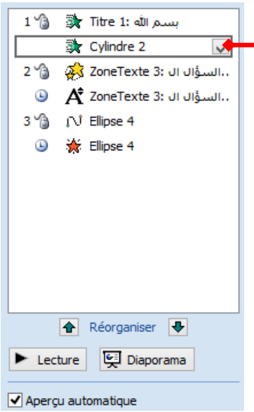
-  : مربع القائمة المنسدلة Début
: Au clic الحركة تبدأ عند النقر :Avec la précédente الحركة تبدأ مع الحركة السابقة وإذا كانت هي الأولى في هذه الشريحة فتبدأ مع إظهار الشريحة. :Après la précédente الحركة تبدأ بعد الحركة السابقة ) ( لاحظ الرمز أمام كل خيار
-  : مربع القائمة المنسدلة Sens )Couleur - Taille - Valeur(
يمكن تغيير الاتجاه، الحجم، اللون...إلخ
-  : مربع القائمة المنسدلة Vitesse
يمكن تعيين سرعة تنفيذ الحركة: بطيئة جدا، بطيئة، متوسطة، . سريعة، سريعة جدا
-  مربع الحركات: ويظهر به:
-  قائمة الكائنات المزودة بحركة على الشريحة
-  رمز نوع الحركة
-  وقت بدء الحركة
-  ترتيب تنفيذ الحركات في العرض النهائي.
يمكن إعادة ترتيب تنفيذ الحركات باستعمال السهمين بجانب Réorganiser .
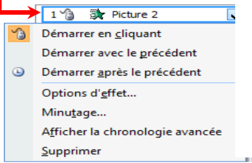
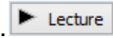
يمكن الوصول إلى خيارات أكثر بالنقر على السهم بجانب اسم الكائن.

-  لاستعراض كل الحركات على الشريحة ننقر على
-  لتشغيل العرض النهائي ننقر على .
-  يتم إظهار الحركة أو التعديل عليها آليا إذا كان الخيار "معاينة تلقائية" محددا
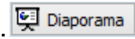
.
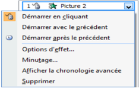
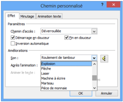
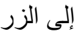
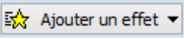

## إضافة صوت إلى الحركة المخصصة
-  نحدد الحركة في مربع الحركات
-  ننقر على السهم بجانب الاسم
-  ننقر على Option d'effets…
-  تظهر علبة حوار لإضافة الأصوات.
-  نختار الصوت الذي نريد ثم ننقر على OK
## تغيير حركة وحذفها
عند تحديد حركة مخصصة من قائمة الحركات، يتحول الزر إلى الزر لاستعماله في تغيير الحركة المحددة بحركة أخرى، كما يصبح الزر فعالا ً  لحذف الحركة إذا أردنا.
## عودة للنشاط
## المطلوب
o أضف حركات مخصصة للنصوص والكائنات التي أدرجتها في عرضك التقديمي. " مثلا في شريحة " إجابة صحيحة "، أضف حركة توكيد Vague "  للنص " "أحسنت أحسنت أحسنت
قد تبدو شرائح العرض التقديمي كما يلي:

## عودة للنشاط
## آخر إشكالية
مازالت الشرائح تستجيب للنقر بالفأرة في أي مكان منها، كما تستجيب لأزرار لوحة المفاتيح . فكيف نعطل هذه الخاصية لتصبح الاستجابة مقتصرة على أزرار الإجراءات  والارتباطات  التشعبية فقط؟
الحل هو ضبط إعدادات العرض
" لوضع اللمسة النهائية على العرض التقديمي "سؤال و جواب
-  ننقر على علامة التبويب Diaporama ثم على Configurer le diaporama
-  " : تظهر علبة الحوار ."Paramètres du diaporama
-  في مربع Type de diaporama نحدد Visionné sur une borne (plein écran)

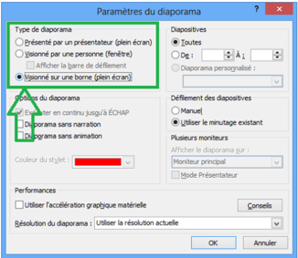
ملاحظة :1
يبقى الزر echap فعالا لإنهاء العرض.
ملاحظة :2
انتبه إلى كيفية بدء الحركات المخصصة !!!
: عليك بإثراء العرض بأسئلة أخرى. ثم احفظ الملف بامتداد .ppsx
## تمارين
## التمرين الأول: عرض للتعريف بمنتجات شركة.
- )1 شغل برنامج عرض الشرائح PowerPoint " . احفظ الملف بإسم تمرين 4 " في المجلد الخاص بك على سطح المكتب.
- )2 أنشئ عرضا تقديميا عن شركة Microsoft : يتكون من الشرائح التالية
## بعض منتجات الشركة
 برنامج Word
 برنامج Excel
 برنامج PowerPoint
## الشريحة الثانية
## مزايا برنامج Excel
 تصميم الجداول الإلكترونية
 إعداد التقارير و الميزانيات
 تصميم الرسوم البيانية
 إعداد الإحصاءات
## الشريحة الرابعة
إعداد
الاسم  و اللقب
الثانوية
الشريحة السادسة
شركة Microsoft
كبرى شركات العالم
## الشريحة الأولى
## مزايا برنامج Word
 كتابة النصوص و معالجتها
 إضافة صور و رسوم
 إضافة جداول و تنسيقها
 دمج المراسلات
## الشريحة الثالثة
## مزايا برنامج PowerPoint
 إعداد الشرائح و العروض التقديمية
 إضافة المؤثرات الصوتية والحركية
 إضافة مقاطع فيديو
 تنسيق الشرائح بأشكال متعددة
الشريحة الخامسة

- )3 قم بالعمليات التالية:
-  في الشريحة الأولى:
أدرج زر إجراء باسم "إعداد" للانتقال إلى الشريحة السادسة.
أدرج زر إنهاء العرض.
-  : في الشريحة الثانية
أدرج ارتباطا تشعبيا لكلمة Word نحو الشريحة الثالثة.
أدرج ارتباطا تشعبيا لكلمة Excel نحو الشريحة الرابعة.
أدرج ارتباطا تشعبيا لكلمة PowerPoint نحو الشريحة الخامسة.
-  في كل من الشرائح الثالثة ، الرابعة و الخامسة: أدرج زر رجوع إلى الشريحة الثانية.
-  في الشريحة السادسة: أدرج زر رجوع إلى البداية.
- )4 قم بإضافة المؤثرات الحركية لعناصر الشريحة الواحدة.
- )5 قم بتطبيق قالب تصميم جاهز على جميع شرائح العرض.
- )6 سجل صوت البسملة  "بسم الله الرحمن الرحيم"، أحفظه في ملف وأدرجه في الشريحة الأولى بحيث يشغل آليا عند ظهور الشريحة.
- )7 " احفظ الملف بالصيغة .ppsx تمرين ."4
## التمرين الثاني
نريد إنشاء عرض تقديمي عن دول إتحاد المغرب العربي.
. ابحث في شبكة الإنترنت عن المعلومات التي تحتاجها لإنجاز هذا التمرين
يتكون العرض على الأقل من سبع شرائح.
## الشريحة الأولى:
-  عنوان "اتحاد المغرب العربي"
-  خريطة لدول المغرب العربي مجتمعة
-  علم وشعار اتحاد المغرب العربي. (يتحركان على مسار متوازي أضلاع .) باتجاهين متعاكسين
-  زر إنهاء العرض، زر التالي

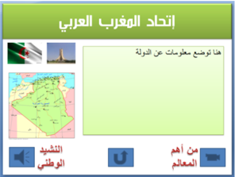
## الشريحة الثانية:
-  تقديم للإتحاد مربع نص
-  إدراج خمسة أشكال، إضافة على كل واحد منها اسم دولة، تنسيقها وربطها تشعبيا كل شكل مع شريحة الدولة الموافقة له.
## الشرائح الأخرى: شريحة لكل دولة بها:
-  .).. مربع نص للتعريف بالدولة (الاسم، المساحة، عدد السكان
-  صورة: العلم الوطني.
-  صوت: السلام الوطني.
-  فيديو: أهم معلم في هذه الدولة.
-  زر رجوع إلى الشريحة الثانية
