## المجال المفاهيمي الثالث
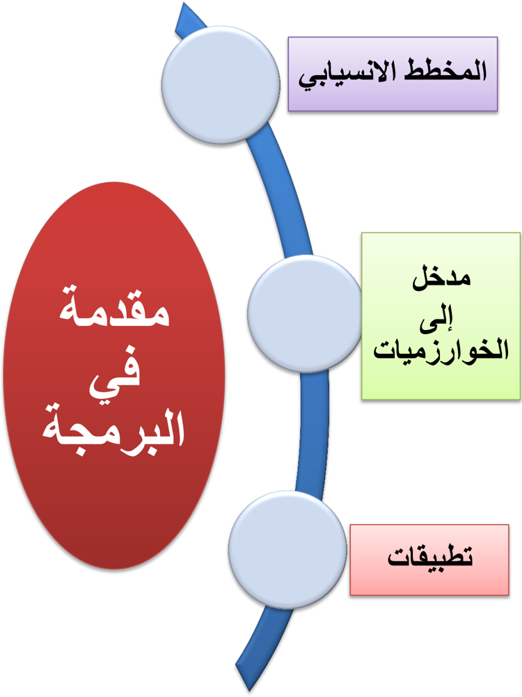
## محمد بن موسى الخوارزمي
أ بو عبد الله محمد بن موسى الخوارزمي عالم مسلم يكنى باسم الخوارزمي وأ بو جعفر قيل أ نه ولد حوالي 461 هـ 184 م وقيل أ نه توفي بعد 232 هـ أ ي بعد 811 م .
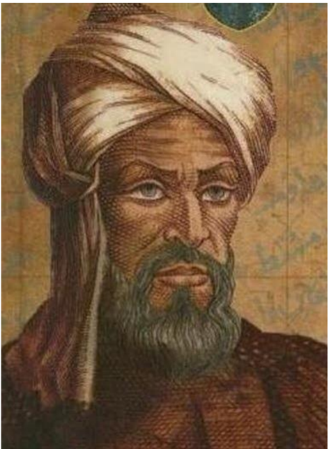
يعتبر من أ وائل علماء الرياضيات المسلمين حيث ساهمت أ عماله بدور كبير في تقدم الرياضيات في عصر ه. اتصل بالخليفة العباسي المأ مون وعمل في بيت الحكمة في بغداد وكسب ثقة الخليفة ا  ذ ولاه المأ مون بيت الحكمة كما عهد ا  ليه برسم خارطة لل رض عمل فيها كثر أ 17 جغر افيا، وقبل وفاته في 857 م/ 232 هـ كان الخوارزمي قد ترك العديد من المؤلفات في علوم الفلك والجغر افيا من أ همها كتاب الجبر والمقابلة الذي يعد أ هم كتبه وقد ترجم الكتاب ا لى اللغة اللاتينية في س نة 4435 م وقد دخلت على ا ثر ذلك كلمات مثل الجبر Algebra و  العدد الصفر Zero ا لى اللغات اللاتينية.
كما ضمت مؤلفات الخوارزمي كتاب الجمع والتفريق في الحساب الهندي، وكتاب رسم الر بع المعمور، وكتاب تقويم البلدان، وكتاب العمل بالا سطرلاب، وكتاب "صورة ال رض " الذي تم ا ع د فيه على كتاب المجسطي  لبطل يموس مع ا ضافات
وشروح وتعليقات، وأ عاد كتابة كتاب الفلك الهندي المعروف باسم "الس ند هند الكبير" الذي ترجم ا لى العر بية زمن الخليفة المنصور فأ عاد الخوارزمي كتابته وأ ضاف ا  ليه وسمي كتابه "الس ند هند ." الصغير
وقد عرض في كتابه (حساب الجبر والمقابلة) أ و (الجبر) أ ول حل منهجي للمعادلات الخطية والتر بيعية. ويعتبر مؤسس علم الجبر، (اللقب الذي يتقاسمه مع ديوفانتوس) في القرن الثاني عشر، قدمت تر جمات اللاتينية عن حسابه على ال   ر قام الهندية، النظام العشري ا لى العالم الغربي. نقح الخوارزمي كتاب الجغر افيا لكلاوديوس  بطل يموس وكتب في علم الفلك والتنجيم.
كان لا سهاماته تأ   ثير كبير على اللغة. "فالجبر"، هو أ حد من اثنين من العمليات التي اس تخدمهم في حل المعادلات التر بيعية. في الا نجليز ية كلمة Algorism و algorithm تنبعان من Algoritmi ، الشكل اللاتيني لاسمه. واسمه هو أ صل الكلمة ا س بانية guarismo والبر تغالية algarismo وهما الاثنان بمعنى "رقم".
## .1 المخطط الإنسيابي
## الكفاءات المستهدفة
 يدرك المتعلم مفهوم المخطط الانسيابي  القدرة على التفكير لحل المشكلات  يتمكن من كتابة برامج للحاسوب
عرف حسن حسين زيتون المشكلة بأنها : » موقف مربك أو سؤال محير أو مدهش يواجه الفرد أو مجموعة من الأفراد فيشعرون بحاجة إلى الحل، ولا يوجد لديهم إمكانات أو خبرات حالية مخزنة في بنيتهم المعرفية تمكنهم من الوصول إلى الحل بصورة فورية أو روتينية بل عليهم بذل جهد ـ معرفي مهاري ـ للوصول إلى الحل، أي أن الفرد يجاهد للعثور على هذا الحل «

إننا عندما نتعلم و نتدرب على صياغة حل المسائل بواسطة الحاسوب ، فإن هذا لا يعني أن الفائدة تقتصر على المسائل الحسابية و المنطقية فحسب ، بل إننا نهدف من تعلم هذا الموضوع إلى :
- .1 القدرة على كتابة برامج للحاسوب
- .2 التخطيط لحياتك اليومية .
- .3 القدرة على التفكير لحل المشكلات.
## صياغة حل المشكلة
إن صياغة حل مشكلة ما, هو تحديد الخطوات المتبعة للوصول إلى الحل, و تتكون هذه الصياغة من ثلاث خطوات أساسية هي :
## فهم المسألة . تحليلها و تحديد عناصرها.
لا يمكن حل مسألة ما, إن لم يتم فهمها بشكل دقيق و كامل و كما يقال " فهم السؤال نصف ." الجواب
و المقصود بفهم المسألة و تحليل عناصرها هو استخراج العناصر الأساسية لحل هذه المسألة وهي:
- -تحديد مدخلات المسألة : الفرضيات والبيانات التي يتم تحليلها لمعرفة النتائج والمخرجات .
- -تحديد مخرجات المسألة : النتائج والمعلومات المراد التوصل إليها عند حل المسألة .
- -تحديد عمليات المعالجة : العمليات الحسابية والخطوات المنطقية التي نقوم بإجرائها على المدخلات حتى تؤدي بالنهاية إلى المخرجات والنتائج السليمة .
## المخططات الانسيابية
##  مقدمة
بالرغم من إن الحاسوب يمتاز بقدرته على انجاز العمليات الحسابية و التعليمات المعطاة له بسرعة فائقة و بدقة و على حفظ المعلومات حيث يعجز الإنسان عن حفظها و استعادتها ، إلا انه يعجز أن يقوم بشكل ذاتي بحل إي مسالة مهما كانت بسيطة بينما الإنسان يمتاز عن الحاسوب بقدرته على التفكير و إرشاده إلى طريقة الحل أي أن يقوم مبدئيا بتمثيلها على شكل تمثيل بياني (مخطط).
##  تعريف المخططات الانسيابية:
هي تمثيل بياني يوضح خطوات حل مشكلة (مسألة)معينة من البداية إلى النهاية مع إخفاء التفاصيل و الأخذ بعين الاعتبار كل الحلول الممكنة لإعطاء الصورة العامة للحل،فهي تعبر عن تدفق عمليات المسألة
## لانشاء مخطط انسيابي لمسألة محددة نتبع ما يلي:
- -تحديد المسالة .) (المشكلة
- -تحليل عناصر المسالة.
- -استعمال الاشكال الهندسية الاصطلاحية في المخطط الانسيابي.
##  تحديد وتحليل عناصر المسألة:
وهي المرحلة الأساسية لحل مسألة وتعتمد عادة    على ثلاثة خطوات:
-  الخطوة : 1 ا لمدخلات الواجب استعمالها ( Entrées ):تسمح هذه الخطوة بتحديد المعطيات التي تتم قراءتها و ادخالها من لوحة المفاتيح.
-  الخطوة : 2 العمليات الواجب إنجازها ( Traitements ):تسمح هذه الخطوة بتحديد عمليات المعالجة المتسلسلة في التعامل مع المعطيات التي تم إدخالها في الخطوة الأولى.
-  الخطوة :3 المخرجات المراد الحصول عليها( :)Sorties تسمح بإظهار و إخراج النتائج المطلوبة، و هي المرحلة ا لأخيرة من حل المسألة ( تحقيق الهدف .)
##  الأشكال الهندسية المستعملة في رسم التخطيط الانسيابي:
أهم الأشكال الهندسية  في المخططات الانسيابية :
| المعنى                                          | الاسم       | الرمز   |
|-------------------------------------------------|-------------|---------|
| يمثل بداية أو نهاية البرنامج                    | بداية/نهاية |         |
| يمثل إدخال البيانات أثناء البرنامج أو إخراجها   | إدخال/إخراج |         |
| يمثل عملية معالجة البيانات                      | عملية       |         |
| يمثل اتخاذ القرار أو تعبير منطقي يحتاج إلى جواب | قرار        |         |
| يمثل اتجاه الانسياب المنطقي للبرنامج            | خط انسياب   |         |
| التوصيل.                                        | نقطة الربط  |         |
##  مثال:
نريد حساب مساحة المستطيل بمعرفة الطول و العرض.
قم بصياغة حل المسألة وهذا بتحليل عناصر المسألة ثم كتابة الخطوات الخوارزمية ثم رسم مخطط الانسيابي. ، إذا علمت أن مساحة المستطيل = الطول  العرض ؟
## تحليل عناصر المسالة:
- .4 المدخلات: هي الطول ( )x ، العرض ( .)y
- .2 عمليات المعالجة: هي قانون مساحة ا لمس تطيل، أ ي مساحة ا لمس ت  طيل( =)z الطول ( * )x العرض ( .)y
- .3 المخرجات: هي مساحة ا لمس تطيل( .)z
..
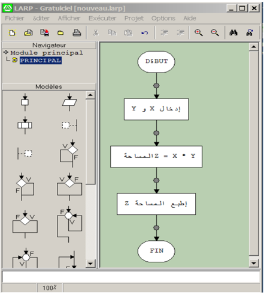

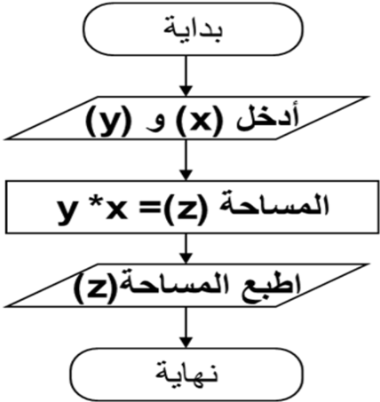
##  تطبيقات
- .1 أنشئ المخطط الانسيابي لحساب مساحة الدائرة .
- .2 أنشئ المخطط الانسيابي لحساب المعدل الفصلي لمادة المعلوماتية
- .3 أنشئ المخطط الانسيابي لحساب المعدل السنوي مع إضافة الملاحظة "ناجح" اذا كان المعدل السنوي  11 أو راسب اذا كان المعدل السنوي  .11
- .1 أنشئ المخطط الانسيابي الخاص بإدخال عدد موجب.
- .1 تتبع سير مخططات الانسيابية التالية وجد الهدف المرجو منها ؟
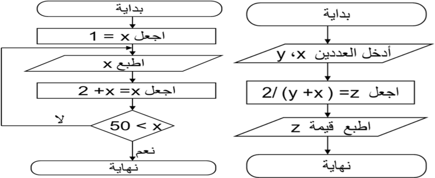
## .2 الخوارزميات
## الكفاءات المستهدفة
 يدرك المتعلم مفهوم الخوارزمية  القدرة على التفكير لحل المشكلات  يتمكن من كتابة برامج للحاسوب
## الخوارزميات
##  أصل كلمة خوارزمية
كلمة خوارزمية مشتقة من اسم العالم الفارسي محمد بن موسى الخوارزمي ( 087 م إلى 840 م ) ، وقد برع هذا العالم في علم الرياضيات و الفلك و وضع مبادئ علم الجبر وألف كتاب الجبر والمقابلة . على جداول الضرب و القسمة و الحساب العشري و ظل
أطلق اسم الخوارزميات Algorithmes هذا الاسم متداولا في أوروبا إلى أن حمل مدلولا جديدا مرتبطا بالبرمجة.
##  تعريف الخوارزمية:
هي  مجموعة  من  الخطوات  الرياضية  و  المنطقية  المتسلسلة  والمحدودة،  اللازمة  لحل  مسألة  ما  و الوصول إلى نتائج محددة اعتبارا من معطيات ابتدائية.
##  خصائص الخوارزمية السليمة :
-  كل خطوة يجب أن تكون معرفة دون أي غموض و محددة بعبارات دقيقة.
-  أن تتوقف العمليات بعد عدد محدد من الخطوات.
-  أن تؤدي الخطوات بمجملها إلى الحل الصحيح للمسألة.
##  الهيكل العام للخوارزمية :
يشمل الهيكل العام للخوارزمية ثلاث أجزاء أساسية، وهي كالآتي:
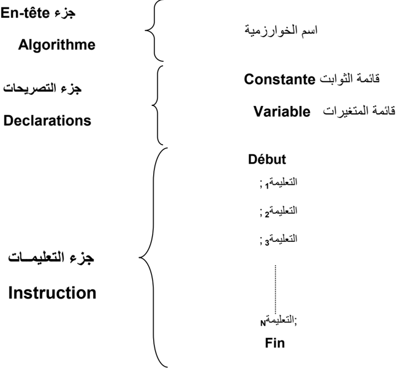
##  جزء En-tête
يحتوي هذا الجزء على اسم الخوارزمية الذي يحدد نسبة للمسألة المراد حلها.
##  جزء التصريحات Déclarations
يتم في هذا الجزء حجز مكان في الذاكرة لقائمة المتغيرات و قائمة الثوابت التي تستعمل في جزء التعليمات من الخوارزمية.
##  جزء التعليمــــات Instructions
## يتضمن هذا الجزء ثلاث مراحل أساسية هي:
-  المرحلة الأولى "المدخلات" : يتم فيها التحضير لحل المسألة و ذلك بإدخال المعطيات اللازمة لتنفيذها.
-  المرحلة  الثانية  "المعالجة"  : تتم  فيها  عملية  التنفيذ  باستعمال  معطيات  (مدخلات)  المرحلة الأولى، تحتوي هذه المرحلة على مجموعة من التعليمات اللازمة لحل المسألة.
-  المرحلة الثالثة " :" المخرجات تعرض فيها النتائج المطلوبة.
##  الكلمات المحجوزة Mots clés
هي كلمات تتخلل الأجزاء الأساسية الثلاث للهيكل العام للخوارزمية، يمكن كتابتها بأحرف لاتينية كبيرة أو صغيرة دون تفرقة، ولدينا من خلال الهيكل العام الكلمات المحجوزة الآتية:
: Algorithme نكتب أمام هذه الكلمة اسم الخوارزمية (identificateur) ، يخضع هذا لأخير لقواعد معينة نشير إليها في العنصر الموالي.
Variable : نكتب هذه الكلمة للتصريح عن المتغيرات.
-  المتغير : هو عنصر يمكن لمحتواه أن يتغير أثناء تنفيذ الخوارزمية.
-  الثابت: هو العنصر الذي لا يتغير محتواه أثناء تنفيذ الخوارزمية.
Constante : نكتب هذه الكلمة للتصريح عن الثوابت.
Début و Fin : كل من الكلمتين تمثلان بداية و نهاية الخوارزمية ، توجد بينهما المراحل الثلاث لجزء التعليمات من الخوارزمية.
ملاحـــــــــــــــظـة: يوجد كلمات محجوزة أخرى يمكن مصادفتها في مختلف أنواع الخوارزميات.
أسماء المعرفات هي الأسماء التي تطلق على البيانات سواء كانت معطيات أو نتائج، المتغيرة منها و الثابتة، كل عنصر نستعمله في الخوارزمية له اسم معرف وحيد. للمتغيرات و الثوابت معرفات لابد من احترام القواعد الآتية في تسميتها :
- يمكن لاسم معرف أن يحتوي على رموز حرفية و عددية من A إلى Z ، من a إلى z و من 7 إلى 9 ، كما يمكن استعمال الرمز -(tiret du huit) فقط.
- لا يمكن للاسم أن يحتوي على فراغ .) (مسافة
- يجب أن تبدأ التسمية بحرف.
- لا يمكن استعمال أي معرف غير مصرح عليه في جزء التصريحات.
- عدم استعمال أي كلمة من الكلمات المحجوزة في التسمية.
- لتسهيل قراءة و كتابة الخوارزمية، يستحسن استعمال أسماء معرفات ذات دلالة ، مثلا : Largeur\_rect عوض .LR
## ملاحـــــــــــــــــظة : اصطلاحا ، يستحسن كتابة معرفات الثوابت بالأحرف الكبيرة .(Majuscules)
##  أنواع البيانات Types de donnés
- o النوع : هو المجال الذي تنتمي إليه البيانات سواء كانت معطيات (مدخلات) أو نتائج (مخرجات) و بصنفيها متغيرة كانت أو ثابتة.
يمكننا استعمال عدة أنواع من البيانات في الخوارزمية، نذكر منها الأنواع الأساسية الآتية :
-  Entier (الأعداد .) الصحيحة
-  Réel (الأعداد .) الحقيقية
-  Caractère (الحروف و .) الرموز
-  Chaines de caractères .) (الكلمات
-  Booléen (منطقي) : هذا النوع يتضمن إحدى القيمتين صحيح أو خطأ.
## أمثلـة:
- .1 كل من اللقب و الاسم يصنفان إلى النوع .« chaine de caractères »
- .2 العدد 3.3 يصنف إلى النوع .« Réel »
##  التصريح عن المتغيرات و الثوابت :
-  التصريح عن الثوابت : يتم التصريح عن المتغيرات كما يلي :
Const ou Constante Identificateur valeur
-  Const أو :Constante هما كلمتان محجوزتان تسمحان بالتصريح عن الثوابت.
-  :Identificateur هو اسم المعرف الذي يطلق على الثابت.
-  : Valeur هي القيمة التي تعطى للثابت. أمثلـة:
## Constante
PI
3.14
B
Vrai
Prénom "Zahra"
- التصريح عن المتغيرات : يتم التصريح عنها كما يلي :
Var ou Variable Identificateur :
-  …..  Type
-  Var أو :Variable هما كلمتان محجوزتان تسمحان بالتصريح عن المتغيرات.
-  :Identificateur هو اسم المعرف الذي يطلق على المتغير.
-  :Type هو نوع المتغير.
أمثلـة:
## Variable
Nom, Prénom : chaine de caractères
x, y, z: réel
 العمليات الحسابية
| الصيغة            | الرمز   | العملية الحسابية   |
|-------------------|---------|--------------------|
| A = X + Y         | +       | الجمع              |
| A = 5 - 3         | -       | الطرح              |
| A = 2 * B         | *       | الضرب              |
| A = X / Y         | /       | القسمة             |
| A = C ^ 2         | ^       | الأس               |
| A = 7 * ( M - N ) | ( )     | الأقواس            |
##  عمليات المقارنة
| المعنى           | العملية   |
|------------------|-----------|
| يساوي            | =         |
| يختلف            | ><        |
| أصغر من          | >         |
| أصغر من أو يساوي | = >       |
| أكبر من          | <         |
| أكبر من أو يساوي | = <       |
## أولوية العمليات الحسابية: عند إنجاز عملية حسابية يجب احترام الأولويات التالية :
- )1 الأقواس ( )
- )2 الأس
- )3 الضرب * والقسمة  / " يتم تنفيذ عمليات الضرب والقسمة بدءا    من اليسار إلى اليمين ."
- )4 الجمع + والطرح "       -يتم تنفيذ عمليات الجمع والطرح بدءا    من اليسار إلى اليمين ."
##  التعليمات الأساسية للغة الخوارزمية :
التعليمة: هي أمر يسمح للجهاز بتحديد العملية المراد إنجازها.
يمكن التعبير عن مسار حل مسألة ما لكتابة خوارزمية بواسطة التعليمات الخمسة الآتية:
- .1 تعليمة الإسناد.
- .2 تعليمة القراءة (أو إدخال .) المعطيات
- .3 تعليمة الكتابة ( أو إظهار .) النتائج
- .4 التعليمة الشرطية.
- .3 التعليمة التكرارية.
الخوارزميات )1 تعليمة الإسناد Instruction d'affectation تسمح  بإسناد  قيمة  محددة  أو  نتيجة  صيغة  إلى  متغير  ما  في  الخانة  ذاكرة case mémoire المحجوزة له. الشكل النظامي : Syntaxe ˂ Nom de variable &gt; &lt; Expression &gt; : Nom de variable يمثل اسم المعرف .Identificateur : Expression قد تكون قيمة ثابتة أو نتيجة دالة أو اسم لمتغير آخر، كما يمكن أن تكون نتيجة لعبارة حسابية. المعنى : المتغير يأخذ قيمة الصيغة. مثـــــال : Surface\_rect          largeur *longueur PI 3.14 )2 تعليمة القراءة Instruction de lecture تسمح بإدخال قيمة إلى الجهاز بواسطة لوحة المفاتيح و وضعها في خانة ذاكرة. الشكل النظامي: Lire( Nom de variable) المعنى: هذه التعليمة هي أمر يطلب بأخذ القيمة المعطاة بواسطة لوحة المفاتيح ووضعها في الخانة الذاكرة المحجوزة للمتغير. أمثلـــة : Lire(N) معناه : ضع القيمة المعطاة من لوحة المفاتيح في الخانة الذاكرة المحجوزة لـ .N : Lire (a,b,c) معناه : ضع القيم المعطاة من لوحة المفاتيح في الخانات الذاكرة المحجوزة لـ : a ، b و c على الترتيب. )3 تعليمة الكتابة Instruction d'écriture تسمح بإظهار قيمة معينة على الشاشة. الشكل النظامي: Ecrire ("Expression") المعنى: هذه التعليمة هي أمر بإظهار الصيغة المحصورة بين المزدوجتين على الشاشة.
Si &lt; Condition&gt; alors &lt;liste d'instructions 1&gt; sinon &lt;liste d'instructions 2&gt; finsi
## أمثلة :
## Ecrire ("Entrez la valeur de S")
هذه التعليمة تسمح بإظهار الصيغة الآتية على الشاشة: Entrez la valeur de S
<!-- formula-not-decoded -->
هاتان التعليمتان تسمحان بإظهار 2 على الشاشة.
## )4 التعليمة الشرطية Instruction conditionnelle
تطلب الخوارزمية في بعض الحالات أثناء الكتابة إلى بعض التعليمات بالتناوب (غير متسلسلة) يطلق عليها اسم التعليمات الشرطية التي تقيد بشرط معين، إذا تحقق هذا الأخير نقوم بعملية و إلا نقوم بعملية أخرى. نميز نوعين من التعليمات الشرطية هما:
## condition Instructions Vrai Suite de L'algorithme أ. التعليمة الشرطية البسيطة : إذا تحقق الشرط تنفذ التعليمة الشكل النظامي: Si    &lt; Condition&gt; alors &lt; Instructions&gt; المعنى: تنفذ مجموعة التعليمات &lt; Instructions&gt; إذا تحقق الشرط &lt; Condition&gt;
ب  . التعليمة الشرطية الاختيارية: إذا تحقق الشرط تنفذ مجموعة من التعليمات و إلا تنفذ مجموعة أخرى من التعليمات.
الشكل النظامي :
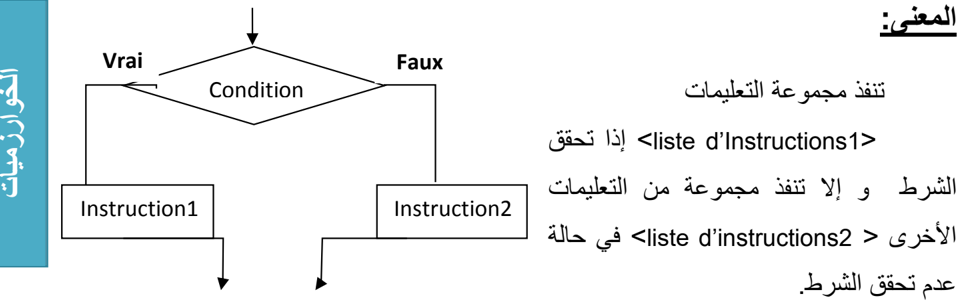
## Suite de L'algorithme
مثــــال كتابة الخوارزمية التي تسمح  بإظهار على الشاشة نتيجة انتقال تلميذ أو رسوبه.
```
Algorithme Elève_admis Var Moyenne : réel; Début Lire (Moyenne); Si Moyenne >= 10 Alors Ecrire ("L'élève est admis") Sinon Ecrire ("L'élève est ajourné") ; Fin si; Fin.
```
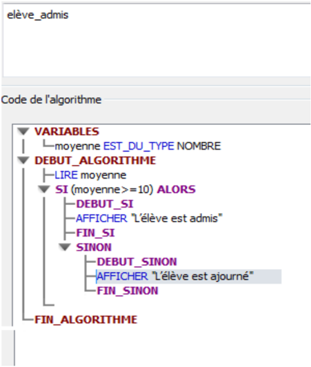
## )3 التعليمة التكرارية: Instruction répétitive
يستعمل هذا النوع لتكرار تنفيذ مجموعة من التعليمات، يرتبط هذا التكرار بتحقق شرط معين و مادام هذا الشرط محققا يعاد تنفذ مجموعة من التعليمات. هناك نوعين من التعليمات التكرارية:
-  التعليمة التكرارية Tant que
-  التعليمة التكرارية Pour
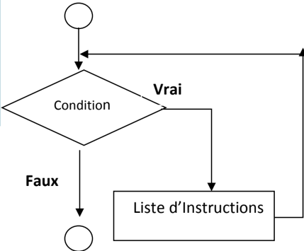
## أ. التعليمة التكرارية Tant que
في حالة  عدم  معرفة  عدد  التكرارات  لتنفيذ  التعليمات  و  ارتباط  التكرار  بتحقيق  شرط  معين نستعمل الحلقة Tant que
## الشكل النظامي
:
Tant que  &lt; Condition&gt;   faire Début &lt;Liste d'instructions &gt; Fin tant que
المعنى: مادام الشرط محققا يكرر تنفيذ مجموعة من التعليمات إلى غاية عدم تحققه.
ملاحظـــــــــــة : الحد الأدنى للتكرارات هو " "1
مثـــــــــال: أكتب الخوارزمية لحساب مجموع الأعداد الصحيحة من 1 إلى
وهذا في حالة ما إذا كان الشرط غير محقق من البداية. .111
## Algorithme Somme\_100valeurs
```
Var S , i : entier ; Début S 0; i 1; Tant que i <=100 faire Début S S + i ; i i +1; Fin tant que 100 est : ", S )
```
Ecrire )"la somme des valeurs de 1 à Fin Pour Fait
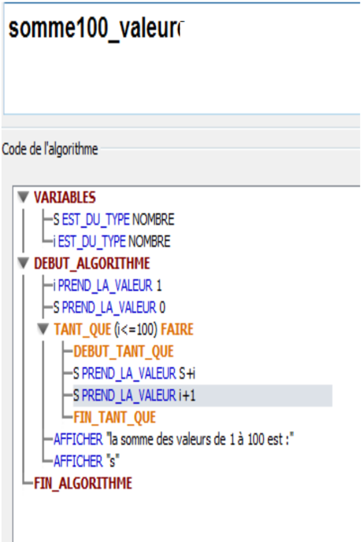
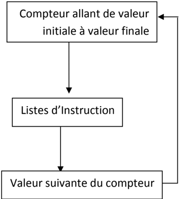
لمعنى: من أجل كل قيمة من قيم العداد التي تتغير من القيمة الابتدائية إلى القيمة النهائية، تنفذ العمليات و كل تنفيذ يكون بمقدار خطوة (
## شرح طريقة عمل التعليمة التكرارية : Pour
-  إعطاء القيمة الابتدائية للعداد (valeur initiale)
-  زيادة قيمة العداد بخطوة بعد كل تنفيذ لمجموعة التعليمات
-  مراقبة شرط التوقف (أي وصول العداد إلى قيمته النهائية)
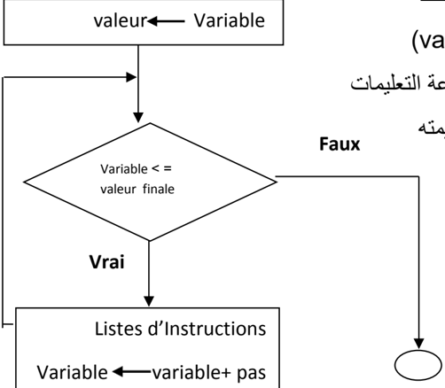
مثـــــــــال: كتابة خوارزمية تسمح بإظهار على الشاشة مضاعفات العدد 3 المحصورة بين 1 و .177
```
Algorithme Multiples de 5; Var i , Multiple : entier ; Début Pour i 1 à 20 Faire Multiple i *5 ; Ecrire ( Multiple , ʺ est multiple de 5ʺ) ; Fin faire ; Fin.
```
)pas
## ب  . التعليمة التكرارية Pour
عند معرفة عدد التكرارات في تنفيذ التعليمات نستعمل التعليمة " Pour" بعداد " "Compteur التي تتوقف عند وصول العداد إلى قيمته النهائية
## الشكل النظامي :
&lt; Nom de variable&gt;       &lt; valeur initial&gt; à &lt; valeur finale &gt;
faire
&lt;Liste d'instructions &gt;
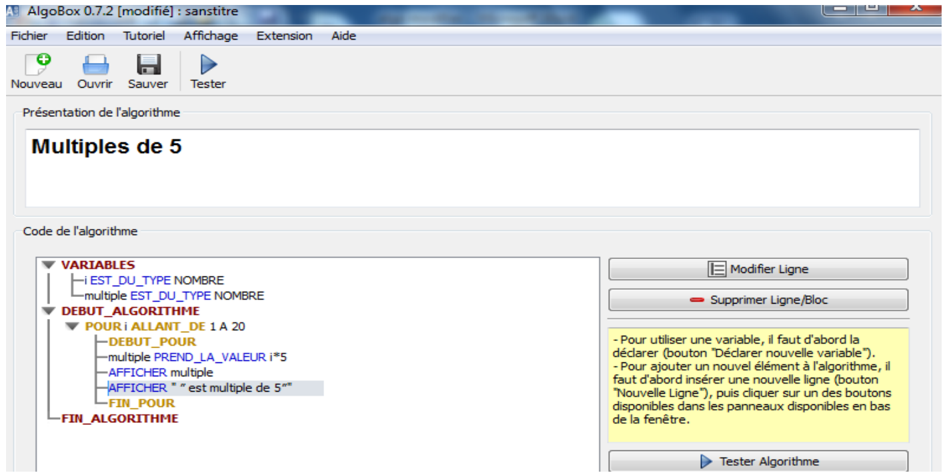
##  تطبيقات
تمرين رقم 1 : اكتب خوارزمية لقراءة عددين وإيجاد حاصل جمعهما؟
تمرين رقم 2 : اكتب خوارزمية لطباعة المعدل السنوي ؟( بفرض أننا نملك معدل كل فصل)
تمرين رقم 3 : اكتب خوارزمية الحل لطباعة الأعداد المحصورة بين ( . )11-1
تمرين رقم 4 : اكتب الخوارزمية لقراءة ثلاثة أعداد ( )A,B,C ومعرفة العدد الأكبر بينها.
تمرين رقم 3 : اكتب الخوارزمية لقراءة عدد وطباعة كلمة Positive إذا كانت قيمة العدد اكبر من أو
تساوي صفر ، وكلمة Négative إذا كان العدد اقل من الصفر ؟.
تمرين رقم 6 : اكتب الخوارزمية لقراءة الأضواء الثلاثية feu tricolores (أحمر, أخضر, .) برتقالي
تمرين رقم 0 : اكتب الخوارزمية لقراءة جدول الضرب للعدد .1
