## المجال المفاهيمي الرابع
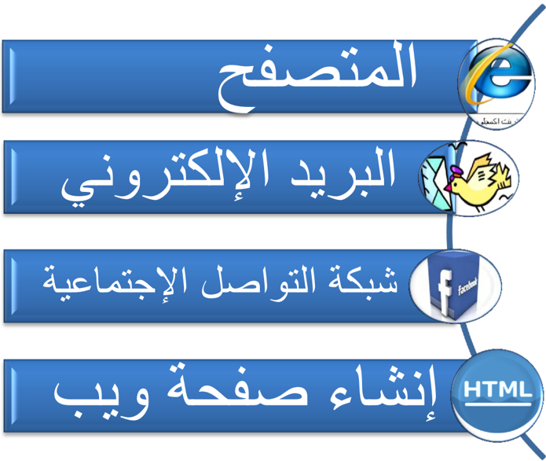
أحدثت التطورات التكنولوجية المتسارعة في السنوات الماضية في مجالات تقنيات الحاسوب والوسائط المتعددة وشبكة الأنترنت, نقلة نوعية  في عالم الاتصال و التواصل , حيث  إنتشرت  شبكة  الإنترنت  في  كافة  أرجاء  العالم,  ومهدت  الطريق  لكافة  المجتمعات للتقارب  والتعارف  وتبادل  الآراء  والأفكار  والرغبات,  وأصبحت  أفضل  وسيلة  لتحقيق التواصل  بين  الأفراد  والجماعات,  ثم  ظهرت  المواقع  الإلكترونية  والمدونات  الشخصية وشبكات المحادثة, التي غيرت مضمون وشكل الإعلام الحديث, وخلقت نوعاً من التواصل . بين أصحابها ومستخدميها من جهة, وبين المستخدمين أنفسهم من جهة أخرى
ومن هذه المواقع محركات البحث وبوابات ويب ومراجع حرة والمدونات ومواقع الصحف  والمجلات  ومواقع  الصحف  الإلكترونية  ومواقع  القنوات  الفضائية  ومواقع اليوتيوب .
## المتصفح
## مقـــدمة :
شبكة الإنترنت تربط بين الحواسيب في جميع أنحاء العالم، وتحو ّ ل عالمنا الكبير إلى مكان صغير مفعم بالحياة , فبإمكاننا الاتصال مع أي إنسان في جميع أنحاء العالم ,بشرط أن  يكون متصل بالشبكة, و بإمكاننا القيام بالمشتريات، الاستماع إلى الأخبار، الاستماع إلى الموسيقى، مشاهدة الأفلام، زيارة المتاحف، حدائق الحيوانات أو أي مكان نرغب فيه.
: الأسئلة التي تطرح نفسها ما هو المتصفح وما الذي يقوم به ؟
## ما هو المتصفح ؟
1 هو برنامج يسمح للمستخدم باستعراض النصوص والصور والملفات ومحتويات أخرى مختلفة، وتعرض على شكل صفحة ويب في موقع من شبكة الأنترنيت أو في شبكة محلية.
النصوص والصور في صفحات الموقع يمكن أن تحتوي على روابط لصفحات أخرى في نفس الموقع أو في مواقع أخرى.
متصفح الويب يتيح للمستخدم الوصول إلى المعلومات المرغوب فيها في المواقع بسهولة وبسرعة ,و هذا . عن طريق تتبع الروابط
## ما هي المتصفحات المتوفرة والمشهورة ؟
يوجد الكثير من المتصفحات على شبكة الأنترنت : وعلى سبيل المثال لا الحصر أنترنت إكسبلورر ، موزيلا فاير فوكس ، ابل سفاري ، جوجل كروم ، ماكستون.

موزيلا فاير فوكس

أنترنت إكسبلورر

جوجل كروم
ابل سفاري

نت سكيب

1 مقدمة من هدى سعود الحربي مركز تقنية المعلومات بالإدارة العامة لتعليم البنات بالطائف
## ما هو أفضل متصفح ؟
لا يوجد متصفح كامل من جميع النواحي ، فمثلا ً يتصف متصفح جوجل بالسرعة وعدم استهلاك الذاكرة ، ويتسم متصفح فايرفوكس بالقوة والثبات ، ويتسم متصفح إكسبلورر الجديد بالأمان.
## ما هي علاقة المتصفح بتصميم المواقع ؟
توجد علاقة وطيدة بين المتصفح وتصميم وتطوير المواقع الويب، وما بين المطور نفسه ومتصفحات المستخدمين، وما يحدد ويحكم العلاقة هو جمهور المستخدمين ومدى وعي وثقافة المستخدم.
يتعين على المصمم أو المطور أن يراعي دعمه للنسخ المتصفحات القديمة أو أن يترك رسالة للمستخدم تفيد بأنه يتوجب عليه استخدام متصفح جديد لكي يتصفح الموقع بالشكل الصحيح.
طبعا ً في الآونة الأخيرة الكثير من المواقع العالمية مثل "يوتيوب" و "فايس بوك" أعلنت عدم دعمها للمتصفحات القديمة حيث أن . عملية الدعم تتطلب جهد كبير نظرا ً لاختلاف المعايير ولغات برمجة المواقع
## استعمال برنامج التصفح للتوجيه داخل موقع الإنترنت
لكل موقع إنترنت تقريبا يوجد بعض الصفحات التابعة له و كمية الصفحات تتغير من موقع إلى آخر.
للتمكن من الوصول إلى كافة المعلومات في الموقع، علينا استعمال الأدوات التي يعرضها الموقع، استعمال الارتباطات الداخلية الخاصة بالموقع، والاستعانة بشريط التوجيه.
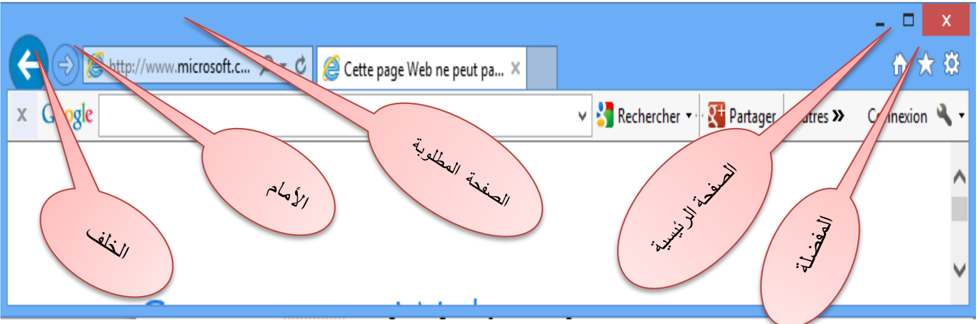
## الصفحات المفضلة
إذا قمت بزيارة موقع وتود زيارته مرة أخرى، من المستحسن أن تقوم بحفظ عنوان الموقع في مجلد المفضلة, هكذا لن تضطر إلى طباعة عنوان الموقع من جديد في برنامج التصفح، ولن تضطر إلى البحث عن الموقع مرة أخرى, علما أن عناوين صفحات المفضلة توجد فقط في الحاسوب الذي حُفظت عليه.
فكيف نحفظ صفحة في مجلد ( المفضلة (Favorites ؟ نضغط بواسطة الزر الأيسر للفارة على قائمة المفضلة ( Favoris )، . التي تظهر في شريط الأدوات عند وجود عدد كبير من الصفحات المفضلة، يكون من الصعب علينا إيجاد صفحة معينة، وعندها ( بإمكاننا استعمال مجلد GESTIONNAIRE DE FAVORIS ). في هذا المجلد بالإمكان ترتيب الصفحات المفضلة في مجلدات مصنفة.
## محركات البحث
محرك البحث Search engine( ) هو برنامج يُتيح للمُستخدِمين البحث َ  عن كلمات محددة ضمن : مصادر الإنترنت المختلفة، ويتألف محرك البحث من ثلاثة أجزاء رئيسة هي
-  (. برنامج العنكبوت )spider program
-  (. برنامج المُفهر ِ س )indexer program
-  . برنامج محرك البحث
: وظيفة البرامج المكونة لمحرك البحث
##  برنامج العنكبوت
( ت َ ستخدِم محركات ُ  البحث برنامج َ  العنكبوت spider ) لإيجاد صفحات جديدة على الويب لإضافتها، ( ويسمى هذا البرنامج أيضا ً  الزاحف crawler ) لأنه يُبحر في الإنترنت بهدوء لزيارة صفحات الويب والاطلاع على محتوياتها، و ( يأخذ هذا البرنامج مؤشرات المواقع من عنوان الصفحة title )، والكلمات المفتاحية keywords( ) ، ولا تقتصر زيارة برنامج العنكبوت على الصفحة الأولى للموقع بل يتابع البرنامج ت َ عق ُّب َ ( الروابط links ) الموجودة فيها لزيارة صفحات أخرى.
##  برنامج المُفهرس
يُمثل برنامج ( المُف َ هر ِ س index program ( )، الكتالوج catalogue ) أحيانا ً  بقاعدة بيانات database( ) ضخمة ت ُ و َ صِّف صفحات الويب، وت َعتمد في هذا التوصيف على المعلومات التي ح َ ص َ لت عليها ( من برنامج العنكبوت . )spider
كما تعتمد على بعض المعايير مثل الكلمات الأكثر تكرارا ً  من غيرها، وتختلف محركات البحث عن ( بعضها في هذه المعايير، إضافة إلى اختلافها في خوارزميات المطابقة .)algorithms ranking
##  برنامج محرك البحث
( يبدأ دور برنامج محرك البحث Program search engine ) عند كتابة كلمة مفتاحية keyword( ( ) في مربع البحث . )search box
يأخذ هذا البرنامج الكلمة المفتاحية ويبحث عن صفحات الويب التي تحقق الاستعلام الذي كونه برنامج ( المُفهرس في قاعدة بيانات الفهرس index database )، ثم ت ُ عر َ ض نتيجة البحث المتمثلة بصفحات الويب (. التي طلبها المُستخدِم في نافذة المُستعرض . )browser window
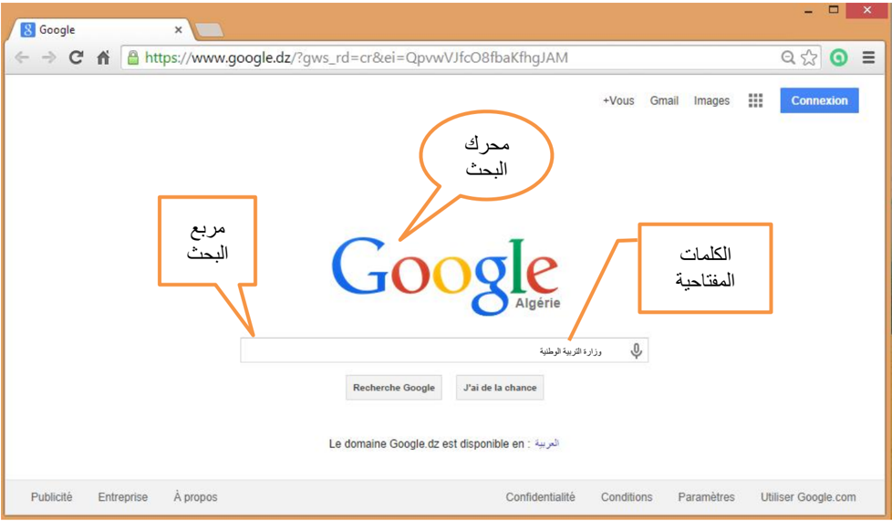
##  أمثلة : على محركات البحث
يوجد عدد كبير من محركات البحث التي تنتشر على الويب نذكر منها على سبيل المثال لا الحصر
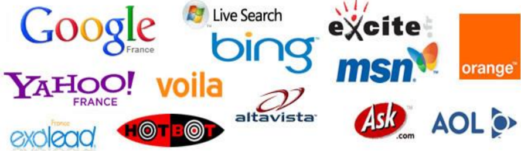
Yahoo ياهو Google جوجل Lycos ليكوس AltaVista ألتا فيستا Excite إكسيات Netscape نيت سكيب
2 تختلف محركات البحث عن بعضها البعض في أسلوب العمل، فمثلا ً : تحتفظ قاعدة بيانات ألتافيستا AltaVista( ) بكل تفاصيل صفحة الويب المخزنة، أما غيرها من آليات البحث الأخرى فقد يحتفظ بالعناوين الرئيسية للصفحة فقط، مما يؤدي إلى اختلاف في . نتائج البحث الظاهرة للمُستخدم
إ ( ن محركات البحث تستخدم في بحثها عن مواقع الويب ما يدعى الكلمات المفتاحية keywordsmots clés ( ) التي يمكن أن تكون كلمة أو عبارة , )phrase وت َ ستخدِم آليات ُ  البحث عادة ً  بعض َ  المعاملات operators-operateurs( ) مع هذه الكلمات المفتاحية، لتوفير خيارات إضافية لعملية البحث.
-  نستخدم )$( إذا كنا غير متأكدين من كتابة الاسم الصحيح.
-  نستخدم )-( إذا كنا نرغب بتضييق البحث قدر الاستطاعة.
-  نستخدم )+( بدلا ً  من (و َ ) أو .and
-  نستخدم )and( للجمع بين كلمتين.
-  نستخدم )or( . للبحث عن إحدى الكلمتين
-  نستخدم )not( للبحث عن كلمة وإلغاء أخرى.
-  نستخدم " " " للبحث عن كلمتين متجاورتين مثل محرك البحث ."
-  نستخدم ) ( للبحث عن جملة.
-  الكلمات )a, an, the( يتم تجاهلها دائما ً  في البحث.
## دلائل البحث:( (Répertoires de recherche- Search directories-
هي عبارة عن مواقع على الإنترنت يمكن البحث فيها عن المعلومات حيث تقوم بفهرسة وتصنيف المعلومات ضمن بنية هرمية متدرجة ومتشعبة تبدأ بالمفتاح الأساسي العام للمعلومات ثم يتدرج إلى الموضوعات الأكثر تخصصا ً .
يقوم بعملية التصنيف هذه طاقم بشري حيث يقوم بتتبع مواقع نشر المعلومات وفهرستها حسب . موضوعاتها وأماكن نشرها وتسجيل ملخصات لمحتوياتها
تتميز أدلة البحث بدقتها العالية في تصنيف المعلومات واستعراض أدلة الموضوعات. . يعيبها عدم تغطيتها كامل محتويات مواقع الإنترنت لاعتمادها على التحديث اليدوي
2 faculty.ksu.edu.sa/74398/.../ محركات %20 البحث %202....
من أمثلة محركات البحث العربية:
ظهر مؤخرا ً  بعض محركات البحث التي تدعم البحث باللغة العربية، ويكمن السبب في قلة هذه المحركات وتأخر ظهورها إلى التقنيات المعقدة التي يحتاجها البحث باللغة العربية. إذ تختلف طبيعة اللغة العربية ( عن الإنجليزية، فاللغة العربية لغة ص َرفية morphological ( )، بينما الإنجليزية لغة لصقية .)affixational ومن هنا كان لا بد للشركات التي تطرح محركات بحث عربية قوية أن تمتلك التقنيات اللازمة لمعالجة اللغة . العربية آليا ً
www.ayna.com
www.4arabs.com
www.sami4.com
www.aldalil.com
www.raddadi.com


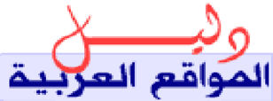
وقد : ظهر أثر ذلك في محركات البحث الموجودة التي انقسمت إلى مجموعتين
- o : المجموعة الأولى
قل َّ دت هذه المجموعة محركات البحث الإنجليزية ولذلك فقد جاءت نتائجها ضعيفة لاعتمادها في البحث ( على المطابقة الحرفية matching string ) لكلمات البحث، مما يتسبب في حجب الكثير من المعلومات التي .) تتوافق مع الكلمات المراد البحث عنها (التي قد تختلف بأحرف زائدة بسيطة
- o · : المجموعة الثانية
تعتمد هذه المجموعة من محركات البحث على تقنيات متقدمة لمعالجة اللغة العربية، ومن أبرز الأمثلة
( عليها: أراب فيستا Arabvista ) و الإدريسي؛ الذي أصدرته شر . كة صخر لبرامج الحاسب الآلي . تتميز المجموعة الثانية بأدوات ووظائف إضافية مثل : البحث باللواصق، والبحث بالمشتقات
## البريد الإلكتروني
##  المقدمة
في بداية الأمر، تم إرسال البريد عن طريق ساعي البريد والحمامة الخاصة بالبريد, مع تطور المواصلات، تطورت الوسائل لنقل البريد، وأقيمت مراكز للبريد, دورها الاهتمام بكميات كبيرة من البريد من داخل و خارج البلد.
و حديثا، وسائل الاتصال التكنولوجية، وعلى رأسها الهاتف وأجهزة الفاكس ، قللت من الحاجة إلى استعمال البريد لنقل المعلومات والرسائل الفورية.
ثم ظهور البريد الإلكتروني (Electronic Mail) هو تبادل الرسائل والوثائق باستخدام الحاسوب ويعتقد كثير من الباحثين أن البريد الإلكتروني من أكثر خدمات الأنترنت استخداما ً  وذلك راجع إلى سهولة استخدامه.
##  تعريف البريد الإلكتروني:
إن البريد الإلكتروني هو عملية تبادل رسائل التي يتم تخزينها بأجهزة الكمبيوتر سواء كانت على شبكة الإنترنت العالمية أو على أي نوع من الشبكات سواء كانت المحلية أو الشبكات الأكبر وتتم بواسطة وسائل . الإتصال التلفونية
البريد الإلكتروني عبارة عن نصوص يتم إرسالها من شخص إلى شخص آخر أو إلى مجموعة من . الأشخاص من خلال الكمبيوتر
##  أنواع البريد الالكتروني:
##  بريد : WEB MAIL
وهو البريد المسموح استخدامه من قبل الجميع عبر شبكة الانترنت من خلال أي متصفح وفي أي مكان في العالم ومن أمثلة بريد WEB MAIL
-  بريد هوت ميل . HOTMAIL
-  ( بريد غوغل جيميل( GMAIL
-  بريد ياهو! YAHOO MAIL
##  بريد POP3
وهو بريد مشابه لبريد ال WEB ويختلف عنه أنه يجب استخدام برنامج مساعد له مثل MS outlook أو Pegasus أو .Eudora
##  العناوين البريدية الإلكترونية
جميع العناوين البريدية الإلكترونية هي ذات طابع واحد، حيث تكون الكلمات المكونة له بالشكل الآتي: اسم صاحب العنوان وتليه علامة @ ثم اسم الكمبيوتر الذي ستصل . إليه الرسالة
مثلا: عنوان هذه المجلة وهو كالتالي : info@education.gov.dz.
 يحتوي البريد الإلكتروني على علامة يرمز لها بالرمز @ وتلفظ ب (آت، At . ) وهي تعني عند او في
 ( الجزء الموجود على الجهة اليسارية للعلامة @ هو إسم المستخدم User Name )، وليس من المهم إذا قمنا بتسجيل الاسم الحقيقي أو أي اسم آخر. بإمكاننا اختيار اسم المستخدم بحسب رغبتنا الشخصية.
 الجزء الموجود في الجانب اليميني للعلامة @ هو اسم المضيف Host( ) والحقل ( .)Domain
والمضيف هو الكمبيوتر الذي يستضيف ويحوي على حساب الأنترنت والحقل هو الشبكة التي يكون المضيف متصل بها، وبعض العناوين لا تحتوي على اسم الحقل ولا تحتوي لاسم المضيف
: مثلا
.com my mail @ abcd اسم الحقل اسم المضيف في     اسم المستخدم .
يتغير اسم الحقل حسب نوع عمل المضيف
في الجدول التالي تظهر أسماء الحقول المختلفة، والى ماذا يرمز كل واحد منها:
| العمل نوعية                      | الرمز   |
|----------------------------------|---------|
| التجارية والشركات الهيئات        | Com     |
| تعليمية مؤسسات                   | Edu     |
| حكومية ومؤسسات منظمات            | Gov     |
| عسكرية ومؤسسات منظمات            | Mil     |
| الإنترنت شبكة لخدمات مزودة شركات | Net     |
| و منظمات الهيئات تجارية غير      | Org     |
| عالمية مؤسسات                    | Int     |
##  خصائص البريد الإلكتروني :3
- .1 سرعة وصول الرسالة، حيث يمكن إرسال رسالة إلى أي مكان في العالم خلال لحظات.
- .2 .) لا يوجد وسيط بين المرسل والمستقبل (إلغاء جميع الحواجز الإدارية
- .3 كلفة معدومة أو منخفضة للإرسال.
- .4 يتم الإرسال واستلام الرد خلال مدة وجيزة من الزمن.
- .5 يمكن ربط ملفات إضافية بالبريد الإلكتروني.
- .6 يستطيع المستقبل أن يحصل على الرسالة في الوقت الذي يناسبه.
- .7 يستطيع المرسل إرسال عدة رسائل إلى جهات مختلفة في الوقت نفسه.
##  مميزات استخدام البريد الإلكتروني :
من أهم مميزات البريد الإلكتروني ما يلي :
- .1 سريع و ذو كلفة زهيدة.
- .2 يتجاوز التوقيتات الزمنية والمناطق الجغرافية.
- .3 يمكن إرساله إلى شخص أو مجموعة أشخاص في الوقت نفسه.
- .4 القوائم البريدية وهي إمكانية عمل قائمة بعناوين خاصة يتم إرسال الرسالة مرة واحدة لمن فيها.
- .5 إرسال ملفات النص والصور والصوت والجداول الإلكترونية كملحقات مع الرسالة.
- .6 تبادل المعلومات مع أشخاص غير معروفين.
##  سلبيات البريد الإلكتروني :
## من سلبيات البريد الإلكتروني ما يلي :
- .1 الاطلاع على محتوياته لا سيما أولئك الذين يطلق عليهم مصطلح (الهاكرز) أي المخترقين.
- .2 احتواء بعض الرسائل على الفيروسات الحاسوبية التي تلحق أضرارا ً  بالغة بالمستخدم وبجهازه بمجرد محاولته قراءة أي من تلك الرسائل .
- .3 استخدام بريدك الإلكتروني لأغراض دعائية من قبل بعض الشركات دون أخذ إذنك فيصبح لديك رسائل غير مرغوب بها كثيرة جدا ً : كونه غير آمن البريد الإلكتروني ليس آمنا ً  تماما ً  وهذا يعني أن بوسع آخرين
3 http://ar.wikipedia.org/wiki/
##  نصائح لمستخدمي البريد الإلكتروني:
- .1 لا تعطي كلمة السر التي تخصك لأي جهة خاصة عبر البريد الإلكتروني.
- .2 غير كلمة السر بشكل دوري ومحاولة استخدام الأرقام والحروف.
- .3 لا ترد على أي رسالة التي تشك بمصدرها, خاصة spam
- .4 لا تفتح الملفات المرفقة مع الرسائل إلا بعد الكشف عليها ببرامج الحماية من الفيروسات.
- .5 حاول استخدام الإصدارات الجديدة للمتصفحات.
- .6 عند خروجك من حسابك الخاص اضغط على زر الخروج . Déconnecter
- .7 عند دخولك إلى حسابك على الشبكة من مقهى إنترنت عام يجب على المستخدم أن يغلق المتصفح بالكامل بعد الخروج من موقع البريد الخاص بك.
##  تطبيقات
-  تمرين :1 اطلبوا عنوان البريد من احد زملائكم في القسم، وأرسلوا إ . ليه رسالة إلكترونية
-  تمرين :2 أطلبوا عنوان البريد الإلكتروني من أحد أصدقائكم وأضيفوا تفاصيله إلى مجلد ." "جهات الاتصال
-  تمرين :3 إبعثوا رسالة قصيرة إلى الصديق الذي قمتم بإضافة تفاصيله إلى القائمة.
-  تمرين :4 ابعثوا برسالة لأحد أصدقائكم في الدورة، واخبروه بعدة كلمات عن الخبر الذي . وجدتموه
## المقدمة
أحدثت التطورات التكنولوجية الحديثة , نقلة نوعية وثورة حقيقية في عالم الاتصال, حيث انتشرت شبكة الإنترنت في كافة أرجاء العالم, وربطت أجزاء هذا العالم المترامية بفضائها الواسع, ومهدت الطريق لكافة المجتمعات للتقارب والتعارف وتبادل الآراء والأفكار والرغبات, وأصبحت أفضل وسيلة لتحقيق التواصل بين الأفراد والجماعات, ثم ظهرت المواقع الإلكترونية والمدونات الشخصية وشبكات المحادثة, التي غيرت مضمون وشكل الإعلام الحديث, وخلقت نوعا ً  من التواصل بين أصحابها ومستخدميها من جهة, وبين المستخدمين أنفسهم من جهة أخرى.
في عام , 1995 وض َع " راندي كونرادز " الركيزة الأولى لمواقع التواصل الاجتماعي حينما أسَّس أول موقع للتواصُل مع أصدقائه وزملائه في الدراسة، وأطلق عليه اسم "classmates.com" ، وكان الهدف منه مساعدة الأصدقاء والزملاء الذين جمعتهم الدراسة في مراحل حياتية معينة وفرقتهم ظروف الحياة العملية في أماكن متباعدة، وكان هذا الموقع يلبي رغبة هؤلاء الأصدقاء والزملاء في التواصل فيما بينهم إلكترونيا ً . وأصبحت مواقع التواصل الاجتماعي أهمَّ   ما يقصده الشباب على الشبكة العنكبوتية منذ تأسيسها، وأحدث َت ثورة وطفرة كبيرة في عالم الاتصال؛ حيث ت ُ تيح للفرد أن يتواصل مع أقرانه في كل أنحاء العالم.
## تعريف الشبكات التواصل الاجتماعية:
الشبكات التواصل الاجتماعية هي مصطلح يطلق على مجموعة من المواقع على شبكة الإنترنت، تتيح التواصل بين الأفراد في بيئة مجتمع افتراضي يجمعهم حسب مجموعات اهتمام أو شبكات انتماء مثلا بلد،
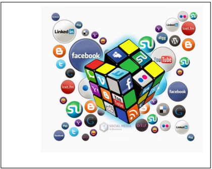
جامعة، مدرسة، ... شركة إلخ، وكل هذا يتم عن طريق خدمات التواصل المباشر؛ مثل: إرسال الرسائل، أو الاطلاع على الملفات الشخصية للآخرين، ومعرفة أخبارهم ومعلوماتهم التي يتيحونها للعرض.
ظهرت شبكات التواصل الاجتماعية مثل: (الفيس بوك -'Facebook' تويتر -'Twitter' ماي سبيس --'Myspace' هاي فايف - 'Hi5' ليكند إن -'LinkedIn' يوتيوب - 'YouTube' سكيب " Skype " ,) وغيرها
التي أتاح البعض منها تبادل مقاطع الفيديو والصور ومشاركة الملفات وإجراء المحادثات الفورية, والتواصل والتفاعل المباشر بين جمهور المتلقين.
تنو َّ ع أشكال وأهداف الشبكات التواصل الاجتماعية، فبعضها عام يهدف إلى التواصل العام وتكوين الصداقات حول العالم وبعضها الآخر يتمحور حول تكوين شبكات اجتماعية في نطاق محدد ومنحصر في مجال معين مثل شبكات المحترفين ....الخ.
## أهمية شبكات التواصل الاجتماعي:
إن أهمية شبكات التواصل الاجتماعي هي إتاحة المجال واسع ً ا أمام الإنسان للتعبير عن نفسه ومشاركة مشاعره وأفكاره مع الآخرين، خاصة وأن هناك حقيقة علمية وهي أن الإنسان اجتماعي بطبعه وبفطرته يتواصل مع الآخرين ولا يمكن له أن يعيش في عزلة عن أخيه الإنسان.
## مميزات شبكات التواصل الاجتماعي : 4
إن الشبكات الاجتماعية تتميز عن غيرها من المواقع في الشبكة العنكبوتية بعدة ميزات، من أبرزها:
-  الهدف من المواقع الاجتماعية هو خلق جو من التواصل في مجتمع إفتراضي يجمع مجموعة من الأشخاص من مناطق ودول مختلفة على موقع واحد، تختلف وجهاتهم ومستوياتهم وألوانهم.
-  يكون هذا التواصل مبنى على الهدف واحد سواء كان التعارف أو التعاون أو التشاور أو لمجرد الترفيه فقط.
-  إن الشخص في هذا المجتمع الافتراضي عضو فاعل، أي أنه يرسل ويستقبل ويقرأ ويكتب ويشارك، ويسمع ويتحدث، فدوره هنا تجاوز الدور السلبي من الاستماع والاطلاع فقط.
## مميزات الشبكات الاجتماعية هي:
-  العالمية : . حيث تلغى ببساطة وسهول كل الحواجز الجغرافية، وتتحطم فيها الحدود الدولية
-  التفاعلية : فالفرد فيها كما أنه مستقبل وقارئ، فهو مرسل وكاتب ومشارك، وتعطي حيز ً ا للمشاركة الفاعلة من المشاهد والقارئ.
-  التنوع :تعدد الاستعمالات، فيستخدمها الطالب للتعلم، والعالم لبث علمه وتعليم الناس، والكاتب للتواصل مع القراء... وهكذا.
-  سهولة الاستخدام : فالشبكات الاجتماعية تستخدم بالإضافة للحروف وبساطة اللغة، تستخدم الرموز والصور التي تسهل للمستخدم التفاعل.
/  http://www.alukah.net/authors/view/home/8967
4 حمزة إسماعيل أبوشنب محلل و باحث
-  الاقتصادية : اقتصادية في الجهد والوقت والمال، في ظل مجانية الاشتراك والتسجيل، فالفرد البسيط يستطيع امتلاك حيز على الشبكة للتواصل الاجتماعي، وليست ذلك حكر ً ا على أصحاب الأموال، أو حكر ًا على جماعة دون أخرى.
## إيجابيات وسلبيات شبكات التواصل الاجتماعي:
وبما أن لكل شيء إيجابيات وسلبيات فإن شبكات التواصل الاجتماعي كذلك لها إيجابياتها وسلبياتها، حيث تضاربت الآراء مع قبول ورفض لانتشار المواقع الاجتماعية على الشبكة الأنترنت ، معتمد ً ا ذلك على دراسات وبحوث أقامها العديد من الباحثين الاجتماعيين والأطباء في مجال علم النفس والطب.
## ولعل أبرز إيجابيات هذه المواقع:
-  التواصل مع العالم الخارجي وتبادل الآراء والأفكار ومعرفة ثقافات .
-  ممارسة العديد من الأنشطة التي تساعد على التقرب والتواصل مع الآخرين.
-  تفتح أبوابا ً  تمكن من إطلاق الإبداعات والمشاريع التي تحقق الأهداف وتساعد المجتمع على النمو.
-  المساهمة في إسقاط أنظمة حكم مرفوضة شعبيا.
## وأبرز السلبيات هي:
-  غياب الرقابة وعدم شعور بعض المستخدمين بالمسؤولية.
-  كثرة الإشاعات والمبالغة في نقل الأحداث.
-  بعض النقاشات التي تبتعد عن الاحترام المتبادل وعدم تقبل الرأي الآخر
-  إضاعة الوقت في التنقل بين الصفحات والملفات دون فائدة.
-  تصفح المواقع يؤدي إلى عزل الشباب والمراهقين عن واقعهم الأسري وعن مشاركتهم في الفعاليات التي يقيمها المجتمع.
-  ظهور لغة جديدة بين الشباب بين العربية والإنجليزية من شأنها أن تضعف لغتنا العربية وإضاعة هويتها.
- 
- انعدام الخصوصية الذي يؤدي إلى أضرار معنوية ونفسية ومادية وبعد التعرف على أبرز إيجابيات وسلبيات مواقع الاتصال الاجتماعية لابد أن نستفيد من الإيجابيات
ونتفادى السلبيات حتى ننعم بذلك التواصل دون مشاكل أو آثار قد تعود بالضرر علينا.
## التطبيقات :
-  الشبكات .. الاجتماعية خطر على المجتمع أم فرصة؟
-  مواقع التواصل الاجتماعي تنمي ذاكرة مستخدميها
-  ما هي سلبيات مواقع التواصل الاجتماعي؟
تيم بيرنرزلي

## .1 مقدمة 5
يظن بعض الناس أن إنشاء المواقع عملية صعبة معقدة، هذا ليس صحيحا ً يمكن للجميع تعلم كيفية إنشاء المواقع . الهدف من هذا الدرس هو مقدمة سهلة في كيفية إنشاء المواقع، هذا الدرس لا يتطلب أي معرفة مسبقة منك عن البرمجة أو تطوير المواقع .
## .2 ما هي HTML
هي اللغة تستخدم في إنشاء و تصميم صفحات الويب ..
اخترعت HTML في عام 1991 م من قبل عالم يسمى تيم بيرنرزلي، الهدف من هذه اللغة هو تبسيط عملية وصول العلماء في جامعات مختلفة إلى البحوث التي ينشرونها، المشروع نجح بشكل لم يتصوره تيم بيرنرزلي ، باختراعه HTML قام تيم بيرنرزلي بوضع أساس شبكة الويب كما نعرفها اليوم.
هي لغة تسمح بعرض المعلومات (مثال: البحوث العلمية) على شبكة إنترنت، ما نراه عند زيارتنا لأي صفحة في الشبكة.
## .3 ماذا تعني H-T-M-L ؟
كلمة HTML هي اختصار "HyperText Mark-up Language" ،
-  HYPER هي عكس "خطي" وهي تعني في هذه الحالة أن ننتقل من أي نقطة إلى أي نقطة بدون أن نسير في خط سير محدد.
-  Text تعني النص.
-  Mark-up هو ما نفعله بالنص، فهذه الكلمة تعني توصيف النص، فأننا نقوم بتوصيف النص تماما ً كما نفعل مع معالجات النصوص و الكلمات فنضيف العناوين والنقاط والنص السميك وغيرها.
-  Language تعني اللغة، فتقنية HTML . هي لغة توصيف
تكتب ملفات HTML ( في صورة ملفات نصوص بسيطة Text )، تأخذ الامتداد .html عادة، وتكتب في أي برنامج للنصوص البسيطة.، في الويندوز نستخدم .Notepad++
لغة HTML لغة وصفية سهلة جدا ذات قدرات عالية وميزات فريدة وقوية، جميع الصفحات العالمية متقنة التصميم تم إعدادها باستخدام لغة HTML ، تتميز HTML أيضا بأنها ذات قواعد سهلة ومعروفة.
5 شبكة المنهل التعليمية http://111000.net/wdesign/?start=30
## .4 العناصر و الوسوم
تتكون ملفات HTML : من قسمين
-  : المحتوى . وهو ما يشاهده الجمهور في صفحتك
 الوسوم :(tags) وهي الأجزاء التي تحدد و . تصف المحتوى من حيث التنسيق الوسوم هي توصيفات نستخدمها ونضعها في بداية العنصر وعند نهايته. كل الوسوم لها نفس الشكل، تبدأ مع علامة أصغر من "&lt;" وتنتهي مع علامة أكبر من "&gt;".
## &lt;html&gt;  .............................................&lt;/html&gt;
بشكل عام هناك نوعان من الوسوم، وسم البداية مثلا : &lt;html&gt; ثم وسم الإغلاق &lt;/html&gt;. الفرق بين الاثنين هي علامة "/"، توصيف المحتوى  يكون بوضعه بين وسم البداية ووسم الإغلاق.
 بعض الأمثلة.
- o المثال :1
الوسم em هو اختصارـ "emphasis".) ) أو الوسم " ,»i يجعل النص "مائلا ً " وكل النصوص بين وسم البداية &lt;em&gt; ووسم الإغلاق &lt;/em&gt; ستظهر بشكل مائل في المتصفح.
&lt;/em&gt; نص مائل .&lt;em&gt;
<!-- formula-not-decoded -->
- o المثال :2
الوسم b هو اختصار لكلمة bold أو الوسم strong للخط العريض، ويأتي في صورة زوج من الوسوم، وسم للفتح ووسم للإغلاق.
HTML is a &lt;b&gt;Great&lt;/b&gt; Language
.. وعند استخدام المتصفح في مشاهدة السطر سيظهر هكذا
سيظهر بهذا الشكل في المتصفح Language Great HTML is a
##  .ملاحظات:
- o جميع عناصر ملف HTML يتم إدراجها عن طريق الوسوم، وتحدد خصائصها أيضا عن طريق الوسوم.
- o لغة HTML لا تراعي حالة الأحرف من حيث كونها كبيرة أو صغيرة، أي أنه في HTML &lt; وضع b &lt; &gt; لا يختلف عن .&gt;B
- o بعض الوسوم تحتاج إلى وسم إغلاق وبعضها لا يحتاج إليه. مثلا الوسم &lt;br&gt; الذي يستخدم لتحديد نهاية السطر و بداية سطر جديد ليس له وسم إغلاق.
- o لغة HTML لا تراعي الفراغات و المسافات البيضاء، أما الفراغات فتعتبر رموزا خاصة أيضا, لتحكم بها نستخدم الوسم non breakable space ( &amp;nbsp ) وإذا أردنا إدخال عدة فراغات بين نص و أخر ما علينا إلا كتابة هذا الوسم بنفس الفراغات المطلوبة .
- o !&lt; توضع التعليقات بين --و --&gt; أي أن المتصفح يتجاهل أي شيء بينهما وكأنه غير . موجود
##  بنية ملف HTML
يتكون ملف HTML من جزئيين رئيسيين هما:
- بداية : Html &lt;html&gt; وسم بداية  المستند  و &lt;/html&gt; وسم نهاية المستند
- 
-  الرأس : Head يحتوي على المعلومات الإضافية الخاصة بالمستند من حيث مثلا عنوان الصفحة والكلمات المفتاحية فيها وغيرها من الأمور الخاصة بالصفحة والتي لا تعتبر من ضمن محتوى المستند .
- العنوان : Title يحتوي على عنوان المستند.
- الجسم : Body وهو يحتوي على المحتوى المستند الذي يراه المستخدم
.
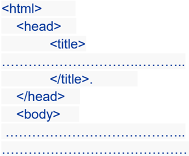
## &lt;/body&gt; &lt;/html&gt;
- 
 المثال التالي يبين كيفية تقسيم ملف .. HTML
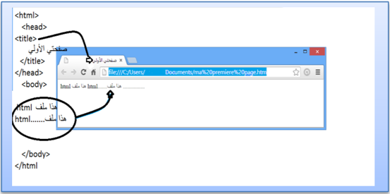
&lt; الأجزاء التابعة للرأس توضع بين head &lt; &gt; و /head &gt;، أما الأجزاء التابعة للجسم فتوضع بين &lt; الوسمين body &lt; &gt; و . &gt;/body
&lt; يتم تحديد عنوان المستند الذي يظهر في شريط العنوان للمتصفح بإحاطته بـ title &lt; &gt; و /title &gt;، &lt; والمكان الصحيح لوسم الـ title &gt; هو &lt; الرأس، حيث أن الوسم title &gt; لا يعتبر من ضمن محتوى الصفحة ولا يظهر في الصفحة، وهو يستخدم في عمليات البحث والأرشيف كما في محركات البحث.
## .5 العناوين و الفقرات
 الأنماط الأساسية
 العناوين: وهي من ستة مستويات، العنوان الأول h1 والثاني h2 وهكذا حتى .. h6
```
<h1>1 /<المستوى h1> <h2>2 /<المستوى h2> <h3>3 /<المستوى h3> <h4>4 /<المستوى h4> <h5>5 /<المستوى h5> <h6>6 /<المستوى h6>
```
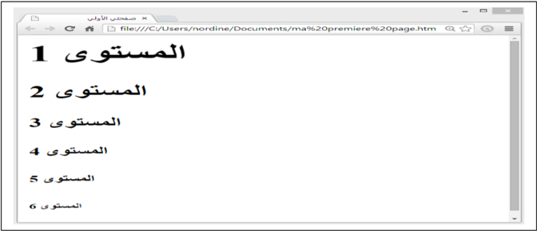
## &lt;p&gt;Paragraph Text&lt;/p&gt;
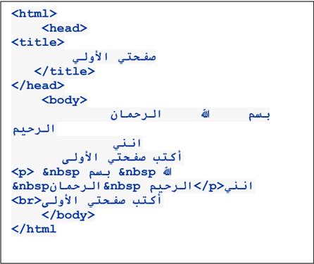

تحديد الفقرات:
يتم إحاطة الفقرة بالوسم
P
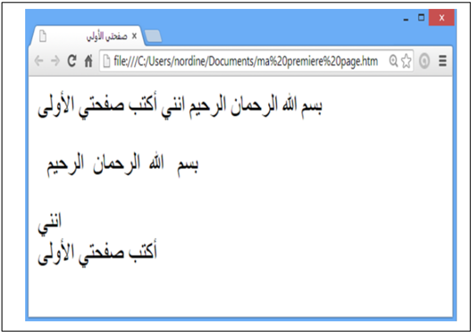
##  تحديد اتجاه الفقرة: استخدم الخاصية align في الوسم P
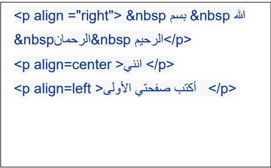
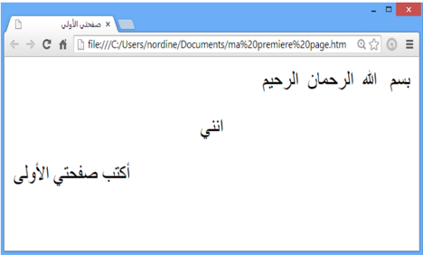
##  الوسم Font
يستعمل الوسم &lt;font&gt; دائما مع مجموعة من الخصائص، فهو لا يمتلك أي تأثير لوحده، وأهم خصائصه هي التي تحدد نوع الخط , . لونه و حجمه
## خصائص الوسم font
 الخاصية :face تحدد نوع الخط المستخدم &lt;font face="Arial"&gt;html /&lt;هذا ملف font&gt;&lt;br&gt; &lt;font face="Courier New"&gt;html /&lt; هذا ملف font&gt; &lt;br&gt; &lt;font face="andalus"&gt;  html &lt;   هذا ملف font&gt;
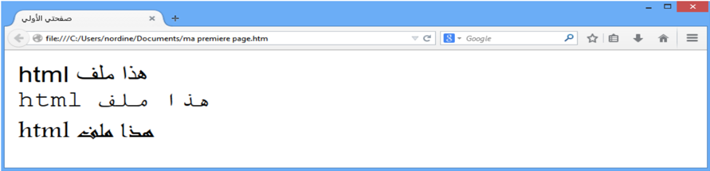
 الخاصية :color تستخدم لتحديد لون الخط (أنظر إلى الألوان ) في الأسفل
&lt; هذه الكلمة font color="red /&lt; "&gt;حمراء font &gt;وهذه&lt; font color="blue /&lt; "&gt; الزرقاء &gt;font
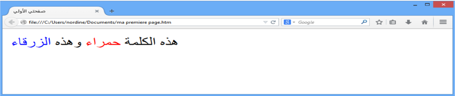
 الخاصية : size تستخدم لتحديد حجم الخط،
توجد سبعة أحجام للخط، والخط الأساسي في الصفحة يأخذ أحد هذه الأحجام، وإذا أردنا تغير حجم الخط في كلمة معينة أو جزء ما من النص نستخدم الوسم font مع الخاصية size لزيادة حجم الخط أو إنقاصه بمقدار معين.
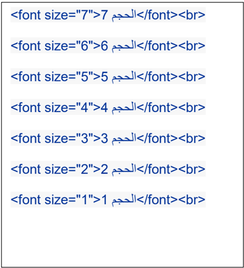
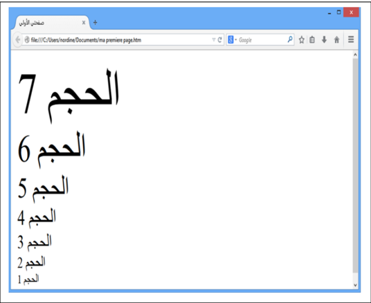
توجد أيضا طريقة سريعة لتكبير الخط خطوة واحدة أو تصغيره خطوة واحدة باستخدام الوسم &gt;big&lt; أو &gt;small&lt; .
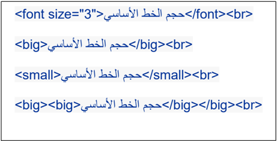
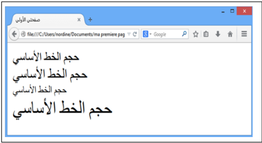
##  ملاحظة:
يمكننا كذلك تغيير حجم الخط الأساسي في المستند وهذا سيؤثر على جميع الأماكن التي استخدمت فيها الأحجام النسبية للخطوط،.
&lt; نغير الخط الأساسي باستخدام وسم يدعى basefont &gt; ويمكن استخدامه لتغيير حجم الخط الأساسي في المستند , لونه و نوعه، وهو لا يأخذ قيم نسبية في الحجم،
##  : مثلا
لتغيير الخط الأساسي إلى Arial بحجم 3 ولون أخضر نضع السطر التالي في المستند
&lt;basefont  color="Green" size="3" face="Arial"&gt;
والوسم &gt;basefont&lt; لا يستخدم في جزء محدد من نصوص HTML بل يظهر تأثيره في الصفحة . كلها لذلك فهو لا يحتاج إلى وسم إغلاق
## المجال المفاهيمي الرابع                               تقنيات  الويب
## الوسم :&lt;hr&gt; وهو  وسم خاص لوضع الخط الأفقي
يمكننا تحديد عرض الخط بالخاصية width ، حيث تأخذ width قيما مطلقة مثل 11 أو 293 وهي تحدد العرض بالبكسل، أوقيما نسبية تقاس بالنسبة إلى عرض الصفحة، مثل 21 % و 55 %،.
توجد أيضا خاصية و هي size التي تحدد ارتفاع الخط رأسيا ويأخذ قيما مطلقة صغيرة.
توجد أيضا خاصية color لتحديد لون الخط.
توجد أيضا الخاصية noshade وهي خاصية بدون قيمة، وعند وضعها تجعل الخط يبدو مصمتا وليس منحوتا كما في الحالة القياسية
خط أفقي
&lt;hr&gt;
خط أفقي ملون
&lt;hr color="red"&gt;
خط أفقي ملون أكبر عرضا
&lt;hr color="Purple" size=8&gt;
خط أفقي محدود الطول
&lt;hr width="30%"&gt;
خط أفقي سميك
&lt;hr noshade size="20"&gt;
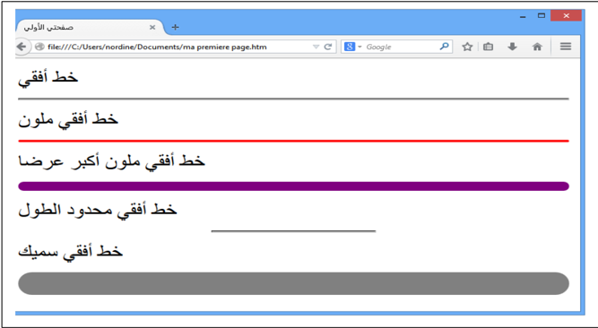
##  تنسيق الصفحة:
&lt; يمكن أيضا استخدام بعض المتغيرات في وسم الجسم body &gt;، وهذه المتغيرات تستخدم في تحديد تنسيق الصفحة
-  لون خلفية الصفحة bgcolor
-  لون النص text
-  حاشية الصفحة العلوية topmargin والسفلية buttommargin واليسرى leftmargin واليمنى .rightmargin
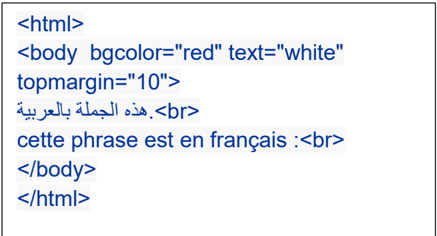
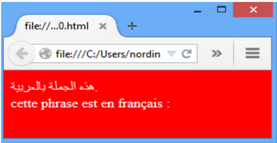
: : disc
:circle
## .6 تنظيم الـمـحتوى
##  التعداد الرقمي و النقطي
يمكننا تنظيم المحتوى في لغة HTML في عدة أشكال، مثلا وضعه في صورة قائمة مرتبة، أو في ) صورة شجرة (مخطط هرمي .
" يمكننا إنجاز قائمة مرتبة بالتعداد الرقمي باستخدام الوسم "ol هي اختصار "ordered list" وغير " مرتبة بالتعداد النقطي باستخدام الوسم ul " هي اختصار "unordered list" بحيث توضع البنود بينهما وكل " بند يحدد بالوسم "li هي اختصار . "list item"
يمكننا تحديد نوع الترقيم في القوائم المرتبة بالحروف أو بالأرقام العربية أو الرومانية وغيرها عبر الخاصية type وتأخذ أحد القيم التالية:
```
: 1 .. ,4 ,3 ,2 ,1 :     a .. , a, b, c, d :    A .. , A, B, C, D :     i .. , i, ii, iii, iv :      I .. , I, II, III, IV : وفي القوائم الغير مرتبة
```

Square
o
ويمكننا وضع قائمة داخل قائمة لتشكيل المخططات الهرمية.
مثال:
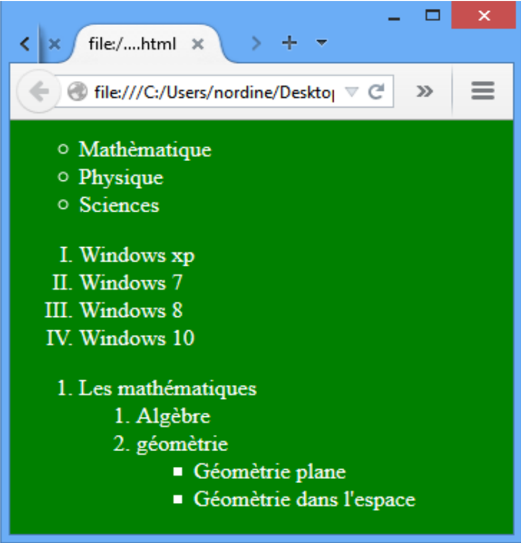

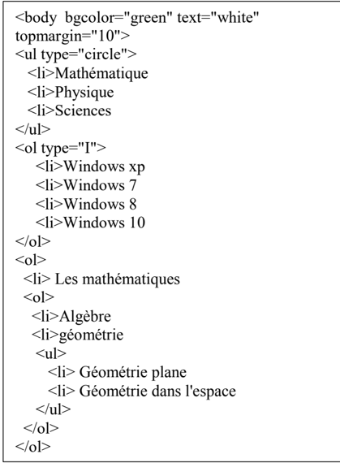
## .7 الــصــور و الرسومات
يمكننا في لغة HTML عرض الصور في الصفحات والتحكم في خواصها.
##  ملاحظة:
يجب أن تكون الصورة جاهرة للنشر على الويب،  أي أن لا تكون ذا حجم كبير لأن ذلك سيؤدي إلى بطء شديد في التحميل.، لذلك يفضل التقليل من الصور قدر الإمكان في صفحات .HTML
لكي نستطيع عرض الصور في المستند يجب أن تكون الصورة من النوع jpeg أو gif أو png
 إدراج الصور
يتم إدراج الصور في صفحة HTML عن طريق الوسم IMG ، وهو وسم مفرد ( لا يحتاج إلى وسم إغلاق)، وهذا الوسم يحتاج إلى خاصية مهمة لكي يعمل بشكل سليم هي src إختصار لكلمة source والتي . نضع بها عنوان الصورة المطلوبة
&lt;img  scr='velo.jpg'&gt;
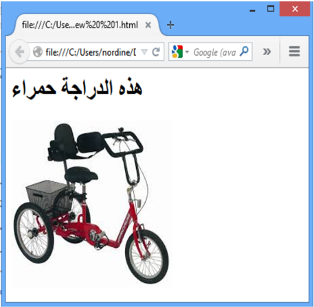
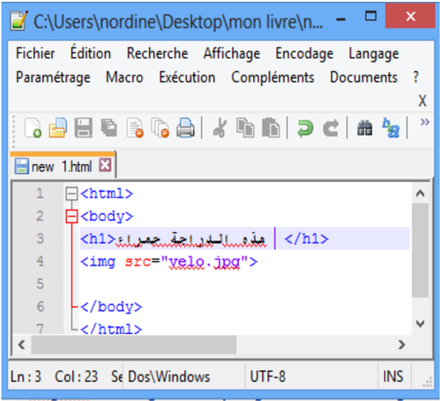
##  الخاصية width و height
الخاصية width تستعمل لتحديد عرض الصورة و الخاصية height لتحديد ارتفاع الصوة. يمكن بواسطة الخاصيتان السابقتان تكبير الصورة وتصغيرها حسب المطلوب، وإذا كنت تريد إظهارها بالحجم الطبيعي فيمكنك ترك هذه الخصائص .
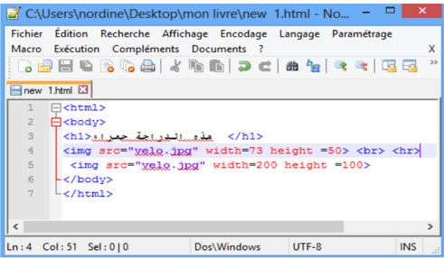
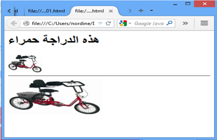
##  الخاصية : align
وهي خاصية مهمة جدا في الصور، وتنبع أهميتها من كونها الطريقة الوحيدة للتحكم بكيفية عرض الصورة بالنسبة للنصوص المحيطة بها، حيث أن الصور في HTML تعتبر جزءا من النص المحيط بها تتحرك معه، وترتبط به.
تأخذ align العديد من القيم وهي :
-  :Bottom, baseline, abs bottom وهي تعرض الصورة بحيث تكون على السطر مثل . أي كلمة أخرى
- &lt;img src="velo.gif" align="bottom"&gt;
-  :left وهي تعرض الصورة على يسار الفقرة ولا يكون للصورة علاقة بالسطر.
- &lt;img src="velo.gif" align="left"&gt;
-  :middle, absmiddle وهي تعرض الصورة في منتصف السطر.
- &lt;img src="velo.gif" align="middle"&gt;
-  :right وهي تعرض الصورة على يمين الفقرة ولا يكون للصورة علاقة بالسطر.
- &lt;img src="velo.gif" align="right"&gt;
-  :top, texttop وهي تعرض أسفل السطر فيكون السطر أعلاها.
- &lt;img src="velo.gif" align="right"&gt;
## .8 الارتباطات التشعبية:
تعد الارتباطات التشعبية من أهم مكونات صفحة الويب, لأنها هي المسؤولة عن ربط مجموعة من الصفحات الويب المختلفة بينها, مما . يتيه للمستخدم التنقل عبرها بسهولة
لإنجاز وصلة نستخدم الوسم a وهي إختصار لكلمة anchor وهي لا تعمل لوحدها ولكن تتطلب خصائص معينة من أهمها الخاصية href هي اختصار "hypertext reference" ، لتحديد الوجهة.
-  الوجهة قد تكون صفحة من موقع خارجي وعندها يبدأ العنوان بـ :http
&lt;a href="http://www.microsoft.com/"&gt;Microsoft Corp.&lt;/a&gt;&lt;br&gt; Microsoft Corp &lt;a href="http://www.microsoft.com/"&gt;cliquer ici.&lt;/a&gt;&lt;br&gt;
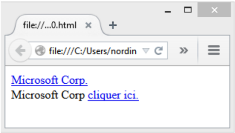
يمكننا إدراج صورة أو زر كبديل على الكلمات
&lt;a href="http://www.microsoft.com/"&gt; &lt;img src="new.gif"&gt;.&lt;/a&gt;&lt;br&gt;
-  الوجهة قد تكون ملف موجودة في نفس الموقع سوأة كانت صفحة ,صورة أو غير ذلك &lt;a href=" .صفحتي htm"&gt; /&lt;صفحة الأولى a&gt;&lt;br&gt;
&lt;a href="velo.gif"&gt; &lt;img src="velo.gif"&gt; /&lt;.أنقر على الصورة
- a&gt;&lt;br&gt;
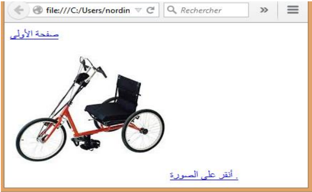
-  الوجهة قد يكون عنوان لبريدا إلكترونيا وعندها يبدأ بـ :mailto
&lt;a href="mailto:nordine@hotmail.com"&gt;Mon--E-mail&lt;/a&gt;
-  الوجهة قد تكون مكان ما داخل نفس الصفحة ,أولها ,أخيرها أو اي مكان نريده.
بإمكاننا إنشاء روابط داخلية ضمن الصفحة، كل ما تحتاجه هي خاصية تسمى( )id أو
"identification" والعلامة "#".
استخدم خاصية « id » لتضع إشارة للعنصر الذي تريد وضع رابط له، مثال:
```
<p><a href = "#heading1"> 1 /<انتقل الى العنوان رقم a></p> <p><a href = "#heading2"> 2 /<انتقل الى العنوان رقم a></p> .. .<h1> id =" heading1"> 1 /< العنوان رقم h1> <p> /<.. نص.. نص.. نص.. نص.. نص.. نص p> .<h1> id = "heading2"> 2 /< العنوان رقم h1> <p> /<.. نص.. نص.. نص.. نص.. نص.. نص p>
```
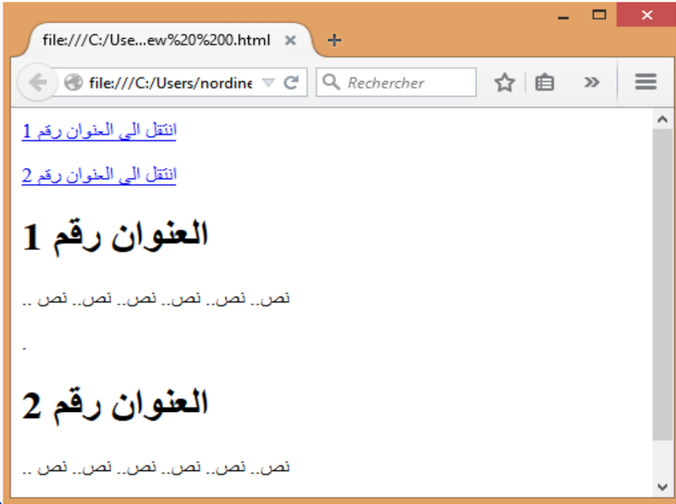
.
## .9 الجداول
تعتبر الجداول من أهم مكونات صفحات HTML ، وجميع التصاميم الإحترافية تستفيد من الجداول لتصميم الصفحة وتوزيع الكائنات عليها وتشكيلها في القالب الذي يريدونه.
يتم إدراج الجدول بالوسم &lt;table&gt; وداخل الجدول يجب إدراج صفوف باستخدام الوسم &lt;tr&gt; تعني " t able r ow" وداخل الصفوف توجد البيانات &lt;td&gt; هي اختصار " t able d ata" وهذا الوسم يبدأ وينهي كل خلية في صفوف الجدول .
يمكن وضع إطار للجدول بالخاصية border حيث نحدد فيه سماكة الإطار المطلوب، القيمة الإفتراضية للإطار هي 1,1 تعني دون إطار.
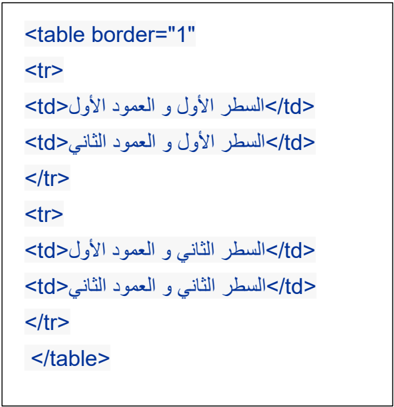
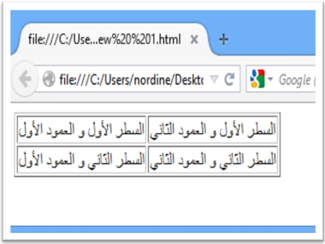
##  الخاصية cellspacing و .cellpadding
يمكننا التحكم بالمسافة بين الخلايا بواسطة الخاصية cellspacing ، والمسافة بين الحدود الداخلية للخلايا ومحتوياتها بواسطة الخاصية .cellpadding
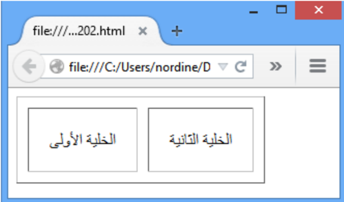
```
<table cellspacing="10" cellpadding="20" border="1"> <tr> <td> /<الخلية الأولى td> <td> /<الخلية الثانية td> </tr> </table>
```
.
middle
للمنتصف
##  الخاصية width و : height
يمكن التحكم بعرض الجدول بالخاصية width وارتفاعه بالخاصية height وكلاهما يأخذ قيما مطلقة أو نسب مئوية، ويمكن استخدام هذه الخصائص في الخلايا td أيضا.
```
<table width="100%" height="100%" border="1"> <tr> <td width="100" height="40%"> الخلية الأولى <td width="100%" height="40%"> الخلية الثانية </tr> </table>
```
-  الخاصية :bgcolor التحكم بلون خلفي للجدول
-  الخاصية :background تعيين صورة  الخلفية للجدول.
يمكن استعمال هذه الخواص في الخلايا td أيضا، وعند تعيين قيمة bgcolor للجدول مختلفة عن قيمة أحد الخلايا فإن لون الخلية سيطغى على لون الجدول في تلك الخلية، لأن الخلية موجودة فوق الجدول في . ترتيب الطبقات
```
<table border="1"  width="90%" height="80%"> <tr> <td bgcolor="Yellow"> /<الخلية الأولى td> <td> /<الخلية الثانية td> </tr> </table>
```
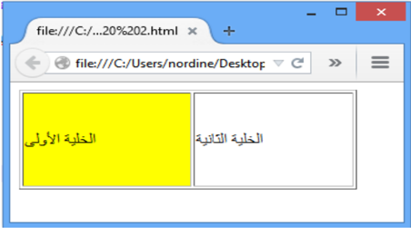
##  الخاصية : align
يمكن التحكم بمحاذاة محتوى الخلية أفقيا بالخاصية . align
في الخاصية align القيمة left تعني محاذاة لليسار و rigth لليمين و center بالمنتصف و justify للضبط الكلي تجعل الأسطر مساوية في الطول.
##  الخاصية :valign
يمكن التحكم بمحاذاة محتوى الخلية رأسيا بالخاصية valign
في الخاصية
valign
فتأخذ القيمة
top
للأعلى،
bottom
للأسفل
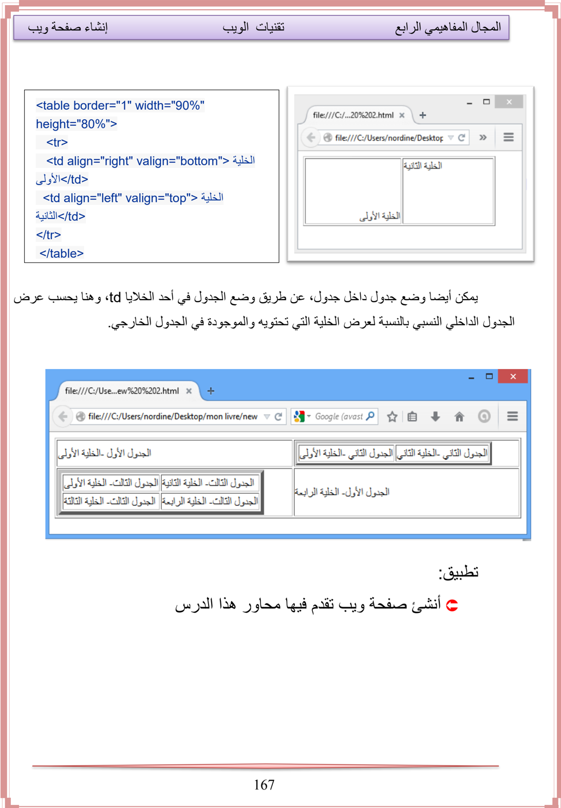
