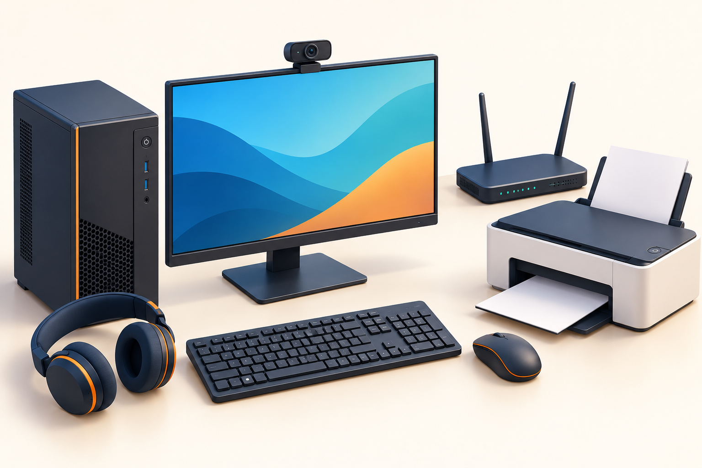
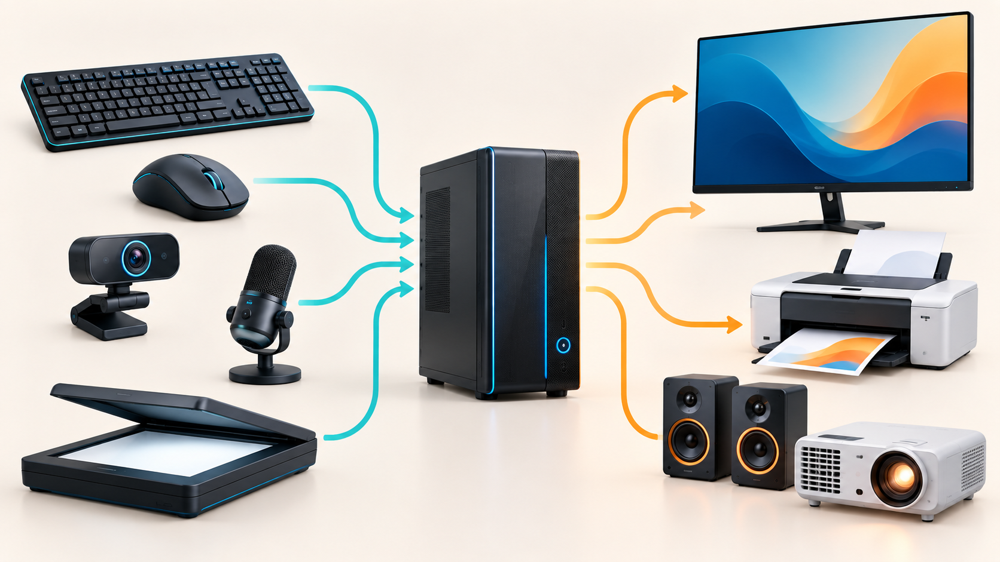
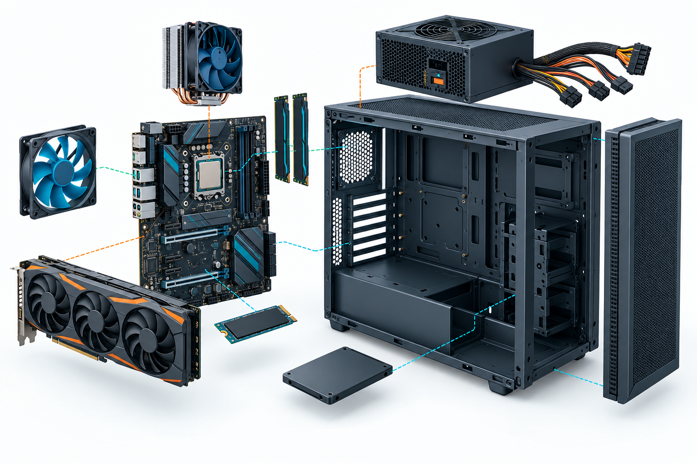
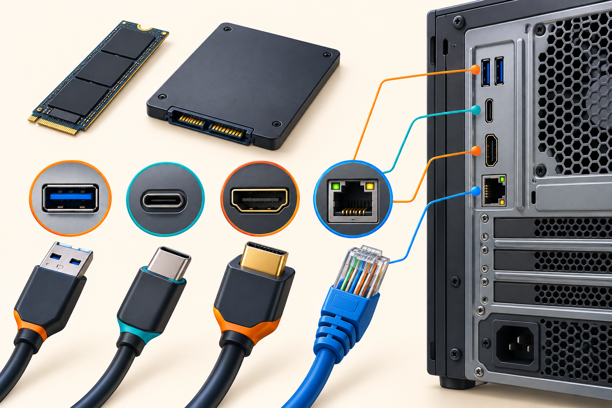
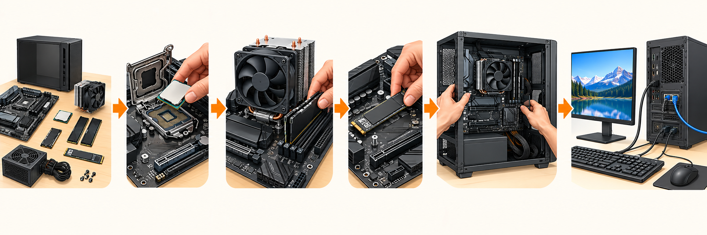

# الوحدة 02: مكوّنات الحاسوب وتجميعه

**المجال المفاهيمي:** التعامل مع بيئة الحاسوب<br>
**المدة المقترحة:** 4 ساعات<br>
**السنة:** الأولى ثانوي

## وضعية الانطلاق

وصل إلى مخبر المؤسسة حاسوب مكتبي جديد: الصندوق والشاشة ولوحة المفاتيح والفأرة وكبلات مختلفة. قبل تشغيله، نحتاج إلى معرفة وظيفة كل قطعة، وكيفية وصلها بأمان، وما الذي يوجد داخل الصندوق.

## الأهداف التعلّمية

في نهاية الوحدة، يكون المتعلم قادراً على أن:

- يعرّف الحاسوب ويذكر أنواعه الشائعة.
- يميّز بين وحدات الإدخال والمعالجة والتخزين والإخراج والاتصال.
- يصف وظيفة المكوّنات الداخلية الأساسية ومكانها التقريبي.
- يفرّق بين الذاكرة المؤقتة والتخزين الدائم، وبين وحدات قياس السعة.
- يتعرّف منافذ USB وUSB-C وHDMI وRJ45 ويختار المنفذ المناسب.
- يرتّب مراحل تجميع حاسوب مكتبي أو مخطط توصيله مع احترام قواعد السلامة.

## خريطة الحصص

| الحصة | المحتوى | الأثر المنتظر |
|---|---|---|
| 1 | تعريف الحاسوب، أنواعه، ووحدات الإدخال والإخراج | تصنيف أجهزة حقيقية أو بطاقات |
| 2 | الصندوق والمكونات الداخلية والذاكرة | بطاقة وظيفة لكل مكوّن |
| 3 | التخزين، تمثيل المعلومات، والمنافذ | تحويلات بسيطة ومطابقة كبل بمنفذ |
| 4 | خطوات التجميع والتوصيل والتقويم | مخطط تركيب آمن أو محاكاة |

## 1. ما الحاسوب؟

الحاسوب جهاز إلكتروني يستقبل البيانات، ويعالجها وفق تعليمات البرامج، ثم يحفظ النتائج أو يعرضها ليستفيد منها المستخدم. لا يقتصر معنى الحاسوب على الصندوق الموجود تحت الطاولة؛ فالحاسوب منظومة تضم أجهزة طرفية ومكوّنات داخلية وبرامج.

### 1.1 أنواع شائعة

| النوع | وصفه | مثال استعمال |
|---|---|---|
| حاسوب مكتبي | أجزاء منفصلة غالباً: صندوق وشاشة ولوحة مفاتيح | المخبر، الإدارة، المنزل |
| حاسوب محمول | شاشة ولوحة مفاتيح ولوحة لمس مدمجة | الدراسة والتنقل |
| جهاز لوحي أو هاتف ذكي | شاشة لمس ومكونات مدمجة | القراءة، الاتصال، التطبيقات |
| خادم | حاسوب مخصص لخدمة أجهزة أو مستخدمين آخرين | تخزين ملفات المؤسسة أو مواقع الويب |



### 1.2 كيف تعمل منظومة الحاسوب؟

يمكن تبسيط عمل الحاسوب في أربع عمليات مترابطة:

```text
إدخال البيانات  ←  معالجة البيانات  ←  حفظها عند الحاجة  ←  إخراج النتيجة
```

مثال: يكتب التلميذ فقرة بلوحة المفاتيح (إدخال)، يعالجها برنامج معالج النصوص (معالجة)، يحفظها في ملف (تخزين)، ثم تظهر على الشاشة أو تطبع (إخراج).

## 2. الأجهزة الطرفية

الأجهزة الطرفية هي الأجهزة التي نتعامل معها خارج الصندوق أو تتصل به. قد تكون سلكية أو لاسلكية، ولكن وظيفتها هي الأساس في تصنيفها.



**اقرأ الرسم:** الأسهم الزرقاء تمثل انتقال البيانات من أجهزة الإدخال إلى الحاسوب، والأسهم البرتقالية تمثل انتقال النتائج من الحاسوب إلى أجهزة الإخراج. الماسح الضوئي في الأسفل يساراً يدخل الوثائق والصور، وجهاز العرض في الأسفل يميناً يعرض محتوى الحاسوب للقسم.

### 2.1 وحدات الإدخال

تدخل البيانات أو الأوامر إلى الحاسوب.

| الجهاز | ماذا يدخل؟ | مثال استعمال |
|---|---|---|
| لوحة المفاتيح | حروف وأرقام ورموز | كتابة تقرير أو كلمة مرور |
| الفأرة أو لوحة اللمس | حركة ونقر واختيار | فتح برنامج أو تحريك عنصر |
| الميكروفون | صوت | تسجيل شرح أو مكالمة |
| كاميرا الويب | صورة وفيديو | قسم افتراضي أو اجتماع |
| الماسح الضوئي | صورة وثيقة ورقية | تحويل وثيقة إلى ملف رقمي |
| قارئ الرموز الشريطية | رقم أو رمز منتج | المتاجر والمكتبات |

**الفأرة الحديثة:** غالباً فأرة ضوئية أو لاسلكية؛ لا تحتاج إلى كرة ميكانيكية كما في بعض الأجهزة القديمة. يجب عدم الخلط بين شكل الاتصال (USB أو Bluetooth) ووظيفتها: وظيفتها إدخال.

### 2.2 وحدات الإخراج

تعرض نتائج المعالجة للمستخدم.

| الجهاز | نوع النتيجة | ملاحظة |
|---|---|---|
| الشاشة | نص وصور وفيديو | جهاز إخراج، وقد تكون لمساً أيضاً |
| الطابعة | وثيقة ورقية | إخراج مادي للملف |
| السماعات أو سماعة الرأس | صوت | تستعمل للتعلم الفردي أو العروض |
| جهاز العرض | صورة مكبرة | يعرض محتوى الحاسوب للقسم |

### 2.3 أجهزة إدخال وإخراج

بعض الأجهزة تؤدي الوظيفتين معاً. شاشة اللمس تعرض المعلومات (إخراج) وتستقبل اللمس (إدخال). وسائط التخزين، مثل ذاكرة USB، تستقبل الملفات عند النسخ إليها وتعيد إرسالها عند فتحها.

### نشاط 1: صنّف قبل أن تلمس

صنّف العناصر الآتية في جدول: كاميرا ويب، طابعة، شاشة لمس، سماعات، ذاكرة USB، لوحة مفاتيح، جهاز عرض. اكتب سبباً قصيراً لكل تصنيف.

## 3. الصندوق والمكوّنات الداخلية

يسمى الصندوق أحياناً **الهيكل (Case / Boîtier)**. يحمي المكونات الداخلية وينظم تثبيتها وتهويتها، لكنه ليس المعالج ولا «الوحدة المركزية» وحده. قبل فتحه: أطفئ الجهاز، افصل كبل الكهرباء، ولا تعمل إلا بإذن الأستاذ.



### 3.1 اللوحة الأم

**اللوحة الأم (Motherboard / Carte mère)** هي اللوحة الإلكترونية الرئيسة التي تصل المكونات ببعضها. عليها مقبس المعالج، وفتحات RAM، وموصلات التخزين، ومنافذ التوسعة، ومنافذ الاتصال الخارجية.

لا يلزم حفظ أسماء كل الشقوق التقنية، لكن يجب فهم المبدأ: المكوّن لا يعمل بمعزل عن بقية الأجزاء؛ اللوحة الأم تنسق الاتصال بينها.

### 3.2 المعالج والتبريد

**وحدة المعالجة المركزية (CPU / Processeur)** تنفذ التعليمات الحسابية والمنطقية التي تطلبها البرامج. ليس معنى ذلك أن كل مهمة يقاس نجاحها بسرعة GHz فقط؛ الأداء يتأثر أيضاً بعدد الأنوية والذاكرة وسرعة التخزين والبرنامج المستعمل.

يُثبّت فوق المعالج مشتت حراري ومروحة أو نظام تبريد مناسب. التبريد ضروري لأن المعالجة تولد حرارة. لا نشغّل حاسوباً بعد فك المبرد، ولا نلمس سطح المكوّنات الساخنة.

### 3.3 الذاكرة الرئيسية: RAM وROM/UEFI

| وجه المقارنة | الذاكرة العشوائية RAM | ذاكرة البرنامج الثابت ROM/UEFI |
|---|---|---|
| الدور | مساحة عمل للبرامج والملفات المفتوحة | تخزين تعليمات بدء تشغيل الجهاز وإعداداته الأساسية |
| عند انقطاع الكهرباء | تفقد محتواها | لا تفقد التعليمات المخزنة فيها عادة |
| مثال | فتح متصفح ومعالج نصوص في الوقت نفسه | فحص المكونات وبدء الإقلاع |

عند فتح ملف، تنقل نسخة منه مؤقتاً إلى RAM. عند الضغط على **حفظ**، يكتب الملف على وسيط التخزين الدائم. لذلك لا يعني وجود الملف في RAM أنه أصبح محفوظاً.

### 3.4 مزود الطاقة وبطاقات التوسعة

**مزود الطاقة (PSU / Alimentation)** يحوّل كهرباء المأخذ إلى طاقة مناسبة لمكونات الحاسوب. لا نفتح مزود الطاقة ولا نفك براغيه في المخبر؛ يحتفظ بأجزاء كهربائية حساسة حتى بعد الفصل.

قد يحتوي الحاسوب على بطاقات توسعة، مثل بطاقة رسوميات (GPU) أو بطاقة شبكة. في بعض الأجهزة تكون وظائف الرسوميات أو الشبكة مدمجة في اللوحة الأم أو المعالج، لذلك ليست كل القطع المنفصلة موجودة في كل حاسوب.

## 4. التخزين وتمثيل المعلومات

### 4.1 وسائط التخزين

وسيط التخزين يحفظ نظام التشغيل والبرامج والملفات بعد إيقاف الحاسوب.

| الوسيط | الفكرة | ميزة وحدّ |
|---|---|---|
| HDD | أقراص ميكانيكية تدور داخل الجهاز | سعة كبيرة غالباً، لكنه أبطأ وحساس للصدمات |
| SSD SATA | ذاكرة إلكترونية في غلاف يشبه القرص | سريع وهادئ ولا أجزاء متحركة فيه |
| SSD M.2 NVMe | بطاقة صغيرة تثبّت على اللوحة الأم | سريع جداً وشائع في الأجهزة الحديثة |
| ذاكرة USB | وسيط متحرك | سهل النقل، لكنه ليس بديلاً آمناً وحيداً للنسخ الاحتياطي |
| قرص خارجي | HDD أو SSD في غلاف خارجي | مناسب للنسخ الاحتياطي والنقل |

الأقراص البصرية مثل CD وDVD جزء من تاريخ التخزين الرقمي وقد توجد في أرشيفات أو أجهزة قديمة، لكنها نادرة في الحواسيب الجديدة. لا نستخدمها مثالاً رئيساً على تجهيز مخبر حديث.

### 4.2 وحدات قياس السعة

أصغر وحدة للمعلومة هي **البت (bit)** وقيمته 0 أو 1. ثمانية بتات تكوّن **بايتاً (Byte / Octet)**.

| الوحدة | العلاقة التعليمية المبسطة |
|---|---|
| 1 B | 8 bits |
| 1 KB | 1024 B |
| 1 MB | 1024 KB |
| 1 GB | 1024 MB |
| 1 TB | 1024 GB |

قد ترى في متاجر الأجهزة كتابة KB وMB وGB وTB بطريقة عشرية، بينما يستعمل نظام التشغيل أحياناً مضاعفات ثنائية. في هذه الوحدة نستعمل التحويل بـ1024 لفهم التدرج.

**مثال:** حوّل 3 GB إلى MB: `3 × 1024 = 3072 MB`.

### 4.3 لماذا يستعمل الحاسوب 0 و1؟

تعالج الدوائر الإلكترونية حالتين كهربائيتين يمكن تمثيلهما بـ0 و1. تسمى هذه الطريقة **النظام الثنائي**. النصوص والصور والصوت كلها تحول داخل الحاسوب إلى سلاسل من البتات، ثم تفسرها البرامج لتظهر لنا بشكل مفهوم.

لا يحتاج التلميذ في هذه المرحلة إلى حفظ ترميز كل حرف؛ المهم أن يدرك أن الملفات المختلفة تخزن في النهاية كمعلومات رقمية.

### نشاط 2: تحويلات قصيرة

1. حوّل 2048 MB إلى GB.
2. حوّل 5 GB إلى MB.
3. هل RAM ذات سعة 8 GB وسائط تخزين دائمة؟ علّل.

## 5. منافذ التوصيل والكبلات



توجد منافذ في الواجهة الأمامية والخلفية للصندوق. لا يكفي أن يبدو الكبل مشابهاً؛ نتأكد من اسم المنفذ وشكله واتجاهه قبل التوصيل.

| المنفذ | استعماله الشائع | تنبيه |
|---|---|---|
| USB-A | لوحة مفاتيح، فأرة، ذاكرة USB، طابعة | لا ندخل القابس بالقوة |
| USB-C | هاتف أو جهاز حديث؛ قد ينقل بيانات أو طاقة أو صورة | الوظائف تختلف باختلاف الجهاز والكبل |
| HDMI | شاشة أو جهاز عرض | ينقل الصورة، وقد ينقل الصوت أيضاً |
| RJ45 (Ethernet) | شبكة سلكية وكبل إنترنت | ليس منفذ هاتف ولا USB |
| مقبس صوت 3.5 mm | سماعة أو ميكروفون في أجهزة معينة | نتحقق من رمز المنفذ |

قد ترى منافذ قديمة، مثل VGA أو PS/2، في أجهزة محفوظة أو قديمة. نعرفها حتى لا نفاجأ بها، لكن تجهيزات المخبر الحديثة تعتمد غالباً USB وHDMI والشبكة السلكية أو اللاسلكية.

## 6. مراحل التجميع والتوصيل

### 6.1 قواعد السلامة

- لا نفتح حاسوباً موصولاً بالكهرباء.
- نعمل على طاولة ثابتة وجافة، ونضع البراغي في وعاء صغير.
- نمسك الكبل من القابس لا من السلك.
- لا نلمس دبابيس المعالج أو الدوائر الإلكترونية بلا حاجة.
- لا نشغّل الحاسوب قبل أن يفحص الأستاذ التركيب.
- نلتقط صورة أو نرسم مخططاً قبل فصل كبلات جهاز جاهز؛ حتى نعيدها إلى أماكنها الصحيحة.

### 6.2 ترتيب عام للتركيب الداخلي

لا يُنفذ هذا الترتيب عملياً إلا تحت إشراف الأستاذ أو في محاكاة، لكنه يوضح منطق التجميع:

1. فحص الهيكل واللوحة الأم والقطع والتأكد من توافقها.
2. تثبيت المعالج في المقبس بالاتجاه الذي تحدده علامة التوجيه.
3. تثبيت التبريد المناسب للمعالج.
4. تركيب شرائح RAM في شقوقها الصحيحة.
5. تثبيت SSD M.2 أو تجهيز SSD/HDD وكبلاته.
6. تثبيت اللوحة الأم ومزود الطاقة داخل الهيكل.
7. توصيل طاقة اللوحة الأم والمعالج ووسيط التخزين، ثم كبلات زر التشغيل والواجهة الأمامية.
8. تثبيت بطاقة التوسعة عند الحاجة، وفحص جميع التوصيلات قبل الإغلاق.

**ملاحظة تعليمية:** الهدف هنا فهم ترتيب العمل وقراءة مخطط التركيب، وليس تعريض تلاميذ مبتدئين لخطر تركيب جهاز المؤسسة دون إشراف.



**اقرأ المخطط من اليسار إلى اليمين:** فحص القطع، تثبيت المعالج، تركيب التبريد وRAM، تثبيت SSD، تركيب المكونات داخل الهيكل، ثم توصيل الشاشة ولوحة المفاتيح والفأرة وكبل الشبكة. لا يظهر كبل الكهرباء في المخطط عمداً: يُوصل فقط في المرحلة الأخيرة وتحت إشراف الأستاذ.

### 6.3 التوصيل الخارجي قبل التشغيل

1. صِل الشاشة بكبل HDMI أو المنفذ المتوافق.
2. صِل لوحة المفاتيح والفأرة بمنافذ USB المناسبة.
3. صِل كبل الشبكة RJ45 إذا كان الاتصال سلكياً.
4. صِل الطاقة بالشاشة والصندوق وفق تعليمات المخبر.
5. رتّب الكبلات كي لا تسبب التعثر أو الضغط على المنافذ.
6. شغّل الجهاز بعد موافقة الأستاذ، وتحقق من ظهور الصورة.

## 7. ورشة تطبيقية وتقويم

### ورشة: مخطط حاسوب للمخبر

**العمل في مجموعات من 3 أو 4:**

1. اختاروا من الصور أو البطاقات: شاشة، كبل HDMI، لوحة مفاتيح USB، كبل RJ45، ذاكرة USB، طابعة، SSD، RAM.
2. صنّفوا كل عنصر: جهاز طرفي، مكوّن داخلي، كبل، أو وسيط تخزين.
3. ارسموا مخططاً لتوصيل حاسوب بالشاشة ولوحة المفاتيح والفأرة والشبكة.
4. ضعوا سهماً يبيّن مسار: كتابة نص → معالجة → حفظ → عرض.
5. راجعوا بطاقة السلامة قبل تقديم المخطط.

### تقويم ختامي

1. ما الفرق بين الحاسوب المكتبي والحاسوب المحمول؟
2. صنف: ماسح ضوئي، سماعات، شاشة لمس، SSD.
3. اشرح الفرق بين RAM وSSD في سطرين.
4. ما المنفذ الأنسب لربط جهاز عرض حديث؟ وما المنفذ الأنسب للشبكة السلكية؟
5. حوّل 4096 MB إلى GB.
6. رتّب: تركيب RAM، فحص القطع، تثبيت المعالج، توصيل الشاشة، اختبار الجهاز.

### تصحيح موجز

1. المكتبي مكوّن من أجزاء منفصلة غالباً؛ المحمول يدمجها في جهاز قابل للتنقل.
2. الماسح: إدخال؛ السماعات: إخراج؛ الشاشة اللمسية: إدخال وإخراج؛ SSD: تخزين.
3. RAM مساحة عمل مؤقتة، وSSD يحفظ الملفات بعد إيقاف الجهاز.
4. HDMI للشاشة أو جهاز العرض، وRJ45 للشبكة السلكية.
5. `4096 ÷ 1024 = 4 GB`.
6. فحص القطع → تثبيت المعالج → تركيب RAM → توصيل الشاشة → اختبار الجهاز. (تختلف التفاصيل الداخلية بحسب نوع الجهاز.)

## خلاصة الوحدة

الحاسوب منظومة متكاملة: تدخل الأجهزة البيانات، يعالجها CPU مستعيناً بالذاكرة، تحفظ على وسائط التخزين، ثم تظهر النتيجة عبر أجهزة الإخراج. معرفة الوظائف والمنافذ وقواعد السلامة تجعل التجميع والتوصيل عملاً منظماً وآمناً، وتمهّد لفهم نظام التشغيل في الوحدة التالية.
