# الوحدة 2: تجميع الحاسوب
## المجال الأول: التعامل مع بيئة الحاسوب
### المدة الزمنية: 04 ساعات

---

## تجميع الحاسوب

### 1 تعريف الحاسوب

كلمة حاسوب هي ترجمة للكلمة الإنجليزية (computer) مشتقة من الفعل compute بمعنى يحسب، وترجمت إلى العربية بعدة أسماء: كمبيوتر، العقل الإلكتروني، الحاسب الآلي الإلكتروني، وهو عبارة عن جهاز إلكتروني يقوم باستقبال المعلومات وتخزينها ومعالجتها قصد إظهارها واستعمالها وقت الحاجة، ويسمى كذلك "PC" أي Personal Computer أي الحاسوب الشخصي.

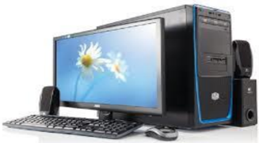

حاسوب مكتبي

حاسوب محمول

### 2 مكونات الحاسوب

من خلال تعريفنا للحاسوب فهو إدخال معلومات ومعالجتها وإظهار النتائج، إذن يمكن تقسيمه إلى ثلاثة عناصر أساسية هي:

1. وحدات الإدخال
2. وحدة المعالجة
3. وحدات الإخراج

### 1 وحدات الإدخال

وهي الأجهزة التي من خلالها يتم إدخال المعلومات إلى وحدة المعالجة، وتتلخص فيما يلي:

#### 1 لوحة المفاتيح (Clavier; Keyboard)

تتكون من أزرار أو مفاتيح لإدخال المعلومات إلى جهاز الحاسوب، وتكتب هذه الأزرار أحرفا أو أرقاما أو رموزا.

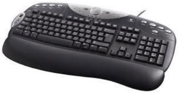

#### 2 الفأرة (La Souris; Mouse)

الفأرة: هي إحدى وحدات الإدخال في الحاسوب، يتم استعمالها يدويا للتأشير والنقر في الواجهة الرسومية وعلى الأيقونات. تحتوي الفأرة الافتراضية حاليا على زرين وعجلة في المنتصف تعمل كزر وسطى، والفأرة نوعان هما:

فأرة الكرة

الميكروفون

يدوي

ماسح ضوئي

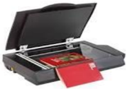

مكتبي

- فأرة الكرة: تحتوي على كرة داخل الفأرة تدور مع حركتها بحيث تتغير وضعية المؤشر حسب حركة ودوران الكرة.
- الفأرة الضوئية: تعتمد على شعاع من ضوء الليزر أسفل الفأرة ينعكس من على السطح ويتم استقباله على شريحة إلكترونية لتحديد الحركة، وتعمل فأرة البلوتوث بنفس المبدأ غير أنها غير متصلة بكابل.

#### 3 الميكروفون (Microphone)

جهاز يتصل بالحاسوب حيث يتكلم المستخدم في هذا المكبر فيخزن صوته على الكمبيوتر بواسطة برنامج خاص ويخرج في السماعات، ويستخدم أيضا في التحدث الصوتي بين شخصين على الإنترنت بواسطة برامج المحادثة والتواصل.

#### 4 الماسح الضوئي (Scanneur; Scanner)

#### وهو ينقسم إلى:

- ماسح يدوي أو ما يسمى بقارئ شفرة الأعمدة (Lecteur de code à barres)، وهو الذي يمسك باليد ويتم مسح الصورة بمصدر الضوء الذي يشع منه فتظهر الصورة أو معلومات على الشاشة (يستعمل في المحلات التجارية لتحديد السلعة وثمنها).
- ماسح ضوئي مكتبي حيث يتم وضع الصورة داخله حتى يظهرها على الشاشة بعد عملية المسح.

#### 5 الكاميرا الرقمية (Caméra Numérique; Digital Camera)

تستعمل لالتقاط الصور والفيديوهات وحفظها في ذاكرتها، حيث يمكن نسخها على قرص الحاسوب لاستعمالها أو تغييرها، كما يمكن ربطها بالحاسوب والتسجيل مباشرة فيه.

كاميرا رقمية

#### 6 كاميرا ويب (Webcam)

تستخدم من أجل التحدث بين فردين على الإنترنت حيث يمكن لكل فرد رؤية الآخر بوضوح عبر هذه الكاميرا والتحدث معه بالصوت والصورة، وتكون مدمجة في الحواسيب المحمولة.

كاميرا الويب

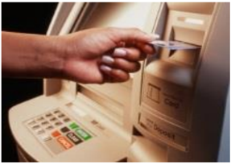

#### 7 شاشة لمسية (Ecran Tactile; Touch Screen)

تعتبر من وسائل إدخال المعلومات الحديثة، تستخدم في جهاز الصرف الآلي في المصارف (البنوك، شبابيك البريد) حيث يمكن للفرد أن يضغط على الأيقونات الموجودة على الشاشة بإصبعه لإجراء عملية.

#### 8 قلم ضوئي (Crayon Optique; Light Pen)

يستخدم هذا القلم أحيانا بديلا عن الإصبع في شاشة اللمس، نجده مثلا في جواز السفر البيومتري حيث يتم الإمضاء به.

قلم ضوئي

#### 9 لوحة لمسية (Panneau Tactile; Touch Panel)

لوحة لمسية

الجهة الأمامية

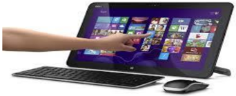

توجد في الحواسيب المحمولة وهي بديلة عن الفأرة، حيث يمكن وضع الإصبع على هذه اللوحة وتحريكه فيتحرك السهم أو الأيقونة الموجودة على الشاشة.

### 2 الوحدة المركزية

وهي الوحدة التي يتم فيها القيام بجميع العمليات من تخزين ومعالجة وغيرهما، وتحتوي على:

#### 1 الصندوق الرئيسي (Boîtier; Case CPU)

هي تلك العلبة الفولاذية التي تحوي البطاقة الأم وكل مكونات الحاسوب الداخلية، وهي مرتبطة بالوسط الخارجي بواسطة مآخذ الكهرباء ووصلات البيانات (الفأرة، لوحة المفاتيح، الشاشة، الطابعة ...).

#### 2 علبة التغذية بالكهرباء (Bloc alimentation; Power Supply Unit)

هي وحدة إمداد وتحويل التيار الكهربائي للوحدة المركزية بكل مكوناتها.

علبة الإمداد أو التغذية بالكهرباء

#### 3 اللوحة الأم (Carte Mère; Motherboard)

هي لوحة إلكترونية يتصل بها كل مكونات الحاسوب الداخلية ومختلف وحدات الإدخال والإخراج، حيث توصل باللوحة الأم عن طريق وصلات أو كابلات.

جهة المنافذ و الوصلات

#### 4 المعالج المركزي (Le Processeur; Processor)

ويطلق عليه تسمية CPU (Unité Centrale de Traitement)، ويمثل عقل الحاسوب حيث يقوم بتسيير وتنسيق كل المهام، ويقوم بتنفيذ التعليمات ومعالجة البيانات التي تتضمنها البرمجيات. ويطلق عليه تسمية المعالج الدقيق (Microprocessor; Microprocesseur).

المعالج من الجهة السفلى (جهة الإبر)

المعالج من الجهة العليا

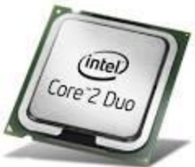

#### ويعرف المعالج بما يلي:

1. التسمية.
2. سرعة تنفيذ العمليات وتقاس بـ GHz أو MHz.

1 KHz = 10³ Hz ; 1 MHz = 10³ KHz ; 1 GHz = 10³ MHz.

| سرعته                     | المعالج       |
|---------------------------|---------------|
| 100 MHz                   | Intel 80486   |
| من 1,3 GHz إلى 3,8 GHz    | Pentium 4     |
| 2,4 GHz                   | Core 2 Duo    |
| 3,33 GHz                  | Intel Core i7 |

#### مثال:

#### 5 الذاكرة المركزية (Mémoire Centrale; Central Memory)

هي وحدة تخزن فيها المعلومات وتحتوي على قسمين:

1. الذاكرة الحية أو ذاكرة الوصول العشوائي RAM (Random Access Memory; mémoire à accès direct)

الذاكرة الحية

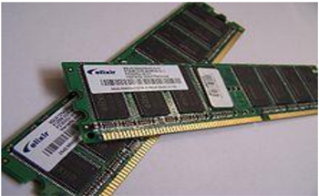

الذاكرة الميتة

وهي الذاكرة التي تخزن المعلومات أثناء المعالجة، من ميزاتها:

- السرعة في الوصول للمعلومة وتوفيرها للمعالج.
- تمحى معلوماتها بمجرد انقطاع التيار الكهربائي عن الحاسوب (ذاكرة متلاشية أو متطايرة) volatile.
- يتغير محتواها حسب البرامج المفتوحة أو النشطة.
2. الذاكرة الميتة ROM (Read Only Memory)

وهي ذاكرة تصمم من قبل الشركة المصممة للوحة الأم، ومن ميزاتها:

- ذاكرة للقراءة فقط، لا يمكن التخزين فيها ومحتوياتها ثابتة.
- لا يمكن حذف المعلومات التي تحويها.
- تحوي برامج لبداية تشغيل الحاسوب.
- تحوي برنامج التعرف على الأجهزة الموصولة بالحاسوب.
- تستخدم لتخزين نظام الإدخال والإخراج الأساسي Basic Input Output System (BIOS).

### 4 وحدات التخزين الخارجية (Unités de Stockage; Storage Units)

هي الأجهزة والأدوات التي يتم تخزين المعلومات والبرامج فيها بصفة مؤقتة أو دائمة، نذكر منها:

#### 1 القرص الصلب (Disque Dur; Hard Disk)

هو قرص مثبت بالوحدة المركزية ويعتبر وحدة التخزين الرئيسية بالحاسوب، ومن مميزاته:

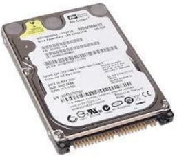

قرص مضغوط CD

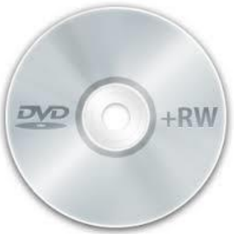

- يتصل باللوحة الأم بواسطة الكبل IDE أو SATA.
- سرعة الوصول إلى المعلومة.
- سعة تخزين كبيرة جدا.
- يعمر ولا يتلف بسرعة.
- يوجد فيه نوع خارجي (Disque Dur Externe).

قرص صلب خارجي

#### 2 القرص المضغوط CD

القرص المضغوط (Compact Disc) هو قرص بصري يستخدم لتخزين البيانات.

#### خصائصه:

- تستخدم أشعة الليزر في تسجيل البيانات على سطحه.
- قراءة محتواه بواسطة قارئ القرص الضوئي.
- لا يمكن أن يكتب عليه إلا باستخدام الناسخ.
- المعلومات فيه محفوظة بشكل جيد ولا تضيع.

#### 3 قرص الفيديو الرقمي DVD

قرص الفيديو الرقمي (Digital Video Disc) أو قرص متعدد الاستخدامات الرقمي (Digital Versatile Disc)، والذي يعرف بـ (DVD)، هو قرص بصري يستخدم كوسيط لتخزين البيانات.

#### خصائصه:

- سعة أكبر تصل إلى 4.7 GB.
- يمكن للقرص الرقمي أن يسجل المعلومات في جهة واحدة أو في جهتين.

#### 4 ذاكرة الفلاش أو الذاكرة الوامضة (Clé USB; Flash Drive)

يطلق عليه كذلك تسمية: فلاش ديسك، وهو وحدة تخزين متحركة (amovible)، تتصل بالحاسوب عن طريق المنفذ USB (Universal Serial Bus، أي الناقل التسلسلي العام)، ويحتوي ذاكرة وامضة.

رمز ذاكرة الفلاش

#### من مميزاته:

- صغير الحجم وخفيف الوزن.
- سعة تصل إلى 1 TO أو أكثر.
- عملية النسخ منه وإليه سهلة وسلسة.

#### من عيوبه:

- كثيرا ما يلتقط الفيروسات.
- حساس للصدمات ويتلف بسرعة.

#### 5 بطاقة ذاكرة (Carte Mémoire; Memory Card)

بطاقة الذاكرة هي ذاكرة فلاش إلكترونية صلبة لتخزين البيانات، تستعمل في آلات التصوير الرقمية، وأجهزة الحاسوب، والهواتف، وألعاب الفيديو، والعديد من الأجهزة الإلكترونية الأخرى.

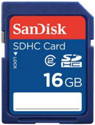

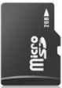

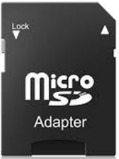

#### مميزاتها:

- قدرة عالية على التخزين والحفظ.
- لا تحتاج للطاقة.

بطاقة ذاكرة

### وحدة قياس الذاكرة

- تتكون الذاكرات بكل أصنافها من خلايا، بحيث كل خلية تعادل بتا واحدا (Bit) من البيانات.
- البت (Bit) هو أصغر وحدة من وحدات قياس الذاكرة ويحتوي قيمتين 1 أو 0.
- كل 8 بتات تشكل بايتا واحدا (Octet; Byte)، وهو المساحة الكافية لتخزين قيمة حرف واحد أو رقم أو رمز، وهي وحدة قياس الذاكرة.

#### مثال:

مضاعفات البايت (Byte)

- 1 KB (Kilo Byte) = 1024 Bytes = 2^10 Bytes، ويصطلح عليها بـ 1000 Bytes.
- 1 MB (Méga Byte) = 1024 KB = 2^10 KB، ويصطلح عليها بـ 1000 KB.
- 1 GB (Giga Byte) = 1024 MB = 2^10 MB، ويصطلح عليها بـ 1000 MB.

0 1 1 0 0 1 0 1

- 1 TB (Téra Byte) = 1024 GB = 2^10 GB، ويصطلح عليها بـ 1000 GB.

### 5 البطاقات الداخلية

#### 1 بطاقة الشبكة (Carte Réseau; Network Card)

بطاقة شبكة لا سلكية Wireless

وتسمى كذلك network adapter أو LAN Adapter.

وغالبا ما تعرف بالاختصار NIC وهو اختصار لـ Network Interface Card ويعني واجهة بطاقة الشبكة، ودورها أنها تسمح لمستخدم الحاسوب بالتواصل مع الحواسيب الأخرى عن طريق الشبكة.

#### وهي نوعان:

- سلكية أو بالكابل.
- لا سلكية Wireless.

#### 2 بطاقة بيانية أو بطاقة عرض مرئي (Carte Graphique; Graphic Card)

بطاقة الصوت

هي البطاقة التي تتصل بشاشة الحاسوب ودورها توصيل الصور والبيانات وعرضها على الشاشة.

#### من ميزاتها:

- لديها ذاكرة خاصة بها.
- ترسل صورا إلى الشاشة مخزنة في ذاكرتها الخاصة.
- لديها ذاكرة ميتة خاصة بها.

#### 3 بطاقة الصوت (Carte Son; Sound Card)

بطاقة الصوت أو البطاقة السمعية هي بطاقة تسهل المدخلات والمخرجات من الإشارات الصوتية من وإلى جهاز الحاسوب، حيث توفر العنصر الصوتي لتطبيقات الوسائط المتعددة: مثل القرآن، والموسيقى، وأفلام الفيديو والترفيه (الألعاب).

طابعة نقطية

طابعة ليزرية (Laser)

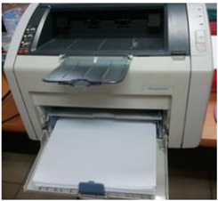

الشاشة: هو جهاز يشبه التلفاز يقوم بعرض البيانات والصور والفيديو التي تتم معالجتها

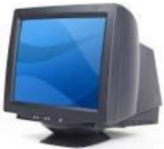

#### وهي نوعان:

- شاشة أشعة أنبوب الكاثود (CRT - Cathode Ray Tube).

- شاشة العرض البلوري السائل (LCD - Liquid Crystal Display).

السماعات: هي وحدة تقوم بإخراج الصوت من الحاسوب وإسماع الشخص كل البيانات الصوتية التي توفرها بطاقة الصوت، مثل القرآن.

### 3 وحدات الإخراج

هي الوحدات التي تخرج أو تظهر نتائج المعالجة، ومنها:

الطابعة: هي ذلك الجهاز الذي يسمح بتحويل البيانات المرئية على الشاشة إلى أوراق، وهي عدة أصناف:

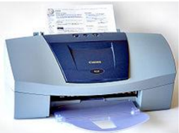

- طابعة بنفث الحبر (Jet d'encre; Inkjet printers).

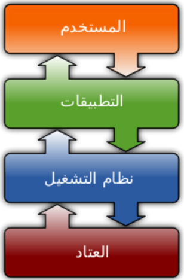
