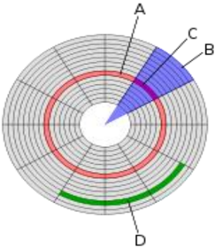
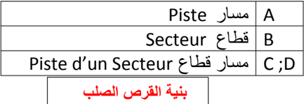

# الوحدة 3: نظام التشغيل
## المجال الأول: التعامل مع بيئة الحاسوب
### المدة الزمنية: 04 ساعات

---

## نظام التشغيل

### 1 تعريف نظام التشغيل

نظام التشغيل (Système d'exploitation SE) (Operating System OS) هو مجموعة من الملفات والبرمجيات المتكاملة فيما بينها والمسؤولة عن:

- إعداد الحاسوب لبدء التشغيل.
- إدارة موارد الحاسوب (وحدات الإدخال، المعالج، الذاكرة، القرص الصلب، كل الأجهزة الملحقة).
- إدارة برمجيات الحاسوب.
- تنظيم وإدارة الملفات ...

### ويتميز بما يلي:

- يعتبر الوسيط بين المستخدم والحاسوب.
- هو جسر لتشغيل برامج المستخدم.
- يوفر واجهة بيانية سهلة الاستخدام (Interface Graphique).
- استخدام أكثر من برنامج أو تطبيق في آن واحد (Multitâches).

### من أشهر أنظمة التشغيل:

- Windows
- Unix
- Linux
- IBM OS/2
- Mac OS

من أشهر أنظمة تشغيل اللوحات اللمسية والهواتف الذكية:

- Android
- BlackBerry OS
- iOS
- Windows Phone
- Mac OS

### 2 مفهوم التثبيت

تثبيت النظام هو عملية نسخ الملفات والبرامج الخاصة بالنظام وجعلها متوفرة بصفة دائمة على القرص الصلب لتمكين الحاسوب من القيام بجميع مهامه.

تتم العملية بواسطة حزمة الملفات والبرامج المتوفرة على (قرص مضغوط، ذاكرة أو قرص صلب أو شبكة) والتي تحوي برنامج الإقلاع Bootable، وتتم هذه العملية بواسطة برنامج خاص يسمى المثبت (Installer) الذي يقترح مراحل وخطوات يجب اتباعها لإتمام العملية.

### 3 مفهوم تقسيم القرص

- القرص الصلب هو قطعة واحدة من الناحية المادية، لكن يمكن تجزئته أو تقسيمه افتراضيا إلى تجزئتين أو أكثر، بحيث كل تجزئة تتميز بنظام ملفات خاص بها (FAT, FAT32, NTFS) ويسمح بحفظ وتخزين الملفات.
- في بعض أنظمة التشغيل مثل Windows تظهر التجزئات في شكل أقراص منفصلة ويرمز لها بحروف أبجدية، مثال: C ; D ; E ; F.
- في أنظمة أخرى مثل الماكنتوش تظهر في شكل أيقونات.
- التجزئة الأساسية هي التي تحتوي عادة ملفات نظام التشغيل ويرمز لها بالحرف C وتتولى عملية إقلاع الحاسوب.

#### تعدد التجزئات يهدف إلى:

- تنظيم وترتيب الملفات.
- حماية الملفات والمجلدات من الضياع.
- تعدد مواضع التخزين.
- تثبيت النظام في تجزئة خاصة به.
- جعل الملفات الشخصية والخاصة في تجزئة مخالفة لتجزئة النظام.
- تتيح فرصة تثبيت أكثر من نظام تشغيل على نفس الحاسوب.

#### 1 مفهوم تهيئة القرص

تهيئة القرص الصلب هي إعداده وتحضيره ليصبح جاهزا لتخزين نظام التشغيل والبرامج والملفات.

يوجد نوعان من التهيئة:

- الفيزيائية: Physical Formatting، وتعرف أيضا بتهيئة المستوى المنخفض Low Level Formatting، ويتم فيها تقسيم القرص الصلب إلى عناصر أساسية: اسطوانات

مسار

Piste

A

قطاع Secteur B

مسار قطاع Piste d'un Secteur C ;D

(Cylinders; Cylindres)، مسارات

(Tracks; Pistes) وقطاعات (Sectors; Secteurs)

وتتم هذه العملية عند مصنع الأقراص الصلبة قبل بيعها، لنستطيع بعد ذلك تهيئتها منطقيا.

- التهيئة المنطقية: Logical Formatting، وتعرف بتهيئة المستوى العالي High Level Formatting، ويتم فيها وضع نظام الملفات (file system) على القرص الصلب مما يتيح له استخدام المساحة التخزينية الموجودة عليه في قراءة وتخزين الملفات والبيانات.

### 4 إعدادات تثبيت نظام التشغيل

#### 1 إعدادات قبل التثبيت

إعداد نظام الإدخال والإخراج الأساسي (BIOS: Basic Input Output System): نلاحظ أنه عند تشغيل الجهاز مباشرة فإنه يقلع من القرص الصلب، وهذا راجع للترتيب الموجود في BIOS، فإذا أردنا إقلاع الجهاز من جهة أخرى (قرص مضغوط، ذاكرة متصلة بمنفذ USB، شبكة ...) توجب علينا تغيير الإقلاع الأول في BIOS.

للدخول إلى برنامج BIOS في أي جهاز، بعد بدء تشغيل الجهاز نضغط على المفتاح delete (Suppr) أو F2، وهو يختلف من جهاز لآخر حسب الشركة المصنعة للوحة الأم، وهنا نغير الإقلاع الأول ثم نحفظ ونغادر البرنامج.

#### 2 التثبيت

بعد تغيير الإقلاع الأولي وتحديده حسب الوسيلة المتوفرة، نتبع المراحل التالية لتثبيت نظام التشغيل (Windows):

- 1. نضع قرص النظام المضغوط في قارئ الأقراص المضغوطة، أو الذاكرة في المنفذ USB.
- 2. نشغل الجهاز، يطلب منا الضغط على أي مفتاح من لوحة المفاتيح.
- 3. تظهر نافذة نختار فيها لغة التثبيت ثم المصادقة على شروط استعمال البرنامج.
- 4. اختيار موضع التثبيت في الأقراص المتوفرة (C ; D ; E).
- 5. إدخال اسم المستعمل وإدخال كلمة مرور.
- 6. اختيار المنطقة الزمنية.
- 7. ضبط الوقت والساعة.
- 8. إعداد الشبكة.
- 9. انتهاء عملية التثبيت.

عند الانتهاء يعاد التشغيل مرة أخرى تلقائيا، وبذلك نكون قد أنهينا عملية تثبيت النظام بنجاح.
