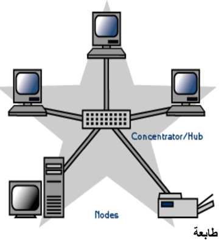
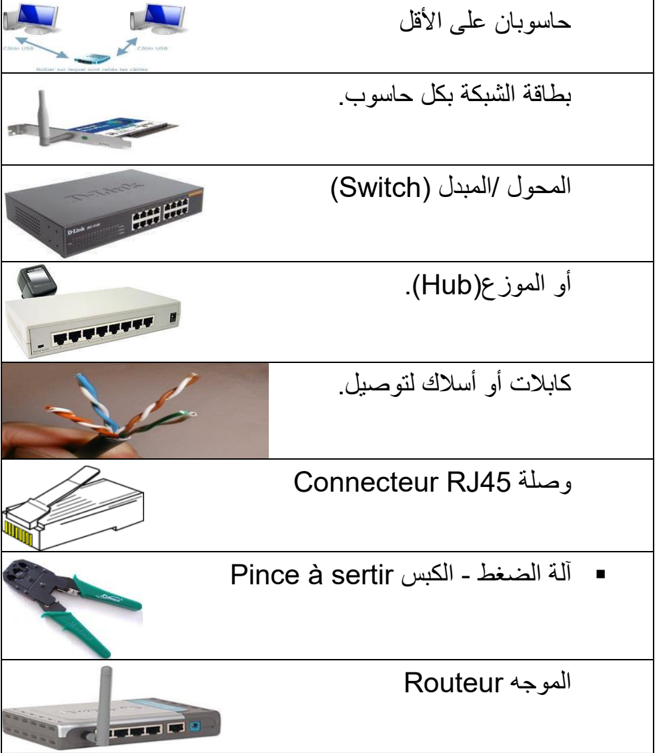
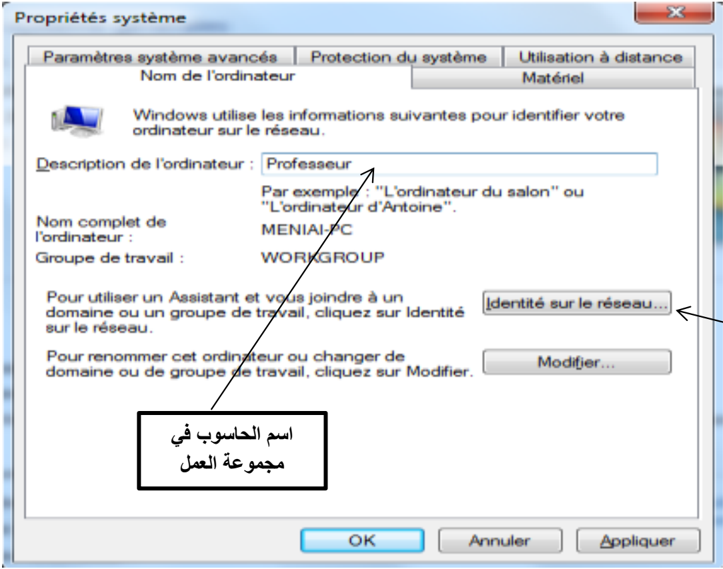
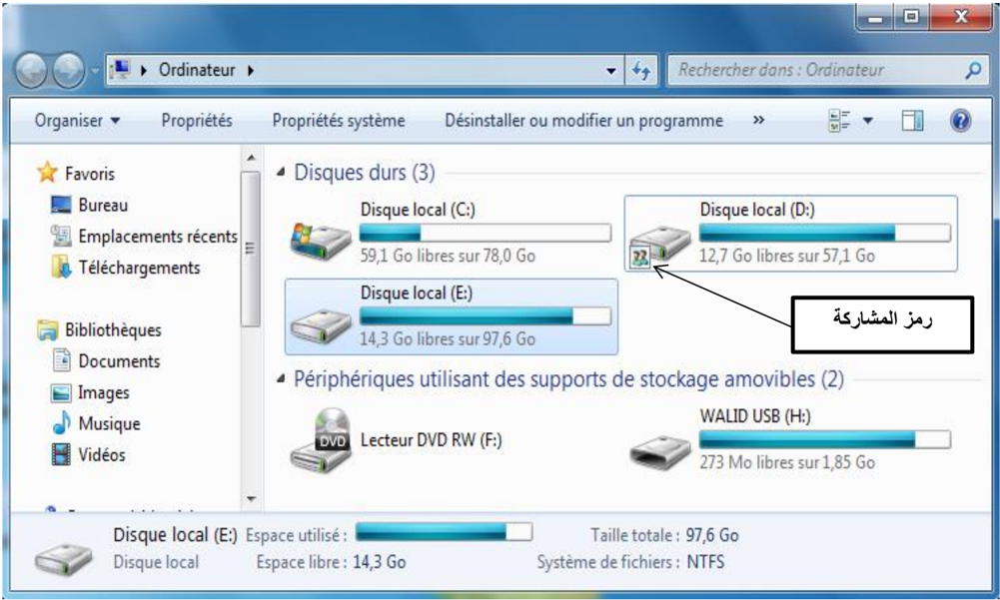
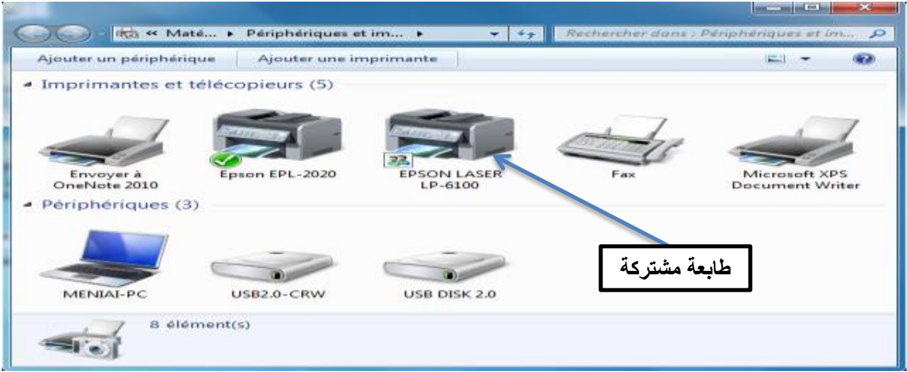

# الوحدة 6: الشبكة المحلية
## المجال الأول: التعامل مع بيئة الحاسوب
### المدة الزمنية: 04 ساعات

---

## الشبكة المحلية

### 1 تعريف الشبكة

الشبكة هي عبارة عن مجموعة من أجهزة الحاسوب متصلة ببعضها البعض بغرض التواصل وتبادل المعطيات واستخدام الموارد، وتتكون من جهازين على الأقل.

### 2 فوائد استعمال الشبكة

- مشاركة التطبيقات والمعطيات والمعلومات.
- مشاركة الأجهزة والأقراص: مثل الطابعات، الماسح، القرص الصلب، القرص المضغوط، الفلاش ...
- الاتصالات: تسهل الاتصالات مثل البريد الإلكتروني والرسائل الفورية وأدوات التواصل الاجتماعي.
- الأمن: يحتاج المستخدم لحساب خاص للدخول إلى الشبكة ويجب استعمال اسم حساب وكلمة مرور لاستعمال الموارد، كما يمكن منع بعض المستخدمين من الدخول إلى الشبكة.
- الدخول إلى الإنترنت: يمكن للمستخدمين الدخول إلى العالم الافتراضي واستغلال مزاياه.

### 3 تصنيف الشبكات

#### تصنف الشبكات حسب:

#### 1 وسيلة الربط

- الشبكات السلكية.
- الشبكات اللاسلكية (Wi-Fi).

#### 2 الامتداد الجغرافي

- الشبكة المحلية (LAN: Local Area Network): هي شبكة تستخدم لتغطية أماكن محدودة وصغيرة مثل المكتب ومخبر التدريس ومقاهي الإنترنت.
- الشبكة الإقليمية (MAN: Metropolitan Area Network): هي الشبكة التي تستعمل في مناطق جغرافية أوسع من المحلية مثل الثانويات والجامعات والمدن.
- الشبكة الواسعة (WAN: Wide Area Network): هي الشبكة التي تستعمل في الأماكن الأوسع مثل البلدان والقارات والأرض بأكملها، وأكبرها على الإطلاق شبكة الإنترنت.

#### 3 العلاقة الوظيفية

نوعان من الشبكة هما:

- الخادم والزبون (Client-Serveur): تتكون هذه الشبكة من حاسوب أو أكثر ذو خصائص تقنية جد عالية (سرعة معالج، سعة تخزين ...) يسمى الخادم (Serveur)، ومجموعة من الحواسيب تسمى الزبائن (Clients)، بحيث يقوم الخادم بتزويد الزبائن في الشبكة بمختلف الخدمات والموارد استجابة للعرائض أو الطلبات المقدمة من طرفهم.
- الند للند (Peer To Peer): هي شبكة تتكون من حواسيب عادة ما تكون بنفس الخصائص التقنية، بحيث يمكن لأي حاسوب عضو في هذه الشبكة أن يكون خادما أو زبونا في نفس الوقت أو بالتناوب، مثل: مخابر الإعلام الآلي ومقاهي الإنترنت.

#### 4 طوبولوجيا الربط

طوبولوجيا أو تشكيل الربط هي الطريقة التي يتم من خلالها توصيل حواسيب الشبكة الواحدة ببعضها البعض، ويمكن تصنيفها إلى ثلاثة أصناف:

- طوبولوجيا الباص (Bus topology) أو التشكيل الخطي: تكون أجهزة الشبكة فيها متصلة بخط توصيل واحد.
- طوبولوجيا الحلقة (Anneau; Ring topology): يتم ربط الأجهزة على شكل حلقة حيث يوصل كل جهاز بالجهاز المجاور له مع وصل الجهاز الأخير بالأول، ويكون لكل واحد منها دور في الاتصال حسب ترتيبها.

- طوبولوجيا النجمة (Etoile; Star topology): تتصل كل أجهزة الشبكة (حواسيب، طابعات ...) بوحدة توصيل مركزية تسمى المحول (Switch)، وذلك باستخدام كابل مستقل لكل جهاز، حيث ترسل العرائض أو البيانات إلى وحدة التوصيل المركزية الموزع (Hub) التي تعمل على تحويلها.

ملاحظة: يعتبر المحول / المبدل (Switch) أكثر تطورا وسرعة من الموزع (Hub).

### 4 المكونات المادية للشبكة

لنتمكن من إنجاز شبكة طوبولوجيا النجمة سلكية أو لا سلكية يجب توفير التجهيزات التالية:

### 5 إعداد الشبكة

بعد عملية الربط، نشرع في إعداد الشبكة باتباع المراحل التالية:

- ننقر بالزر الأيمن على (الكمبيوتر) Ordinateur من سطح المكتب ثم نختار (خصائص) Propriétés.
- تظهر نافذة ننقر فيها على (الإعدادات عن بعد) "Paramètres d'utilisation à distance".
- يظهر إطار ننقر على علامة تبويب (اسم الكمبيوتر) Nom de l'ordinateur، ثم على الزر (معرف الشبكة) "Identité sur le réseau".

معرف الشبكة

- يظهر إطار نختار الاختيار الأول (هذا الكمبيوتر جزء من مجموعة عمل ...) "Cet Ordinateur appartient à un réseau d'entreprise…" ثم ننقر على (التالي) Suivant.
- يظهر إطار آخر لتحديد نوع شبكة الاتصال ننقر على الاختيار الثاني (تستخدم الشركة شبكة بدون مجال) "Ma société utilise un réseau sans domaine" ثم (التالي) Suivant.
- يظهر إطار نكتب فيه اسم مجموعة العمل، مثال: MS Home; Workgroups، ثم (التالي) Suivant (يجب اختيار نفس اسم مجموعة العمل بالنسبة لكافة المناصب).
- يظهر إطار أخير ننقر على (إنهاء) Terminer مع إعادة تشغيل الجهاز.

#### ملاحظة:

1. نقوم بهذه العملية مع كافة حواسيب الشبكة.
2. للاطلاع على الأجهزة المتصلة بالشبكة والمشغلة، نفتح أيقونة Réseau الموجودة على سطح المكتب.
### 6 استغلال الموارد المشتركة

#### 1 المشاركة (Partage; Sharing)

هي إعطاء الحق لأعضاء الشبكة باستغلال الأقراص، الطابعات، الماسح، مجلد أو برنامج. المشاركة نوعان:

- في الوسائل مثل: الطابعة.
- في الأقراص والمجلدات والملفات.

يوجد نوعان من المشاركة في الأقراص و المجلدات:

- المشاركة الكاملة: يستطيع المستعملون الآخرون أن يقوموا بكل العمليات على الملحقة المشتركة (قراءة، تغيير، حذف).
- المشاركة في القراءة فقط: باقي أعضاء الشبكة لا يستطيعون التغيير في محتوى الأقراص المشتركة بل القراءة فقط.

#### 2 المشاركة في الأقراص والمجلدات

##### 1 المشاركة في الأقراص

يمكن مشاركة القرص الصلب أو تجزئة منه أو ذاكرة فلاش ...

للقيام بهذه العملية نتبع ما يلي:

### نموذج لشبكة محلية متصلة بالإنترنت

## التطبيقات

### التمرين 1

- ما الفرق بين المعلوماتية وتكنولوجيا الإعلام والاتصال؟

- أذكر إيجابيات استعمال تكنولوجيا الإعلام والاتصال في ميدان التربية والتعليم.

- عدد الآثار السلبية للاستعمال المفرط لتكنولوجيا الإعلام والاتصال.

- أذكر إصدارات من WINDOWS وتاريخ ظهورها.

### التمرين 2

- حول إلى الأوكتي:

64 ko = ... Octet

1 Go = ... TeraOctet

2 To = ... MégaOctet

500 Ko = ... MégaOctet

500 Mo = ... KiloOctet

1 To = ... Octet

### التمرين 3

- رتب تصاعديا قياسات الذاكرات التالية: 1 GO، 1.44 Mo، 650 Mo، 800 Ko.

### التمرين 4

- قم بالمقارنة بين RAM وROM.

### التمرين 5

1. من البرامج التطبيقية في الحاسوب:

- [ ] البرامج المكتبية
- [ ] Windows7
- [ ] الألعاب
- [ ] MS DOS
- [ ] معالج النصوص
- [ ] اللوحة الأم

2. أي الوحدات الآتية لا تفقد بياناتها عن فصل التيار الكهربائي عن الحاسوب:

- [ ] الذاكرة RAM
- [ ] القرص الصلب
- [ ] لوحة المفاتيح
- [ ] القرص المضغوط
- [ ] الذاكرة ROM
- [ ] الطابعة

### التمرين 6

- إلى أي قسم تنتمي المكونات التالية: (ضع إشارة x في العمود المناسب)

| البرمجيات | المعدات | المكون |
|-----------|---------|--------|
|           |         | المعالج (Processeur) |
|           |         | الذاكرة التشغيلية |
|           |         | نظام التشغيل |
|           |         | معالج النصوص |
|           |         | القرص الصلب |
|           |         | الطابعة |
|           |         | البيانات |
|           |         | جداول البيانات |

### التمرين 7

- املأ الفراغات بما يناسبها:

التهيئة ................... تتم على مستوى ...................... حيث تقوم بتقسيم القرص الصلب إلى مسارات

و............... و...............

والتهيئة ................... تتم قبل تثبيت ....................... النظام من أجل

### التمرين 8

- قم بمقارنة في جدول بين الأنواع الثلاثة لحسابات المستخدمين.

### التمرين 9

- عندما أردت حفظ ملف معين على أحد الأقراص، ظهرت لك الرسالة التالية:
- "لا يمكن حفظ الملف لعدم وجود مساحة كافية" espace disque insuffisant.
1. ما هو تفسيرك لهذه المشكلة؟
2. كيف يمكن معالجتها؟

### التمرين 10

- طلب منك في مخبر المعلوماتية إنشاء شبكة محلية متكونة من 4 حواسيب.

- ما هي الأدوات اللازمة؟
- أذكر مراحل إعداد هذه الشبكة.
