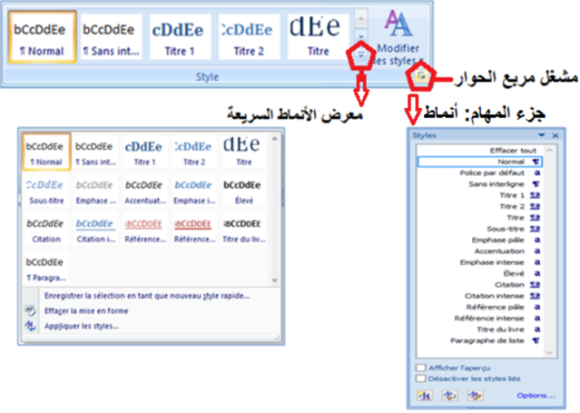
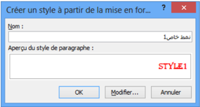
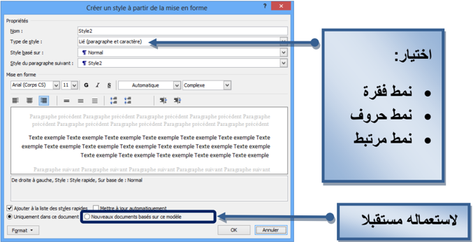
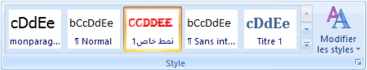
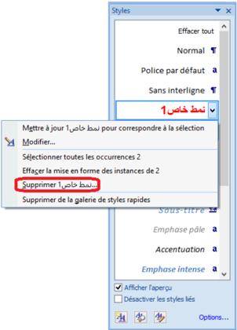
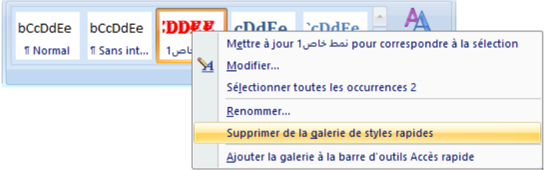
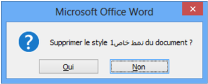
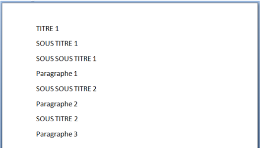

# الوحدة 7: الأنماط في Word
## المجال الثاني: المكتبية

---

## الأنماط في Word

### 1 الإشكالية

في جميع مستنداتي أريد إبراز بعض الكلمات الهامة فأختار لها تنسيقا خاصا: خطا مختلفا عن خط الفقرة، حجما مختلفا أيضا، لونا مميزا، ... داكنا، سميكا ومائلا، بحدود وتظليل

هل يوفر Word طريقة سريعة وبسيطة لهذا العمل؟ وإذا لم يكن هنالك نمط بهذه الخيارات هل أستطيع إنشاء نمط خاص؟ وهل يمكن حفظه لاستعماله لاحقا؟

### 2 ما هو النمط؟

عوضا عن استعمال التنسيق المباشر، نستخدم الأنماط لتطبيق مجموعة من خيارات التنسيق للحصول على مستند متناسق بسرعة وسهولة.

النمط مجموعة من خصائص التنسيق تُطبَّق معا دفعة واحدة.

تتنوع الأنماط في Word فمنها أنماط للحروف ومنها أنماط للفقرات ومنها أنماط للقوائم ومنها أنماط للجداول.

### 3 لماذا نستخدم الأنماط؟

- توفر الأنماط الوقت، فعوضا عن القيام بعدة عمليات للتنسيق نقوم بعملية واحدة.
- تمنح الأنماط للمستند مظهرا متناسقا.
- عند استخدام أنماط العناوين المُضمّنة في Word، يمكنه إنشاء جدول محتويات تلقائيا كما ينشئ مخطط المستند لتسهيل التنقل في المستندات الكبيرة.

### 4 أنماط الحروف والفقرات والأنماط المرتبطة

### أين نجد الأنماط؟

نجد أنماط الحروف والفقرات والأنماط المرتبطة في المجموعة نمط Style ضمن علامة التبويب الصفحة الرئيسية Accueil.

### كيف نميز الأنماط؟

ننقر فوق مشغل مربع الحوار نمط Style فيظهر جزء المهام أنماط Styles.

- الأنماط المسبوقة بالرمز هي أنماط فقرة. ننقر في أي مكان داخل الفقرة لتطبيق النمط على كامل الفقرة.
- الأنماط المسبوقة بالرمز a هي أنماط حروف. ننقر في أي مكان داخل الكلمة لتطبيق النمط على كامل الكلمة. يمكن تحديد جزء من كلمة أو عدة كلمات لتطبيق النمط عليها.
- الأنماط المسبوقة بالرمز a هي أنماط مرتبطة. تعمل كأنماط حروف وأنماط فقرات في نفس الوقت.

### تغيير الأنماط

- ننقر على Modifier les styles
- نضع المؤشر فوق Jeu de styles
- تظهر عدة أنماط نختار واحدا لإدراجه في معرض الأنماط السريعة ثم ننقر على خيارنا.

ملاحظة: يمكن تغيير الألوان من Couleurs والخطوط من Polices.

### أنماط الحروف

تتضمن أنماط الحروف خصائص تنسيق يمكن تطبيقها على النص، مثل: اسم الخط، حجمه، لونه، التنسيق غامق، مائل، تسطير والحدود والتظليل.

لا تشمل أنماط الحروف تنسيقا يؤثر على خصائص الفقرة، مثل تباعد الأسطر، محاذاة النص، المسافة البادئة وعلامات الجدولة.

#### لتطبيق نمط الحروف:

1. نحدد النص الذي نريد تنسيقه (حرف، كلمة بالنقر داخلها، عدة كلمات).
2. ننقر على نمط الحروف الذي نريد استعماله.

#### ملاحظة:

عند تمرير المؤشر فوق الأنماط السريعة تظهر معاينة للتنسيق في المستند. عندما نشير إلى نمط حروف، يتم تنسيق الكلمة التي نقرنا فوقها فقط. وعندما نشير إلى نمط فقرة أو نمط مرتبط، يتم تنسيق الفقرة بكاملها.

### أنماط الفقرة

زيادة على كل ما يتضمنه نمط الحروف، يتحكم نمط الفقرة بمظهرها، مثل محاذاة النص، علامات الجدولة، تباعد الأسطر، والحدود.

#### لتطبيق نمط فقرة:

1. نحدد الفقرات التي نريد تنسيقها (إذا كانت فقرة واحدة يكفي النقر داخلها).
2. ننقر على نمط الفقرة الذي نريد استعماله.

في مستند فارغ جديد، يطبّق Word تلقائيا نمط الفقرة "عادي Normal" على كل النص ويطبق النمط "سرد الفقرات" Paragraphe de liste على عناصر قائمة التعداد.

### الأنماط المرتبطة

تستجيب الأنماط المرتبطة إلى التحديد الذي نقوم به:

- فإذا حددنا فقرة (نقرنا داخلها) ثم طبقنا نمطا مرتبطا، فسيتم تطبيق النمط على كل الفقرة باعتباره نمط فقرة.
- وإذا حددنا كلمة أو جملة في فقرة ثم طبقنا نمطا مرتبطا، فسيتم تطبيق النمط على النص المحدد فقط باعتباره نمط حروف ولا تتأثر الفقرة ككل.

### 5 حفظ نمط فقرة سريع خاص

إذا كنا نستخدم تخطيطا خاصا للفقرات يمكن حفظه كنمط سريع واستخدامه:

- ننسق الفقرة كما نريد أن تظهر و نحدّدها (المؤشر داخلها)
- ننقر على
- ننقر على

Enregistrer la sélection en tant que nouveau style rapide

- ندخل اسما لحفظ النمط ثم ننقر على OK.

ملاحظة: إذا أردنا تغيير بعض الخصائص الأخرى، ننقر على Modifier فتظهر علبة حوار Créer un style à partir de le mise en forme كما في الصورة التالية:

نحدد خياراتنا ثم ننقر على OK.

سيظهر الآن النمط السريع الجديد مع الأنماط الأخرى

### 6 حذف نمط

### حذف النمط من معرض الأنماط السريعة فقط

- ننقر بالزر الأيمن على النمط في معرض الأنماط السريعة
- ننقر على Supprimer de la galerie de styles rapides

#### ملاحظتان:

1. يحذف النمط من معرض الأنماط السريعة لكنه يبقى موجودا في جزء المهام أنماط Styles.
2. إذا أردنا إجراء تعديلات فقط على النمط ننقر على Modifier.

### حذف النمط من جزء المهام أنماط Styles

- ننقر بالزر الأيمن على اسم النمط (مثلا في الصورة: نمط خاص).
- ننقر على Supprimer (مثلا في الصورة: نمط خاص 1).
- تظهر علبة حوار لتأكيد الحذف، ننقر على Oui.

ملاحظة: في هذه الحالة يحذف النمط نهائيا من المستند.

## تمارين

1. ما هي فوائد استعمال الأنماط مقارنة بالتنسيق المباشر؟
2. كُلفت بكتابة جزء من المصحف الشريف على أن يكون اسم الجلالة (الله) بتنسيق مختلف عن خط الكتابة، فيكون بلون أخضر، سميكا، مائلا.
- ما أفضل طريقة لتحقيق المطلوب؟
- حقق المطلوب بإنشاء نمط وتطبيقه على بعض الآيات (يطبق النمط أيضا على كلمات مثل: تالله، بالله).
3. أنشئ نمطا لفقرة لاستعماله في مستنداتك لاحقا. كيف تحفظ هذا النمط؟
4. لديك مستند جاهز، تريد من Word أن ينشئ له جدولا للمحتويات تلقائيا. ما الخطوات التي تتبعها؟
5. في الصورة، تريد تنسيق المستند "هيكل" بتطبيق أنماط سريعة:
- أ. اكتب المحتوى في مستند جديد.
- ب. استعمل الأنماط السريعة لتنسيق هذا المستند كما يلي:
- غير الأنماط السريعة إلى Moderne.
- استعمل Normal للفقرات.
- استعمل Titre 1 للعناوين الرئيسية.
- استعمل Titre 2 للعناوين الفرعية (Sous Titre 1، Sous Titre 2).
- استعمل Titre 3 للعناوين الأعمق (Sous Sous Titre 1، Sous Sous Titre 2).

### صورة للمستند الناتج:

- ت. أعد التنسيق بتطبيق أنماط سريعة أخرى من اختيارك.
