# الوحدة 8: القوالب في Word
## المجال الثاني: المكتبية

---

## القوالب في Word

### الكفاءات المستهدفة

- يدرك المتعلم مفهوم القوالب.
- يتمكن من استخدام القوالب الجاهزة.
- يتمكن من إنشاء قالب من مستند.
- يتمكن من تغيير قالب وحفظه.

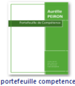

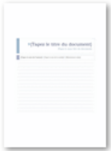


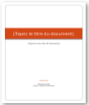

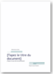


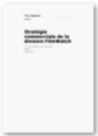

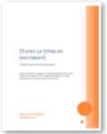

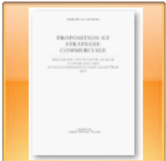

## القوالب في Word

### 1 الإشكالية

طلب منك مدير مؤسسة المساعدة في حل الإشكالية التالية:

كلما أراد أن يبعث رسالة إلى أحد زبائنه إلا وأعاد إدخال: اسم المؤسسة، العنوان البريدي، الهاتف، الفاكس، العنوان الإلكتروني، رمز المؤسسة، تاريخ المراسلة، العبارات التي تتكرر في الرسالة

فهل يمكن أن تثبت هذه المعلومات في الرسالة وتصبح مهمته إدخال النصوص المتغيرة فقط؟

### 2 مفهوم القالب

القالب نوع من المستندات، يُنشئ نسخة لنفسه عند فتحه.

- كل مستند Word يعتمد على قالب.
- القالب الافتراضي في Word هو Normal.dotm.
- يحتوي القالب على الخط المستعمل، حجمه، نمط الفقرات، أنماط العناوين، الهوامش ... وقد يحتوي أيضا على نصوص ثابتة وأنماط خاصة.

### 3 أين نجد القوالب؟

افتراضيا تحفظ القوالب داخل المجلد:

```
C:\Utilisateurs\nom_utilisateur\AppData\Roaming\Microsoft\Templates
```

لكن يمكن حفظ القوالب في أي مكان (سطح المكتب، مجلد، قرص فلاش ...) حتى نستطيع استخدام القالب على أي جهاز.

### 4 إنشاء مستند جديد من قالب موجود

يسمح لنا معالج النصوص Word بإنشاء مستندات جديدة باستخدام قوالب جاهزة.


#### الطريقة الأولى:


1. ننقر على الزر Microsoft Office ثم ننقر على Nouveau.
2. أسفل Modèles نجد عدة خيارات:
- إذا أردنا استخدام قالب موجود على جهاز الحاسوب، ننقر على:
- Modèles Installés.
- إذا أردنا تنزيل قالب، ننقر على أحد الارتباطات الموجودة أسفل Microsoft Office Online، مثل Curriculum-vitae، Lettres، Diplômes (يجب أن يكون الحاسوب متصلا بالإنترنت).
3. ننقر نقرا مزدوجا على القالب المختار.

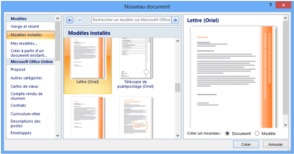

#### الطريقة الثانية:

إذا كان ملف القالب موجودا في مجلد خاص، على سطح المكتب أو في مفتاح USB:

1. ننقر بالزر الأيمن للفأرة على ملف القالب.
2. ننقر على Nouveau.
3. يفتح مباشرة مستند جديد من هذا القالب.

### 5 إنشاء قالب

#### إنشاء قالب من مستند

- نفتح المستند الذي سيكون أساسا للقالب، أو ننشئ مستندا جديدا ونجري عليه التنسيقات التي نريد أن يحتويها القالب.
- نحفظه على شكل قالب، كما يلي:

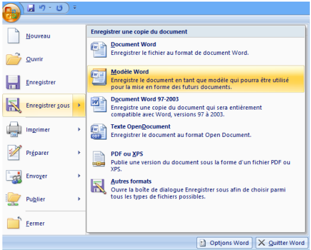

- ننقر على زر Microsoft Office.
- نختار حفظ باسم Enregistrer sous.
- ننقر على Modèle Word.


تظهر علبة حوار، نختار مكان الحفظ، نكتب اسما للقالب في مربع اسم الملف، ثم ننقر على Enregistrer.


- نغلق القالب.

#### إنشاء قالب من قالب موجود

- نفتح القالب الذي نريد تغييره
- نجري التغييرات
- نحفظه على شكل قالب. (كما رأينا سابقا)
- نغلق القالب.

### 6 حل الاشكالية:

لحل الإشكالية المطروحة أعلاه ننشئ قالبا:

#### إنشاء قالب "الرسالة"

1. ننشئ مستندا جديدا في Word. لاحظ في شريط العنوان Document x - Microsoft Word حيث x عدد.
2. نقوم بكتابة النصوص الثابتة في الرسالة وتنسيقها.

رأس الرسالة: اسم المؤسسة مع الرمز (مثلا صورة من معرض الصور)، العنوان البريدي، الهاتف، الفاكس، البريد الإلكتروني، اسم المدينة والتاريخ.

النصوص الثابتة: إلى السيد/، الموضوع، تقبلوا فائق التقدير والاحترام، المدير.

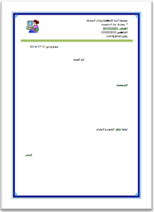

#### يمكن أن ننسّقها على الرسالة كما يلي:

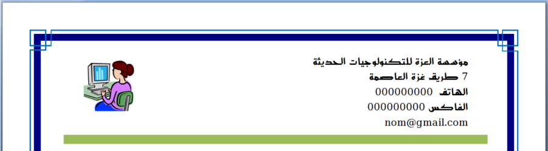

#### ملاحظة:

#### إنهاء الفقرة أو الرجوع إلى السطر؟

لاحظ الكتابة على اليمين ومثيلتها على اليسار. كلا الكتابتين كُتبت بنفس الخط ونفس الحجم لكن: الكتابة على اليمين استهلكت مساحة أكبر على الرسالة، وهذا لأن:

- كل سطر في الكتابة على اليمين يعتبر فقرة لأننا أنهيناه بـ Entrer.
- الأسطر الخمسة في الكتابة على اليسار تمثل فقرة واحدة لأننا أنهينا كل سطر بـ: رجوع إلى السطر Maj + Entrer.

لإظهار كل العلامات والرموز المخفية، ننقر على الأمر Afficher tout من المجموعة Paragraphe.

يُمثَّل الضغط على المفتاح Entrer بالرمز .

يُمثَّل الضغط على المفتاحين Maj + Entrer بالرمز ↵.

يمكن أن ننسّقها أسفل الرسالة كما يلي:

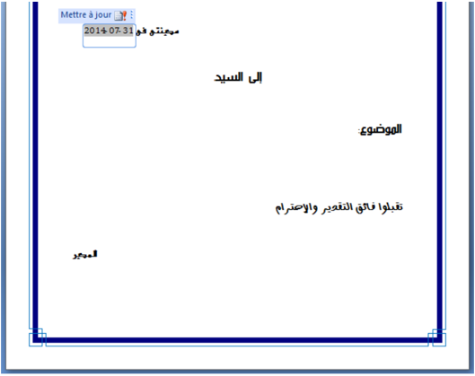

نكتب النصوص التي لا تتغير وننسّقها، وندرج التاريخ.

#### ملاحظة:

#### كيف يُحيّن التاريخ تلقائيا كلما كتبنا رسالة؟


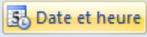

1. ننقر على التبويب إدراج Insertion.
2. في المجموعة Texte، ننقر على الأمر.
3. تظهر علبة حوار Date et heure، نختار نوع التاريخ، ننشط Mettre à jour automatiquement، ثم ننقر على OK.

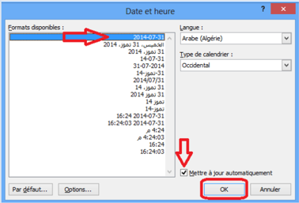

4. نحفظ المستند الجديد على شكل قالب:
- ننقر على زر Microsoft Office.
- نختار حفظ باسم Enregistrer sous.
- ننقر على Modèle Word.
- تظهر علبة حوار Enregistrer sous.


نختار مكان الحفظ Bureau.

نكتب اسم القالب "رسالة.dotx" في مربع Nom de Fichier.

نلاحظ أن مربع النوع Type به Modèle Word (*.dotx).

ثم ننقر على Enregistrer.

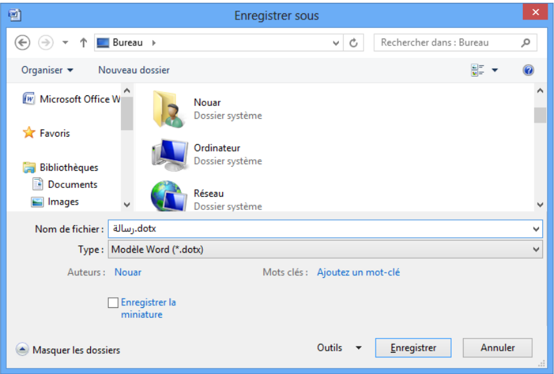

نلاحظ أن شريط العنوان أصبح "رسالة.dotx"، أي أننا حصلنا على قالب.

(القوالب من الشكل "اسم_القالب.dotm" تكون الماكروات فيها مُنشَّطة).

5. نغلق المستند بالنقر على الزر.
6. نجد فوق سطح المكتب الملف التالي جاهزا للاستعمال.

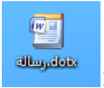

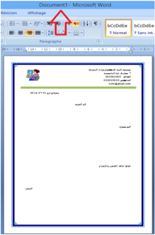


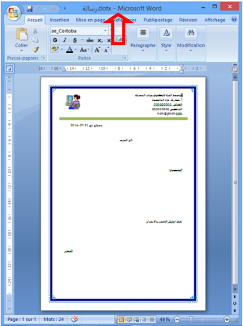

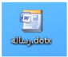

### إنشاء مستند من قالب "الرسالة"

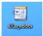

- ننقر نقرا مزدوجا على القالب.
- ينشئ القالب نسخة لنفسه.

(لاحظ شريط العنوان: Document x - Microsoft Word، ولاحظ المحتوى).

#### ملاحظة:

يمكن إنشاء المستند بالنقر بالزر الأيمن على القالب ثم النقر على Nouveau.

### تغيير قالب "الرسالة"


- ننقر بالزر الأيمن على القالب.
- ننقر على Ouvrir.
- يفتح القالب، نجري التغييرات عليه ثم نحفظه.

(لاحظ شريط العنوان: رسالة.dotx - Microsoft Word).

## تمارين

### التمرين 1

- س1: ما الفائدة من استعمال القوالب؟
- س2: اختر الإجابة الصحيحة: كيف أعرف القالب الذي يعتمد عليه مستند Word؟
 - [ ] من خصائص المستند.
 - [ ] لا نستطيع معرفة القالب.
 - [ ] القالب هو دوما القالب الافتراضي Normal.dotm.

### التمرين 2

#### لاحظ الكتابة التالية:

بعملية واحدة نريد أن تكون الجملة بالفرنسية في السطر الثاني دون أن تكون عنصرا من القائمة. كيف نحقق هذا؟

### التمرين 3

طُلِب منك كتابة سيرة ذاتية (C.V) للمشاركة في مسابقة توظيف بمؤسسة عالمية. كيف تلبي هذا الطلب باستعمال القوالب الجاهزة للسير الذاتية التي يوفرها Word؟

### التمرين 4

أنشئ قالبا لشهادة مدرسية لمؤسستك.

### التمرين 5

أنشئ قالبا لوصفة طبية لطبيب أخصائي، وأدرج تاريخا يُحيَّن تلقائيا.
