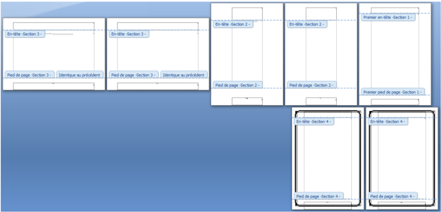
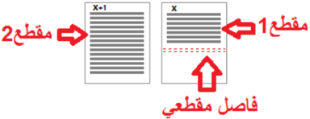
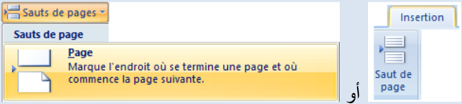
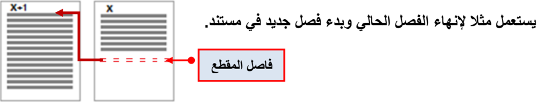
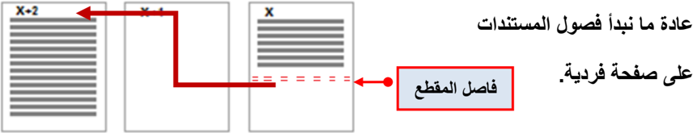
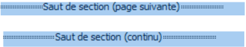
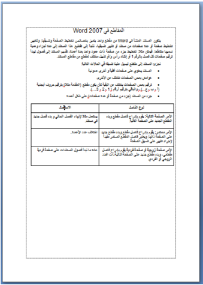

# الوحدة 9: المقاطع في Word
## المجال الثاني: المكتبية

---

## المقاطع في Word

### الكفاءات المستهدفة

- يدرك المتعلم مفهوم المقاطع.
- يتمكن من إنشاء مقاطع بتخطيط صفحات وتنسيقات مختلفة.

### 1 الإشكالية

كُلفت بإنجاز بحث من سبع صفحات حول المقاطع في Word حيث:

الصفحة الأولى:

باتجاه عمودي، هوامش مخصصة وهي بدون ترقيم.

الصفحتان الثانية والثالثة: باتجاه عمودي وترقيم أ، ب.

الصفحتان الرابعة والخامسة: باتجاه أفقي وترقيم 1، 2.

- الصفحتان السادسة والسابعة: باتجاه عمودي، لها حدود وترقيم يتبع السابق.

كيف يمكن تغيير اتجاه بعض الصفحات فقط في المستند؟

كيف نحصل على صفحات مختلفة التنسيق في نفس المستند؟

### 2 مفهوم المقطع Section

يحتوي المستند المنشأ في Word على مقطع واحد يتميز بخصائص تخطيط الصفحة وتنسيقها.

لتغيير تخطيط صفحة أو عدة صفحات من مستند أو تغيير تنسيقها، نلجأ إلى تقطيع هذا المستند إلى عدة أجزاء وهمية نسميها مقاطعا.

نستعمل المقاطع للحصول على صفحات مختلفة التنسيق والإعدادات داخل مستند واحد.

#### فيمكن مثلا:

- تخطيط جزء من صفحة ذات عمود واحد بعدة أعمدة.
- تقسيم المستند إلى فصول ليبدأ ترقيم صفحات كل فصل بالرقم 1.
- إنشاء رأس و/أو تذييل مختلف لمقطع من مقاطع المستند.

### 3 متى نجزئ المستند إلى مقاطع؟

نجزئ المستند إلى مقاطع ليسهل علينا تنسيقه في الحالات التالية:

- المستند يحتوي على صفحات أفقية وأخرى عمودية.
- هوامش بعض الصفحات تختلف عن الأخرى.
- رؤوس وتذييلات بعض الصفحات مختلفة أو بعض الصفحات بدون رؤوس وتذييلات.
- ترقيم بعض الصفحات يختلف عن البقية، كأن يكون مقطع (المقدمة مثلا) بترقيم حروف أبجدية (أ، ب، ج ...)، والباقي بترقيم أرقام (1، 2، 3 ...).
- جزء من المستند (جزء من صفحة أو عدة صفحات) على شكل أعمدة.
- ...

### 4 إنشاء مقطع

#### 1 إدراج فاصل مقطع

1. ننقر حيث نريد بدء المقطع.
2. في علامة التبويب Mise en page، في المجموعة Mise en page:
- ننقر على Sauts de pages.
3. في مجموعة الأوامر Sauts de section، ننقر على نوع فاصل المقطع الذي نريد.

#### 2 مبدأ عمل الفواصل المقطعية

- عند إدراج فاصل مقطع، فإنه يفرق بين الصفحات السابقة والصفحات اللاحقة، ويسمّي السابقة مقطع 1 والصفحات اللاحقة مقطع 2.
- يمكننا تنسيق أبعاد وهوامش صفحات المقطع الأول دون أن تتأثر أبعاد وهوامش صفحات المقطع الثاني.
- يتحكم فاصل المقطع في تنسيق مقطع النص الذي يسبقه.
- عند حذف فاصل المقطع في الصورة السابقة، فإننا نحذف أيضا تنسيق النص في المقطع الأول، ويصبح النص جزءا من المقطع الثاني ويتبعه في التنسيق.

#### ملاحظة:

#### فاصل صفحات أو فاصل مقطعي؟

- نستعمل فاصل الصفحات إذا أردنا الانتقال إلى الصفحة التالية دون إجراء تغيير لا في تخطيط الصفحة ولا في تنسيقها.
- نستعمل الفواصل المقطعية إذا أردنا إجراء تغيير في تخطيط الصفحة و/أو في تنسيقها بالنسبة للصفحات التالية.

#### 3 أنواع الفواصل المقطعية

- الأمر "الصفحة التالية" Page suivante: يقوم بإدراج فاصل مقطع وبدء المقطع الجديد على الصفحة التالية.
- الأمر "مستمر" Continu: يقوم بإدراج فاصل مقطع وبدء مقطع جديد على الصفحة ذاتها.
- الأمر "صفحة زوجية" Page paire أو "صفحة فردية" Page impaire: يقوم بإدراج فاصل مقطع، وبدء مقطع جديد على الصفحة التالية ذات العدد الزوجي أو الفردي.

### رؤوس وتذييلات الصفحات

- رؤوس وتذييلات صفحات المقطع الثاني تبقى متصلة مع رؤوس وتذييلات صفحات المقطع الأول وتتغير بتغيّرها. لاحظ الصورة:
- لكي نجعل لكل مقطع رأس صفحات مخصص:

1. نضع المؤشر في رأس صفحة من صفحات المقطع الثاني.
2. ضمن التبويب تصميم Création،
- وفي المجموعة Navigation نلغي تنشيط الأمر Lier au précédent.

- بطريقة مماثلة نجعل لكل مقطع تذييل صفحات مخصّص.
- رؤوس الصفحات غير مرتبطة بتذييلاتها، فيمكن الحصول مثلا على رؤوس متماثلة لكل المقاطع مع اختلاف التذييلات من مقطع لآخر.

### 5 حذف فاصل مقطع

#### لإظهار فاصل المقطع:

- ننقر على علامة التبويب Affichage.
- ضمن المجموعة Affichages document ننقر على Brouillon.

يظهر فاصل المقطع على شكل خط منقط مزدوج.

ملاحظة: يمكن إظهار فاصل المقطع أيضا بالنقر على الزر Afficher tout من المجموعة Paragraphe.

#### لحذف فاصل المقطع:

- نحدد فاصل المقطع الذي نريد حذفه.
- نضغط على المفتاح Suppr.

#### ملاحظات:

#### المقاطع في Word 2007

يتكون المستند المنشأ في Word من مقطع واحد يتميز بخصائص تخطيط الصفحة وتنسيقها. ولتغيير تخطيط صفحة أو عدة صفحات من مستند أو تغيير تنسيقها، نلجأ إلى تقطيع هذا المستند إلى عدة أجزاء وهمية نسميها مقاطعا. فيمكن مثلا: تخطيط جزء من صفحة ذات عمود واحد بعدة أعمدة، تقسيم المستند إلى فصول ليبدأ ترقيم صفحات كل فصل بالرقم 1، أو إنشاء رأس و/أو تذييل مختلف لمقطع من مقاطع المستند.

نجزئ المستند إلى مقاطع ليسهل علينا تنسيقه في الحالات التالية:

- المستند يحتوي على صفحات أفقية وأخرى عمودية.
- هوامش بعض الصفحات تختلف عن الأخرى.
- ترقيم بعض الصفحات يختلف عن البقية، كأن يكون مقطع (المقدمة مثلا) بترقيم حروف أبجدية (أ، ب، ج ...)، والباقي بترقيم أرقام (1، 2، 3 ...).
- جزء من المستند (جزء من صفحة أو عدة صفحات) على شكل أعمدة.

| نوع الفاصل | الاستعمال |
|------------|-----------|
| الأمر "الصفحة التالية" Page suivante | يقوم بإدراج فاصل مقطع وبدء مقطع جديد على الصفحة التالية. يستعمل مثلا لإنهاء الفصل الحالي وبدء فصل جديد في المستند. |
| الأمر "مستمر" Continu | يقوم بإدراج فاصل مقطع وبدء مقطع جديد على الصفحة ذاتها. يعتبر مفيدا لإجراء تغيير على تنسيق الصفحة أو اختلاف عدد الأعمدة. |
| الأمر "صفحة زوجية" أو "صفحة فردية" Page paire / Page impaire | يقوم بإدراج فاصل مقطع وبدء مقطع جديد على الصفحة التالية ذات العدد الزوجي أو الفردي. ما نبدأ به عادة فصول المستندات. |

#### نهاية الصفحة

## تمارين

### التمرين 1

1. ما هي فوائد تجزئة المستند إلى مقاطع؟
2. ما الفرق بين فاصل الصفحة وفاصل المقطع؟
3. اذكر أنواع فواصل المقاطع.

### التمرين 2

إليك محتويات صفحة في Word:

#### بداية الصفحة

#### المطلوب:

- اكتب هذه الصفحة في Word.
- أجر عليها التعديلات اللازمة (تنسيق، تخطيط صفحة، إدراج فواصل صفحات، إدراج فواصل مقاطع ...) حتى تحصل على النتيجة كما في الصورة التالية:

#### صورة الصفحة قبل التعديل

#### صورة الصفحة بعد التعديل

حيث نحصل على ثلاث صفحات: الأولى والثانية باتجاه عمودي والثالثة باتجاه أفقي، كما أن الصفحة الثانية بها مقطعان الأول بعمودين والثاني بعمود واحد.

