# الوحدة 10: دمج المراسلات
## المجال الثاني: المكتبية
### المدة الزمنية: 02 ساعة

---

## دمج المراسلات Publipostage

### الكفاءات المستهدفة

- يدرك المتعلم مفهوم دمج المراسلات وأهميته.
- يتمكن من تطبيق عملية دمج المراسلات.
- يتمكن من الإدراج المشروط لنص.
- يتمكن من تصفية البيانات.

### 1 دمج المراسلات

#### 1 الإشكالية

قررت إدارة ثانويتك تقديم جوائز وإنجاز شهادات تقدير للطلاب المتحصلين على معدلات جيدة. يتكون نص الشهادة من جزء ثابت وجزء متغير حسب اسم ولقب الطالب، قسمه، ومعدله. ولكون العدد كبيرا يصعب ملء هذه الشهادات بالطريقة التقليدية، اقترح على الإدارة حلا لإنجاز هذا العمل بطريقة أسرع وبجهد أقل، علما أن للإدارة ملفا معلوماتيا لكل التلاميذ المتفوقين.

الشهادة حيث يظهر النص المشترك، والفراغات التي تُملأ حسب كل طالب:

#### جزء من ملف الطلاب:

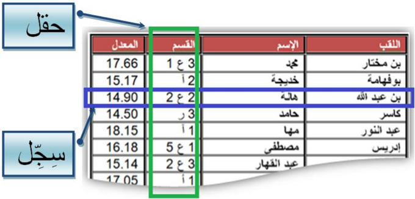

#### 2 دمج المراسلات

يوفر معالج النصوص طريقة مناسبة أكثر لحل هذا النوع من الإشكاليات هي: دمج المراسلات. تسهل هذه الطريقة عملية إرسال العديد من الرسائل المتشابهة إلى العديد من المستلمين.

الهدف من دمج المراسلات هو إنشاء رسائل شخصية لقائمة من المستلمين.

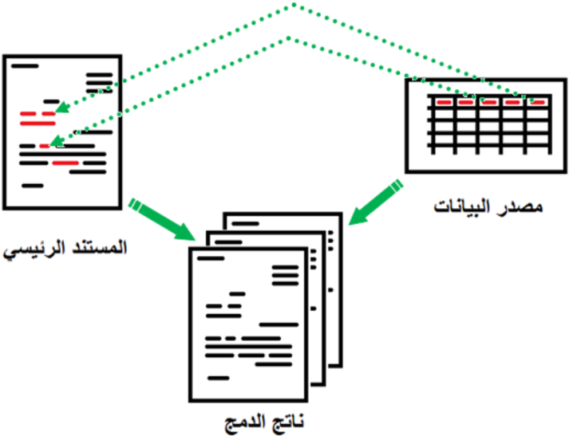

#### 3 تنفيذ عملية دمج المراسلات

لتنفيذ عملية دمج المراسلات نحتاج إلى:

- الوثيقة الأولى تحتوي على بيانات المستلمين (المرسل إليهم) ونسميها مصدر البيانات.
- الوثيقة الثانية وهي الرسالة النموذج ونسميها المستند الرئيسي وتحتوي على الجزء الثابت الذي تشترك فيه كل الرسائل.

ينتج عن دمج المستند الرئيسي مع مصدر البيانات مستندا ثالثا يمكن أن يكون:

- رسائل شخصية
- رسائل إلكترونية
- ملصقات Etiquettes
- ظروف بريدية Enveloppes
- دليل Répertoire

#### مصدر البيانات

في المثال الحالي مصدر البيانات هو جدول في معالج النصوص Word، ويمكن أن يكون جدولا في مصنف Excel أو في قاعدة بيانات Access أو قائمة عناوين في Outlook.

يمكن أن يكون ملف مصدر البيانات موجودا قبل بدء عملية دمج المراسلات، كما يمكن إنشاؤه خلال العملية نفسها.

#### المستند الرئيسي

ننشئ وثيقة في Word، تحتوي على كل المعلومات المشتركة في الشهادة ونترك فراغات للمعلومات المتغيرة حسب الطالب.

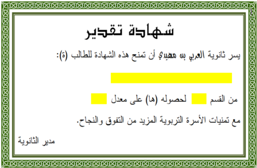

#### خطوات عملية الدمج

1. ننقر على علامة التبويب Publipostage.
2. ننقر على Démarrer la fusion et le publipostage ثم على Lettres، لتأكيد أننا بصدد إنشاء رسائل.
3. ننقر على Sélection des destinataires.

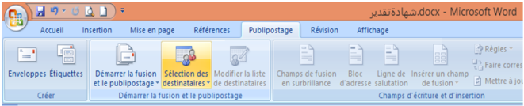

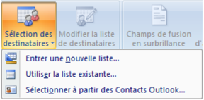

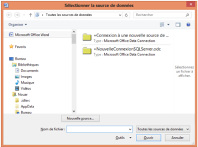

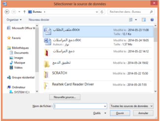

4. تنسدل قائمة، ننقر على Utiliser la liste existante…

5. تظهر علبة حوار لاختيار مصدر البيانات.
6. ننتقل إلى مكان وجود ملف مصدر البيانات - في المثال الحالي المكان هو سطح المكتب واسم الملف هو "ملف_الطلاب.docx" - نحدده ثم ننقر على Ouvrir.

ظاهريا لم يحدث شيء، لكن حدث ربط بين المستند الرئيسي ومصدر البيانات، وهذا ما سنلاحظه في الخطوة التالية.

7. نضع مؤشر الكتابة في المكان الذي سندرج فيه اللقب.
8. ننقر على Insérer un champ de fusion.

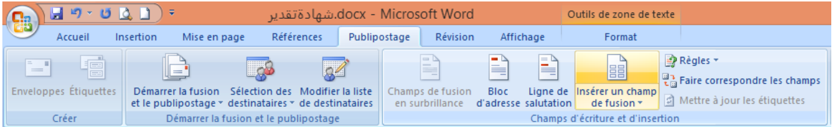

9. تنسدل قائمة، ننقر على اللقب.

فيدمج الحقل "اللقب" في المستند الرئيسي ويظهر على الشكل: «اللقب». وبطريقة مماثلة ندرج كل الحقول الأخرى، كل في مكانه.

بعد إكمال هذه العملية يصبح المستند الرئيسي كما في الشكل المقابل.

يمكن إضافة التنسيقات للحقول المدرجة. فمثلا نحدد «اللقب» ... ونغير الخط والحجم واللون.

10. لمعاينة النتيجة ننقر على Aperçu des résultats.

ننتقل من مستلم لآخر باستعمال الأزرار

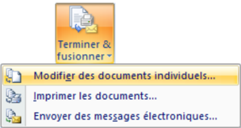

11. لإتمام عملية الدمج ننقر على Terminer & fusionner، تنسدل قائمة، ننقر على Modifier des documents individuels…

- تظهر علبة حوار لاختيار كل السجلات في عملية الدمج أو بعضها فقط. نختار Tous ثم ننقر على OK.
- تتم عملية الدمج في ملف جديد افتراضيا باسم Lettres1.

فنحصل على الناتج كما في الصورة التالية:

(في نهاية كل صفحة يدرج Word فاصلا للصفحات).

- إذا كانت نتيجة الدمج مُرضية، نقوم بعملية الطباعة (لا يلزم حفظ الملف).

- ننقر على Terminer & fusionner.
- ننقر على Imprimer les documents….

### 2 الإدراج المشروط لنص

#### 1 الإشكالية

لم يستسغ أستاذ اللغة العربية الكتابتين التاليتين الواردتين في الشهادة: "الطالب(ة)" و"لحصوله(ها)". فطلب منك أن تكون شهادة الطالب بالصيغة المذكرة وشهادة الطالبة بالصيغة المؤنثة، مذكرا إياك أن للإدارة ملفا بصيغة Excel للطلبة به حقل يشير إلى جنس الطالب. انظر الصورة:

#### شهادة الطالبة

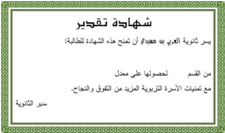

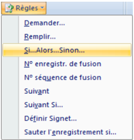

#### ملف الطلبة بصيغة Excel

#### 2 تنفيذ الإدراج المشروط لنص تلقائيا

#### شهادة الطالب

#### "للطالب" / "للطالبة"

1. نفتح المستند الرئيسي.
2. ننقر على علامة التبويب Publipostage.
3. ننقر على Règles.
4. ثم على Si…Alors…Sinon….

- تظهر علبة حوار Insérer le mot clé.
- من Nom du champ نختار حقل الجنس.
- من Élément de comparaison نختار est égal à.
- من Comparer avec نكتب: أ.
- في خانة Insérer le texte suivant نكتب: ة، كما يبدو على الصورة.

الحرف "ة" لن يكون بنفس تنسيق كلمة للطالب، لذلك وجب تنسيقه.

- بعد حرف الباء من كلمة للطالب ننقر على زر المسافة لإدخال فراغ.
- ننقر على كلمة للطالب.
- ننقر على علامة التبويب Accueil، ثم ننقر على Reproduire la mise en forme.
- نحدد الفراغ السابق ليصبح بنفس تنسيق كلمة الطالب، وهو مكان إدراج الحرف ة إذا كان جنس الطالب أ (أنثى).

#### "لحصوله" / "لحصولها"

بطريقة مماثلة يمكن إضافة الحرف ا للكلمة "لحصوله" إذا كانت الشهادة لطالبة.

نعيد دمج المستند الرئيسي المعدل مع مصدر البيانات الجديد، فنحصل على شهادات تقدير مخصّصة:

للذكور: يسر ثانوية العربي بن مهيدي ... أن تمنح هذه الشهادة للطالب لحصوله ...

للإناث: يسر ثانوية العربي بن مهيدي ... أن تمنح هذه الشهادة للطالبة لحصولها ...

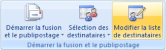

### 3 تصفية مصدر البيانات

#### 1 الإشكالية

اتصل بك مدير المؤسسة مبديا أسفه لأنه لا يستطيع توفير جوائز لكل التلاميذ المتفوقين، لذلك يتوجب إنجاز شهادات تقدير للحاصلين على معدل أكبر من أو يساوي 15 من 20 فقط.

علينا في هذه الحالة تصفية مصدر البيانات، فكيف يكون ذلك؟

#### 2 عملية التصفية

1. نفتح المستند الرئيسي.
2. ننقر على علامة التبويب Publipostage.
3. ننقر على Modifier la liste de destinataires.
4. ننقر على Filtrer.

تظهر علبة حوار: Fusion et publipostage: Destinataires.

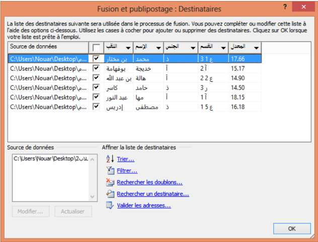

- إذا كان عدد المستلمين صغيرا، يمكن إجراء عملية التصفية يدويا باستخدام مربعات الاختيار.
- يمكن فرز قائمة المستلمين باستخدام Trier.

#### تظهر علبة حوار أخرى: Option de requête

- في Champ نختار الحقل «المعدل».
- في Élément de comparaison نختار est supérieur ou égal à.
- في Comparer avec ندخل القيمة 15.

- ننقر على OK فتتم تصفية البيانات، ونحصل على السجلات التي تحقق الشرط:

- "المعدل أكبر من أو يساوي 15" فقط.

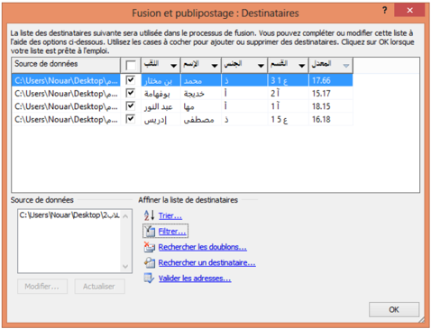

ثم نكمل عملية الدمج.

## تمارين

### التمرين 1

1. أنشئ جدولا في Excel لأصدقائك حيث:
2. املأ الجدول بمعلومات من طرفك (لا يقل عدد الأصدقاء عن 10 موزعين على مدن مختلفة).
3. أنشئ في معالج النصوص مستندا رئيسيا لدعوة أصدقائك لحضور حفل نجاحك.
4. استعمل دمج المراسلات للحصول على كل الدعوات.
5. طرأ طارئ مما يستدعي اقتصار الدعوة على الأصدقاء الذين يسكنون في مدينتك. كيف تفعل؟

- العمود A: اسم ولقب الصديق.
- العمود B: المدينة التي يقيم بها.

### التمرين 2: الظروف البريدية

املأ الجدول أدناه (أهل، أصدقاء، زملاء...)، ثم باستخدام دمج المراسلات، أنشئ ظروفا بريدية للمستلمين.

| الدولة | الرمز البريدي | العنوان البريدي | الاسم واللقب | الصفة |
|--------|---------------|-----------------|--------------|-------|
|        |               |                 |              | السيد |
|        |               |                 |              | السيدة |
|        |               |                 |              | الآنسة |

قد يبدو الظرف على الشكل التالي:

### التمرين 3: الملصقات

اقترب موعد الامتحان ولم تتم كتابة الملصقات التي ستلصق على طاولة كل ممتحن حاملة: اسمه، لقبه ورقم تسجيله. وبما أن العدد يقارب 100 فلن تكون العملية يدوية، اقترح حلا. (يفترض وجود ملف إلكتروني للطلاب).
