# الوحدة 11: الصيغ والدوال في Excel
## المجال الثاني: المكتبية

---

## الصيغ والدوال في Excel

### الكفاءات المستهدفة

- يدرك المتعلم مفهوم الصيغة، مفهوم الدالة والفرق بينهما.
- يتمكن من كتابة صيغ واستعمال دوال بسيطة لحل مشكلة.
- يتمكن من استعمال الدالة SI.

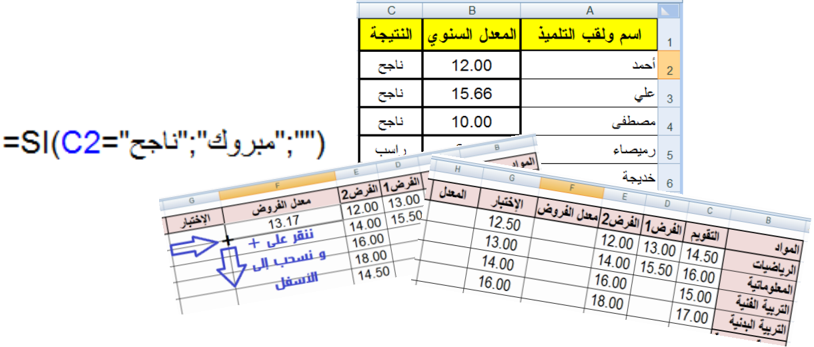

### 1. الإشكالية 1

يوجد في كشف نقاط التلميذ نوعان من المواد الدراسية:

- أساسية: يُقوَّم فيها التلميذ بفرضين.
- غير أساسية: يُقوَّم فيها التلميذ بفرض واحد.

قد يبدو جزء من هذا الكشف على الشكل التالي:

#### لحساب معدل الفروض:

- إذا كانت المادة أساسية نجمع النقاط الثلاثة "التقويم"، "الفرض 1"، "الفرض 2" ثم نقسم هذا المجموع على 3.
- إذا كانت المادة غير أساسية نجمع نقطتي "التقويم" و"الفرض 1"، ثم نقسم المجموع على 2.

هل نستعمل صيغة ثم ننسخها؟ أم نستعمل دالة؟

### 2. هل أستعمل صيغة أم دالة؟

- ما هي الصيغة؟

الصيغة عبارة حسابية و/أو منطقية، يقوم المجدول بحساب نتيجتها تلقائيا بعد كتابتها والضغط على المفتاح Entrer.

الدوال صيغ جاهزة مُضمَّنة في البرنامج يمكن استخدامها بسرعة وسهولة.

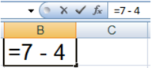

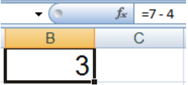

- ما هي الدالة؟

#### أمثلة

مثال 1: يمكن أن تحتوي الصيغة أعدادا وعمليات حسابية فقط.

- في الخلية B1 نكتب الصيغة =7-4. لاحظ أن ما كتبناه يظهر في شريط الصيغة.
- نضغط على المفتاح Entrer.
- يحسب المجدول نتيجة الصيغة تلقائيا. لاحظ أن محتوى الخلية B1 هو النتيجة 3.

مثال 2: يمكن أن تحتوي الصيغة عبارة منطقية وتكون نتيجتها إما "صح" VRAI وإما "خطأ" FAUX. عبارة الصيغة: محتوى الخلية A5 أكبر من محتوى الخلية B5.

مثال 3: يمكن أن تحتوي الصيغة مراجع للخلايا.

#### حساب محيط مستطيل:

- محتوى الخلية A2 قيمة الطول.
- محتوى الخلية B2 قيمة العرض.

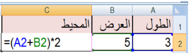

لحساب محيط هذا المستطيل ووضع قيمته في الخلية C3 نتبع الخطوات التالية:

- 1. في الخلية C3 نكتب =.
- 2. ننقر على الخلية A2.
- 3. نكتب +.
- 4. ننقر على الخلية B2.
- 5. نكتب ) * 2 ثم نضغط على Entrer.

ملاحظة: إذا غيرنا مثلا قيمة الخلية A2 فإن النتيجة في الخلية C3 تتغير تلقائيا.

#### مراجعة:

#### أولويات العمليات الحسابية من الأقوى إلى الأضعف:

- الأقواس ().
- الأس ^.
- الجداء *، القسمة /، والأفضلية من اليسار إلى اليمين.
- الجمع +، الطرح -، والأفضلية من اليسار إلى اليمين.

#### مثال 4: حساب متوسط القيم الموجودة في النطاق A1:A10

- الحل 1: باستعمال الصيغة: =(A1+A2+A3+A4+A5+A6+A7+A8+A9+A10)/10

بالتأكيد من الأفضل استعمال الدوال:

- الحل 2: باستعمال دالة المجموع: =SOMME(A1:A10)/10

- الحل 3 وهو الأفضل: استعمال دالة الوسط الحسابي: =MOYENNE(A1:A10)

#### من فوائد استعمال الدوال: تبسيط الصيغ

#### مراجعة:

#### الدالة SOMME: دالة المجموع

- =SOMME(A1;C3:D12;2): جمع محتوى الخلية A1 ومحتوى خلايا النطاق C3:D12 والقيمة 2.
- =SOMME(E:E): جمع محتويات خلايا العمود E.

ألا يؤدي استخدام كل العمود كنطاق في دالة إلى بطء العمليات الحسابية؟

هذا الاعتقاد غير صحيح، لأن Excel يتعقب آخر خلايا العمود التي تم استخدامها ولن يستخدم الخلايا التي تقع بعدها عند حساب نتيجة الصيغة.

- نضغط على المفتاح Entrer.

#### الدالة MOYENNE: الوسط الحسابي

- =MOYENNE(A1:D20): جمع الأعداد الموجودة في النطاق A1:D20 وقسمتها على عدد هذه الأعداد.
- =MOYENNE(E:E): الوسط الحسابي لأعداد العمود E.

### حل الإشكالية 1

#### حساب معدل الفروض

نريد جمع محتويات الخلايا C7، D7، E7 ونضع الناتج في الخلية F7.

#### الخطوات:

- 1. في الخلية F7 نكتب = ثم القوس (.
- 2. ننقر على الخلية C7 ثم نكتب +.
- 3. ننقر على الخلية D7 ثم نكتب +.
- 4. ننقر على الخلية E7.
- 5. ندخل رمز القسمة / ثم 3.

نحصل على معدل الرياضيات 13.17.

لنسخ الصيغة ولصقها نستعمل مقبض التعبئة (+) ونسحب إلى الأسفل.

#### النتيجة:

بالنسبة للمواد الأساسية نحصل على نتائج صحيحة. لكن بالنسبة للمواد غير الأساسية فإن النتائج تكون خاطئة، إذ سنجمع قيمتين فقط ونقسم على ثلاثة.

#### الحل:

يمكن كتابة صيغة أخرى بالنسبة للمواد غير الأساسية، لكن الأفضل استعمال الدالة Moyenne.

- 1. في الخلية F7 نكتب =.
- 2. ننقر على التبويب Formules.
- 3. من الأوامر الموجودة في المجموعة Bibliothèque de fonctions ننقر على Somme automatique.
- 4. تنسدل قائمة، ننقر على Moyenne.
- 5. نحدد النطاق C7:E7.
- 6. نضغط على المفتاح Entrer.

ننسخ الدالة ونلصقها باستعمال مقبض التعبئة (+) والسحب إلى الأسفل.

#### أمثلة أخرى

مثال 5: يمكن إدراج دالة داخل صيغة.

إذا كان محتوى الخلية A1 هو قيمة نصف قطر دائرة.

لحساب محيط هذه الدائرة نكتب في الخلية B1 الصيغة التالية:

=2*PI()*A1

حيث PI() دالة ترجع قيمة π.

#### ملاحظة: وسائط الدالة

كل الدوال تستعمل أقواسا ()، وما بداخل الأقواس هي وسائط الدالة.

قد يكون للدالة وسيط أو أكثر، وقد يكون عدد الوسائط محددا أو غير محدد، وقد يكون اختياريا، وقد تكون دالة بدون وسيط.

- ليس للدالة PI() وسيط.
- للدالة الجذر التربيعي RACINE وسيط واحد: RACINE(A1) ترجع الجذر التربيعي لمحتوى الخلية A1.
- تقبل الدالة SOMME وسيطا أو أكثر.
- للتفريق بين الوسائط نستعمل الفاصلة أو النقطة الفاصلة حسب إعدادات الجهاز.
- لعرض الصيغة في الخلية بدل النتيجة ننقر على علامة التبويب Formules.
- ضمن المجموعة Audit de formules ننقر على الأمر Afficher les formules.

#### مثال 6: ما هي أكبر قيمة في النطاق A1:E1000؟

لا يمكن استخدام صيغة للإجابة على هذا السؤال.

الحل: استخدام الدالة MAX: =MAX(A1:E1000)

من فوائد استعمال الدوال: تنفيذ حسابات لا يمكن تنفيذها باستعمال الصيغ.

#### مراجعة:

#### الدالة MAX: أكبر قيمة

- =MAX(A1;D1:D5;9): إيجاد أكبر قيمة من محتوى الخلية A1 ومحتويات الخلايا في النطاق D1:D5 والعدد 9.

#### الدالة MIN: أصغر قيمة

- =MIN(A1;D1:D5;9): إيجاد أصغر قيمة من محتوى الخلية A1 ومحتويات الخلايا في النطاق D1:D5 والعدد 9.

### 3. إدراج دالة

لإدراج دالة يمكن اتباع إحدى الطرائق التالية:

- 1. كتابة الدالة يدويا، ستجد أن المجدول يوفر لك ميزة الإكمال التلقائي.
- 2. النقر على التبويب Formules واستعمال أمر من الأوامر الموجودة في المجموعة Bibliothèque de fonctions.
- 3. بالنقر على Insérer une fonction "إدراج دالة" تظهر علبة حوار للبحث عن دالة أو اختيار دالة من الفئات المتوفرة.

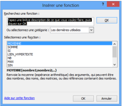

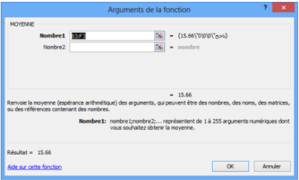

بعد النقر على OK تظهر علبة حوار أخرى لإدخال وسائط الدالة.

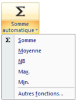

- 4. بالنقر على Somme automatique "جمع تلقائي" ثم اختيار إحدى الدوال المألوفة من القائمة المنسدلة أو النقر على الأمر Autres fonctions "دوال إضافية".
- 5. بالنقر على إحدى الفئات المعروضة مثلا "المنطقية" Logique.
- 6. النقر على الرمز في شريط الصيغة.

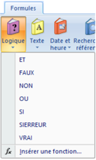

- 7. الاختصار: Maj+F3.

### 4. الإشكالية 2

لحساب معدل المادة في العمود H: نضرب "معدل الفروض" بالمعامل 2 و"الاختبار" بالمعامل 1، نجمع الناتجين ثم نقسم على 3.

هل توجد دالة لحساب هذا المعدل أم أننا مجبرون على استعمال صيغة؟

### حل الإشكالية 2

لا توجد دالة لحساب معدل المادة بالطريقة المطلوبة، لذلك يجب كتابة صيغة لحساب هذا المعدل كما يلي:

- 1. في الخلية H7 نكتب = ثم القوس (.
- 2. ننقر على الخلية F7 ثم نكتب *2.
- 3. نكتب + ثم ننقر على الخلية G7.
- 4. نكتب *1 ثم القوس ).
- 5. ندخل رمز القسمة / ثم 3.
- 6. نضغط على المفتاح Entrer.

### 5. الإشكالية 3

#### إدراج قرار في كشف نقاط التلميذ

في كشف نقاط نهاية السنة الدراسية، نريد إدراج عمود للنتيجة يكون فيه محتوى الخلية "ناجح" إذا كان المعدل السنوي للتلميذ أكبر من أو يساوي 10 و"راسب" في الحالات الأخرى.

هل توجد دالة نستخدمها لهذه العملية؟

بالفعل هي الدالة الشرطية SI.

#### من فوائد استعمال الدوال: التنفيذ الشرطي للصيغ، مما يسمح باتخاذ القرارات.

### 6. الدالة SI

من أهم الدوال استخداما في Excel الدالة الشرطية SI "إذا كان" التي تمكّن الصيغة من اتخاذ القرار.

عبارة الدالة: =SI(الشرط; القيمة إذا تحقق الشرط; القيمة إذا لم يتحقق الشرط)

### حل الإشكالية 3

الشرط: المعدل السنوي أكبر من أو يساوي 10: B2&gt;=10

إذا تحقق الشرط: تظهر عبارة "ناجح" في الخلية من العمود "النتيجة".

إذا لم يتحقق الشرط: تظهر عبارة "راسب" في الخلية من العمود "النتيجة".

- 1. نضغط على المفتاح Entrer.
- 2. ننسخ الصيغة ونلصقها بالسحب من مقبض التعبئة (+) إلى الأسفل فنحصل على النتائج.

ملاحظة: نحصل على نفس النتيجة باستعمال الصيغة =SI(B2&lt;10;"راسب";"ناجح").

#### مثال: إدراج عمود للتهنئة

نريد إدراج عمود للتهنئة بحيث: إذا كان محتوى خلية "النتيجة" هو "ناجح" يصبح محتوى خلية التهنئة من العمود D هو "مبروك" وإلا نترك خلية التهنئة فارغة.

#### الحل:

في الخلية D2 نكتب الدالة (لاحظ الصورة)، نضغط على المفتاح Entrer ثم ننسخ ونلصق الدالة.

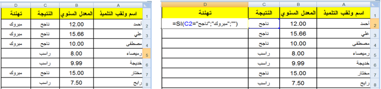

لاحظ كيف تمثل الخلية الفارغة في الدالة: " ".

### 7. الإشكالية 4

#### "راسب ناجح!" و"ناجح راسب!"

نظرا لنجاح عدة تلاميذ رغم مستوياتهم الضعيفة في اللغة العربية، قررت وزارة التربية أنّه لا يعتبر ناجحا إلا من تحصل على معدل سنوي أكبر من أو يساوي 10 ويكون معدله في اللغة العربية أيضا أكبر من أو يساوي 10.

نلاحظ وجود شرطين في هذه الإشكالية من الواجب أن يتحققا معا، لذلك نلجأ إلى استخدام الدالة المنطقية "و" ET مع الدالة الشرطية SI.

#### ملاحظة: الدالة المنطقية "و" ET

يمكن استخدام الدوال المنطقية مستقلة ويكون الناتج إما Vrai وإما Faux، كما يمكن استخدامها داخل الدالة SI للربط بين الشروط.

توجد دوال منطقية أخرى ومنها: "أو" OU و"نفي" NON.

### حل الإشكالية 4

الشرط: المعدل السنوي أكبر من أو يساوي 10 ومعدل اللغة العربية أكبر من أو يساوي 10.

إذا تحقق الشرط: تظهر عبارة "ناجح" في الخلية من العمود "النتيجة".

إذا لم يتحقق الشرط: تظهر عبارة "راسب" في الخلية من العمود "النتيجة".

في الخلية D4 نكتب الدالة (لاحظ الصورة)، نضغط على المفتاح Entrer ثم ننسخ ونلصق الدالة =SI(ET(B2&gt;=10;C2&gt;=10);"ناجح";"راسب").

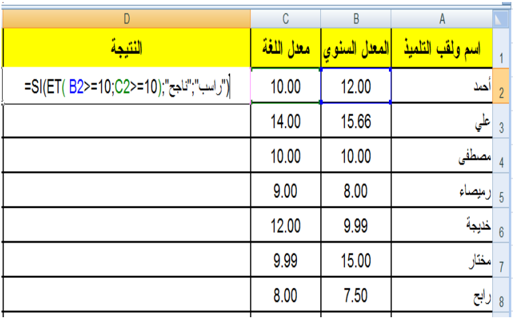

## تمارين

### التمرين الأول

ما هي فوائد استعمال الدوال في Excel؟

### التمرين الثاني

- 1. أنجز الجدول التالي ونسقه (بتنسيقك الخاص).

- 2. في الجدول الأول أعلى الصورة:
  - أدخل مبلغ الراتب والمصاريف لكل شهر (المبالغ تكون بالعملة د.ج).
  - اكتب صيغة لحساب المبلغ المدخر لشهر جانفي ثم انسخها للأشهر الأخرى.
  - اكتب صيغة لحساب نسبة الادخار لشهر جانفي ثم انسخها للأشهر الأخرى.
- 3. في الجدول الثاني أسفل الصورة، واستنادا إلى الجدول الأعلى، اكتب صيغا (دوالا) لحساب (تعيين):
  - مجموع الرواتب.
  - مجموع المصاريف.
  - مجموع المبالغ المدخرة.
  - أكبر راتب.
  - أصغر راتب.

### التمرين الثالث

استعمال العمليات الحسابية على التواريخ.

#### متوسط الاستهلاك اليومي لمادة البطاطا بين تاريخين:

استهلكت أسرة 500 كغ بطاطا بين التاريخين التاليين 2022-1-1 و 2022-12-31.

نريد حساب متوسط الاستهلاك يوميا، اكتب في الخلية B5 الصيغة المطلوبة.

### التمرين الرابع: استعمال الدالة OU

باستعمال الدالة "أو" OU اكتب صيغة داخل الخلية B3 وانسخها للحصول على القيمة VRAI إذا كان اللون المقابل في العمود A من ألوان العلم الوطني، والقيمة FAUX في الحالات الأخرى.

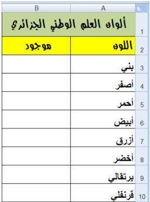

قد تكون من الشكل: =OU(A3="أخضر";A3="أبيض";A3="أحمر")

### التمرين الخامس

أدخل في العمود A قيما عشوائية من 1 إلى 100.

أدخل في العمود B قيما عشوائية من 1 إلى 100.

اكتب صيغة في العمود C تدرج العبارة:

- "القيمة في العمود A أكبر من أو تساوي القيمة في العمود B".
- "القيمة في العمود A أصغر من القيمة في العمود B".

### التمرين السادس: ليكن الجدول:

1. أكمل الجدول السابق بكتابة صيغتين:
   - الأولى في العمود C لحساب قيمة الخصم حسب القاعدة التالية: إذا كانت قيمة مشتريات زبون أقل من 10000 دج يستفيد من خصم مقداره 5%، أما في الحالات الأخرى يستفيد من خصم مقداره 7%.
   - الثانية في العمود D لحساب المبلغ المدفوع.
2. إذا حذفنا العمود C من الجدول السابق، أعد كتابة الصيغة في العمود D لحساب المبلغ المدفوع حسب نفس القاعدة في السؤال السابق.

### التمرين السابع

للمشاركة في مسابقة الدخول للتكوين في المدرسة العليا للرياضيات، يشترط أن يكون المعدل السنوي أكبر من أو يساوي 10 ومعدل الرياضيات أكبر تماما من 10.

اكتب صيغة تدرج في العمود D "مقبول" أو "مرفوض" حسب الحالة.
