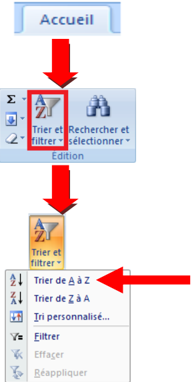
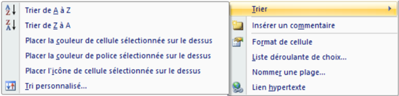
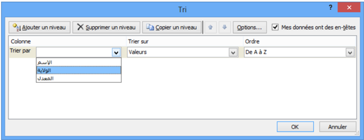
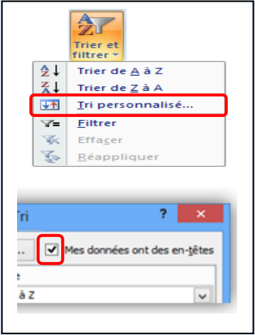

# الوحدة 12: فرز البيانات في Excel
## المجال الثاني: المكتبية

---

### 2 فرز البيانات Le tri

## الكفاءات المستهدفة

- يدرك المتعلم مفهوم فرز البيانات.
- يتمكن من فرز جدول حسب معيار.
- يتمكن من فرز جدول حسب معيارين.

## فرز وترتيب البيانات في Excel

### 1 نشاط

## إليك جزء من قائمة نتائج مسابقة وطنية:

## المطلوب:

- .4 اكتب القائمة في ورقة excel
- .4 رتب القائمة حسب المعدل من الأكبر إلى الأصغر.
- .4 ." أعد ترتيب القائمة حسب الاسم من "أ" إلى "ي
- .0 أعد ترتيب القائمة حسب تاريخ الميلاد من الأقدم إلى الأحدث.
- .4 كيف نرتب القائمة ترتيبا تصاعديا بالنسبة لرقم الولاية و ترتيبا تنازليا  بالنسبة للمعدل (في نفس الوقت)؟

## 2. فرز البيانات

فرز  بيانات  جدول  هو  إعادة  ترتيبها  حسب  القيم العددية  أو  النصية  الموجودة  في  الأعمدة  وقد  يكون الترتيب تصاعديا أو تنازليا.

## ملاحظات:

- عادة ما تتم عملية الفرز حسب العمود، لكن يمكن أيضا أن تتم حسب الصف.
- يمكن أن تتم عملية الفرز في عمود واحد أو أكثر.

### يمكن فرز البيانات:

- حسب النص (من أ إلى ي أو من ي إلى أ)
- حسب الرقم (من الأصغر إلى الأكبر أو من الأكبر إلى الأصغر)
- حسب التواريخ والأوقات (من الأقدم للأحدث أو من الأحدث للأقدم)
- حسب قائمة مخصصة (مثل كبير ،متوسط وصغير)
- )... حسب التنسيق (مثل لون الخلية أو لون الخط

### لماذا الفرز؟

## تسمح عملية الفرز بـ:

- معاينة البيانات بشكل أسرع.
- فهمها بصورة أفضل.
- تنظيم البيانات مما يسهل البحث عنها.
- اتخاذ قرارات سليمة وأكثر فاعلية.

القائمة بعد الفرز

- كيف تتم عملية الفرز؟

## حل النشاط السابق

- 1. ترتيب القائمة حسب المعدل من الأكبر إلى الأصغر.
- ." ننقر على إحدى خلايا العمود "المعدل
- في  علامة  التبويب  "الصفحة  الرئيسية"  " Accueil "،  في " مجموعة  "تحرير "Edition" ،  ننقر  على  الأداة  "فرز " وتصفية Trier et filtrer" " لتظهر أدوات التصفية:.

- ننقر على الأداة
- نحصل على الجدول المرتب.

القائمة قبل الفرز

## ملاحظات:

- .4 في  عملية  الفرز  يتم  إعادة  ترتيب  جميع  بيانات  الجدول  وليس  بيانات  العمود  الذي  تم  الفرز  على أساسه فقط. وإلا لحصلنا على نتائج خاطئة.
- .4 عند ترتيب قيم عددية يجب التحقق من أن كافة البيانات مخزنة كرقم. كيف يتم هذا؟

- ننقر بالزر الأيمن على الخلية أو النطاق.
- ننقر على .Format de cellule
- تظهر علبة حوار،من علامة التبويب "Nombre" نختار الفئة التي نريد.

## 2. ترتيب القائمة حسب الاسم من أ إلى ي.

- ." ننقر على إحدى خلايا العمود "الاسم
- " في  علامة  التبويب  "الصفحة  الرئيسية Accueil" "،  في " مجموعة "تحرير "Edition" ،  ننقر  على  الأداة "فرز " وتصفية Trier et filtrer" " لتظهر أدوات التصفية:.

- ننقر على الأداة
- نحصل على الجدول المرتب المقابل

## ملاحظات

- .4 عند ترتيب قيم نصية يجب التحقق من أن كافة البيانات مخزنة كنص.
- .4 عند  استيراد  بيانات  من  تطبيقات  أخرى،  يجب  التأكد  من  عدم  وجود  مسافات  بادئة  مدرجة  قبل البيانات لأن هذا يؤدي إلى نتائج خاطئة، في حالة كهذه يجب حذف هذه المسافات قبل فرز البيانات.
- .4 إذا استعملنا نصوصا بلغة ذات أصول لاتينية (فرنسية أو إنجليزية مثلا)، يمكن القيام بعملية الفرز مع تحسس حالة الأحرف: Majuscule أو. Minuscule كيف يتم هذا؟

## 3. ترتيب القائمة حسب تاريخ الميلاد من الأقدم إلى الأحدث.

- ." ننقر على إحدى خلايا العمود "تاريخ الميلاد
- "  " في  علامة  التبويب  "الصفحة  الرئيسية Accueil "، "  " في مجموعة "تحرير Edition " ، ننقر على الأداة "  " "فرز  وتصفية Trier  et  filtrer "  لتظهر  أدوات التصفية:.

- ننقر على الأداة
- نحصل على الجدول المرتب المقابل

## ملاحظة:

- .4 عند ترتيب التواريخ يجب التحقق من أن كافة البيانات مخزنة كتاريخ.
- .4 يمكن إجراء عملية الفرز بالنقر بالزر الأيمن على خلية من العمود ثم اختيار نوع الفرز.

## 4. ترتيب القائمة ترتيبا تصاعديا بالنسبة لرقم الولاية و ترتيبا تنازليا بالنسبة للمعدل.

-. ننقر على إحدى خلايا الجدول
- "  " في  علامة  التبويب  "الصفحة  الرئيسية Accueil "، "  " في مجموعة "تحرير Edition " ، ننقر على الأداة "  " "فرز  و  تصفية Trier  et  filtrer "  لتظهر  أدوات التصفية:
- ننقر على الأداة.
- تظهر علبة حوار .Tri
- في مربع Trier par نختار العمود "الولاية"
- في مربع Trier sur " نختار ."Valeurs
- " في مربع Ordre " " نختار "Du plus petit au plus grand
- ننقر على Ajouter un niveau
- في مربع Trier par " نختار العمود"المعدل
- في مربع Trier sur " نختار ."Valeurs
- " في مربع Ordre " " نختار "Du plus grand au plus petit
- ننقر على OK لنحصل على الجدول مرتبا.

القائمة مرتبة ترتيبا تصاعديا بالنسبة لرقم الولاية

القائمة مرتبة ترتيبا تنازليا بالنسبة للمعدل

## ملاحظات

- عادة ما يحتوي الجدول على صف عنوان لأن هذا يسهل قراءة البيانات
- افتراضيا لا يتم تضمين القيم الموجودة في عنوان العمود في عملية الفرز
- إذا أردنا أن تشمل عملية الفرز القيم الموجودة في العنوان:
- ننقر على Trier et filtrer (التبويب - Acceuil المجموعة (Edition
- .1
- .2 ننقر على .Tri personnalisé
- 3. في علبة الحوار Tri ، نلغي تنشيط Mes données ont des en-têtes

## تمارين

## التمرين الأول: أجب بصحيح أو خطأ

- .4 لايمكن تطبيق عملية الفرز إلا على الأعمدة.
- .4 يمكن فرز البيانات حسب لون الخلية.
- .4 تسمح عملية الفرز بتنظيم البيانات مما يسهل اتخاذ القرارات الأكثر فاعلية.
- .0 يمكن تطبيق عملية الفرز حسب عدة أعمدة.

## التمرين الثاني

قصد  اختيار  لاعبي  هجوم  لتكوين  فريق  ولائي،  تمت عملية  إحصاء  شملت  كل  فرق  الولاية  وأسفرت  على  الجدول المقابل: (يمكنك  تغيير  هذه  البيانات    ببيانات  أخرى  حسب الحاجة)

- .4 رتب الجدول حسب سن اللاعب.
- .4 رتب الجدول حسب عدد الأهداف المسجلة.
- .4 رتب  الجدول  حسب  عدد  الأهداف  المسجلة  وسن .) اللاعب (في نفس الوقت

## التمرين الثالث

مستعينا بمكتبة ثانويتك املأ الجدول التالي:

- .4 رتب الجدول حسب عنوان الكتاب.
- .4 حسب أي معيار يجب ترتيب الجدول لمعرفة أقدم كتاب في المكتبة؟ قم بهذه العملية.
- .4 ما هو الكتاب الأكثر استعمالا من طرف التلاميذ؟
