# الوحدة 13: الارتباطات التشعبية في PowerPoint
## المجال الثالث: العروض التقديمية

---

## وحدة العروض التقديمية

### 1. الارتباطات التشعبية Les liens hypertextes

## الكفاءات المستهدفة

- يتعرف على مفهوم العرض التفاعلي.
- يتعرف على مفهوم الارتباط التشعبي.
- يتمكن من استعمال أزرار الإجراءات.
- يتمكن من استعمال الارتباطات التشعبية.

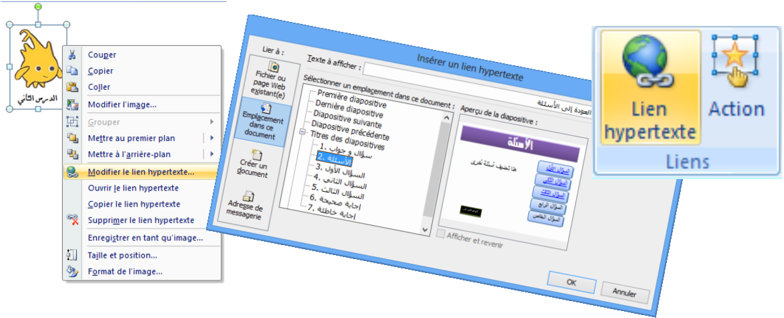

## الارتباطات التشعبية

### 1. نشاط: عرض تقديمي "سؤال وجواب"

نريد إنشاء عرض تقديمي، المطلوب فيه اختيار الإجابة الصحيحة من عدة إجابات مقترحة لعدة أسئلة، ويكون إظهار شريحة للإجابة الصحيحة وأخرى للإجابة الخاطئة حسب الحالة، ثم الرجوع لاختيار سؤال آخر.

- شغل برنامج PowerPoint
- أنشئ عرضًا تقديميًا يتكون من 4 شرائح (على الأقل) كما في الشكل التالي:

تخطيط الشرائح الأخرى

تخطيط الشريحة الأولى

الشريحة 1: العنوان: "سؤال وجواب"، العنوان الفرعي: "تقويم حول برنامج العروض التقديمية PowerPoint"، إدراج صورة أو أكثر من مكتبة الصور.

الشريحة 2: العنوان: "الأسئلة"، إدراج SmartArt من شكل قائمة تحوي الأسئلة المقترحة (على الأقل ثلاثة).

الشريحة 3: العنوان: "السؤال الأول"، إدراج مربع نص السؤال الأول، إدراج SmartArt من شكل قائمة تحوي الإجابات المقترحة (على الأقل ثلاثة).

- الشريحة 4: العنوان: "السؤال الثاني"، إدراج مربع نص السؤال الثاني، إدراج SmartArt من شكل قائمة تحوي الإجابات المقترحة (على الأقل ثلاثة).
- الشريحة 5: العنوان: "السؤال الثالث"، إدراج مربع نص السؤال الثالث، إدراج SmartArt من شكل قائمة تحوي الإجابات المقترحة (على الأقل ثلاثة).

الشريحة 6: العنوان: "إجابة صحيحة"، إدراج مربعي نص "أحسنت" و"العودة إلى الأسئلة"، إدراج شكل "وجه ضاحك".

الشريحة 7: العنوان: "إجابة خاطئة"، إدراج مربعي نص "حاول مرة أخرى" و"العودة إلى الأسئلة"، إدراج شكل "وجه عبوس".

بعد التنسيق قد تبدو الشرائح في عرض "فارز الشرائح" كما يلي:

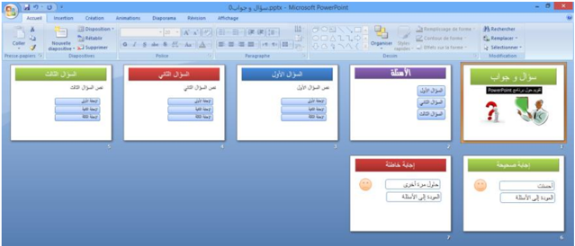

عند تنفيذ العرض يتم عرض الشرائح حسب تسلسلها:

الشريحة 1 الشريحة 2 الشريحة 3 الشريحة 4 ... وهكذا

الإشكالية: كيف ننتقل مثلا من الشريحة الثانية إلى الشريحة الخامسة لعرض السؤال الثالث؟

وكيف ننتقل إلى شريحة الإجابة الصحيحة إذا كانت إجابتنا بالفعل صحيحة؟

وكيف نعود بعد ذلك لاختيار سؤال آخر؟

لتحقيق هذا: يجب أن يكون عرضنا التقديمي تفاعليًا.

للتحكم في تسلسل عرض الشرائح ندرج "أزرار إجراءات".

### 2. أزرار الإجراءات Boutons d'action

زر الإجراء هو زر جاهز يمكن إدراجه في العرض التقديمي وتعريف ارتباط له.

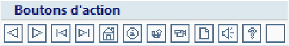

- زر الإجراء "السابق" للذهاب إلى الشريحة السابقة.
- زر الإجراء "التالي" للذهاب إلى الشريحة الموالية.

ملاحظة: تظهر أزرار الإجراءات أيضًا في المجموعة Dessin من التبويب Accueil.

- توجد أزرار الإجراءات ضمن مجموعات الأشكال.
- تظهر على أزرار الإجراءات أشكال تساعد على فهم عملها.

#### مثلا:

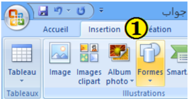

#### إدراج زر إجراء

نعرض الشرائح في العرض العادي "Normal".

1. ضمن علامة التبويب Insertion، من مجموعة الرسومات التوضيحية Illustrations، نضغط على السهم أسفل أداة أشكال.

ستظهر مجموعة من الأشكال. ننقر على شكل الزر الذي نريد إدراجه.

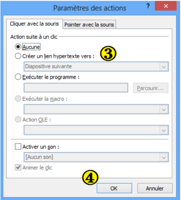

2. يتغير المؤشر إلى شكل +، وباستخدام السحب والإفلات، نرسم الزر على الشريحة.

في علبة الحوار Paramètres des actions التي تظهر، نختار إحدى علامتي التبويب:

- "Pointer avec la souris" إذا أردنا أن يستجيب الزر بمجرد مرور مؤشر الفأرة فوقه.
- "Cliquer avec la souris" إذا أردنا أن تكون استجابة الزر بعد النقر عليه.

(الاستجابة تكون في طريقة العرض Diaporama)

3. يتوقف الإجراء الذي سيحدث عند النقر على زر الإجراء أو تحريك المؤشر فوقه على ما نختار من بين ما يلي:
- ننقر على Aucune: لاستخدام الشكل بدون تنفيذ أي إجراء.
- ننقر على Créer un lien hypertexte vers: لإنشاء ارتباط تشعبي، ثم نختار الوجهة التي نريد الانتقال إليها.
- ننقر على Exécuter le programme: لتشغيل برنامج، ثم ننقر على Parcourir لتحديد مكان البرنامج الذي نريد تشغيله.
- نحدد خانة الاختيار Activer un son: لتشغيل صوت، ننقر على السهم فتنسدل قائمة بالأصوات ونحدد واحدًا لتشغيله.
4. ننقر على OK.

- إدراج الزر "التالي" في الشريحة الأولى من النشاط السابق.
- تنسيق الزر وإضافة النص التالي له: "ابدأ".

بعد إدراج الزر على الشريحة، ننقر على OK.

باستعمال الزر الأيمن للفأرة، ننقر على "Modifier le texte".

ونكتب: "ابدأ"، ثم ننقر خارج الزر.

شكل الزر بعد التخصيص:

تخصيص زر الإجراء

#### ملاحظات:

- عند تنفيذ العرض التقديمي، يغير تمرير المؤشر فوق الزر الإجرائي شكله إلى:
- يمكن تنسيق زر الإجراء وتغيير حجمه ومكانه.
- لحذف زر الإجراء نحدده ثم نضغط على مفتاح Suppr من لوحة المفاتيح.
- نستطيع تغيير عمل أي زر من أزرار الإجراءات.
- لإنشاء ارتباط بملف تم إنشاؤه بواسطة برنامج آخر، مثل ملف Word أو Excel أو Pdf، ننقر فوق "ملف آخر" Autre fichier من الارتباط التشعبي.

#### عودة للنشاط

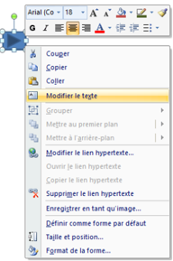

#### عودة للنشاط

- إدراج الزر في الشريحة الأولى من النشاط السابق وتخصيصه بحيث ننهي العرض عند النقر عليه.

#### المطلوب

- تنسيق الزر وإضافة النص التالي له: "إنهاء العرض".
- نسخ الزر ولصقه في الشرائح الأخرى.
- بعد إدراج الزر على الشريحة، ننشئ له ارتباطًا تشعبيًا نحو:

"Arrêter le diaporama" وننقر على OK.

باستعمال الزر الأيمن للفأرة، ننقر على "Modifier le texte".

ونكتب: "إنهاء العرض"، ثم ننقر خارج الزر.

شكل الزر بعد التخصيص:

#### وأيضا:

- أدرج زرًا للرجوع إلى شريحة الأسئلة في كل شريحة من شرائح الأسئلة.

#### المطلوب

### 3. الارتباطات التشعبية

لقد أدرجنا، عند حل النشاط السابق، أزرار إجراءات سمحت لنا بالانتقال من شريحة إلى أخرى، وهذا ما نسميه "ارتباطًا تشعبيًا".

ما هو الارتباط التشعبي؟

الارتباط التشعبي هو اتصال من شريحة لأخرى في نفس العرض التقديمي، أو إلى شريحة في عرض تقديمي آخر، أو عنوان بريد إلكتروني، أو صفحة Web، أو ملف.

يمكننا إنشاء ارتباط تشعبي من نص أو كائن، مثل صورة أو رسم بياني أو شكل أو WordArt.

إنشاء ارتباط تشعبي إلى شريحة في نفس العرض التقديمي

#### وأيضا:

- اربط كل سؤال من شريحة "الأسئلة" بالشريحة المناسبة له.
- اربط كل إجابة بالشريحة الموافقة لها: صحيحة أو خاطئة.

#### لاحظ:

- ظهور نص الارتباط التشعبي داخل مربع "Texte à afficher" حيث يمكن تغييره.
- ظهور معاينة للشريحة الهدف.

#### إنشاء ارتباط تشعبي إلى شريحة في عرض تقديمي آخر

1. في العرض Normal، نحدد النص أو الكائن الذي نريد استخدامه كارتباط تشعبي.
2. ضمن علامة التبويب Insertion، في المجموعة Liens، ننقر على Lien hypertexte (أو ننقر بالزر الأيمن على التحديد ثم على Lien hypertexte): تظهر علبة حوار باسم Insérer un lien hypertexte.
3. في المربع Lier à، ننقر على Fichier ou page Web existante(e).
4. نحدد موقع العرض التقديمي الذي يحتوي على الشريحة التي نريد الارتباط بها.
5. ننقر على "إشارة مرجعية" Signet…، تظهر علبة حوار باسم "Sélectionner un emplacement dans le document".
6. ننقر على عنوان الشريحة التي نريد الارتباط بها، ثم ننقر على OK (لإغلاق هذه العلبة).
7. ننقر على OK (لإغلاق علبة الحوار السابقة).

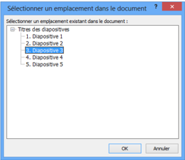

الطريقة 1: استعمال الأمر Lien hypertexte

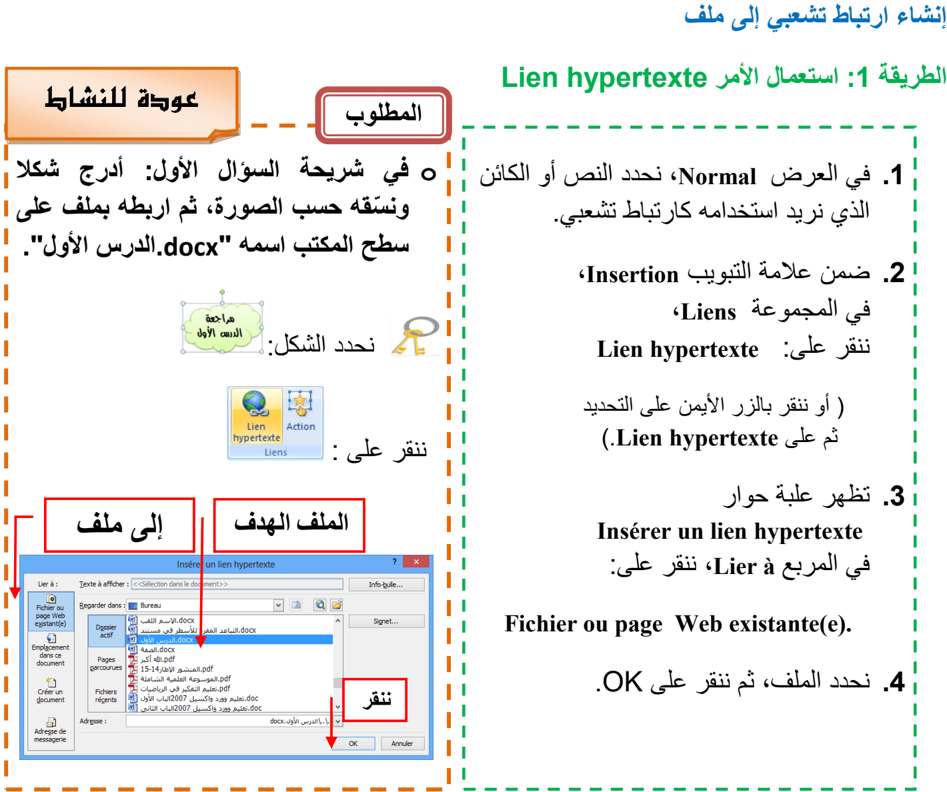

#### لاحظ:

- بالنقر على Info-bulle "تعريف الأدوات" يمكن إدخال نص يظهر عند مرور مؤشر الفأرة على الارتباط التشعبي.
- من خلال عملية إدراج ارتباط تشعبي يمكن إنشاء ملف جديد باختيار:

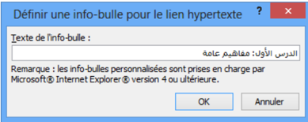

Créer un document من المربع Lier à.

#### عودة للنشاط

#### الطريقة 2: استعمال الأمر Action

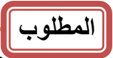

- في شريحة السؤال الثاني، أدرج صورة ثم اربطها بملف على سطح المكتب اسمه "الدرس الثاني.pdf".

#### نحدد الصورة:

ننقر على:

في إعدادات الإجراءات ننقر على Autre fichier (كما في الصورة) ثم ننقر على OK. تظهر علبة حوار، نحدد الملف ثم ننقر على OK.

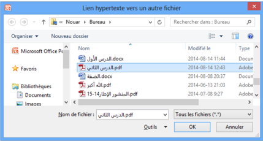

يظهر مسار الملف في خانة الارتباط التشعبي، ثم ننقر على OK.

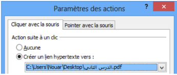

#### العمليات على الارتباط التشعبي

بالنقر بالزر الأيمن على ارتباط تشعبي يمكن:

- تغيير الارتباط التشعبي: Modifier le lien hypertexte
- فتح الارتباط التشعبي: Ouvrir le lien hypertexte
- نسخ الارتباط التشعبي: Copier le lien hypertexte
- حذف الارتباط التشعبي: Supprimer le lien hypertexte

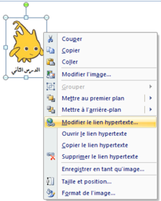
