# الوحدة 14: الحركة في العروض التقديمية
## المجال الثالث: العروض التقديمية

---

### 2. الحركة في العروض التقديمية L'animation

## الكفاءات المستهدفة

- يدرك المتعلم أهمية الحركة في العروض التقديمية.
- يتمكن من إدراج مراحل انتقالية للشرائح والتحكم في إعداداتها.
- يتمكن من إضافة حركة مخصصة وتغيير إعداداتها.

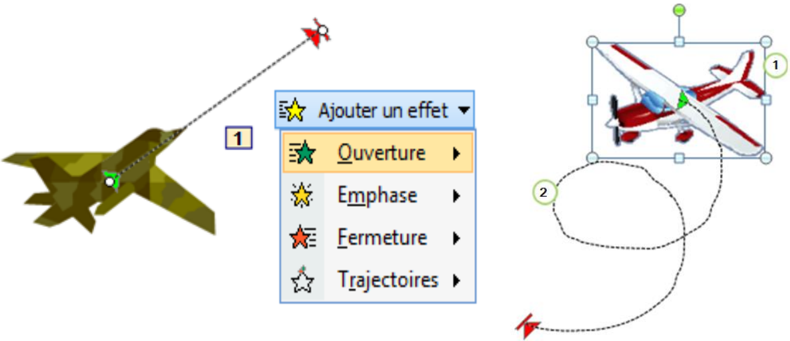

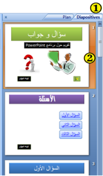

## الحركة: تأثيرات مشوقة

لإضفاء الحيوية، وجعل العرض التقديمي أكثر تشويقا نلجأ إلى:

- تطبيق مراحل انتقالية للشرائح.
- إضافة أصوات ومقاطع فيديو.
- تطبيق حركة مخصصة على الكائنات: نصوص، صور، أشكال...

### 1. المراحل الانتقالية للشرائح

هي تأثير حركي يظهر عند الانتقال من شريحة إلى أخرى.

#### إضافة مرحلة انتقالية إلى شريحة من العرض التقديمي:

1. في طريقة العرض Normal، في جزء المهام الذي يحتوي على علامتي التبويب Plan و Diapositives، ننقر على علامة التبويب "Diapositives".
2. نحدد الشريحة التي نريد إضافة مرحلة انتقالية إليها.
3. ننقر على علامة التبويب "حركات" Animations، في المجموعة Accès à cette diapositive، ننقر على أحد التأثيرات المتوفرة ليتم تطبيقه على الشريحة المحددة.
4. لتطبيق نفس المرحلة الانتقالية على كافة شرائح العرض ننقر على Appliquer partout.
5. لاختيار سرعة حركة الانتقال بين الشريحتين، ننقر على السهم بجانب Vitesse de transition وننقر على أحد الخيارات: بطيئة Lente، متوسطة Moyenne، سريعة Rapide.
6. لإضافة صوت يتم تشغيله أثناء الانتقال من شريحة إلى أخرى، ننقر على السهم بجانب Son de transition ونختار صوتًا من الأصوات المتاحة أو صوتًا من ملف صوتي Autre son.

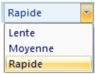

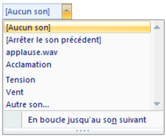

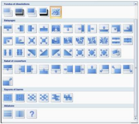

#### ملاحظات:

- ننقر على السهم لعرض كافة التأثيرات المتوفرة.
- لمعاينة نتيجة المرحلة الانتقالية قبل تطبيقها، نضع مؤشر الفأرة فوق أيقونتها فيظهر التأثير.
- لتطبيق نفس المرحلة الانتقالية على بعض الشرائح فقط، نحدد الشرائح المعنية ثم نتبع الخطوات السابقة.

#### توقيت عرض الشرائح

افتراضيًا يكون الانتقال من شريحة إلى أخرى يدويًا Manuellement. لجعل هذا الانتقال آليًا بعد مدة زمنية نحدد Automatiquement après ونعين المدة بالثواني.

بدون مرحلة انتقالية

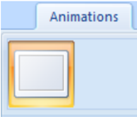

عودة للنشاط

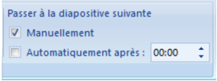

#### حذف مرحلة انتقالية لشريحة

- نحدد هذه الشريحة.
- من علامة التبويب Animation، من المجموعة Accès à cette diapositive، ننقر على الرمز الأول Aucune transition.

#### المطلوب

- أضف مراحل انتقالية للشرائح.
- أضف صوت تصفيق عند الانتقال إلى شريحة الإجابة الصحيحة.
- سجل فيديو تقديميًا للنشاط (باستعمال الحاسوب أو الهاتف النقال) وأدرجه في الشريحة الأولى.
- يمكنك الاستغناء عن الزر "ابدأ" في الشريحة الأولى ويكون الانتقال إلى الشريحة الثانية بتوقيت.

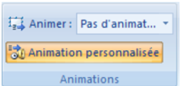

### 2. الحركات المخصصة Animation personnalisée

هي مؤثرات بصرية متنوعة يمكن تطبيقها على النصوص وعلى الكائنات المدرجة على الشريحة، الهدف منها التشويق والتنظيم ودعم أفكار العرض.

- يمكن تطبيق عدة حركات على نفس النص أو الكائن.
- تكون الحركات داخل شريحة واحدة مرقمة وتنفذ بالترتيب.

#### إضافة حركة مخصصة إلى كائن

1. نحدد النص أو الكائن الذي نريد تحريكه.
2. ننقر على علامة التبويب Animations.
3. من المجموعة Animations ننقر على الزر فيظهر جزء المهام الخاص بالحركة المخصصة Personnaliser l'animation.
4. ننقر على السهم بجانب الزر فتنسدل قائمة بأربعة أنواع، يتفرع كل نوع إلى مجموعة من الحركات المستخدمة مؤخرًا وتنتهي بزر Autres effets… للحصول على حركات أخرى.
5. ننقر على اسم حركة لتطبيقها.

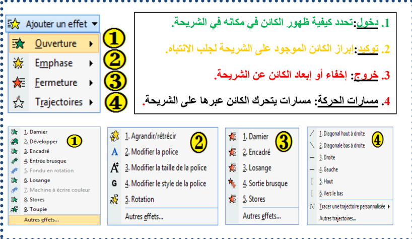

#### تعيين إعدادات الحركة المخصصة

في جزء المهام الخاص "تخصيص الحركة" Personnaliser l'animation، نحدد حركة ونقوم بتغيير إعداداتها:

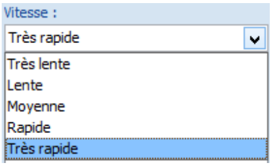

- مربع القائمة المنسدلة Début:
- الحركة تبدأ عند النقر: Au clic.
- الحركة تبدأ مع الحركة السابقة، وإذا كانت هي الأولى في هذه الشريحة فتبدأ مع إظهار الشريحة: Avec la précédente.
- الحركة تبدأ بعد الحركة السابقة: Après la précédente (لاحظ الرمز أمام كل خيار).

- مربع القائمة المنسدلة Sens (Couleur - Taille - Valeur):

يمكن تغيير الاتجاه، الحجم، اللون...إلخ.

- مربع القائمة المنسدلة Vitesse:

يمكن تعيين سرعة تنفيذ الحركة: بطيئة جدًا، بطيئة، متوسطة، سريعة، سريعة جدًا.

- مربع الحركات ويظهر به:
- قائمة الكائنات المزودة بحركة على الشريحة.
- رمز نوع الحركة.
- وقت بدء الحركة.
- ترتيب تنفيذ الحركات في العرض النهائي.

يمكن إعادة ترتيب تنفيذ الحركات باستعمال السهمين بجانب Réorganiser.

يمكن الوصول إلى خيارات أكثر بالنقر على السهم بجانب اسم الكائن.

- لاستعراض كل الحركات على الشريحة ننقر على:
- لتشغيل العرض النهائي ننقر على:
- يتم إظهار الحركة أو التعديل عليها آليًا إذا كان الخيار "معاينة تلقائية" محددًا.

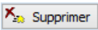

#### إضافة صوت إلى الحركة المخصصة

- نحدد الحركة في مربع الحركات.
- ننقر على السهم بجانب الاسم.
- ننقر على Option d'effets…
- تظهر علبة حوار لإضافة الأصوات.
- نختار الصوت الذي نريد ثم ننقر على OK.

#### تغيير حركة وحذفها

عند تحديد حركة مخصصة من قائمة الحركات، يتحول الزر إلى زر لاستعماله في تغيير الحركة المحددة بحركة أخرى، كما يصبح الزر فعالًا لحذف الحركة إذا أردنا.

#### عودة للنشاط

#### المطلوب

- أضف حركات مخصصة للنصوص والكائنات التي أدرجتها في عرضك التقديمي. مثلًا في شريحة "إجابة صحيحة"، أضف حركة توكيد Vague للنص "أحسنت".

قد تبدو شرائح العرض التقديمي كما يلي:

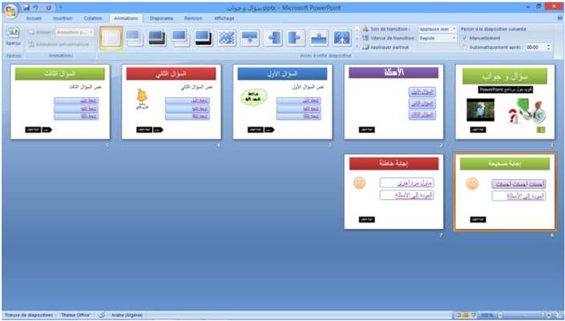

#### عودة للنشاط

#### آخر إشكالية

مازالت الشرائح تستجيب للنقر بالفأرة في أي مكان منها، كما تستجيب لأزرار لوحة المفاتيح. فكيف نعطل هذه الخاصية لتصبح الاستجابة مقتصرة على أزرار الإجراءات والارتباطات التشعبية فقط؟

الحل هو ضبط إعدادات العرض.

لوضع اللمسة النهائية على العرض التقديمي "سؤال وجواب":

- ننقر على علامة التبويب Diaporama ثم على Configurer le diaporama.
- تظهر علبة الحوار "Paramètres du diaporama".
- في مربع Type de diaporama نحدد Visionné sur une borne (plein écran).

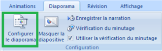

ملاحظة 1:

يبقى الزر Echap فعالًا لإنهاء العرض.

ملاحظة 2:

انتبه إلى كيفية بدء الحركات المخصصة!

عليك إثراء العرض بأسئلة أخرى، ثم احفظ الملف بامتداد .ppsx.

## تمارين

## التمرين الأول: عرض للتعريف بمنتجات شركة.

- 1) شغل برنامج عرض الشرائح PowerPoint، واحفظ الملف باسم "تمرين 4" في المجلد الخاص بك على سطح المكتب.
- 2) أنشئ عرضًا تقديميًا عن شركة Microsoft يتكون من الشرائح التالية:

## الشريحة الأولى

شركة Microsoft

كبرى شركات العالم

## الشريحة الثانية

## بعض منتجات الشركة

- برنامج Word
- برنامج Excel
- برنامج PowerPoint

## الشريحة الثالثة

## مزايا برنامج Word

- كتابة النصوص ومعالجتها
- إضافة صور ورسوم
- إضافة جداول وتنسيقها
- دمج المراسلات

## الشريحة الرابعة

## مزايا برنامج Excel

- تصميم الجداول الإلكترونية
- إعداد التقارير والميزانيات
- تصميم الرسوم البيانية
- إعداد الإحصاءات

## الشريحة الخامسة

## مزايا برنامج PowerPoint

- إعداد الشرائح والعروض التقديمية
- إضافة المؤثرات الصوتية والحركية
- إضافة مقاطع فيديو
- تنسيق الشرائح بأشكال متعددة

## الشريحة السادسة

إعداد

الاسم واللقب

الثانوية

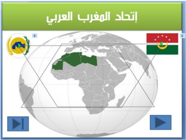

- 3) قم بالعمليات التالية:
- في الشريحة الأولى:

أدرج زر إجراء باسم "إعداد" للانتقال إلى الشريحة السادسة.

أدرج زر إنهاء العرض.

- في الشريحة الثانية:

أدرج ارتباطًا تشعبيًا لكلمة Word نحو الشريحة الثالثة.

أدرج ارتباطًا تشعبيًا لكلمة Excel نحو الشريحة الرابعة.

أدرج ارتباطًا تشعبيًا لكلمة PowerPoint نحو الشريحة الخامسة.

- في كل من الشرائح الثالثة والرابعة والخامسة: أدرج زر رجوع إلى الشريحة الثانية.
- في الشريحة السادسة: أدرج زر رجوع إلى البداية.
- 4) قم بإضافة المؤثرات الحركية لعناصر الشريحة الواحدة.
- 5) قم بتطبيق قالب تصميم جاهز على جميع شرائح العرض.
- 6) سجل صوت البسملة "بسم الله الرحمن الرحيم"، واحفظه في ملف وأدرجه في الشريحة الأولى بحيث يُشغَّل آليًا عند ظهور الشريحة.
- 7) احفظ الملف بالصيغة .ppsx باسم "تمرين 4".

## التمرين الثاني

نريد إنشاء عرض تقديمي عن دول اتحاد المغرب العربي.

ابحث في شبكة الإنترنت عن المعلومات التي تحتاجها لإنجاز هذا التمرين.

يتكون العرض على الأقل من سبع شرائح.

## الشريحة الأولى:

- عنوان "اتحاد المغرب العربي"
- خريطة لدول المغرب العربي مجتمعة
- علم وشعار اتحاد المغرب العربي (يتحركان على مسار متوازي أضلاع) باتجاهين متعاكسين.
- زر إنهاء العرض وزر التالي.

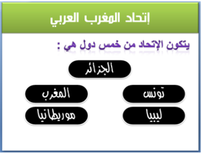

## الشريحة الثانية:

- تقديم للاتحاد في مربع نص.
- إدراج خمسة أشكال، وإضافة اسم دولة على كل واحد منها، وتنسيقها وربطها تشعبيًا كل شكل مع شريحة الدولة الموافقة له.

## الشرائح الأخرى: شريحة لكل دولة بها:

- مربع نص للتعريف بالدولة (الاسم، المساحة، عدد السكان...).
- صورة: العلم الوطني.
- صوت: السلام الوطني.
- فيديو: أهم معلم في هذه الدولة.
- زر رجوع إلى الشريحة الثانية.
