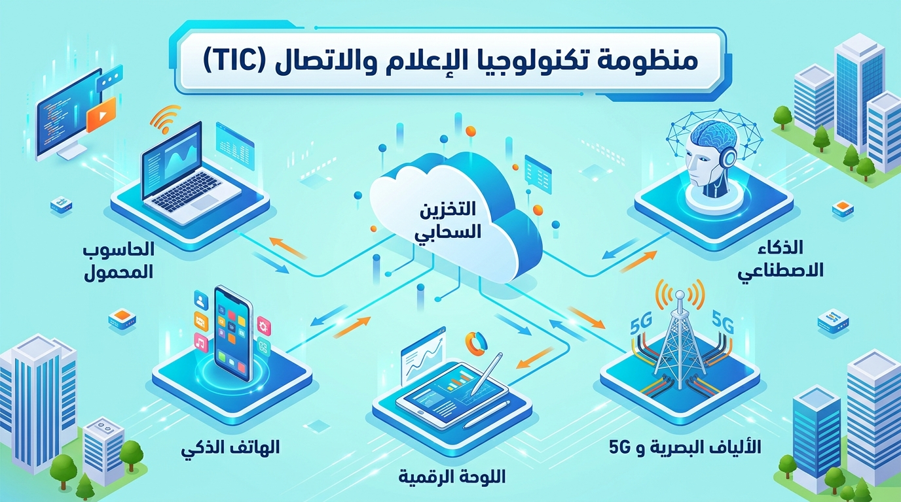
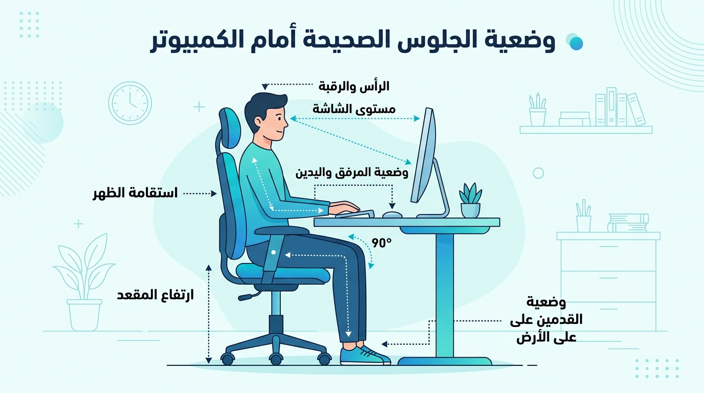

# الوحدة 01: تقنية المعلومات والتطور التكنولوجي

## المجال المفاهيمي الأول: التعامل مع بيئة الحاسوب
**المستوى:** السنة الأولى ثانوي (1AS)  
**الحجم الزمني الموصى به:** 02 ساعة  

---

## الأهداف التعلمية
في نهاية هذه الوحدة، يكون المتعلم قادرًا على:
1. تحديد المفهوم الدقيق لتكنولوجيا الإعلام والاتصال (TIC) والتمييز بين مكوناتها الثلاثة (تكنولوجيا، إعلام، اتصال).
2. التعرف على إدماج التكنولوجيا في التعليم (TICE) وأهميتها في دعم التفكير الذاتي والتفكير النقدي.
3. تتبع المحطات الرئيسية لتطور أجهزة ومعالجة المعلومات (الحواسيب، الهواتف الذكية، أنظمة التشغيل الحديثة).
4. التمييز بين مكونات المنظومة المعلوماتية (العتاد، البرمجيات، الموارد البشرية، الموارد المعرفية).
5. استيعاب التطور المعاصر نحو السحابة الإلكترونية (Cloud Computing) والذكاء الاصطناعي (AI).

---

## 1. تكنولوجيا الإعلام والاتصال (TIC)
**تكنولوجيا الإعلام والاتصال** (Information and Communication Technologies - TIC / ICT) هي مصطلح مركب ينقسم إلى ثلاثة عناصر أساسية:

### 1.1 التكنولوجيا (Technologie)
كلمة ذات أصل يوناني (*technología*) تتكون من مقطعين:
- **تكنو (Techno):** الصنعة، الفن، أو المهارة التطبيقية.
- **لوجي (Logos):** العلم أو الدراسة المنظمة.

**المفهوم:** هي التطبيق المنظم للمعارف العلمية والمهارات الفنية لأداء وظائف محددة وحل المشكلات العملية.

### 2.1 الإعلام (Information)
هو التعبير عن البيانات بعد معالجتها وتنظيمها لتصبح ذات معنى وفائدة للمستقبل. ويتطلب الإعلام وجود رسالة (أخبار، معارف، أفكار) تنتقل من مرسل إلى مستقبل.

### 3.1 الاتصال (Communication)
هو العملية الفعالة لنقل وتبادل المعلومات والأفكار بين مرسل ومستقبل عبر وسيط محدد، بهدف التفاعل والتفاهم.

---

## 2. مفهوم منظومة TIC وخصائصها الحديثة

تُعرّف **تكنولوجيا الإعلام والاتصال (TIC)** بأنها التلاقي والتكامل بين عتاد الحواسيب، الأجهزة الذكية، البرمجيات، وتجهيزات الاتصالات والإنترنت عالية السرعة.

### أهم خصائص ومميزات TIC الحديثة:
- **سرعة فائقة ودقة عالية:** معالجة ملايين البيانات في أجزاء من الثانية وتقليل نسبة الخطأ.
- **التخزين السحابي (Cloud Storage):** إمكانية الوصول إلى الملفات والبيانات من أي مكان عبر العالم وفي أي وقت.
- **الاتصال اللحظي:** التواصل الفوري بالصوت والصورة عبر شبكات الألياف البصرية (Fiber Optics) وشبكات الجيل الخامس (5G).
- **إتاحة المعرفة:** توفير مصادر تعليمية وبحثية هائلة للجميع.

### السلبيات والمخاطر والقواعد الصحية لاستخدام الحواسيب:

- **تشتيت الانتباه والإدمان الرقمي:** الاستخدام المفرط دون تنظيم يؤثر سلبيًا على التحصيل الدراسي.
- **المخاطر الصحية (Ergonomics):** آلام العينين والظهر الناتجة عن الجلوس الطويل أمام الشاشات دون مراعاة الوضعية الصحيحة (الظهر مستقيم، الشاشة في مستوى العينين، اليدان بزاوية 90 درجة، القدمان مستقرتان على الأرض).
- **المخاطر الأمنية:** انتهاك الخصوصية ومخاطر الاحتيال الإلكتروني (Phishing).

---

## 3. إدماج التكنولوجيا في التعليم (TICE)

تُمثل **تكنولوجيا الإعلام والاتصال في التعليم (TICE - Technologies de l'Information et de la Communication pour l'Enseignement)** استخدام الوسائط الرقمية والمنصات التعليمية لتطوير عملية التعلم.

### من أبرز فوائد TICE:
- التحول من التعليم القائم على التلقين المباشر إلى التعلم الذاتي والتفاعلي (المقاربة بالكفاءات).
- استخدام المحاكاة التفاعلية (Interactive Simulations) والذكاء الاصطناعي التفاعلي كأدوات مساعدة.
- تنمية مهارات البحث العلمي والتفكير النقدي لدى المتعلم.

---

## 4. المعلوماتية والمنظومة الرقمية (Informatique)

**المعلوماتية (Computer Science / Informatique):** هي علم معالجة المعلومات بطريقة آلية وعقلانية باستخدام أجهزة الحاسوب والبرمجيات المخصصة.

تتكون المنظومة المعلوماتية الحديثة من أربعة أبعاد متكاملة:
1. **العتاد (Hardware / Matériels):** المكونات المادية الملموسة (المعالج، الذاكرة، الشاشة...).
2. **البرمجيات (Software / Logiciels):** أنظمة التشغيل والتطبيقات التي تدير العتاد وتنفذ الأوامر.
3. **الموارد البشرية (Human Resources):** المبرمجون، مهندسو الصيانة، والمهندسون والمستخدمون.
4. **الموارد المعرفية والبيانات (Data & Knowledge):** القواعد والبيانات المنظمة التي يتم تشغيلها وإدارتها.

---

## 5. تطور أنظمة التشغيل والأجهزة (من التأسيس إلى 2026)

### 1.5 تطور أجهزة معالجة المعلومات
مرت الحواسيب بمراحل وتطورات متسارعة:
- **1951:** تشغيل حاسوب **EDVAC** وإتاحة الحواسيب الأولى للبحوث.
- **1981:** إطلاق أول حاسوب شخصي **IBM PC** يعتمد المعالج الدقيق.
- **2007:** إطلاق هاتف **iPhone** وبداية ثورة الهواتف الذكية بشاشات اللمس.
- **2010:** انتهاء مرحلة الأجهزة الثقيلة وبداية الانتشار الواسع للوحات الرقمية (Tablets).
- **2020-2026:** عصر المعالجات متعددة الأنوية الذكية (AI Chips)، المعالجات المحمولة عالية الكفاءة (ARM Architecture)، والأجهزة المدمجة بالذكاء الاصطناعي.

### 2.5 تطور أنظمة التشغيل للحواسيب (Windows / Linux / macOS)
تستحوذ شركة **Microsoft** على النسبة الأكبر من سوق حواسيب مكتبية وخاصة عبر سلسلة نظام **Windows**، إلى جانب الأنظمة مفتوحة المصدر مثل **Linux (Ubuntu)** ونظام **macOS**:

| النظام | سنة الظهور / التحديث | الميزات الرئيسية |
| :--- | :--- | :--- |
| **MS-DOS** | 1981 | نظام أوامر نصية بدون واجهة رسومية |
| **Windows 95 / XP** | 1995 / 2001 | انتشار الواجهة البيانية والقوائم الشجرية |
| **Windows 7** | 2009 | الاستقرارية العالية والواجهة الزجاجية (Aero) |
| **Windows 10** | 2015 | التوافق الكامل بين الأجهزة المحمولة والكتبية |
| **Windows 11** | 2021 - 2026 | واجهة حديثة، دعم تطبيقات متعددة المهام، وأدوات الذكاء الاصطناعي (Copilot) |
| **Linux (Ubuntu)** | مستمر (2026) | نظام مفتوح المصدر وآمن للغاية مستعمل في السيرفرات والتعليم |

### 3.5 أنظمة تشغيل الهواتف الذكية والأجهزة المحمولة

| الشركة المصممة | نظام التشغيل | الأجهزة المستهدفة |
| :--- | :--- | :--- |
| **Google** | **Android** | معظم الهواتف واللوحات الرقمية عالميًا |
| **Apple** | **iOS / iPadOS** | أجهزة iPhone و iPad |
| *أنظمة سابقة (تاريخية)* | *Symbian / Windows Phone / BlackBerry OS* | *أنظمة توقف دعمها لصالح Android و iOS* |

---

## نشاط تطبيقي (تقويم الوحدة)

### التمرين الأول: (اختبار المفاهيم)
1. عرف المكونات الثلاثة لـ TIC: (تكنولوجيا - إعلام - اتصال).
2. قارن في جدول مختصر بين العتاد (Hardware) والبرمجيات (Software) مع تقديم مثالين لكل منهما.

### التمرين الثاني: (البحث والتفكير التكنولوجي)
- اذکر نظام تشغيل مثبت على جهاز الحاسوب في قاعة الإعلام الآلي بمؤسستك.
- ما الفرق الرئيسي بين حفظ ملف على قرص صلب محلي (Local Hard Drive) وحفظه على السحابة (Cloud Drive)؟
