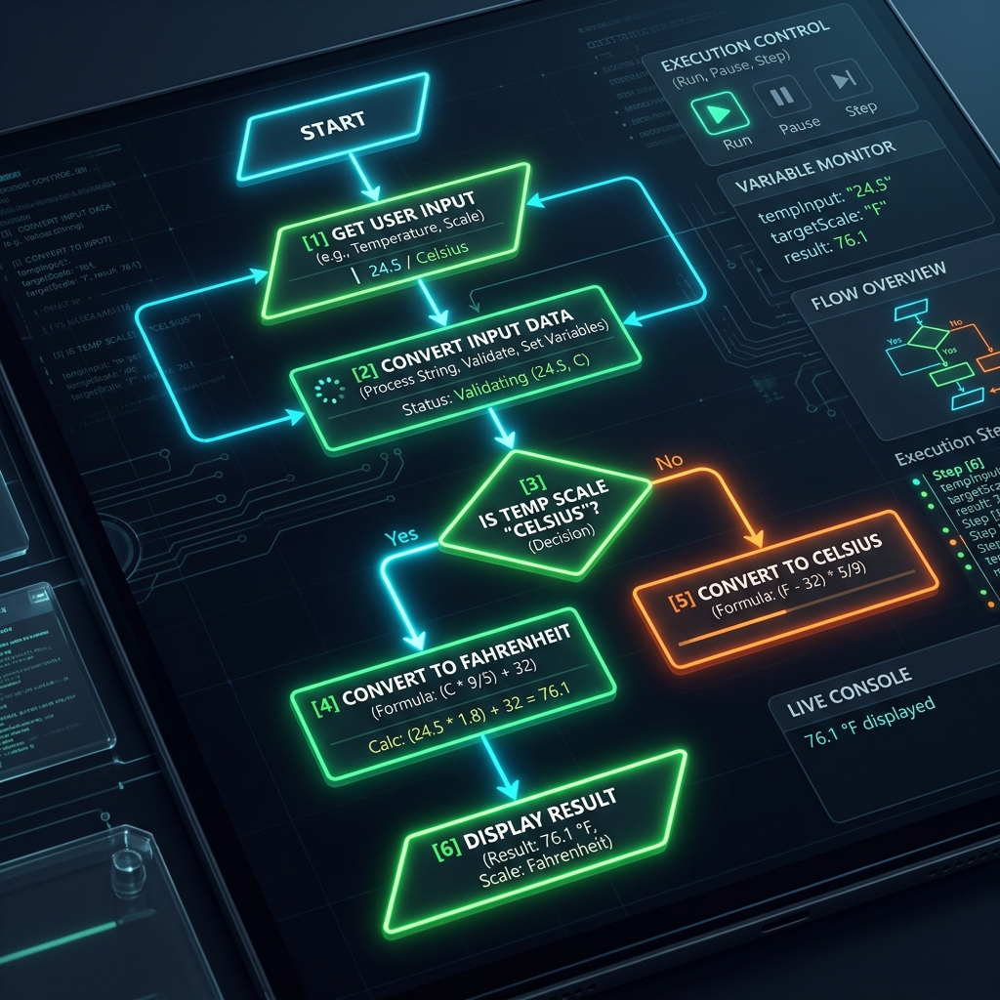

# الوحدة 15: المخطط الانسيابي (Flowcharts)
## المجال الرابع: المقدمة في البرمجة
### المدة الزمنية: 02 ساعة

---

## 1. حل المشكلات برمجياً (Problem Solving)

إننا عندما نتعلم البرمجة، فإن الفائدة لا تقتصر على المسائل الرياضية فحسب، بل نهدف إلى:
1. القدرة على كتابة برامج للحاسوب لتسهيل حياتنا.
2. القدرة على التفكير المنطقي لحل المشكلات المعقدة وتجزئتها.
3. التخطيط السليم والدقيق للمهام اليومية.

### صياغة حل المشكلة
لا يمكن حل أي مسألة إن لم يتم فهمها بشكل دقيق. لحل مشكلة بواسطة الحاسوب، نقوم بتقسيمها إلى ثلاثة عناصر أساسية:

- **المدخلات (Inputs):** هي البيانات والمعطيات الأولية التي نعطيها للحاسوب (مثل إدخال كلمة المرور، أو إدخال طول وعرض الغرفة).
- **عمليات المعالجة (Processing):** هي العمليات الحسابية أو المنطقية التي يقوم بها الحاسوب على المدخلات (مثل التحقق من صحة كلمة المرور، أو ضرب الطول في العرض).
- **المخرجات (Outputs):** هي النتائج النهائية التي يظهرها الحاسوب للمستخدم (مثل رسالة "تم الدخول بنجاح"، أو "مساحة الغرفة هي 20").

---

## 2. المخططات الانسيابية (Flowcharts)

### مقدمة
بالرغم من سرعة الحاسوب الفائقة، إلا أنه لا يستطيع التفكير بنفسه. الإنسان هو من يقوم بتوجيهه خطوة بخطوة. ولتسهيل كتابة البرامج، يقوم المبرمجون أولاً برسم خطوات الحل على شكل "رسم بياني" يسمى المخطط الانسيابي.

### تعريف المخطط الانسيابي:
هو تمثيل رسومي (بياني) يوضح خطوات حل مسألة معينة من البداية إلى النهاية باستخدام أشكال هندسية متسلسلة. يسهل المخطط الانسيابي تتبع سير البرنامج واكتشاف الأخطاء قبل كتابة الكود البرمجي الفعلي.

### الأشكال الهندسية الأساسية (Flowchart Symbols):

تعتمد المخططات الانسيابية على معايير عالمية، حيث يعبر كل شكل هندسي عن دلالة معينة:

| المعنى | الاسم بالإنجليزية | الرمز الهندسي |
|--------|-------------------|---------------|
| يمثل بداية البرنامج (Start) أو نهايته (End). | Terminal | **بيضاوي (Ellipse)** |
| يمثل إدخال البيانات (Input) أو عرض النتائج (Output). | Data | **متوازي أضلاع (Parallelogram)** |
| يمثل عملية معالجة أو حساب (Processing). | Process | **مستطيل (Rectangle)** |
| يمثل اتخاذ قرار أو شرط (Condition / Decision). يحتاج لجواب نعم/لا. | Decision | **معين (Diamond)** |
| يمثل اتجاه سير تدفق البرنامج. | Arrow | **سهم (Flowline)** |

---

## 3. بيئة العمل: برنامج Flowgorithm

في دروسنا، سنعتمد على برنامج **Flowgorithm** العالمي لتصميم المخططات الانسيابية. 
يتميز هذا البرنامج بأنه لا يكتفي بالرسم فقط، بل يتيح لك **"تشغيل"** مخططك الانسيابي لتتأكد من صحة النتائج، كما يقوم بتوليد الكود البرمجي (مثل كود Python) بشكل تلقائي!

---

## 4. مثال تطبيقي شامل

نريد تصميم مخطط انسيابي يحسب مساحة مستطيل بناءً على الطول والعرض الذي يدخله المستخدم.

**أولاً: تحليل عناصر المسألة:**
1. **المدخلات (Inputs):** الطول (x)، العرض (y).
2. **المعالجة (Processing):** المساحة = الطول × العرض (z = x * y).
3. **المخرجات (Outputs):** طباعة قيمة المساحة (z).

**ثانياً: المخطط الانسيابي (كما يتم رسمه في Flowgorithm):**
1. **[ البداية - Start ]**
2. إدخال الطول (x) وإدخال العرض (y) -> *(شكل متوازي أضلاع)*
3. حساب z = x * y -> *(شكل مستطيل)*
4. إخراج وطباعة (z) -> *(شكل متوازي أضلاع)*
5. **[ النهاية - End ]**

---

## 5. تطبيقات للتدرب (باستخدام Flowgorithm)

1. **السن القانوني:** ارسم مخططاً انسيابياً يطلب من المستخدم إدخال عمره. إذا كان العمر 18 أو أكبر، يطبع "مسموح بالدخول"، وإلا يطبع "مرفوض". *(تلميح: استخدم شكل المعين لاتخاذ القرار)*.
2. **حساب المعدل:** ارسم مخططاً انسيابياً يحسب المعدل الفصلي لتلميذ لديه 3 علامات مختلفة، ويطبع المعدل النهائي. 
